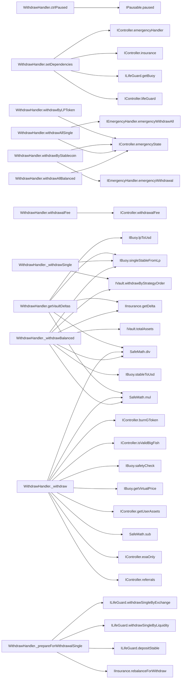
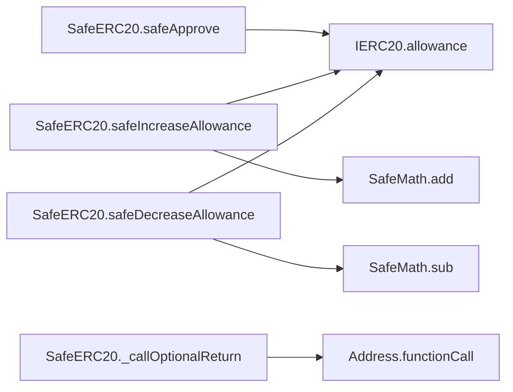

# 🧬 Flow Graphs, Constructor Sequences & SSA Representations

## Contract: WithdrawHandler
### Linearised Constructor Execution sequence
1. `Ownable.constructor()`
2. `Controllable.constructor()`
3. `FixedStablecoins.constructor(address[3], uint256[3])`
4. `FixedVaults.constructor(address[3])`

### Inter-Contract & Function Call Graph (Mermaid)


### Functions Intermediate Code Operations (SlithIR & SSA)
#### Function: `withdrawByLPToken`
<details><summary>View SlithIR Operations</summary>

```
No SlithIR operations.
```
</details>
<details><summary>View SSA Operations</summary>

```
No SSA operations.
```
</details>

#### Function: `withdrawByStablecoin`
<details><summary>View SlithIR Operations</summary>

```
No SlithIR operations.
```
</details>
<details><summary>View SSA Operations</summary>

```
No SSA operations.
```
</details>

#### Function: `withdrawAllSingle`
<details><summary>View SlithIR Operations</summary>

```
No SlithIR operations.
```
</details>
<details><summary>View SSA Operations</summary>

```
No SSA operations.
```
</details>

#### Function: `withdrawAllBalanced`
<details><summary>View SlithIR Operations</summary>

```
No SlithIR operations.
```
</details>
<details><summary>View SSA Operations</summary>

```
No SSA operations.
```
</details>

#### Function: `ctrlPaused`
<details><summary>View SlithIR Operations</summary>

```
TMP_6(IPausable) = INTERNAL_CALL, Controllable._pausable()()
TMP_7(bool) = HIGH_LEVEL_CALL, dest:TMP_6(IPausable), function:paused, arguments:[]  
RETURN TMP_7
```
</details>
<details><summary>View SSA Operations</summary>

```
No SSA operations.
```
</details>

#### Function: `setController`
<details><summary>View SlithIR Operations</summary>

```
TMP_8 = CONVERT 0 to address
TMP_9(bool) = newController != TMP_8
TMP_10(None) = SOLIDITY_CALL require(bool,string)(TMP_9,setController: !0x)
oldController(address) := controller(address)
controller(address) := newController(address)
Emit ChangeController(oldController,newController)
MODIFIER_CALL, Ownable.onlyOwner()()
```
</details>
<details><summary>View SSA Operations</summary>

```
No SSA operations.
```
</details>

#### Function: `owner`
<details><summary>View SlithIR Operations</summary>

```
RETURN _owner
```
</details>
<details><summary>View SSA Operations</summary>

```
No SSA operations.
```
</details>

#### Function: `renounceOwnership`
<details><summary>View SlithIR Operations</summary>

```
TMP_24 = CONVERT 0 to address
Emit OwnershipTransferred(_owner,TMP_24)
TMP_26 = CONVERT 0 to address
_owner(address) := TMP_26(address)
MODIFIER_CALL, Ownable.onlyOwner()()
```
</details>
<details><summary>View SSA Operations</summary>

```
No SSA operations.
```
</details>

#### Function: `transferOwnership`
<details><summary>View SlithIR Operations</summary>

```
TMP_28 = CONVERT 0 to address
TMP_29(bool) = newOwner != TMP_28
TMP_30(None) = SOLIDITY_CALL require(bool,string)(TMP_29,Ownable: new owner is the zero address)
Emit OwnershipTransferred(_owner,newOwner)
_owner(address) := newOwner(address)
MODIFIER_CALL, Ownable.onlyOwner()()
```
</details>
<details><summary>View SSA Operations</summary>

```
No SSA operations.
```
</details>

#### Function: `setDependencies`
<details><summary>View SlithIR Operations</summary>

```
TMP_35(IController) = INTERNAL_CALL, Controllable._controller()()
ctrl(IController) := TMP_35(IController)
TMP_36(address) = HIGH_LEVEL_CALL, dest:ctrl(IController), function:lifeGuard, arguments:[]  
TMP_37 = CONVERT TMP_36 to ILifeGuard
lg(ILifeGuard) := TMP_37(ILifeGuard)
TMP_38(address) = HIGH_LEVEL_CALL, dest:lg(ILifeGuard), function:getBuoy, arguments:[]  
TMP_39 = CONVERT TMP_38 to IBuoy
buoy(IBuoy) := TMP_39(IBuoy)
TMP_40(address) = HIGH_LEVEL_CALL, dest:ctrl(IController), function:insurance, arguments:[]  
TMP_41 = CONVERT TMP_40 to IInsurance
insurance(IInsurance) := TMP_41(IInsurance)
TMP_42(address) = HIGH_LEVEL_CALL, dest:ctrl(IController), function:emergencyHandler, arguments:[]  
TMP_43 = CONVERT TMP_42 to IEmergencyHandler
emergencyHandler(IEmergencyHandler) := TMP_43(IEmergencyHandler)
TMP_44 = CONVERT ctrl to address
TMP_45 = CONVERT lg to address
TMP_46 = CONVERT buoy to address
TMP_47 = CONVERT insurance to address
TMP_48 = CONVERT emergencyHandler to address
Emit LogNewDependencies(TMP_44,TMP_45,TMP_46,TMP_47,TMP_48)
MODIFIER_CALL, Ownable.onlyOwner()()
```
</details>
<details><summary>View SSA Operations</summary>

```
No SSA operations.
```
</details>

#### Function: `withdrawByLPToken`
<details><summary>View SlithIR Operations</summary>

```
TMP_51(bool) = HIGH_LEVEL_CALL, dest:ctrl(IController), function:emergencyState, arguments:[]  
TMP_52 = UnaryType.BANG TMP_51 
TMP_53(None) = SOLIDITY_CALL require(bool,string)(TMP_52,withdrawByLPToken: emergencyState)
TMP_54(bool) = lpAmount > 0
TMP_55(None) = SOLIDITY_CALL require(bool,string)(TMP_54,!minAmount)
TMP_56(WithdrawHandler.WithdrawParameter) = new WithdrawParameter(msg.sender,pwrd,True,False,N_COINS,minAmounts,lpAmount)
parameters(WithdrawHandler.WithdrawParameter) := TMP_56(WithdrawHandler.WithdrawParameter)
INTERNAL_CALL, WithdrawHandler._withdraw(WithdrawHandler.WithdrawParameter)(parameters)
```
</details>
<details><summary>View SSA Operations</summary>

```
No SSA operations.
```
</details>

#### Function: `withdrawByStablecoin`
<details><summary>View SlithIR Operations</summary>

```
TMP_58(bool) = HIGH_LEVEL_CALL, dest:ctrl(IController), function:emergencyState, arguments:[]  
CONDITION TMP_58
HIGH_LEVEL_CALL, dest:emergencyHandler(IEmergencyHandler), function:emergencyWithdrawal, arguments:['msg.sender', 'pwrd', 'lpAmount', 'minAmount']  
TMP_60(bool) = index < N_COINS
TMP_61(None) = SOLIDITY_CALL require(bool,string)(TMP_60,!withdrawByStablecoin: invalid index)
TMP_62(bool) = lpAmount > 0
TMP_63(None) = SOLIDITY_CALL require(bool,string)(TMP_62,!minAmount)
REF_26(uint256) -> minAmounts[index]
REF_26(uint256) (->minAmounts) := minAmount(uint256)
TMP_64(WithdrawHandler.WithdrawParameter) = new WithdrawParameter(msg.sender,pwrd,False,False,index,minAmounts,lpAmount)
parameters(WithdrawHandler.WithdrawParameter) := TMP_64(WithdrawHandler.WithdrawParameter)
INTERNAL_CALL, WithdrawHandler._withdraw(WithdrawHandler.WithdrawParameter)(parameters)
```
</details>
<details><summary>View SSA Operations</summary>

```
No SSA operations.
```
</details>

#### Function: `withdrawAllSingle`
<details><summary>View SlithIR Operations</summary>

```
TMP_66(bool) = HIGH_LEVEL_CALL, dest:ctrl(IController), function:emergencyState, arguments:[]  
CONDITION TMP_66
HIGH_LEVEL_CALL, dest:emergencyHandler(IEmergencyHandler), function:emergencyWithdrawAll, arguments:['msg.sender', 'pwrd', 'minAmount']  
INTERNAL_CALL, WithdrawHandler._withdrawAllSingleFromAccount(address,bool,uint256,uint256)(msg.sender,pwrd,index,minAmount)
```
</details>
<details><summary>View SSA Operations</summary>

```
No SSA operations.
```
</details>

#### Function: `withdrawAllBalanced`
<details><summary>View SlithIR Operations</summary>

```
TMP_69(bool) = HIGH_LEVEL_CALL, dest:ctrl(IController), function:emergencyState, arguments:[]  
TMP_70 = UnaryType.BANG TMP_69 
TMP_71(None) = SOLIDITY_CALL require(bool,string)(TMP_70,withdrawByLPToken: emergencyState)
TMP_72(WithdrawHandler.WithdrawParameter) = new WithdrawParameter(msg.sender,pwrd,True,True,N_COINS,minAmounts,0)
parameters(WithdrawHandler.WithdrawParameter) := TMP_72(WithdrawHandler.WithdrawParameter)
INTERNAL_CALL, WithdrawHandler._withdraw(WithdrawHandler.WithdrawParameter)(parameters)
```
</details>
<details><summary>View SSA Operations</summary>

```
No SSA operations.
```
</details>

#### Function: `getVaultDeltas`
<details><summary>View SlithIR Operations</summary>

```
TMP_74(uint256) = HIGH_LEVEL_CALL, dest:buoy(IBuoy), function:lpToUsd, arguments:['amount']  
TMP_75(uint256[3]) = HIGH_LEVEL_CALL, dest:insurance(IInsurance), function:getDelta, arguments:['TMP_74']  
delta(uint256[3]) = ['TMP_75(uint256[3])']
TMP_76(bool) = i < N_COINS
CONDITION TMP_76
REF_33(uint256) -> delta[i]
TMP_77(uint256) = LIBRARY_CALL, dest:SafeMath, function:SafeMath.mul(uint256,uint256), arguments:['amount', 'REF_33'] 
TMP_78(uint256) = LIBRARY_CALL, dest:SafeMath, function:SafeMath.div(uint256,uint256), arguments:['TMP_77', 'PERCENTAGE_DECIMAL_FACTOR'] 
withdraw(uint256) := TMP_78(uint256)
TMP_79(bool) = withdraw > 0
CONDITION TMP_79
REF_35(uint256) -> tokenAmounts[i]
TMP_80 = CONVERT i to int128
TMP_81(uint256) = HIGH_LEVEL_CALL, dest:buoy(IBuoy), function:singleStableFromLp, arguments:['withdraw', 'TMP_80']  
REF_35(uint256) (->tokenAmounts) := TMP_81(uint256)
TMP_82(uint256) := i(uint256)
i(uint256) = i + 1
RETURN tokenAmounts
```
</details>
<details><summary>View SSA Operations</summary>

```
No SSA operations.
```
</details>

#### Function: `withdrawalFee`
<details><summary>View SlithIR Operations</summary>

```
TMP_83(IController) = INTERNAL_CALL, Controllable._controller()()
TMP_84(uint256) = HIGH_LEVEL_CALL, dest:TMP_83(IController), function:withdrawalFee, arguments:['pwrd']  
RETURN TMP_84
```
</details>
<details><summary>View SSA Operations</summary>

```
No SSA operations.
```
</details>


---

## Contract: FixedGTokens
### Linearised Constructor Execution sequence
- No constructors configured in hierarchy.

### Inter-Contract & Function Call Graph (Mermaid)
```mermaid
flowchart LR
```

### Functions Intermediate Code Operations (SlithIR & SSA)

---

## Contract: IBuoy
### Linearised Constructor Execution sequence
- No constructors configured in hierarchy.

### Inter-Contract & Function Call Graph (Mermaid)
```mermaid
flowchart LR
```

### Functions Intermediate Code Operations (SlithIR & SSA)
#### Function: `safetyCheck`
<details><summary>View SlithIR Operations</summary>

```
No SlithIR operations.
```
</details>
<details><summary>View SSA Operations</summary>

```
No SSA operations.
```
</details>

#### Function: `updateRatios`
<details><summary>View SlithIR Operations</summary>

```
No SlithIR operations.
```
</details>
<details><summary>View SSA Operations</summary>

```
No SSA operations.
```
</details>

#### Function: `updateRatiosWithTolerance`
<details><summary>View SlithIR Operations</summary>

```
No SlithIR operations.
```
</details>
<details><summary>View SSA Operations</summary>

```
No SSA operations.
```
</details>

#### Function: `lpToUsd`
<details><summary>View SlithIR Operations</summary>

```
No SlithIR operations.
```
</details>
<details><summary>View SSA Operations</summary>

```
No SSA operations.
```
</details>

#### Function: `usdToLp`
<details><summary>View SlithIR Operations</summary>

```
No SlithIR operations.
```
</details>
<details><summary>View SSA Operations</summary>

```
No SSA operations.
```
</details>

#### Function: `stableToUsd`
<details><summary>View SlithIR Operations</summary>

```
No SlithIR operations.
```
</details>
<details><summary>View SSA Operations</summary>

```
No SSA operations.
```
</details>

#### Function: `stableToLp`
<details><summary>View SlithIR Operations</summary>

```
No SlithIR operations.
```
</details>
<details><summary>View SSA Operations</summary>

```
No SSA operations.
```
</details>

#### Function: `singleStableFromLp`
<details><summary>View SlithIR Operations</summary>

```
No SlithIR operations.
```
</details>
<details><summary>View SSA Operations</summary>

```
No SSA operations.
```
</details>

#### Function: `curvePool`
<details><summary>View SlithIR Operations</summary>

```
No SlithIR operations.
```
</details>
<details><summary>View SSA Operations</summary>

```
No SSA operations.
```
</details>

#### Function: `getVirtualPrice`
<details><summary>View SlithIR Operations</summary>

```
No SlithIR operations.
```
</details>
<details><summary>View SSA Operations</summary>

```
No SSA operations.
```
</details>

#### Function: `singleStableFromUsd`
<details><summary>View SlithIR Operations</summary>

```
No SlithIR operations.
```
</details>
<details><summary>View SSA Operations</summary>

```
No SSA operations.
```
</details>

#### Function: `singleStableToUsd`
<details><summary>View SlithIR Operations</summary>

```
No SlithIR operations.
```
</details>
<details><summary>View SSA Operations</summary>

```
No SSA operations.
```
</details>


---

## Contract: IChainPrice
### Linearised Constructor Execution sequence
- No constructors configured in hierarchy.

### Inter-Contract & Function Call Graph (Mermaid)
```mermaid
flowchart LR
```

### Functions Intermediate Code Operations (SlithIR & SSA)
#### Function: `getPriceFeed`
<details><summary>View SlithIR Operations</summary>

```
No SlithIR operations.
```
</details>
<details><summary>View SSA Operations</summary>

```
No SSA operations.
```
</details>


---

## Contract: IController
### Linearised Constructor Execution sequence
- No constructors configured in hierarchy.

### Inter-Contract & Function Call Graph (Mermaid)
```mermaid
flowchart LR
```

### Functions Intermediate Code Operations (SlithIR & SSA)
#### Function: `stablecoins`
<details><summary>View SlithIR Operations</summary>

```
No SlithIR operations.
```
</details>
<details><summary>View SSA Operations</summary>

```
No SSA operations.
```
</details>

#### Function: `vaults`
<details><summary>View SlithIR Operations</summary>

```
No SlithIR operations.
```
</details>
<details><summary>View SSA Operations</summary>

```
No SSA operations.
```
</details>

#### Function: `underlyingVaults`
<details><summary>View SlithIR Operations</summary>

```
No SlithIR operations.
```
</details>
<details><summary>View SSA Operations</summary>

```
No SSA operations.
```
</details>

#### Function: `curveVault`
<details><summary>View SlithIR Operations</summary>

```
No SlithIR operations.
```
</details>
<details><summary>View SSA Operations</summary>

```
No SSA operations.
```
</details>

#### Function: `pnl`
<details><summary>View SlithIR Operations</summary>

```
No SlithIR operations.
```
</details>
<details><summary>View SSA Operations</summary>

```
No SSA operations.
```
</details>

#### Function: `insurance`
<details><summary>View SlithIR Operations</summary>

```
No SlithIR operations.
```
</details>
<details><summary>View SSA Operations</summary>

```
No SSA operations.
```
</details>

#### Function: `lifeGuard`
<details><summary>View SlithIR Operations</summary>

```
No SlithIR operations.
```
</details>
<details><summary>View SSA Operations</summary>

```
No SSA operations.
```
</details>

#### Function: `buoy`
<details><summary>View SlithIR Operations</summary>

```
No SlithIR operations.
```
</details>
<details><summary>View SSA Operations</summary>

```
No SSA operations.
```
</details>

#### Function: `reward`
<details><summary>View SlithIR Operations</summary>

```
No SlithIR operations.
```
</details>
<details><summary>View SSA Operations</summary>

```
No SSA operations.
```
</details>

#### Function: `isValidBigFish`
<details><summary>View SlithIR Operations</summary>

```
No SlithIR operations.
```
</details>
<details><summary>View SSA Operations</summary>

```
No SSA operations.
```
</details>

#### Function: `withdrawHandler`
<details><summary>View SlithIR Operations</summary>

```
No SlithIR operations.
```
</details>
<details><summary>View SSA Operations</summary>

```
No SSA operations.
```
</details>

#### Function: `emergencyHandler`
<details><summary>View SlithIR Operations</summary>

```
No SlithIR operations.
```
</details>
<details><summary>View SSA Operations</summary>

```
No SSA operations.
```
</details>

#### Function: `depositHandler`
<details><summary>View SlithIR Operations</summary>

```
No SlithIR operations.
```
</details>
<details><summary>View SSA Operations</summary>

```
No SSA operations.
```
</details>

#### Function: `totalAssets`
<details><summary>View SlithIR Operations</summary>

```
No SlithIR operations.
```
</details>
<details><summary>View SSA Operations</summary>

```
No SSA operations.
```
</details>

#### Function: `gTokenTotalAssets`
<details><summary>View SlithIR Operations</summary>

```
No SlithIR operations.
```
</details>
<details><summary>View SSA Operations</summary>

```
No SSA operations.
```
</details>

#### Function: `eoaOnly`
<details><summary>View SlithIR Operations</summary>

```
No SlithIR operations.
```
</details>
<details><summary>View SSA Operations</summary>

```
No SSA operations.
```
</details>

#### Function: `getSkimPercent`
<details><summary>View SlithIR Operations</summary>

```
No SlithIR operations.
```
</details>
<details><summary>View SSA Operations</summary>

```
No SSA operations.
```
</details>

#### Function: `gToken`
<details><summary>View SlithIR Operations</summary>

```
No SlithIR operations.
```
</details>
<details><summary>View SSA Operations</summary>

```
No SSA operations.
```
</details>

#### Function: `emergencyState`
<details><summary>View SlithIR Operations</summary>

```
No SlithIR operations.
```
</details>
<details><summary>View SSA Operations</summary>

```
No SSA operations.
```
</details>

#### Function: `deadCoin`
<details><summary>View SlithIR Operations</summary>

```
No SlithIR operations.
```
</details>
<details><summary>View SSA Operations</summary>

```
No SSA operations.
```
</details>

#### Function: `distributeStrategyGainLoss`
<details><summary>View SlithIR Operations</summary>

```
No SlithIR operations.
```
</details>
<details><summary>View SSA Operations</summary>

```
No SSA operations.
```
</details>

#### Function: `burnGToken`
<details><summary>View SlithIR Operations</summary>

```
No SlithIR operations.
```
</details>
<details><summary>View SSA Operations</summary>

```
No SSA operations.
```
</details>

#### Function: `mintGToken`
<details><summary>View SlithIR Operations</summary>

```
No SlithIR operations.
```
</details>
<details><summary>View SSA Operations</summary>

```
No SSA operations.
```
</details>

#### Function: `getUserAssets`
<details><summary>View SlithIR Operations</summary>

```
No SlithIR operations.
```
</details>
<details><summary>View SSA Operations</summary>

```
No SSA operations.
```
</details>

#### Function: `referrals`
<details><summary>View SlithIR Operations</summary>

```
No SlithIR operations.
```
</details>
<details><summary>View SSA Operations</summary>

```
No SSA operations.
```
</details>

#### Function: `addReferral`
<details><summary>View SlithIR Operations</summary>

```
No SlithIR operations.
```
</details>
<details><summary>View SSA Operations</summary>

```
No SSA operations.
```
</details>

#### Function: `getStrategiesTargetRatio`
<details><summary>View SlithIR Operations</summary>

```
No SlithIR operations.
```
</details>
<details><summary>View SSA Operations</summary>

```
No SSA operations.
```
</details>

#### Function: `withdrawalFee`
<details><summary>View SlithIR Operations</summary>

```
No SlithIR operations.
```
</details>
<details><summary>View SSA Operations</summary>

```
No SSA operations.
```
</details>

#### Function: `validGTokenDecrease`
<details><summary>View SlithIR Operations</summary>

```
No SlithIR operations.
```
</details>
<details><summary>View SSA Operations</summary>

```
No SSA operations.
```
</details>


---

## Contract: ICurve3Pool
### Linearised Constructor Execution sequence
- No constructors configured in hierarchy.

### Inter-Contract & Function Call Graph (Mermaid)
```mermaid
flowchart LR
```

### Functions Intermediate Code Operations (SlithIR & SSA)
#### Function: `coins`
<details><summary>View SlithIR Operations</summary>

```
No SlithIR operations.
```
</details>
<details><summary>View SSA Operations</summary>

```
No SSA operations.
```
</details>

#### Function: `get_virtual_price`
<details><summary>View SlithIR Operations</summary>

```
No SlithIR operations.
```
</details>
<details><summary>View SSA Operations</summary>

```
No SSA operations.
```
</details>

#### Function: `get_dy`
<details><summary>View SlithIR Operations</summary>

```
No SlithIR operations.
```
</details>
<details><summary>View SSA Operations</summary>

```
No SSA operations.
```
</details>

#### Function: `calc_withdraw_one_coin`
<details><summary>View SlithIR Operations</summary>

```
No SlithIR operations.
```
</details>
<details><summary>View SSA Operations</summary>

```
No SSA operations.
```
</details>

#### Function: `calc_token_amount`
<details><summary>View SlithIR Operations</summary>

```
No SlithIR operations.
```
</details>
<details><summary>View SSA Operations</summary>

```
No SSA operations.
```
</details>

#### Function: `balances`
<details><summary>View SlithIR Operations</summary>

```
No SlithIR operations.
```
</details>
<details><summary>View SSA Operations</summary>

```
No SSA operations.
```
</details>


---

## Contract: ICurve3Deposit
### Linearised Constructor Execution sequence
- No constructors configured in hierarchy.

### Inter-Contract & Function Call Graph (Mermaid)
```mermaid
flowchart LR
```

### Functions Intermediate Code Operations (SlithIR & SSA)
#### Function: `exchange`
<details><summary>View SlithIR Operations</summary>

```
No SlithIR operations.
```
</details>
<details><summary>View SSA Operations</summary>

```
No SSA operations.
```
</details>

#### Function: `add_liquidity`
<details><summary>View SlithIR Operations</summary>

```
No SlithIR operations.
```
</details>
<details><summary>View SSA Operations</summary>

```
No SSA operations.
```
</details>

#### Function: `remove_liquidity`
<details><summary>View SlithIR Operations</summary>

```
No SlithIR operations.
```
</details>
<details><summary>View SSA Operations</summary>

```
No SSA operations.
```
</details>

#### Function: `remove_liquidity_imbalance`
<details><summary>View SlithIR Operations</summary>

```
No SlithIR operations.
```
</details>
<details><summary>View SSA Operations</summary>

```
No SSA operations.
```
</details>

#### Function: `remove_liquidity_one_coin`
<details><summary>View SlithIR Operations</summary>

```
No SlithIR operations.
```
</details>
<details><summary>View SSA Operations</summary>

```
No SSA operations.
```
</details>

#### Function: `get_dy`
<details><summary>View SlithIR Operations</summary>

```
No SlithIR operations.
```
</details>
<details><summary>View SSA Operations</summary>

```
No SSA operations.
```
</details>


---

## Contract: ICurveMetaPool
### Linearised Constructor Execution sequence
- No constructors configured in hierarchy.

### Inter-Contract & Function Call Graph (Mermaid)
```mermaid
flowchart LR
```

### Functions Intermediate Code Operations (SlithIR & SSA)
#### Function: `coins`
<details><summary>View SlithIR Operations</summary>

```
No SlithIR operations.
```
</details>
<details><summary>View SSA Operations</summary>

```
No SSA operations.
```
</details>

#### Function: `get_virtual_price`
<details><summary>View SlithIR Operations</summary>

```
No SlithIR operations.
```
</details>
<details><summary>View SSA Operations</summary>

```
No SSA operations.
```
</details>

#### Function: `get_dy_underlying`
<details><summary>View SlithIR Operations</summary>

```
No SlithIR operations.
```
</details>
<details><summary>View SSA Operations</summary>

```
No SSA operations.
```
</details>

#### Function: `calc_withdraw_one_coin`
<details><summary>View SlithIR Operations</summary>

```
No SlithIR operations.
```
</details>
<details><summary>View SSA Operations</summary>

```
No SSA operations.
```
</details>

#### Function: `calc_token_amount`
<details><summary>View SlithIR Operations</summary>

```
No SlithIR operations.
```
</details>
<details><summary>View SSA Operations</summary>

```
No SSA operations.
```
</details>

#### Function: `exchange`
<details><summary>View SlithIR Operations</summary>

```
No SlithIR operations.
```
</details>
<details><summary>View SSA Operations</summary>

```
No SSA operations.
```
</details>

#### Function: `add_liquidity`
<details><summary>View SlithIR Operations</summary>

```
No SlithIR operations.
```
</details>
<details><summary>View SSA Operations</summary>

```
No SSA operations.
```
</details>

#### Function: `remove_liquidity_one_coin`
<details><summary>View SlithIR Operations</summary>

```
No SlithIR operations.
```
</details>
<details><summary>View SSA Operations</summary>

```
No SSA operations.
```
</details>


---

## Contract: ICurveZap
### Linearised Constructor Execution sequence
- No constructors configured in hierarchy.

### Inter-Contract & Function Call Graph (Mermaid)
```mermaid
flowchart LR
```

### Functions Intermediate Code Operations (SlithIR & SSA)
#### Function: `add_liquidity`
<details><summary>View SlithIR Operations</summary>

```
No SlithIR operations.
```
</details>
<details><summary>View SSA Operations</summary>

```
No SSA operations.
```
</details>

#### Function: `remove_liquidity`
<details><summary>View SlithIR Operations</summary>

```
No SlithIR operations.
```
</details>
<details><summary>View SSA Operations</summary>

```
No SSA operations.
```
</details>

#### Function: `remove_liquidity_imbalance`
<details><summary>View SlithIR Operations</summary>

```
No SlithIR operations.
```
</details>
<details><summary>View SSA Operations</summary>

```
No SSA operations.
```
</details>

#### Function: `remove_liquidity_one_coin`
<details><summary>View SlithIR Operations</summary>

```
No SlithIR operations.
```
</details>
<details><summary>View SSA Operations</summary>

```
No SSA operations.
```
</details>

#### Function: `calc_withdraw_one_coin`
<details><summary>View SlithIR Operations</summary>

```
No SlithIR operations.
```
</details>
<details><summary>View SSA Operations</summary>

```
No SSA operations.
```
</details>

#### Function: `calc_token_amount`
<details><summary>View SlithIR Operations</summary>

```
No SlithIR operations.
```
</details>
<details><summary>View SSA Operations</summary>

```
No SSA operations.
```
</details>

#### Function: `pool`
<details><summary>View SlithIR Operations</summary>

```
No SlithIR operations.
```
</details>
<details><summary>View SSA Operations</summary>

```
No SSA operations.
```
</details>


---

## Contract: IEmergencyHandler
### Linearised Constructor Execution sequence
- No constructors configured in hierarchy.

### Inter-Contract & Function Call Graph (Mermaid)
```mermaid
flowchart LR
```

### Functions Intermediate Code Operations (SlithIR & SSA)
#### Function: `emergencyWithdrawal`
<details><summary>View SlithIR Operations</summary>

```
No SlithIR operations.
```
</details>
<details><summary>View SSA Operations</summary>

```
No SSA operations.
```
</details>

#### Function: `emergencyWithdrawAll`
<details><summary>View SlithIR Operations</summary>

```
No SlithIR operations.
```
</details>
<details><summary>View SSA Operations</summary>

```
No SSA operations.
```
</details>


---

## Contract: IInsurance
### Linearised Constructor Execution sequence
- No constructors configured in hierarchy.

### Inter-Contract & Function Call Graph (Mermaid)
```mermaid
flowchart LR
```

### Functions Intermediate Code Operations (SlithIR & SSA)
#### Function: `calculateDepositDeltasOnAllVaults`
<details><summary>View SlithIR Operations</summary>

```
No SlithIR operations.
```
</details>
<details><summary>View SSA Operations</summary>

```
No SSA operations.
```
</details>

#### Function: `rebalanceTrigger`
<details><summary>View SlithIR Operations</summary>

```
No SlithIR operations.
```
</details>
<details><summary>View SSA Operations</summary>

```
No SSA operations.
```
</details>

#### Function: `rebalance`
<details><summary>View SlithIR Operations</summary>

```
No SlithIR operations.
```
</details>
<details><summary>View SSA Operations</summary>

```
No SSA operations.
```
</details>

#### Function: `calcSkim`
<details><summary>View SlithIR Operations</summary>

```
No SlithIR operations.
```
</details>
<details><summary>View SSA Operations</summary>

```
No SSA operations.
```
</details>

#### Function: `rebalanceForWithdraw`
<details><summary>View SlithIR Operations</summary>

```
No SlithIR operations.
```
</details>
<details><summary>View SSA Operations</summary>

```
No SSA operations.
```
</details>

#### Function: `getDelta`
<details><summary>View SlithIR Operations</summary>

```
No SlithIR operations.
```
</details>
<details><summary>View SSA Operations</summary>

```
No SSA operations.
```
</details>

#### Function: `getVaultDeltaForDeposit`
<details><summary>View SlithIR Operations</summary>

```
No SlithIR operations.
```
</details>
<details><summary>View SSA Operations</summary>

```
No SSA operations.
```
</details>

#### Function: `sortVaultsByDelta`
<details><summary>View SlithIR Operations</summary>

```
No SlithIR operations.
```
</details>
<details><summary>View SSA Operations</summary>

```
No SSA operations.
```
</details>

#### Function: `getStrategiesTargetRatio`
<details><summary>View SlithIR Operations</summary>

```
No SlithIR operations.
```
</details>
<details><summary>View SSA Operations</summary>

```
No SSA operations.
```
</details>

#### Function: `setUnderlyingTokenPercent`
<details><summary>View SlithIR Operations</summary>

```
No SlithIR operations.
```
</details>
<details><summary>View SSA Operations</summary>

```
No SSA operations.
```
</details>


---

## Contract: ILifeGuard
### Linearised Constructor Execution sequence
- No constructors configured in hierarchy.

### Inter-Contract & Function Call Graph (Mermaid)
```mermaid
flowchart LR
```

### Functions Intermediate Code Operations (SlithIR & SSA)
#### Function: `assets`
<details><summary>View SlithIR Operations</summary>

```
No SlithIR operations.
```
</details>
<details><summary>View SSA Operations</summary>

```
No SSA operations.
```
</details>

#### Function: `totalAssets`
<details><summary>View SlithIR Operations</summary>

```
No SlithIR operations.
```
</details>
<details><summary>View SSA Operations</summary>

```
No SSA operations.
```
</details>

#### Function: `getAssets`
<details><summary>View SlithIR Operations</summary>

```
No SlithIR operations.
```
</details>
<details><summary>View SSA Operations</summary>

```
No SSA operations.
```
</details>

#### Function: `totalAssetsUsd`
<details><summary>View SlithIR Operations</summary>

```
No SlithIR operations.
```
</details>
<details><summary>View SSA Operations</summary>

```
No SSA operations.
```
</details>

#### Function: `availableUsd`
<details><summary>View SlithIR Operations</summary>

```
No SlithIR operations.
```
</details>
<details><summary>View SSA Operations</summary>

```
No SSA operations.
```
</details>

#### Function: `availableLP`
<details><summary>View SlithIR Operations</summary>

```
No SlithIR operations.
```
</details>
<details><summary>View SSA Operations</summary>

```
No SSA operations.
```
</details>

#### Function: `depositStable`
<details><summary>View SlithIR Operations</summary>

```
No SlithIR operations.
```
</details>
<details><summary>View SSA Operations</summary>

```
No SSA operations.
```
</details>

#### Function: `investToCurveVault`
<details><summary>View SlithIR Operations</summary>

```
No SlithIR operations.
```
</details>
<details><summary>View SSA Operations</summary>

```
No SSA operations.
```
</details>

#### Function: `distributeCurveVault`
<details><summary>View SlithIR Operations</summary>

```
No SlithIR operations.
```
</details>
<details><summary>View SSA Operations</summary>

```
No SSA operations.
```
</details>

#### Function: `deposit`
<details><summary>View SlithIR Operations</summary>

```
No SlithIR operations.
```
</details>
<details><summary>View SSA Operations</summary>

```
No SSA operations.
```
</details>

#### Function: `withdrawSingleByLiquidity`
<details><summary>View SlithIR Operations</summary>

```
No SlithIR operations.
```
</details>
<details><summary>View SSA Operations</summary>

```
No SSA operations.
```
</details>

#### Function: `withdrawSingleByExchange`
<details><summary>View SlithIR Operations</summary>

```
No SlithIR operations.
```
</details>
<details><summary>View SSA Operations</summary>

```
No SSA operations.
```
</details>

#### Function: `invest`
<details><summary>View SlithIR Operations</summary>

```
No SlithIR operations.
```
</details>
<details><summary>View SSA Operations</summary>

```
No SSA operations.
```
</details>

#### Function: `getBuoy`
<details><summary>View SlithIR Operations</summary>

```
No SlithIR operations.
```
</details>
<details><summary>View SSA Operations</summary>

```
No SSA operations.
```
</details>

#### Function: `investSingle`
<details><summary>View SlithIR Operations</summary>

```
No SlithIR operations.
```
</details>
<details><summary>View SSA Operations</summary>

```
No SSA operations.
```
</details>

#### Function: `investToCurveVaultTrigger`
<details><summary>View SlithIR Operations</summary>

```
No SlithIR operations.
```
</details>
<details><summary>View SSA Operations</summary>

```
No SSA operations.
```
</details>


---

## Contract: IPausable
### Linearised Constructor Execution sequence
- No constructors configured in hierarchy.

### Inter-Contract & Function Call Graph (Mermaid)
```mermaid
flowchart LR
```

### Functions Intermediate Code Operations (SlithIR & SSA)
#### Function: `paused`
<details><summary>View SlithIR Operations</summary>

```
No SlithIR operations.
```
</details>
<details><summary>View SSA Operations</summary>

```
No SSA operations.
```
</details>


---

## Contract: IToken
### Linearised Constructor Execution sequence
- No constructors configured in hierarchy.

### Inter-Contract & Function Call Graph (Mermaid)
```mermaid
flowchart LR
```

### Functions Intermediate Code Operations (SlithIR & SSA)
#### Function: `factor`
<details><summary>View SlithIR Operations</summary>

```
No SlithIR operations.
```
</details>
<details><summary>View SSA Operations</summary>

```
No SSA operations.
```
</details>

#### Function: `factor`
<details><summary>View SlithIR Operations</summary>

```
No SlithIR operations.
```
</details>
<details><summary>View SSA Operations</summary>

```
No SSA operations.
```
</details>

#### Function: `mint`
<details><summary>View SlithIR Operations</summary>

```
No SlithIR operations.
```
</details>
<details><summary>View SSA Operations</summary>

```
No SSA operations.
```
</details>

#### Function: `burn`
<details><summary>View SlithIR Operations</summary>

```
No SlithIR operations.
```
</details>
<details><summary>View SSA Operations</summary>

```
No SSA operations.
```
</details>

#### Function: `burnAll`
<details><summary>View SlithIR Operations</summary>

```
No SlithIR operations.
```
</details>
<details><summary>View SSA Operations</summary>

```
No SSA operations.
```
</details>

#### Function: `totalAssets`
<details><summary>View SlithIR Operations</summary>

```
No SlithIR operations.
```
</details>
<details><summary>View SSA Operations</summary>

```
No SSA operations.
```
</details>

#### Function: `getPricePerShare`
<details><summary>View SlithIR Operations</summary>

```
No SlithIR operations.
```
</details>
<details><summary>View SSA Operations</summary>

```
No SSA operations.
```
</details>

#### Function: `getShareAssets`
<details><summary>View SlithIR Operations</summary>

```
No SlithIR operations.
```
</details>
<details><summary>View SSA Operations</summary>

```
No SSA operations.
```
</details>

#### Function: `getAssets`
<details><summary>View SlithIR Operations</summary>

```
No SlithIR operations.
```
</details>
<details><summary>View SSA Operations</summary>

```
No SSA operations.
```
</details>


---

## Contract: IVault
### Linearised Constructor Execution sequence
- No constructors configured in hierarchy.

### Inter-Contract & Function Call Graph (Mermaid)
```mermaid
flowchart LR
```

### Functions Intermediate Code Operations (SlithIR & SSA)
#### Function: `withdraw`
<details><summary>View SlithIR Operations</summary>

```
No SlithIR operations.
```
</details>
<details><summary>View SSA Operations</summary>

```
No SSA operations.
```
</details>

#### Function: `withdraw`
<details><summary>View SlithIR Operations</summary>

```
No SlithIR operations.
```
</details>
<details><summary>View SSA Operations</summary>

```
No SSA operations.
```
</details>

#### Function: `withdrawByStrategyOrder`
<details><summary>View SlithIR Operations</summary>

```
No SlithIR operations.
```
</details>
<details><summary>View SSA Operations</summary>

```
No SSA operations.
```
</details>

#### Function: `withdrawByStrategyIndex`
<details><summary>View SlithIR Operations</summary>

```
No SlithIR operations.
```
</details>
<details><summary>View SSA Operations</summary>

```
No SSA operations.
```
</details>

#### Function: `deposit`
<details><summary>View SlithIR Operations</summary>

```
No SlithIR operations.
```
</details>
<details><summary>View SSA Operations</summary>

```
No SSA operations.
```
</details>

#### Function: `updateStrategyRatio`
<details><summary>View SlithIR Operations</summary>

```
No SlithIR operations.
```
</details>
<details><summary>View SSA Operations</summary>

```
No SSA operations.
```
</details>

#### Function: `totalAssets`
<details><summary>View SlithIR Operations</summary>

```
No SlithIR operations.
```
</details>
<details><summary>View SSA Operations</summary>

```
No SSA operations.
```
</details>

#### Function: `getStrategiesLength`
<details><summary>View SlithIR Operations</summary>

```
No SlithIR operations.
```
</details>
<details><summary>View SSA Operations</summary>

```
No SSA operations.
```
</details>

#### Function: `strategyHarvestTrigger`
<details><summary>View SlithIR Operations</summary>

```
No SlithIR operations.
```
</details>
<details><summary>View SSA Operations</summary>

```
No SSA operations.
```
</details>

#### Function: `strategyHarvest`
<details><summary>View SlithIR Operations</summary>

```
No SlithIR operations.
```
</details>
<details><summary>View SSA Operations</summary>

```
No SSA operations.
```
</details>

#### Function: `getStrategyAssets`
<details><summary>View SlithIR Operations</summary>

```
No SlithIR operations.
```
</details>
<details><summary>View SSA Operations</summary>

```
No SSA operations.
```
</details>

#### Function: `token`
<details><summary>View SlithIR Operations</summary>

```
No SlithIR operations.
```
</details>
<details><summary>View SSA Operations</summary>

```
No SSA operations.
```
</details>

#### Function: `vault`
<details><summary>View SlithIR Operations</summary>

```
No SlithIR operations.
```
</details>
<details><summary>View SSA Operations</summary>

```
No SSA operations.
```
</details>

#### Function: `investTrigger`
<details><summary>View SlithIR Operations</summary>

```
No SlithIR operations.
```
</details>
<details><summary>View SSA Operations</summary>

```
No SSA operations.
```
</details>

#### Function: `invest`
<details><summary>View SlithIR Operations</summary>

```
No SlithIR operations.
```
</details>
<details><summary>View SSA Operations</summary>

```
No SSA operations.
```
</details>


---

## Contract: AggregatorV3Interface
### Linearised Constructor Execution sequence
- No constructors configured in hierarchy.

### Inter-Contract & Function Call Graph (Mermaid)
```mermaid
flowchart LR
```

### Functions Intermediate Code Operations (SlithIR & SSA)
#### Function: `decimals`
<details><summary>View SlithIR Operations</summary>

```
No SlithIR operations.
```
</details>
<details><summary>View SSA Operations</summary>

```
No SSA operations.
```
</details>

#### Function: `description`
<details><summary>View SlithIR Operations</summary>

```
No SlithIR operations.
```
</details>
<details><summary>View SSA Operations</summary>

```
No SSA operations.
```
</details>

#### Function: `version`
<details><summary>View SlithIR Operations</summary>

```
No SlithIR operations.
```
</details>
<details><summary>View SSA Operations</summary>

```
No SSA operations.
```
</details>

#### Function: `getRoundData`
<details><summary>View SlithIR Operations</summary>

```
No SlithIR operations.
```
</details>
<details><summary>View SSA Operations</summary>

```
No SSA operations.
```
</details>

#### Function: `latestRoundData`
<details><summary>View SlithIR Operations</summary>

```
No SlithIR operations.
```
</details>
<details><summary>View SSA Operations</summary>

```
No SSA operations.
```
</details>


---

## Contract: SafeMath
### Linearised Constructor Execution sequence
- No constructors configured in hierarchy.

### Inter-Contract & Function Call Graph (Mermaid)
```mermaid
flowchart LR
```

### Functions Intermediate Code Operations (SlithIR & SSA)

---

## Contract: IERC20
### Linearised Constructor Execution sequence
- No constructors configured in hierarchy.

### Inter-Contract & Function Call Graph (Mermaid)
```mermaid
flowchart LR
```

### Functions Intermediate Code Operations (SlithIR & SSA)
#### Function: `totalSupply`
<details><summary>View SlithIR Operations</summary>

```
No SlithIR operations.
```
</details>
<details><summary>View SSA Operations</summary>

```
No SSA operations.
```
</details>

#### Function: `balanceOf`
<details><summary>View SlithIR Operations</summary>

```
No SlithIR operations.
```
</details>
<details><summary>View SSA Operations</summary>

```
No SSA operations.
```
</details>

#### Function: `transfer`
<details><summary>View SlithIR Operations</summary>

```
No SlithIR operations.
```
</details>
<details><summary>View SSA Operations</summary>

```
No SSA operations.
```
</details>

#### Function: `allowance`
<details><summary>View SlithIR Operations</summary>

```
No SlithIR operations.
```
</details>
<details><summary>View SSA Operations</summary>

```
No SSA operations.
```
</details>

#### Function: `approve`
<details><summary>View SlithIR Operations</summary>

```
No SlithIR operations.
```
</details>
<details><summary>View SSA Operations</summary>

```
No SSA operations.
```
</details>

#### Function: `transferFrom`
<details><summary>View SlithIR Operations</summary>

```
No SlithIR operations.
```
</details>
<details><summary>View SSA Operations</summary>

```
No SSA operations.
```
</details>


---

## Contract: SafeERC20
### Linearised Constructor Execution sequence
- No constructors configured in hierarchy.

### Inter-Contract & Function Call Graph (Mermaid)


### Functions Intermediate Code Operations (SlithIR & SSA)

---

## Contract: Address
### Linearised Constructor Execution sequence
- No constructors configured in hierarchy.

### Inter-Contract & Function Call Graph (Mermaid)
```mermaid
flowchart LR
```

### Functions Intermediate Code Operations (SlithIR & SSA)

---

## Contract: DepositHandler
### Linearised Constructor Execution sequence
1. `Ownable.constructor()`
2. `Controllable.constructor()`
3. `FixedStablecoins.constructor(address[3], uint256[3])`
4. `FixedVaults.constructor(address[3])`

### Inter-Contract & Function Call Graph (Mermaid)
```mermaid
flowchart LR
    DepositHandler.ctrlPaused --> IPausable.paused
    DepositHandler.setDependencies --> ILifeGuard.getBuoy
    DepositHandler.setDependencies --> IController.insurance
    DepositHandler.setDependencies --> IController.lifeGuard
    DepositHandler.setFeeToken --> IController.stablecoins
    DepositHandler.depositGToken --> IBuoy.safetyCheck
    DepositHandler.depositGToken --> IController.referrals
    DepositHandler.depositGToken --> IController.eoaOnly
    DepositHandler.depositGToken --> IController.addReferral
    DepositHandler.depositGToken --> IController.mintGToken
    DepositHandler._deposit --> SafeERC20.safeTransferFrom
    DepositHandler._deposit --> SafeMath.sub
    DepositHandler._deposit --> IBuoy.lpToUsd
    DepositHandler._deposit --> IERC20.balanceOf
    DepositHandler._deposit --> IBuoy.stableToUsd
    DepositHandler._deposit --> IController.isValidBigFish
    DepositHandler._invest --> IInsurance.calculateDepositDeltasOnAllVaults
    DepositHandler._invest --> ILifeGuard.invest
    DepositHandler._invest --> IInsurance.getVaultDeltaForDeposit
    DepositHandler._invest --> ILifeGuard.investSingle
    DepositHandler._invest --> ILifeGuard.deposit
    DepositHandler.roughUsd --> SafeMath.add
    DepositHandler.roughUsd --> SafeMath.mul
    DepositHandler.roughUsd --> SafeMath.div
```

### Functions Intermediate Code Operations (SlithIR & SSA)
#### Function: `depositGvt`
<details><summary>View SlithIR Operations</summary>

```
No SlithIR operations.
```
</details>
<details><summary>View SSA Operations</summary>

```
No SSA operations.
```
</details>

#### Function: `depositPwrd`
<details><summary>View SlithIR Operations</summary>

```
No SlithIR operations.
```
</details>
<details><summary>View SSA Operations</summary>

```
No SSA operations.
```
</details>

#### Function: `ctrlPaused`
<details><summary>View SlithIR Operations</summary>

```
TMP_6(IPausable) = INTERNAL_CALL, Controllable._pausable()()
TMP_7(bool) = HIGH_LEVEL_CALL, dest:TMP_6(IPausable), function:paused, arguments:[]  
RETURN TMP_7
```
</details>
<details><summary>View SSA Operations</summary>

```
No SSA operations.
```
</details>

#### Function: `setController`
<details><summary>View SlithIR Operations</summary>

```
TMP_8 = CONVERT 0 to address
TMP_9(bool) = newController != TMP_8
TMP_10(None) = SOLIDITY_CALL require(bool,string)(TMP_9,setController: !0x)
oldController(address) := controller(address)
controller(address) := newController(address)
Emit ChangeController(oldController,newController)
MODIFIER_CALL, Ownable.onlyOwner()()
```
</details>
<details><summary>View SSA Operations</summary>

```
No SSA operations.
```
</details>

#### Function: `owner`
<details><summary>View SlithIR Operations</summary>

```
RETURN _owner
```
</details>
<details><summary>View SSA Operations</summary>

```
No SSA operations.
```
</details>

#### Function: `renounceOwnership`
<details><summary>View SlithIR Operations</summary>

```
TMP_24 = CONVERT 0 to address
Emit OwnershipTransferred(_owner,TMP_24)
TMP_26 = CONVERT 0 to address
_owner(address) := TMP_26(address)
MODIFIER_CALL, Ownable.onlyOwner()()
```
</details>
<details><summary>View SSA Operations</summary>

```
No SSA operations.
```
</details>

#### Function: `transferOwnership`
<details><summary>View SlithIR Operations</summary>

```
TMP_28 = CONVERT 0 to address
TMP_29(bool) = newOwner != TMP_28
TMP_30(None) = SOLIDITY_CALL require(bool,string)(TMP_29,Ownable: new owner is the zero address)
Emit OwnershipTransferred(_owner,newOwner)
_owner(address) := newOwner(address)
MODIFIER_CALL, Ownable.onlyOwner()()
```
</details>
<details><summary>View SSA Operations</summary>

```
No SSA operations.
```
</details>

#### Function: `setDependencies`
<details><summary>View SlithIR Operations</summary>

```
TMP_35(IController) = INTERNAL_CALL, Controllable._controller()()
ctrl(IController) := TMP_35(IController)
TMP_36(address) = HIGH_LEVEL_CALL, dest:ctrl(IController), function:lifeGuard, arguments:[]  
TMP_37 = CONVERT TMP_36 to ILifeGuard
lg(ILifeGuard) := TMP_37(ILifeGuard)
TMP_38(address) = HIGH_LEVEL_CALL, dest:lg(ILifeGuard), function:getBuoy, arguments:[]  
TMP_39 = CONVERT TMP_38 to IBuoy
buoy(IBuoy) := TMP_39(IBuoy)
TMP_40(address) = HIGH_LEVEL_CALL, dest:ctrl(IController), function:insurance, arguments:[]  
TMP_41 = CONVERT TMP_40 to IInsurance
insurance(IInsurance) := TMP_41(IInsurance)
TMP_42 = CONVERT ctrl to address
TMP_43 = CONVERT lg to address
TMP_44 = CONVERT buoy to address
TMP_45 = CONVERT insurance to address
Emit LogNewDependencies(TMP_42,TMP_43,TMP_44,TMP_45)
MODIFIER_CALL, Ownable.onlyOwner()()
```
</details>
<details><summary>View SSA Operations</summary>

```
No SSA operations.
```
</details>

#### Function: `setFeeToken`
<details><summary>View SlithIR Operations</summary>

```
TMP_48(address[3]) = HIGH_LEVEL_CALL, dest:ctrl(IController), function:stablecoins, arguments:[]  
REF_24(address) -> TMP_48[index]
token(address) := REF_24(address)
TMP_49 = CONVERT 0 to address
TMP_50(bool) = token != TMP_49
TMP_51(None) = SOLIDITY_CALL require(bool,string)(TMP_50,setFeeToken: !invalid token)
REF_25(bool) -> feeToken[index]
REF_25(bool) (->feeToken) := True(bool)
Emit LogNewFeeToken(token,index)
MODIFIER_CALL, Ownable.onlyOwner()()
```
</details>
<details><summary>View SSA Operations</summary>

```
No SSA operations.
```
</details>

#### Function: `depositPwrd`
<details><summary>View SlithIR Operations</summary>

```
INTERNAL_CALL, DepositHandler.depositGToken(uint256[3],uint256,address,bool)(inAmounts,minAmount,_referral,True)
MODIFIER_CALL, Controllable.whenNotPaused()()
```
</details>
<details><summary>View SSA Operations</summary>

```
No SSA operations.
```
</details>

#### Function: `depositGvt`
<details><summary>View SlithIR Operations</summary>

```
INTERNAL_CALL, DepositHandler.depositGToken(uint256[3],uint256,address,bool)(inAmounts,minAmount,_referral,False)
MODIFIER_CALL, Controllable.whenNotPaused()()
```
</details>
<details><summary>View SSA Operations</summary>

```
No SSA operations.
```
</details>


---

## Contract: IERC20Detailed
### Linearised Constructor Execution sequence
- No constructors configured in hierarchy.

### Inter-Contract & Function Call Graph (Mermaid)
```mermaid
flowchart LR
```

### Functions Intermediate Code Operations (SlithIR & SSA)
#### Function: `name`
<details><summary>View SlithIR Operations</summary>

```
No SlithIR operations.
```
</details>
<details><summary>View SSA Operations</summary>

```
No SSA operations.
```
</details>

#### Function: `symbol`
<details><summary>View SlithIR Operations</summary>

```
No SlithIR operations.
```
</details>
<details><summary>View SSA Operations</summary>

```
No SSA operations.
```
</details>

#### Function: `decimals`
<details><summary>View SlithIR Operations</summary>

```
No SlithIR operations.
```
</details>
<details><summary>View SSA Operations</summary>

```
No SSA operations.
```
</details>


---

## Contract: Controller
### Linearised Constructor Execution sequence
1. `Pausable.constructor()`
2. `Ownable.constructor()`
3. `Whitelist.constructor()`
4. `FixedStablecoins.constructor(address[3], uint256[3])`
5. `FixedGTokens.constructor(address, address)`

### Inter-Contract & Function Call Graph (Mermaid)
```mermaid
flowchart LR
    Controller.getSkimPercent --> IInsurance.calcSkim
    Controller.setLifeGuard --> ILifeGuard.getBuoy
    Controller.gTokenTotalAssets --> IPnL.calcPnL
    Controller.isValidBigFish --> SafeMath.mul
    Controller.isValidBigFish --> SafeMath.div
    Controller.isValidBigFish --> IPnL.calcPnL
    Controller.isValidBigFish --> SafeMath.add
    Controller.distributeCurveAssets --> ILifeGuard.distributeCurveVault
    Controller._totalAssets --> IVault.totalAssets
    Controller._totalAssets --> SafeMath.add
    Controller._totalAssets --> IBuoy.getVirtualPrice
    Controller._totalAssets --> IBuoy.safetyCheck
    Controller._totalAssets --> SafeMath.mul
    Controller._totalAssets --> IBuoy.stableToLp
    Controller._totalAssets --> SafeMath.div
    Controller._totalAssets --> ILifeGuard.getAssets
    Controller._totalAssetsEmergency --> IERC20.balanceOf
    Controller._totalAssetsEmergency --> SafeMath.div
    Controller._totalAssetsEmergency --> IVault.totalAssets
    Controller._totalAssetsEmergency --> SafeMath.mul
    Controller._totalAssetsEmergency --> SafeMath.add
    Controller._totalAssetsEmergency --> IChainPrice.getPriceFeed
    Controller.emergency --> IInsurance.setUnderlyingTokenPercent
    Controller.emergency --> IPnL.emergencyPnL
    Controller.restart --> IPnL.recover
    Controller.restart --> IInsurance.setUnderlyingTokenPercent
    Controller.distributeStrategyGainLoss --> IBuoy.updateRatios
    Controller.distributeStrategyGainLoss --> IBuoy.lpToUsd
    Controller.distributeStrategyGainLoss --> IPnL.distributePriceChange
    Controller.distributeStrategyGainLoss --> IPnL.distributeStrategyGainLoss
    Controller.distributeStrategyGainLoss --> IBuoy.singleStableToUsd
    Controller.realizePriceChange --> IPnL.distributePriceChange
    Controller.realizePriceChange --> IBuoy.updateRatiosWithTolerance
    Controller.burnGToken --> IToken.burn
    Controller.burnGToken --> IPnL.decreaseGTokenLastAmount
    Controller.burnGToken --> IToken.burnAll
    Controller.burnGToken --> IToken.factor
    Controller.mintGToken --> IPnL.increaseGTokenLastAmount
    Controller.mintGToken --> IToken.factor
    Controller.mintGToken --> IToken.mint
    Controller.getUserAssets --> IToken.getAssets
    Controller.validGTokenIncrease --> IToken.totalAssets
    Controller.validGTokenIncrease --> SafeMath.add
    Controller.validGTokenIncrease --> SafeMath.mul
    Controller.validGTokenIncrease --> SafeMath.div
    Controller.validGTokenDecrease --> IToken.totalAssets
    Controller.validGTokenDecrease --> SafeMath.sub
    Controller.validGTokenDecrease --> SafeMath.mul
    Controller.validGTokenDecrease --> SafeMath.div
    Controller.getStrategiesTargetRatio --> IInsurance.getStrategiesTargetRatio
    Controller.getStrategiesTargetRatio --> IPnL.utilisationRatio
```

### Functions Intermediate Code Operations (SlithIR & SSA)
#### Function: `stablecoins`
<details><summary>View SlithIR Operations</summary>

```
No SlithIR operations.
```
</details>
<details><summary>View SSA Operations</summary>

```
No SSA operations.
```
</details>

#### Function: `vaults`
<details><summary>View SlithIR Operations</summary>

```
No SlithIR operations.
```
</details>
<details><summary>View SSA Operations</summary>

```
No SSA operations.
```
</details>

#### Function: `underlyingVaults`
<details><summary>View SlithIR Operations</summary>

```
No SlithIR operations.
```
</details>
<details><summary>View SSA Operations</summary>

```
No SSA operations.
```
</details>

#### Function: `curveVault`
<details><summary>View SlithIR Operations</summary>

```
No SlithIR operations.
```
</details>
<details><summary>View SSA Operations</summary>

```
No SSA operations.
```
</details>

#### Function: `pnl`
<details><summary>View SlithIR Operations</summary>

```
No SlithIR operations.
```
</details>
<details><summary>View SSA Operations</summary>

```
No SSA operations.
```
</details>

#### Function: `insurance`
<details><summary>View SlithIR Operations</summary>

```
No SlithIR operations.
```
</details>
<details><summary>View SSA Operations</summary>

```
No SSA operations.
```
</details>

#### Function: `lifeGuard`
<details><summary>View SlithIR Operations</summary>

```
No SlithIR operations.
```
</details>
<details><summary>View SSA Operations</summary>

```
No SSA operations.
```
</details>

#### Function: `buoy`
<details><summary>View SlithIR Operations</summary>

```
No SlithIR operations.
```
</details>
<details><summary>View SSA Operations</summary>

```
No SSA operations.
```
</details>

#### Function: `reward`
<details><summary>View SlithIR Operations</summary>

```
No SlithIR operations.
```
</details>
<details><summary>View SSA Operations</summary>

```
No SSA operations.
```
</details>

#### Function: `isValidBigFish`
<details><summary>View SlithIR Operations</summary>

```
No SlithIR operations.
```
</details>
<details><summary>View SSA Operations</summary>

```
No SSA operations.
```
</details>

#### Function: `withdrawHandler`
<details><summary>View SlithIR Operations</summary>

```
No SlithIR operations.
```
</details>
<details><summary>View SSA Operations</summary>

```
No SSA operations.
```
</details>

#### Function: `emergencyHandler`
<details><summary>View SlithIR Operations</summary>

```
No SlithIR operations.
```
</details>
<details><summary>View SSA Operations</summary>

```
No SSA operations.
```
</details>

#### Function: `depositHandler`
<details><summary>View SlithIR Operations</summary>

```
No SlithIR operations.
```
</details>
<details><summary>View SSA Operations</summary>

```
No SSA operations.
```
</details>

#### Function: `totalAssets`
<details><summary>View SlithIR Operations</summary>

```
No SlithIR operations.
```
</details>
<details><summary>View SSA Operations</summary>

```
No SSA operations.
```
</details>

#### Function: `gTokenTotalAssets`
<details><summary>View SlithIR Operations</summary>

```
No SlithIR operations.
```
</details>
<details><summary>View SSA Operations</summary>

```
No SSA operations.
```
</details>

#### Function: `eoaOnly`
<details><summary>View SlithIR Operations</summary>

```
No SlithIR operations.
```
</details>
<details><summary>View SSA Operations</summary>

```
No SSA operations.
```
</details>

#### Function: `getSkimPercent`
<details><summary>View SlithIR Operations</summary>

```
No SlithIR operations.
```
</details>
<details><summary>View SSA Operations</summary>

```
No SSA operations.
```
</details>

#### Function: `gToken`
<details><summary>View SlithIR Operations</summary>

```
No SlithIR operations.
```
</details>
<details><summary>View SSA Operations</summary>

```
No SSA operations.
```
</details>

#### Function: `emergencyState`
<details><summary>View SlithIR Operations</summary>

```
No SlithIR operations.
```
</details>
<details><summary>View SSA Operations</summary>

```
No SSA operations.
```
</details>

#### Function: `deadCoin`
<details><summary>View SlithIR Operations</summary>

```
No SlithIR operations.
```
</details>
<details><summary>View SSA Operations</summary>

```
No SSA operations.
```
</details>

#### Function: `distributeStrategyGainLoss`
<details><summary>View SlithIR Operations</summary>

```
No SlithIR operations.
```
</details>
<details><summary>View SSA Operations</summary>

```
No SSA operations.
```
</details>

#### Function: `burnGToken`
<details><summary>View SlithIR Operations</summary>

```
No SlithIR operations.
```
</details>
<details><summary>View SSA Operations</summary>

```
No SSA operations.
```
</details>

#### Function: `mintGToken`
<details><summary>View SlithIR Operations</summary>

```
No SlithIR operations.
```
</details>
<details><summary>View SSA Operations</summary>

```
No SSA operations.
```
</details>

#### Function: `getUserAssets`
<details><summary>View SlithIR Operations</summary>

```
No SlithIR operations.
```
</details>
<details><summary>View SSA Operations</summary>

```
No SSA operations.
```
</details>

#### Function: `referrals`
<details><summary>View SlithIR Operations</summary>

```
No SlithIR operations.
```
</details>
<details><summary>View SSA Operations</summary>

```
No SSA operations.
```
</details>

#### Function: `addReferral`
<details><summary>View SlithIR Operations</summary>

```
No SlithIR operations.
```
</details>
<details><summary>View SSA Operations</summary>

```
No SSA operations.
```
</details>

#### Function: `getStrategiesTargetRatio`
<details><summary>View SlithIR Operations</summary>

```
No SlithIR operations.
```
</details>
<details><summary>View SSA Operations</summary>

```
No SSA operations.
```
</details>

#### Function: `withdrawalFee`
<details><summary>View SlithIR Operations</summary>

```
No SlithIR operations.
```
</details>
<details><summary>View SSA Operations</summary>

```
No SSA operations.
```
</details>

#### Function: `validGTokenDecrease`
<details><summary>View SlithIR Operations</summary>

```
No SlithIR operations.
```
</details>
<details><summary>View SSA Operations</summary>

```
No SSA operations.
```
</details>

#### Function: `addToWhitelist`
<details><summary>View SlithIR Operations</summary>

```
TMP_6 = CONVERT 0 to address
TMP_7(bool) = user != TMP_6
TMP_8(None) = SOLIDITY_CALL require(bool,string)(TMP_7,WhiteList: 0x)
REF_12(bool) -> whitelist[user]
REF_12(bool) (->whitelist) := True(bool)
Emit LogAddToWhitelist(user)
MODIFIER_CALL, Ownable.onlyOwner()()
```
</details>
<details><summary>View SSA Operations</summary>

```
No SSA operations.
```
</details>

#### Function: `removeFromWhitelist`
<details><summary>View SlithIR Operations</summary>

```
TMP_11 = CONVERT 0 to address
TMP_12(bool) = user != TMP_11
TMP_13(None) = SOLIDITY_CALL require(bool,string)(TMP_12,WhiteList: 0x)
REF_13(bool) -> whitelist[user]
REF_13(bool) (->whitelist) := False(bool)
Emit LogRemoveFromWhitelist(user)
MODIFIER_CALL, Ownable.onlyOwner()()
```
</details>
<details><summary>View SSA Operations</summary>

```
No SSA operations.
```
</details>

#### Function: `owner`
<details><summary>View SlithIR Operations</summary>

```
RETURN _owner
```
</details>
<details><summary>View SSA Operations</summary>

```
No SSA operations.
```
</details>

#### Function: `renounceOwnership`
<details><summary>View SlithIR Operations</summary>

```
TMP_19 = CONVERT 0 to address
Emit OwnershipTransferred(_owner,TMP_19)
TMP_21 = CONVERT 0 to address
_owner(address) := TMP_21(address)
MODIFIER_CALL, Ownable.onlyOwner()()
```
</details>
<details><summary>View SSA Operations</summary>

```
No SSA operations.
```
</details>

#### Function: `transferOwnership`
<details><summary>View SlithIR Operations</summary>

```
TMP_23 = CONVERT 0 to address
TMP_24(bool) = newOwner != TMP_23
TMP_25(None) = SOLIDITY_CALL require(bool,string)(TMP_24,Ownable: new owner is the zero address)
Emit OwnershipTransferred(_owner,newOwner)
_owner(address) := newOwner(address)
MODIFIER_CALL, Ownable.onlyOwner()()
```
</details>
<details><summary>View SSA Operations</summary>

```
No SSA operations.
```
</details>

#### Function: `paused`
<details><summary>View SlithIR Operations</summary>

```
RETURN _paused
```
</details>
<details><summary>View SSA Operations</summary>

```
No SSA operations.
```
</details>

#### Function: `pause`
<details><summary>View SlithIR Operations</summary>

```
INTERNAL_CALL, Pausable._pause()()
MODIFIER_CALL, Whitelist.onlyWhitelist()()
```
</details>
<details><summary>View SSA Operations</summary>

```
No SSA operations.
```
</details>

#### Function: `unpause`
<details><summary>View SlithIR Operations</summary>

```
INTERNAL_CALL, Pausable._unpause()()
MODIFIER_CALL, Ownable.onlyOwner()()
```
</details>
<details><summary>View SSA Operations</summary>

```
No SSA operations.
```
</details>

#### Function: `setWithdrawHandler`
<details><summary>View SlithIR Operations</summary>

```
TMP_40 = CONVERT 0 to address
TMP_41(bool) = _withdrawHandler != TMP_40
TMP_42(None) = SOLIDITY_CALL require(bool,string)(TMP_41,setWithdrawHandler: 0x)
withdrawHandler(address) := _withdrawHandler(address)
emergencyHandler(address) := _emergencyHandler(address)
Emit LogNewWithdrawHandler(_withdrawHandler)
MODIFIER_CALL, Ownable.onlyOwner()()
```
</details>
<details><summary>View SSA Operations</summary>

```
No SSA operations.
```
</details>

#### Function: `setDepositHandler`
<details><summary>View SlithIR Operations</summary>

```
TMP_45 = CONVERT 0 to address
TMP_46(bool) = _depositHandler != TMP_45
TMP_47(None) = SOLIDITY_CALL require(bool,string)(TMP_46,setDepositHandler: 0x)
depositHandler(address) := _depositHandler(address)
Emit LogNewDepositHandler(_depositHandler)
MODIFIER_CALL, Ownable.onlyOwner()()
```
</details>
<details><summary>View SSA Operations</summary>

```
No SSA operations.
```
</details>

#### Function: `stablecoins`
<details><summary>View SlithIR Operations</summary>

```
TMP_50(address[3]) = INTERNAL_CALL, FixedStablecoins.underlyingTokens()()
RETURN TMP_50
```
</details>
<details><summary>View SSA Operations</summary>

```
No SSA operations.
```
</details>

#### Function: `getSkimPercent`
<details><summary>View SlithIR Operations</summary>

```
TMP_51 = CONVERT insurance to IInsurance
TMP_52(uint256) = HIGH_LEVEL_CALL, dest:TMP_51(IInsurance), function:calcSkim, arguments:[]  
RETURN TMP_52
```
</details>
<details><summary>View SSA Operations</summary>

```
No SSA operations.
```
</details>

#### Function: `vaults`
<details><summary>View SlithIR Operations</summary>

```
i(uint256) := 0(uint256)
TMP_53(bool) = i < N_COINS
CONDITION TMP_53
REF_15(address) -> result[i]
REF_16(address) -> underlyingVaults[i]
REF_15(address) (->result) := REF_16(address)
TMP_54(uint256) := i(uint256)
i(uint256) = i + 1
RETURN result
```
</details>
<details><summary>View SSA Operations</summary>

```
No SSA operations.
```
</details>

#### Function: `setVault`
<details><summary>View SlithIR Operations</summary>

```
TMP_55 = CONVERT 0 to address
TMP_56(bool) = vault != TMP_55
TMP_57(None) = SOLIDITY_CALL require(bool,string)(TMP_56,setVault: 0x)
TMP_58(bool) = index < N_COINS
TMP_59(None) = SOLIDITY_CALL require(bool,string)(TMP_58,setVault: !index)
REF_17(address) -> underlyingVaults[index]
REF_17(address) (->underlyingVaults) := vault(address)
REF_18(uint256) -> vaultIndexes[vault]
TMP_60(uint256) = index + 1
REF_18(uint256) (->vaultIndexes) := TMP_60(uint256)
Emit LogNewVault(index,vault)
MODIFIER_CALL, Ownable.onlyOwner()()
```
</details>
<details><summary>View SSA Operations</summary>

```
No SSA operations.
```
</details>

#### Function: `setCurveVault`
<details><summary>View SlithIR Operations</summary>

```
TMP_63 = CONVERT 0 to address
TMP_64(bool) = _curveVault != TMP_63
TMP_65(None) = SOLIDITY_CALL require(bool,string)(TMP_64,setCurveVault: 0x)
curveVault(address) := _curveVault(address)
REF_19(uint256) -> vaultIndexes[_curveVault]
TMP_66(uint8) = N_COINS + 1
REF_19(uint256) (->vaultIndexes) := TMP_66(uint8)
Emit LogNewCurveVault(_curveVault)
MODIFIER_CALL, Ownable.onlyOwner()()
```
</details>
<details><summary>View SSA Operations</summary>

```
No SSA operations.
```
</details>

#### Function: `setLifeGuard`
<details><summary>View SlithIR Operations</summary>

```
TMP_69 = CONVERT 0 to address
TMP_70(bool) = _lifeGuard != TMP_69
TMP_71(None) = SOLIDITY_CALL require(bool,string)(TMP_70,setLifeGuard: 0x)
lifeGuard(address) := _lifeGuard(address)
TMP_72 = CONVERT _lifeGuard to ILifeGuard
TMP_73(address) = HIGH_LEVEL_CALL, dest:TMP_72(ILifeGuard), function:getBuoy, arguments:[]  
buoy(address) := TMP_73(address)
Emit LogNewLifeguard(_lifeGuard)
MODIFIER_CALL, Ownable.onlyOwner()()
```
</details>
<details><summary>View SSA Operations</summary>

```
No SSA operations.
```
</details>

#### Function: `setInsurance`
<details><summary>View SlithIR Operations</summary>

```
TMP_76 = CONVERT 0 to address
TMP_77(bool) = _insurance != TMP_76
TMP_78(None) = SOLIDITY_CALL require(bool,string)(TMP_77,setInsurance: 0x)
insurance(address) := _insurance(address)
Emit LogNewInsurance(_insurance)
MODIFIER_CALL, Ownable.onlyOwner()()
```
</details>
<details><summary>View SSA Operations</summary>

```
No SSA operations.
```
</details>

#### Function: `setPnL`
<details><summary>View SlithIR Operations</summary>

```
TMP_81 = CONVERT 0 to address
TMP_82(bool) = _pnl != TMP_81
TMP_83(None) = SOLIDITY_CALL require(bool,string)(TMP_82,setPnl: 0x)
pnl(address) := _pnl(address)
Emit LogNewPnl(_pnl)
MODIFIER_CALL, Ownable.onlyOwner()()
```
</details>
<details><summary>View SSA Operations</summary>

```
No SSA operations.
```
</details>

#### Function: `addSafeAddress`
<details><summary>View SlithIR Operations</summary>

```
REF_21(bool) -> safeAddresses[account]
REF_21(bool) (->safeAddresses) := True(bool)
Emit LogNewSafeAddress(account)
MODIFIER_CALL, Ownable.onlyOwner()()
```
</details>
<details><summary>View SSA Operations</summary>

```
No SSA operations.
```
</details>

#### Function: `switchEoaOnly`
<details><summary>View SlithIR Operations</summary>

```
preventSmartContracts(bool) := check(bool)
MODIFIER_CALL, Ownable.onlyOwner()()
```
</details>
<details><summary>View SSA Operations</summary>

```
No SSA operations.
```
</details>

#### Function: `setBigFishThreshold`
<details><summary>View SlithIR Operations</summary>

```
TMP_89(bool) = _percent > 0
TMP_90(None) = SOLIDITY_CALL require(bool,string)(TMP_89,_whaleLimit is 0)
bigFishThreshold(uint256) := _percent(uint256)
bigFishAbsoluteThreshold(uint256) := _absolute(uint256)
Emit LogNewBigFishThreshold(_percent,_absolute)
MODIFIER_CALL, Ownable.onlyOwner()()
```
</details>
<details><summary>View SSA Operations</summary>

```
No SSA operations.
```
</details>

#### Function: `setReward`
<details><summary>View SlithIR Operations</summary>

```
TMP_93 = CONVERT 0 to address
TMP_94(bool) = _reward != TMP_93
TMP_95(None) = SOLIDITY_CALL require(bool,string)(TMP_94,setReward: 0x)
reward(address) := _reward(address)
Emit LogNewRewardsContract(_reward)
MODIFIER_CALL, Ownable.onlyOwner()()
```
</details>
<details><summary>View SSA Operations</summary>

```
No SSA operations.
```
</details>

#### Function: `addReferral`
<details><summary>View SlithIR Operations</summary>

```
TMP_98(bool) = msg.sender == depositHandler
TMP_99(None) = SOLIDITY_CALL require(bool,string)(TMP_98,!depositHandler)
TMP_100 = CONVERT 0 to address
TMP_101(bool) = account != TMP_100
TMP_102 = CONVERT 0 to address
TMP_103(bool) = referral != TMP_102
TMP_104(bool) = TMP_101 && TMP_103
REF_22(address) -> referrals[account]
TMP_105 = CONVERT 0 to address
TMP_106(bool) = REF_22 == TMP_105
TMP_107(bool) = TMP_104 && TMP_106
CONDITION TMP_107
REF_23(address) -> referrals[account]
REF_23(address) (->referrals) := referral(address)
```
</details>
<details><summary>View SSA Operations</summary>

```
No SSA operations.
```
</details>

#### Function: `setWithdrawalFee`
<details><summary>View SlithIR Operations</summary>

```
REF_24(uint256) -> withdrawalFee[pwrd]
REF_24(uint256) (->withdrawalFee) := newFee(uint256)
Emit LogNewWithdrawalFee(msg.sender,pwrd,newFee)
MODIFIER_CALL, Ownable.onlyOwner()()
```
</details>
<details><summary>View SSA Operations</summary>

```
No SSA operations.
```
</details>

#### Function: `totalAssets`
<details><summary>View SlithIR Operations</summary>

```
CONDITION emergencyState
TMP_110(uint256) = INTERNAL_CALL, Controller._totalAssetsEmergency()()
RETURN TMP_110
TMP_111(uint256) = INTERNAL_CALL, Controller._totalAssets()()
RETURN TMP_111
```
</details>
<details><summary>View SSA Operations</summary>

```
No SSA operations.
```
</details>

#### Function: `gTokenTotalAssets`
<details><summary>View SlithIR Operations</summary>

```
TMP_112 = CONVERT pnl to IPnL
TUPLE_0(uint256,uint256) = HIGH_LEVEL_CALL, dest:TMP_112(IPnL), function:calcPnL, arguments:[]  
gvtAssets(uint256)= UNPACK TUPLE_0 index: 0 
pwrdAssets(uint256)= UNPACK TUPLE_0 index: 1 
TMP_113 = CONVERT gvt to address
TMP_114(bool) = msg.sender == TMP_113
CONDITION TMP_114
RETURN gvtAssets
TMP_115 = CONVERT pwrd to address
TMP_116(bool) = msg.sender == TMP_115
CONDITION TMP_116
RETURN pwrdAssets
RETURN 0
```
</details>
<details><summary>View SSA Operations</summary>

```
No SSA operations.
```
</details>

#### Function: `gToken`
<details><summary>View SlithIR Operations</summary>

```
CONDITION isPWRD
TMP_117 = CONVERT pwrd to address
RETURN TMP_117
TMP_118 = CONVERT gvt to address
RETURN TMP_118
```
</details>
<details><summary>View SSA Operations</summary>

```
No SSA operations.
```
</details>

#### Function: `isValidBigFish`
<details><summary>View SlithIR Operations</summary>

```
TMP_119(bool) = deposit && pwrd
CONDITION TMP_119
TMP_120(bool) = INTERNAL_CALL, Controller.validGTokenIncrease(uint256)(amount)
TMP_121(None) = SOLIDITY_CALL require(bool,string)(TMP_120,isBigFish: !validGTokenIncrease)
TMP_122 = UnaryType.BANG pwrd 
TMP_123 = UnaryType.BANG deposit 
TMP_124(bool) = TMP_122 && TMP_123
CONDITION TMP_124
TMP_125(bool) = INTERNAL_CALL, Controller.validGTokenDecrease(uint256)(amount)
TMP_126(None) = SOLIDITY_CALL require(bool,string)(TMP_125,isBigFish: !validGTokenDecrease)
TMP_127 = CONVERT pnl to IPnL
TUPLE_1(uint256,uint256) = HIGH_LEVEL_CALL, dest:TMP_127(IPnL), function:calcPnL, arguments:[]  
gvtAssets(uint256)= UNPACK TUPLE_1 index: 0 
pwrdAssets(uint256)= UNPACK TUPLE_1 index: 1 
TMP_128(uint256) = LIBRARY_CALL, dest:SafeMath, function:SafeMath.add(uint256,uint256), arguments:['pwrdAssets', 'gvtAssets'] 
assets(uint256) := TMP_128(uint256)
TMP_129(bool) = amount < bigFishAbsoluteThreshold
CONDITION TMP_129
RETURN False
TMP_130(bool) = amount > assets
CONDITION TMP_130
RETURN True
TMP_131(uint256) = LIBRARY_CALL, dest:SafeMath, function:SafeMath.mul(uint256,uint256), arguments:['assets', 'bigFishThreshold'] 
TMP_132(uint256) = LIBRARY_CALL, dest:SafeMath, function:SafeMath.div(uint256,uint256), arguments:['TMP_131', 'PERCENTAGE_DECIMAL_FACTOR'] 
TMP_133(bool) = amount > TMP_132
RETURN TMP_133
```
</details>
<details><summary>View SSA Operations</summary>

```
No SSA operations.
```
</details>

#### Function: `distributeCurveAssets`
<details><summary>View SlithIR Operations</summary>

```
TMP_134 = CONVERT lifeGuard to ILifeGuard
TMP_135(uint256[3]) = HIGH_LEVEL_CALL, dest:TMP_134(ILifeGuard), function:distributeCurveVault, arguments:['amount', 'delta']  
amounts(uint256[3]) = ['TMP_135(uint256[3])']
Emit LogNewCurveToStableDistribution(amount,amounts,delta)
MODIFIER_CALL, Whitelist.onlyWhitelist()()
```
</details>
<details><summary>View SSA Operations</summary>

```
No SSA operations.
```
</details>

#### Function: `eoaOnly`
<details><summary>View SlithIR Operations</summary>

```
REF_31(bool) -> safeAddresses[tx.origin]
TMP_138 = UnaryType.BANG REF_31 
TMP_139(bool) = preventSmartContracts && TMP_138
CONDITION TMP_139
TMP_140(bool) = sender == tx.origin
TMP_141(None) = SOLIDITY_CALL require(bool,string)(TMP_140,EOA only)
```
</details>
<details><summary>View SSA Operations</summary>

```
No SSA operations.
```
</details>

#### Function: `emergency`
<details><summary>View SlithIR Operations</summary>

```
TMP_178(bool) = coin < N_COINS
TMP_179(None) = SOLIDITY_CALL require(bool,string)(TMP_178,invalid coin)
TMP_180(bool) = INTERNAL_CALL, Pausable.paused()()
TMP_181 = UnaryType.BANG TMP_180 
CONDITION TMP_181
INTERNAL_CALL, Pausable._pause()()
deadCoin(uint256) := coin(uint256)
emergencyState(bool) := True(bool)
TMP_183(bool) = i < N_COINS
CONDITION TMP_183
TMP_184(bool) = i == coin
CONDITION TMP_184
percent(uint256) := 10000(uint256)
percent(uint256) := 0(uint256)
TMP_185 = CONVERT insurance to IInsurance
HIGH_LEVEL_CALL, dest:TMP_185(IInsurance), function:setUnderlyingTokenPercent, arguments:['i', 'percent']  
TMP_187(uint256) := i(uint256)
i(uint256) = i + 1
TMP_188 = CONVERT pnl to IPnL
HIGH_LEVEL_CALL, dest:TMP_188(IPnL), function:emergencyPnL, arguments:[]  
MODIFIER_CALL, Whitelist.onlyWhitelist()()
```
</details>
<details><summary>View SSA Operations</summary>

```
No SSA operations.
```
</details>

#### Function: `restart`
<details><summary>View SlithIR Operations</summary>

```
INTERNAL_CALL, Pausable._unpause()()
deadCoin(uint256) := 99(uint256)
emergencyState(bool) := False(bool)
TMP_192(bool) = i < N_COINS
CONDITION TMP_192
TMP_193 = CONVERT insurance to IInsurance
REF_58(uint256) -> allocations[i]
HIGH_LEVEL_CALL, dest:TMP_193(IInsurance), function:setUnderlyingTokenPercent, arguments:['i', 'REF_58']  
TMP_195(uint256) := i(uint256)
i(uint256) = i + 1
TMP_196 = CONVERT pnl to IPnL
HIGH_LEVEL_CALL, dest:TMP_196(IPnL), function:recover, arguments:[]  
MODIFIER_CALL, Ownable.onlyOwner()()
MODIFIER_CALL, Pausable.whenPaused()()
```
</details>
<details><summary>View SSA Operations</summary>

```
No SSA operations.
```
</details>

#### Function: `distributeStrategyGainLoss`
<details><summary>View SlithIR Operations</summary>

```
REF_60(uint256) -> vaultIndexes[msg.sender]
index(uint256) := REF_60(uint256)
TMP_200(bool) = index > 0
TMP_201(uint8) = N_COINS + 1
TMP_202(bool) = index <= TMP_201
TMP_203(bool) = TMP_200 || TMP_202
TMP_204(None) = SOLIDITY_CALL require(bool,string)(TMP_203,!VaultAdaptor)
TMP_205 = CONVERT pnl to IPnL
ipnl(IPnL) := TMP_205(IPnL)
TMP_206 = CONVERT buoy to IBuoy
ibuoy(IBuoy) := TMP_206(IBuoy)
TMP_207(uint256) = index - 1
index(uint256) := TMP_207(uint256)
TMP_208(bool) = index < N_COINS
CONDITION TMP_208
TMP_209(bool) = gain > 0
CONDITION TMP_209
TMP_210(uint256) = HIGH_LEVEL_CALL, dest:ibuoy(IBuoy), function:singleStableToUsd, arguments:['gain', 'index']  
gainUsd(uint256) := TMP_210(uint256)
TMP_211(bool) = loss > 0
CONDITION TMP_211
TMP_212(uint256) = HIGH_LEVEL_CALL, dest:ibuoy(IBuoy), function:singleStableToUsd, arguments:['loss', 'index']  
lossUsd(uint256) := TMP_212(uint256)
TMP_213(bool) = gain > 0
CONDITION TMP_213
TMP_214(uint256) = HIGH_LEVEL_CALL, dest:ibuoy(IBuoy), function:lpToUsd, arguments:['gain']  
gainUsd(uint256) := TMP_214(uint256)
TMP_215(bool) = loss > 0
CONDITION TMP_215
TMP_216(uint256) = HIGH_LEVEL_CALL, dest:ibuoy(IBuoy), function:lpToUsd, arguments:['loss']  
lossUsd(uint256) := TMP_216(uint256)
HIGH_LEVEL_CALL, dest:ipnl(IPnL), function:distributeStrategyGainLoss, arguments:['gainUsd', 'lossUsd', 'reward']  
TMP_218(bool) = HIGH_LEVEL_CALL, dest:ibuoy(IBuoy), function:updateRatios, arguments:[]  
CONDITION TMP_218
TMP_219(uint256) = INTERNAL_CALL, Controller._totalAssets()()
HIGH_LEVEL_CALL, dest:ipnl(IPnL), function:distributePriceChange, arguments:['TMP_219']  
```
</details>
<details><summary>View SSA Operations</summary>

```
No SSA operations.
```
</details>

#### Function: `realizePriceChange`
<details><summary>View SlithIR Operations</summary>

```
TMP_221 = CONVERT pnl to IPnL
ipnl(IPnL) := TMP_221(IPnL)
TMP_222 = CONVERT buoy to IBuoy
ibuoy(IBuoy) := TMP_222(IBuoy)
CONDITION emergencyState
TMP_223(uint256) = INTERNAL_CALL, Controller._totalAssetsEmergency()()
HIGH_LEVEL_CALL, dest:ipnl(IPnL), function:distributePriceChange, arguments:['TMP_223']  
TMP_225(bool) = HIGH_LEVEL_CALL, dest:ibuoy(IBuoy), function:updateRatiosWithTolerance, arguments:['tolerance']  
CONDITION TMP_225
TMP_226(uint256) = INTERNAL_CALL, Controller._totalAssets()()
HIGH_LEVEL_CALL, dest:ipnl(IPnL), function:distributePriceChange, arguments:['TMP_226']  
MODIFIER_CALL, Ownable.onlyOwner()()
```
</details>
<details><summary>View SSA Operations</summary>

```
No SSA operations.
```
</details>

#### Function: `burnGToken`
<details><summary>View SlithIR Operations</summary>

```
TMP_229(bool) = msg.sender == withdrawHandler
TMP_230(bool) = msg.sender == emergencyHandler
TMP_231(bool) = TMP_229 || TMP_230
TMP_232(None) = SOLIDITY_CALL require(bool,string)(TMP_231,burnGToken: !withdrawHandler)
TMP_233(IToken) = INTERNAL_CALL, FixedGTokens.gTokens(bool)(pwrd)
gt(IToken) := TMP_233(IToken)
TMP_234 = UnaryType.BANG all 
CONDITION TMP_234
TMP_235(uint256) = HIGH_LEVEL_CALL, dest:gt(IToken), function:factor, arguments:[]  
HIGH_LEVEL_CALL, dest:gt(IToken), function:burn, arguments:['account', 'TMP_235', 'amount']  
HIGH_LEVEL_CALL, dest:gt(IToken), function:burnAll, arguments:['account']  
TMP_238 = CONVERT pnl to IPnL
HIGH_LEVEL_CALL, dest:TMP_238(IPnL), function:decreaseGTokenLastAmount, arguments:['pwrd', 'amount', 'bonus']  
```
</details>
<details><summary>View SSA Operations</summary>

```
No SSA operations.
```
</details>

#### Function: `mintGToken`
<details><summary>View SlithIR Operations</summary>

```
TMP_240(bool) = msg.sender == depositHandler
TMP_241(None) = SOLIDITY_CALL require(bool,string)(TMP_240,burnGToken: !depositHandler)
TMP_242(IToken) = INTERNAL_CALL, FixedGTokens.gTokens(bool)(pwrd)
gt(IToken) := TMP_242(IToken)
TMP_243(uint256) = HIGH_LEVEL_CALL, dest:gt(IToken), function:factor, arguments:[]  
HIGH_LEVEL_CALL, dest:gt(IToken), function:mint, arguments:['account', 'TMP_243', 'amount']  
TMP_245 = CONVERT pnl to IPnL
HIGH_LEVEL_CALL, dest:TMP_245(IPnL), function:increaseGTokenLastAmount, arguments:['pwrd', 'amount']  
```
</details>
<details><summary>View SSA Operations</summary>

```
No SSA operations.
```
</details>

#### Function: `getUserAssets`
<details><summary>View SlithIR Operations</summary>

```
TMP_247(IToken) = INTERNAL_CALL, FixedGTokens.gTokens(bool)(pwrd)
gt(IToken) := TMP_247(IToken)
TMP_248(uint256) = HIGH_LEVEL_CALL, dest:gt(IToken), function:getAssets, arguments:['account']  
deductUsd(uint256) := TMP_248(uint256)
TMP_249(bool) = deductUsd > 0
TMP_250(None) = SOLIDITY_CALL require(bool,string)(TMP_249,!minAmount)
RETURN deductUsd
```
</details>
<details><summary>View SSA Operations</summary>

```
No SSA operations.
```
</details>

#### Function: `validGTokenDecrease`
<details><summary>View SlithIR Operations</summary>

```
TMP_259(IToken) = INTERNAL_CALL, FixedGTokens.gTokens(bool)(False)
TMP_260(uint256) = HIGH_LEVEL_CALL, dest:TMP_259(IToken), function:totalAssets, arguments:[]  
TMP_261(uint256) = LIBRARY_CALL, dest:SafeMath, function:SafeMath.sub(uint256,uint256), arguments:['TMP_260', 'amount'] 
TMP_262(uint256) = LIBRARY_CALL, dest:SafeMath, function:SafeMath.mul(uint256,uint256), arguments:['TMP_261', 'utilisationRatioLimitGvt'] 
TMP_263(uint256) = LIBRARY_CALL, dest:SafeMath, function:SafeMath.div(uint256,uint256), arguments:['TMP_262', 'PERCENTAGE_DECIMAL_FACTOR'] 
TMP_264(IToken) = INTERNAL_CALL, FixedGTokens.gTokens(bool)(True)
TMP_265(uint256) = HIGH_LEVEL_CALL, dest:TMP_264(IToken), function:totalAssets, arguments:[]  
TMP_266(bool) = TMP_263 >= TMP_265
RETURN TMP_266
```
</details>
<details><summary>View SSA Operations</summary>

```
No SSA operations.
```
</details>

#### Function: `setUtilisationRatioLimitPwrd`
<details><summary>View SlithIR Operations</summary>

```
utilisationRatioLimitPwrd(uint256) := _utilisationRatioLimitPwrd(uint256)
Emit LogNewUtilLimit(True,_utilisationRatioLimitPwrd)
MODIFIER_CALL, Ownable.onlyOwner()()
```
</details>
<details><summary>View SSA Operations</summary>

```
No SSA operations.
```
</details>

#### Function: `setUtilisationRatioLimitGvt`
<details><summary>View SlithIR Operations</summary>

```
utilisationRatioLimitGvt(uint256) := _utilisationRatioLimitGvt(uint256)
Emit LogNewUtilLimit(False,_utilisationRatioLimitGvt)
MODIFIER_CALL, Ownable.onlyOwner()()
```
</details>
<details><summary>View SSA Operations</summary>

```
No SSA operations.
```
</details>

#### Function: `getStrategiesTargetRatio`
<details><summary>View SlithIR Operations</summary>

```
TMP_271 = CONVERT pnl to IPnL
TMP_272(uint256) = HIGH_LEVEL_CALL, dest:TMP_271(IPnL), function:utilisationRatio, arguments:[]  
utilRatio(uint256) := TMP_272(uint256)
TMP_273 = CONVERT insurance to IInsurance
TMP_274(uint256[]) = HIGH_LEVEL_CALL, dest:TMP_273(IInsurance), function:getStrategiesTargetRatio, arguments:['utilRatio']  
RETURN TMP_274
```
</details>
<details><summary>View SSA Operations</summary>

```
No SSA operations.
```
</details>


---

## Contract: FixedVaults
### Linearised Constructor Execution sequence
- No constructors configured in hierarchy.

### Inter-Contract & Function Call Graph (Mermaid)
```mermaid
flowchart LR
```

### Functions Intermediate Code Operations (SlithIR & SSA)

---

## Contract: IPnL
### Linearised Constructor Execution sequence
- No constructors configured in hierarchy.

### Inter-Contract & Function Call Graph (Mermaid)
```mermaid
flowchart LR
```

### Functions Intermediate Code Operations (SlithIR & SSA)
#### Function: `calcPnL`
<details><summary>View SlithIR Operations</summary>

```
No SlithIR operations.
```
</details>
<details><summary>View SSA Operations</summary>

```
No SSA operations.
```
</details>

#### Function: `increaseGTokenLastAmount`
<details><summary>View SlithIR Operations</summary>

```
No SlithIR operations.
```
</details>
<details><summary>View SSA Operations</summary>

```
No SSA operations.
```
</details>

#### Function: `decreaseGTokenLastAmount`
<details><summary>View SlithIR Operations</summary>

```
No SlithIR operations.
```
</details>
<details><summary>View SSA Operations</summary>

```
No SSA operations.
```
</details>

#### Function: `lastGvtAssets`
<details><summary>View SlithIR Operations</summary>

```
No SlithIR operations.
```
</details>
<details><summary>View SSA Operations</summary>

```
No SSA operations.
```
</details>

#### Function: `lastPwrdAssets`
<details><summary>View SlithIR Operations</summary>

```
No SlithIR operations.
```
</details>
<details><summary>View SSA Operations</summary>

```
No SSA operations.
```
</details>

#### Function: `utilisationRatio`
<details><summary>View SlithIR Operations</summary>

```
No SlithIR operations.
```
</details>
<details><summary>View SSA Operations</summary>

```
No SSA operations.
```
</details>

#### Function: `emergencyPnL`
<details><summary>View SlithIR Operations</summary>

```
No SlithIR operations.
```
</details>
<details><summary>View SSA Operations</summary>

```
No SSA operations.
```
</details>

#### Function: `recover`
<details><summary>View SlithIR Operations</summary>

```
No SlithIR operations.
```
</details>
<details><summary>View SSA Operations</summary>

```
No SSA operations.
```
</details>

#### Function: `distributeStrategyGainLoss`
<details><summary>View SlithIR Operations</summary>

```
No SlithIR operations.
```
</details>
<details><summary>View SSA Operations</summary>

```
No SSA operations.
```
</details>

#### Function: `distributePriceChange`
<details><summary>View SlithIR Operations</summary>

```
No SlithIR operations.
```
</details>
<details><summary>View SSA Operations</summary>

```
No SSA operations.
```
</details>


---

## Contract: IWithdrawHandler
### Linearised Constructor Execution sequence
- No constructors configured in hierarchy.

### Inter-Contract & Function Call Graph (Mermaid)
```mermaid
flowchart LR
```

### Functions Intermediate Code Operations (SlithIR & SSA)
#### Function: `withdrawByLPToken`
<details><summary>View SlithIR Operations</summary>

```
No SlithIR operations.
```
</details>
<details><summary>View SSA Operations</summary>

```
No SSA operations.
```
</details>

#### Function: `withdrawByStablecoin`
<details><summary>View SlithIR Operations</summary>

```
No SlithIR operations.
```
</details>
<details><summary>View SSA Operations</summary>

```
No SSA operations.
```
</details>

#### Function: `withdrawAllSingle`
<details><summary>View SlithIR Operations</summary>

```
No SlithIR operations.
```
</details>
<details><summary>View SSA Operations</summary>

```
No SSA operations.
```
</details>

#### Function: `withdrawAllBalanced`
<details><summary>View SlithIR Operations</summary>

```
No SlithIR operations.
```
</details>
<details><summary>View SSA Operations</summary>

```
No SSA operations.
```
</details>


---

## Contract: IHarvest
### Linearised Constructor Execution sequence
- No constructors configured in hierarchy.

### Inter-Contract & Function Call Graph (Mermaid)
```mermaid
flowchart LR
```

### Functions Intermediate Code Operations (SlithIR & SSA)
#### Function: `deposit`
<details><summary>View SlithIR Operations</summary>

```
No SlithIR operations.
```
</details>
<details><summary>View SSA Operations</summary>

```
No SSA operations.
```
</details>

#### Function: `balanceOf`
<details><summary>View SlithIR Operations</summary>

```
No SlithIR operations.
```
</details>
<details><summary>View SSA Operations</summary>

```
No SSA operations.
```
</details>

#### Function: `getPricePerFullShare`
<details><summary>View SlithIR Operations</summary>

```
No SlithIR operations.
```
</details>
<details><summary>View SSA Operations</summary>

```
No SSA operations.
```
</details>

#### Function: `transfer`
<details><summary>View SlithIR Operations</summary>

```
No SlithIR operations.
```
</details>
<details><summary>View SSA Operations</summary>

```
No SSA operations.
```
</details>

#### Function: `withdraw`
<details><summary>View SlithIR Operations</summary>

```
No SlithIR operations.
```
</details>
<details><summary>View SSA Operations</summary>

```
No SSA operations.
```
</details>

#### Function: `withdrawAll`
<details><summary>View SlithIR Operations</summary>

```
No SlithIR operations.
```
</details>
<details><summary>View SSA Operations</summary>

```
No SSA operations.
```
</details>

#### Function: `approve`
<details><summary>View SlithIR Operations</summary>

```
No SlithIR operations.
```
</details>
<details><summary>View SSA Operations</summary>

```
No SSA operations.
```
</details>

#### Function: `underlying`
<details><summary>View SlithIR Operations</summary>

```
No SlithIR operations.
```
</details>
<details><summary>View SSA Operations</summary>

```
No SSA operations.
```
</details>

#### Function: `symbol`
<details><summary>View SlithIR Operations</summary>

```
No SlithIR operations.
```
</details>
<details><summary>View SSA Operations</summary>

```
No SSA operations.
```
</details>

#### Function: `decimals`
<details><summary>View SlithIR Operations</summary>

```
No SlithIR operations.
```
</details>
<details><summary>View SSA Operations</summary>

```
No SSA operations.
```
</details>


---

## Contract: IStake
### Linearised Constructor Execution sequence
- No constructors configured in hierarchy.

### Inter-Contract & Function Call Graph (Mermaid)
```mermaid
flowchart LR
```

### Functions Intermediate Code Operations (SlithIR & SSA)
#### Function: `balanceOf`
<details><summary>View SlithIR Operations</summary>

```
No SlithIR operations.
```
</details>
<details><summary>View SSA Operations</summary>

```
No SSA operations.
```
</details>

#### Function: `earned`
<details><summary>View SlithIR Operations</summary>

```
No SlithIR operations.
```
</details>
<details><summary>View SSA Operations</summary>

```
No SSA operations.
```
</details>

#### Function: `lpToken`
<details><summary>View SlithIR Operations</summary>

```
No SlithIR operations.
```
</details>
<details><summary>View SSA Operations</summary>

```
No SSA operations.
```
</details>

#### Function: `stake`
<details><summary>View SlithIR Operations</summary>

```
No SlithIR operations.
```
</details>
<details><summary>View SSA Operations</summary>

```
No SSA operations.
```
</details>

#### Function: `getReward`
<details><summary>View SlithIR Operations</summary>

```
No SlithIR operations.
```
</details>
<details><summary>View SSA Operations</summary>

```
No SSA operations.
```
</details>

#### Function: `withdraw`
<details><summary>View SlithIR Operations</summary>

```
No SlithIR operations.
```
</details>
<details><summary>View SSA Operations</summary>

```
No SSA operations.
```
</details>

#### Function: `exit`
<details><summary>View SlithIR Operations</summary>

```
No SlithIR operations.
```
</details>
<details><summary>View SSA Operations</summary>

```
No SSA operations.
```
</details>


---

## Contract: IExposure
### Linearised Constructor Execution sequence
- No constructors configured in hierarchy.

### Inter-Contract & Function Call Graph (Mermaid)
```mermaid
flowchart LR
```

### Functions Intermediate Code Operations (SlithIR & SSA)
#### Function: `calcRiskExposure`
<details><summary>View SlithIR Operations</summary>

```
No SlithIR operations.
```
</details>
<details><summary>View SSA Operations</summary>

```
No SSA operations.
```
</details>

#### Function: `getExactRiskExposure`
<details><summary>View SlithIR Operations</summary>

```
No SlithIR operations.
```
</details>
<details><summary>View SSA Operations</summary>

```
No SSA operations.
```
</details>

#### Function: `getUnifiedAssets`
<details><summary>View SlithIR Operations</summary>

```
No SlithIR operations.
```
</details>
<details><summary>View SSA Operations</summary>

```
No SSA operations.
```
</details>

#### Function: `sortVaultsByDelta`
<details><summary>View SlithIR Operations</summary>

```
No SlithIR operations.
```
</details>
<details><summary>View SSA Operations</summary>

```
No SSA operations.
```
</details>

#### Function: `calcRoughDelta`
<details><summary>View SlithIR Operations</summary>

```
No SlithIR operations.
```
</details>
<details><summary>View SSA Operations</summary>

```
No SSA operations.
```
</details>


---

## Contract: IDepositHandler
### Linearised Constructor Execution sequence
- No constructors configured in hierarchy.

### Inter-Contract & Function Call Graph (Mermaid)
```mermaid
flowchart LR
```

### Functions Intermediate Code Operations (SlithIR & SSA)
#### Function: `depositGvt`
<details><summary>View SlithIR Operations</summary>

```
No SlithIR operations.
```
</details>
<details><summary>View SSA Operations</summary>

```
No SSA operations.
```
</details>

#### Function: `depositPwrd`
<details><summary>View SlithIR Operations</summary>

```
No SlithIR operations.
```
</details>
<details><summary>View SSA Operations</summary>

```
No SSA operations.
```
</details>


---

## Contract: IAllocation
### Linearised Constructor Execution sequence
- No constructors configured in hierarchy.

### Inter-Contract & Function Call Graph (Mermaid)
```mermaid
flowchart LR
```

### Functions Intermediate Code Operations (SlithIR & SSA)
#### Function: `calcSystemTargetDelta`
<details><summary>View SlithIR Operations</summary>

```
No SlithIR operations.
```
</details>
<details><summary>View SSA Operations</summary>

```
No SSA operations.
```
</details>

#### Function: `calcVaultTargetDelta`
<details><summary>View SlithIR Operations</summary>

```
No SlithIR operations.
```
</details>
<details><summary>View SSA Operations</summary>

```
No SSA operations.
```
</details>

#### Function: `calcStrategyPercent`
<details><summary>View SlithIR Operations</summary>

```
No SlithIR operations.
```
</details>
<details><summary>View SSA Operations</summary>

```
No SSA operations.
```
</details>


---

## Contract: FixedStablecoins
### Linearised Constructor Execution sequence
- No constructors configured in hierarchy.

### Inter-Contract & Function Call Graph (Mermaid)
```mermaid
flowchart LR
```

### Functions Intermediate Code Operations (SlithIR & SSA)

---

## Contract: PnL
### Linearised Constructor Execution sequence
1. `Ownable.constructor()`
2. `Controllable.constructor()`
3. `FixedGTokens.constructor(address, address)`

### Inter-Contract & Function Call Graph (Mermaid)
```mermaid
flowchart LR
    PnL.ctrlPaused --> IPausable.paused
    PnL.increaseGTokenLastAmount --> SafeMath.add
    PnL.decreaseGTokenLastAmount --> SafeMath.div
    PnL.decreaseGTokenLastAmount --> SafeMath.add
    PnL.decreaseGTokenLastAmount --> SafeMath.sub
    PnL.decreaseGTokenLastAmount --> SafeMath.mul
    PnL.utilisationRatio --> SafeMath.mul
    PnL.utilisationRatio --> SafeMath.div
    PnL.handleInvestGain --> SafeMath.add
    PnL.handleInvestGain --> SafeMath.div
    PnL.handleInvestGain --> SafeMath.mul
    PnL.handleInvestGain --> SafeMath.sub
    PnL.handleLoss --> SafeMath.sub
    PnL.forceDistribute --> IController.totalAssets
    PnL.forceDistribute --> SafeMath.add
    PnL.forceDistribute --> SafeMath.sub
    PnL.distributeStrategyGainLoss --> IToken.factor
    PnL.distributeStrategyGainLoss --> IToken.mint
    PnL.distributeStrategyGainLoss --> SafeMath.add
    PnL.distributePriceChange --> SafeMath.sub
    PnL.distributePriceChange --> SafeMath.add
```

### Functions Intermediate Code Operations (SlithIR & SSA)
#### Function: `calcPnL`
<details><summary>View SlithIR Operations</summary>

```
No SlithIR operations.
```
</details>
<details><summary>View SSA Operations</summary>

```
No SSA operations.
```
</details>

#### Function: `increaseGTokenLastAmount`
<details><summary>View SlithIR Operations</summary>

```
No SlithIR operations.
```
</details>
<details><summary>View SSA Operations</summary>

```
No SSA operations.
```
</details>

#### Function: `decreaseGTokenLastAmount`
<details><summary>View SlithIR Operations</summary>

```
No SlithIR operations.
```
</details>
<details><summary>View SSA Operations</summary>

```
No SSA operations.
```
</details>

#### Function: `lastGvtAssets`
<details><summary>View SlithIR Operations</summary>

```
No SlithIR operations.
```
</details>
<details><summary>View SSA Operations</summary>

```
No SSA operations.
```
</details>

#### Function: `lastPwrdAssets`
<details><summary>View SlithIR Operations</summary>

```
No SlithIR operations.
```
</details>
<details><summary>View SSA Operations</summary>

```
No SSA operations.
```
</details>

#### Function: `utilisationRatio`
<details><summary>View SlithIR Operations</summary>

```
No SlithIR operations.
```
</details>
<details><summary>View SSA Operations</summary>

```
No SSA operations.
```
</details>

#### Function: `emergencyPnL`
<details><summary>View SlithIR Operations</summary>

```
No SlithIR operations.
```
</details>
<details><summary>View SSA Operations</summary>

```
No SSA operations.
```
</details>

#### Function: `recover`
<details><summary>View SlithIR Operations</summary>

```
No SlithIR operations.
```
</details>
<details><summary>View SSA Operations</summary>

```
No SSA operations.
```
</details>

#### Function: `distributeStrategyGainLoss`
<details><summary>View SlithIR Operations</summary>

```
No SlithIR operations.
```
</details>
<details><summary>View SSA Operations</summary>

```
No SSA operations.
```
</details>

#### Function: `distributePriceChange`
<details><summary>View SlithIR Operations</summary>

```
No SlithIR operations.
```
</details>
<details><summary>View SSA Operations</summary>

```
No SSA operations.
```
</details>

#### Function: `ctrlPaused`
<details><summary>View SlithIR Operations</summary>

```
TMP_72(IPausable) = INTERNAL_CALL, Controllable._pausable()()
TMP_73(bool) = HIGH_LEVEL_CALL, dest:TMP_72(IPausable), function:paused, arguments:[]  
RETURN TMP_73
```
</details>
<details><summary>View SSA Operations</summary>

```
No SSA operations.
```
</details>

#### Function: `setController`
<details><summary>View SlithIR Operations</summary>

```
TMP_74 = CONVERT 0 to address
TMP_75(bool) = newController != TMP_74
TMP_76(None) = SOLIDITY_CALL require(bool,string)(TMP_75,setController: !0x)
oldController(address) := controller(address)
controller(address) := newController(address)
Emit ChangeController(oldController,newController)
MODIFIER_CALL, Ownable.onlyOwner()()
```
</details>
<details><summary>View SSA Operations</summary>

```
No SSA operations.
```
</details>

#### Function: `owner`
<details><summary>View SlithIR Operations</summary>

```
RETURN _owner
```
</details>
<details><summary>View SSA Operations</summary>

```
No SSA operations.
```
</details>

#### Function: `renounceOwnership`
<details><summary>View SlithIR Operations</summary>

```
TMP_90 = CONVERT 0 to address
Emit OwnershipTransferred(_owner,TMP_90)
TMP_92 = CONVERT 0 to address
_owner(address) := TMP_92(address)
MODIFIER_CALL, Ownable.onlyOwner()()
```
</details>
<details><summary>View SSA Operations</summary>

```
No SSA operations.
```
</details>

#### Function: `transferOwnership`
<details><summary>View SlithIR Operations</summary>

```
TMP_94 = CONVERT 0 to address
TMP_95(bool) = newOwner != TMP_94
TMP_96(None) = SOLIDITY_CALL require(bool,string)(TMP_95,Ownable: new owner is the zero address)
Emit OwnershipTransferred(_owner,newOwner)
_owner(address) := newOwner(address)
MODIFIER_CALL, Ownable.onlyOwner()()
```
</details>
<details><summary>View SSA Operations</summary>

```
No SSA operations.
```
</details>

#### Function: `setRebase`
<details><summary>View SlithIR Operations</summary>

```
rebase(bool) := _rebase(bool)
Emit LogRebaseSwitch(_rebase)
MODIFIER_CALL, Ownable.onlyOwner()()
```
</details>
<details><summary>View SSA Operations</summary>

```
No SSA operations.
```
</details>

#### Function: `setPerformanceFee`
<details><summary>View SlithIR Operations</summary>

```
performanceFee(uint256) := _performanceFee(uint256)
Emit LogNewPerfromanceFee(_performanceFee)
MODIFIER_CALL, Ownable.onlyOwner()()
```
</details>
<details><summary>View SSA Operations</summary>

```
No SSA operations.
```
</details>

#### Function: `increaseGTokenLastAmount`
<details><summary>View SlithIR Operations</summary>

```
TMP_104(bool) = msg.sender == controller
TMP_105(None) = SOLIDITY_CALL require(bool,string)(TMP_104,increaseGTokenLastAmount: !controller)
TMP_106 = UnaryType.BANG pwrd 
CONDITION TMP_106
TMP_107(uint256) = LIBRARY_CALL, dest:SafeMath, function:SafeMath.add(uint256,uint256), arguments:['lastGvtAssets', 'dollarAmount'] 
lastGvtAssets(uint256) := TMP_107(uint256)
TMP_108(uint256) = LIBRARY_CALL, dest:SafeMath, function:SafeMath.add(uint256,uint256), arguments:['lastPwrdAssets', 'dollarAmount'] 
lastPwrdAssets(uint256) := TMP_108(uint256)
TMP_109 = CONVERT dollarAmount to int256
Emit LogNewGtokenChange(pwrd,TMP_109)
```
</details>
<details><summary>View SSA Operations</summary>

```
No SSA operations.
```
</details>

#### Function: `decreaseGTokenLastAmount`
<details><summary>View SlithIR Operations</summary>

```
TMP_111(bool) = msg.sender == controller
TMP_112(None) = SOLIDITY_CALL require(bool,string)(TMP_111,decreaseGTokenLastAmount: !controller)
lastGA(uint256) := lastGvtAssets(uint256)
lastPA(uint256) := lastPwrdAssets(uint256)
TMP_113 = UnaryType.BANG pwrd 
CONDITION TMP_113
TMP_114(bool) = bonus > 0
CONDITION TMP_114
preGABeforeBonus(uint256) := lastGA(uint256)
prePABeforeBonus(uint256) := lastPA(uint256)
TMP_115(uint256) = LIBRARY_CALL, dest:SafeMath, function:SafeMath.add(uint256,uint256), arguments:['preGABeforeBonus', 'prePABeforeBonus'] 
preTABeforeBonus(uint256) := TMP_115(uint256)
CONDITION rebase
TMP_116(uint256) = LIBRARY_CALL, dest:SafeMath, function:SafeMath.mul(uint256,uint256), arguments:['bonus', 'preGABeforeBonus'] 
TMP_117(uint256) = LIBRARY_CALL, dest:SafeMath, function:SafeMath.div(uint256,uint256), arguments:['TMP_116', 'preTABeforeBonus'] 
TMP_118(uint256) = LIBRARY_CALL, dest:SafeMath, function:SafeMath.add(uint256,uint256), arguments:['preGABeforeBonus', 'TMP_117'] 
lastGA(uint256) := TMP_118(uint256)
TMP_119(uint256) = LIBRARY_CALL, dest:SafeMath, function:SafeMath.mul(uint256,uint256), arguments:['bonus', 'prePABeforeBonus'] 
TMP_120(uint256) = LIBRARY_CALL, dest:SafeMath, function:SafeMath.div(uint256,uint256), arguments:['TMP_119', 'preTABeforeBonus'] 
TMP_121(uint256) = LIBRARY_CALL, dest:SafeMath, function:SafeMath.add(uint256,uint256), arguments:['prePABeforeBonus', 'TMP_120'] 
lastPA(uint256) := TMP_121(uint256)
TMP_122(uint256) = LIBRARY_CALL, dest:SafeMath, function:SafeMath.add(uint256,uint256), arguments:['preGABeforeBonus', 'bonus'] 
lastGA(uint256) := TMP_122(uint256)
TMP_123 = CONVERT bonus to int256
Emit LogPnLExecution(0,TMP_123,0,0,bonus,0,preGABeforeBonus,prePABeforeBonus,lastGA,lastPA)
lastGvtAssets(uint256) := lastGA(uint256)
lastPwrdAssets(uint256) := lastPA(uint256)
TMP_125(uint256) = 0 - dollarAmount
TMP_126 = CONVERT TMP_125 to int256
Emit LogNewGtokenChange(pwrd,TMP_126)
TMP_128(bool) = dollarAmount > lastGA
CONDITION TMP_128
lastGA(uint256) := 0(uint256)
TMP_129(uint256) = LIBRARY_CALL, dest:SafeMath, function:SafeMath.sub(uint256,uint256), arguments:['lastGA', 'dollarAmount'] 
lastGA(uint256) := TMP_129(uint256)
TMP_130(bool) = dollarAmount > lastPA
CONDITION TMP_130
lastPA(uint256) := 0(uint256)
TMP_131(uint256) = LIBRARY_CALL, dest:SafeMath, function:SafeMath.sub(uint256,uint256), arguments:['lastPA', 'dollarAmount'] 
lastPA(uint256) := TMP_131(uint256)
```
</details>
<details><summary>View SSA Operations</summary>

```
No SSA operations.
```
</details>

#### Function: `calcPnL`
<details><summary>View SlithIR Operations</summary>

```
RETURN lastGvtAssets,lastPwrdAssets
```
</details>
<details><summary>View SSA Operations</summary>

```
No SSA operations.
```
</details>

#### Function: `utilisationRatio`
<details><summary>View SlithIR Operations</summary>

```
TMP_132(bool) = lastGvtAssets != 0
CONDITION TMP_132
TMP_133(uint256) = LIBRARY_CALL, dest:SafeMath, function:SafeMath.mul(uint256,uint256), arguments:['lastPwrdAssets', 'PERCENTAGE_DECIMAL_FACTOR'] 
TMP_134(uint256) = LIBRARY_CALL, dest:SafeMath, function:SafeMath.div(uint256,uint256), arguments:['TMP_133', 'lastGvtAssets'] 
RETURN TMP_134
RETURN 0
```
</details>
<details><summary>View SSA Operations</summary>

```
No SSA operations.
```
</details>

#### Function: `emergencyPnL`
<details><summary>View SlithIR Operations</summary>

```
TMP_135(bool) = msg.sender == controller
TMP_136(None) = SOLIDITY_CALL require(bool,string)(TMP_135,emergencyPnL: !controller)
INTERNAL_CALL, PnL.forceDistribute()()
```
</details>
<details><summary>View SSA Operations</summary>

```
No SSA operations.
```
</details>

#### Function: `recover`
<details><summary>View SlithIR Operations</summary>

```
TMP_138(bool) = msg.sender == controller
TMP_139(None) = SOLIDITY_CALL require(bool,string)(TMP_138,recover: !controller)
INTERNAL_CALL, PnL.forceDistribute()()
```
</details>
<details><summary>View SSA Operations</summary>

```
No SSA operations.
```
</details>

#### Function: `distributeStrategyGainLoss`
<details><summary>View SlithIR Operations</summary>

```
TMP_181(bool) = msg.sender == controller
TMP_182(None) = SOLIDITY_CALL require(bool,string)(TMP_181,!Controller)
lastGA(uint256) := lastGvtAssets(uint256)
lastPA(uint256) := lastPwrdAssets(uint256)
TMP_183(bool) = gain > 0
CONDITION TMP_183
TUPLE_0(uint256,uint256,uint256) = INTERNAL_CALL, PnL.handleInvestGain(uint256,uint256,uint256,address)(lastGA,lastPA,gain,reward)
gvtAssets(uint256)= UNPACK TUPLE_0 index: 0 
pwrdAssets(uint256)= UNPACK TUPLE_0 index: 1 
performanceBonus(uint256)= UNPACK TUPLE_0 index: 2 
TMP_184(bool) = performanceBonus > 0
CONDITION TMP_184
TMP_185(uint256) = HIGH_LEVEL_CALL, dest:gvt(IToken), function:factor, arguments:['gvtAssets']  
HIGH_LEVEL_CALL, dest:gvt(IToken), function:mint, arguments:['reward', 'TMP_185', 'performanceBonus']  
TMP_187(uint256) = LIBRARY_CALL, dest:SafeMath, function:SafeMath.add(uint256,uint256), arguments:['gvtAssets', 'performanceBonus'] 
gvtAssets(uint256) := TMP_187(uint256)
lastGvtAssets(uint256) := gvtAssets(uint256)
lastPwrdAssets(uint256) := pwrdAssets(uint256)
TMP_188 = CONVERT gain to int256
investPnL(int256) := TMP_188(int256)
TMP_189(bool) = loss > 0
CONDITION TMP_189
TUPLE_1(uint256,uint256) = INTERNAL_CALL, PnL.handleLoss(uint256,uint256,uint256)(lastGA,lastPA,loss)
lastGvtAssets(uint256)= UNPACK TUPLE_1 index: 0 
lastPwrdAssets(uint256)= UNPACK TUPLE_1 index: 1 
TMP_190 = CONVERT loss to int256
TMP_191(int256) = 0 - TMP_190
investPnL(int256) := TMP_191(int256)
Emit LogPnLExecution(0,investPnL,investPnL,0,0,performanceBonus,lastGA,lastPA,lastGvtAssets,lastPwrdAssets)
```
</details>
<details><summary>View SSA Operations</summary>

```
No SSA operations.
```
</details>

#### Function: `distributePriceChange`
<details><summary>View SlithIR Operations</summary>

```
TMP_193(bool) = msg.sender == controller
TMP_194(None) = SOLIDITY_CALL require(bool,string)(TMP_193,!Controller)
gvtAssets(uint256) := lastGvtAssets(uint256)
pwrdAssets(uint256) := lastPwrdAssets(uint256)
TMP_195(uint256) = LIBRARY_CALL, dest:SafeMath, function:SafeMath.add(uint256,uint256), arguments:['gvtAssets', 'pwrdAssets'] 
totalAssets(uint256) := TMP_195(uint256)
TMP_196(bool) = currentTotalAssets > totalAssets
CONDITION TMP_196
TMP_197(uint256) = LIBRARY_CALL, dest:SafeMath, function:SafeMath.sub(uint256,uint256), arguments:['currentTotalAssets', 'totalAssets'] 
TMP_198(uint256) = LIBRARY_CALL, dest:SafeMath, function:SafeMath.add(uint256,uint256), arguments:['gvtAssets', 'TMP_197'] 
lastGvtAssets(uint256) := TMP_198(uint256)
TMP_199(bool) = currentTotalAssets < totalAssets
CONDITION TMP_199
TMP_200(uint256) = LIBRARY_CALL, dest:SafeMath, function:SafeMath.sub(uint256,uint256), arguments:['totalAssets', 'currentTotalAssets'] 
TUPLE_2(uint256,uint256) = INTERNAL_CALL, PnL.handleLoss(uint256,uint256,uint256)(gvtAssets,pwrdAssets,TMP_200)
lastGvtAssets(uint256)= UNPACK TUPLE_2 index: 0 
lastPwrdAssets(uint256)= UNPACK TUPLE_2 index: 1 
TMP_201 = CONVERT currentTotalAssets to int256
TMP_202 = CONVERT totalAssets to int256
TMP_203(int256) = TMP_201 - TMP_202
priceChange(int256) := TMP_203(int256)
Emit LogPnLExecution(0,priceChange,0,priceChange,0,0,gvtAssets,pwrdAssets,lastGvtAssets,lastPwrdAssets)
```
</details>
<details><summary>View SSA Operations</summary>

```
No SSA operations.
```
</details>


---

## Contract: Whitelist
### Linearised Constructor Execution sequence
1. `Ownable.constructor()`

### Inter-Contract & Function Call Graph (Mermaid)
```mermaid
flowchart LR
```

### Functions Intermediate Code Operations (SlithIR & SSA)
#### Function: `owner`
<details><summary>View SlithIR Operations</summary>

```
RETURN _owner
```
</details>
<details><summary>View SSA Operations</summary>

```
No SSA operations.
```
</details>

#### Function: `renounceOwnership`
<details><summary>View SlithIR Operations</summary>

```
TMP_3 = CONVERT 0 to address
Emit OwnershipTransferred(_owner,TMP_3)
TMP_5 = CONVERT 0 to address
_owner(address) := TMP_5(address)
MODIFIER_CALL, Ownable.onlyOwner()()
```
</details>
<details><summary>View SSA Operations</summary>

```
No SSA operations.
```
</details>

#### Function: `transferOwnership`
<details><summary>View SlithIR Operations</summary>

```
TMP_7 = CONVERT 0 to address
TMP_8(bool) = newOwner != TMP_7
TMP_9(None) = SOLIDITY_CALL require(bool,string)(TMP_8,Ownable: new owner is the zero address)
Emit OwnershipTransferred(_owner,newOwner)
_owner(address) := newOwner(address)
MODIFIER_CALL, Ownable.onlyOwner()()
```
</details>
<details><summary>View SSA Operations</summary>

```
No SSA operations.
```
</details>

#### Function: `addToWhitelist`
<details><summary>View SlithIR Operations</summary>

```
TMP_12 = CONVERT 0 to address
TMP_13(bool) = user != TMP_12
TMP_14(None) = SOLIDITY_CALL require(bool,string)(TMP_13,WhiteList: 0x)
REF_0(bool) -> whitelist[user]
REF_0(bool) (->whitelist) := True(bool)
Emit LogAddToWhitelist(user)
MODIFIER_CALL, Ownable.onlyOwner()()
```
</details>
<details><summary>View SSA Operations</summary>

```
No SSA operations.
```
</details>

#### Function: `removeFromWhitelist`
<details><summary>View SlithIR Operations</summary>

```
TMP_17 = CONVERT 0 to address
TMP_18(bool) = user != TMP_17
TMP_19(None) = SOLIDITY_CALL require(bool,string)(TMP_18,WhiteList: 0x)
REF_1(bool) -> whitelist[user]
REF_1(bool) (->whitelist) := False(bool)
Emit LogRemoveFromWhitelist(user)
MODIFIER_CALL, Ownable.onlyOwner()()
```
</details>
<details><summary>View SSA Operations</summary>

```
No SSA operations.
```
</details>


---

## Contract: Controllable
### Linearised Constructor Execution sequence
1. `Ownable.constructor()`

### Inter-Contract & Function Call Graph (Mermaid)
```mermaid
flowchart LR
    Controllable.ctrlPaused --> IPausable.paused
```

### Functions Intermediate Code Operations (SlithIR & SSA)
#### Function: `owner`
<details><summary>View SlithIR Operations</summary>

```
RETURN _owner
```
</details>
<details><summary>View SSA Operations</summary>

```
No SSA operations.
```
</details>

#### Function: `renounceOwnership`
<details><summary>View SlithIR Operations</summary>

```
TMP_3 = CONVERT 0 to address
Emit OwnershipTransferred(_owner,TMP_3)
TMP_5 = CONVERT 0 to address
_owner(address) := TMP_5(address)
MODIFIER_CALL, Ownable.onlyOwner()()
```
</details>
<details><summary>View SSA Operations</summary>

```
No SSA operations.
```
</details>

#### Function: `transferOwnership`
<details><summary>View SlithIR Operations</summary>

```
TMP_7 = CONVERT 0 to address
TMP_8(bool) = newOwner != TMP_7
TMP_9(None) = SOLIDITY_CALL require(bool,string)(TMP_8,Ownable: new owner is the zero address)
Emit OwnershipTransferred(_owner,newOwner)
_owner(address) := newOwner(address)
MODIFIER_CALL, Ownable.onlyOwner()()
```
</details>
<details><summary>View SSA Operations</summary>

```
No SSA operations.
```
</details>

#### Function: `ctrlPaused`
<details><summary>View SlithIR Operations</summary>

```
TMP_12(IPausable) = INTERNAL_CALL, Controllable._pausable()()
TMP_13(bool) = HIGH_LEVEL_CALL, dest:TMP_12(IPausable), function:paused, arguments:[]  
RETURN TMP_13
```
</details>
<details><summary>View SSA Operations</summary>

```
No SSA operations.
```
</details>

#### Function: `setController`
<details><summary>View SlithIR Operations</summary>

```
TMP_14 = CONVERT 0 to address
TMP_15(bool) = newController != TMP_14
TMP_16(None) = SOLIDITY_CALL require(bool,string)(TMP_15,setController: !0x)
oldController(address) := controller(address)
controller(address) := newController(address)
Emit ChangeController(oldController,newController)
MODIFIER_CALL, Ownable.onlyOwner()()
```
</details>
<details><summary>View SSA Operations</summary>

```
No SSA operations.
```
</details>


---

## Contract: Constants
### Linearised Constructor Execution sequence
- No constructors configured in hierarchy.

### Inter-Contract & Function Call Graph (Mermaid)
```mermaid
flowchart LR
```

### Functions Intermediate Code Operations (SlithIR & SSA)

---

## Contract: IYearnV2Strategy
### Linearised Constructor Execution sequence
- No constructors configured in hierarchy.

### Inter-Contract & Function Call Graph (Mermaid)
```mermaid
flowchart LR
```

### Functions Intermediate Code Operations (SlithIR & SSA)
#### Function: `vault`
<details><summary>View SlithIR Operations</summary>

```
No SlithIR operations.
```
</details>
<details><summary>View SSA Operations</summary>

```
No SSA operations.
```
</details>

#### Function: `setVault`
<details><summary>View SlithIR Operations</summary>

```
No SlithIR operations.
```
</details>
<details><summary>View SSA Operations</summary>

```
No SSA operations.
```
</details>

#### Function: `keeper`
<details><summary>View SlithIR Operations</summary>

```
No SlithIR operations.
```
</details>
<details><summary>View SSA Operations</summary>

```
No SSA operations.
```
</details>

#### Function: `setKeeper`
<details><summary>View SlithIR Operations</summary>

```
No SlithIR operations.
```
</details>
<details><summary>View SSA Operations</summary>

```
No SSA operations.
```
</details>

#### Function: `harvestTrigger`
<details><summary>View SlithIR Operations</summary>

```
No SlithIR operations.
```
</details>
<details><summary>View SSA Operations</summary>

```
No SSA operations.
```
</details>

#### Function: `harvest`
<details><summary>View SlithIR Operations</summary>

```
No SlithIR operations.
```
</details>
<details><summary>View SSA Operations</summary>

```
No SSA operations.
```
</details>

#### Function: `withdraw`
<details><summary>View SlithIR Operations</summary>

```
No SlithIR operations.
```
</details>
<details><summary>View SSA Operations</summary>

```
No SSA operations.
```
</details>

#### Function: `estimatedTotalAssets`
<details><summary>View SlithIR Operations</summary>

```
No SlithIR operations.
```
</details>
<details><summary>View SSA Operations</summary>

```
No SSA operations.
```
</details>


---

## Contract: IYearnV2Vault
### Linearised Constructor Execution sequence
- No constructors configured in hierarchy.

### Inter-Contract & Function Call Graph (Mermaid)
```mermaid
flowchart LR
```

### Functions Intermediate Code Operations (SlithIR & SSA)
#### Function: `strategies`
<details><summary>View SlithIR Operations</summary>

```
No SlithIR operations.
```
</details>
<details><summary>View SSA Operations</summary>

```
No SSA operations.
```
</details>

#### Function: `totalAssets`
<details><summary>View SlithIR Operations</summary>

```
No SlithIR operations.
```
</details>
<details><summary>View SSA Operations</summary>

```
No SSA operations.
```
</details>

#### Function: `pricePerShare`
<details><summary>View SlithIR Operations</summary>

```
No SlithIR operations.
```
</details>
<details><summary>View SSA Operations</summary>

```
No SSA operations.
```
</details>

#### Function: `deposit`
<details><summary>View SlithIR Operations</summary>

```
No SlithIR operations.
```
</details>
<details><summary>View SSA Operations</summary>

```
No SSA operations.
```
</details>

#### Function: `withdraw`
<details><summary>View SlithIR Operations</summary>

```
No SlithIR operations.
```
</details>
<details><summary>View SSA Operations</summary>

```
No SSA operations.
```
</details>

#### Function: `withdrawByStrategy`
<details><summary>View SlithIR Operations</summary>

```
No SlithIR operations.
```
</details>
<details><summary>View SSA Operations</summary>

```
No SSA operations.
```
</details>

#### Function: `depositLimit`
<details><summary>View SlithIR Operations</summary>

```
No SlithIR operations.
```
</details>
<details><summary>View SSA Operations</summary>

```
No SSA operations.
```
</details>

#### Function: `debtOutstanding`
<details><summary>View SlithIR Operations</summary>

```
No SlithIR operations.
```
</details>
<details><summary>View SSA Operations</summary>

```
No SSA operations.
```
</details>

#### Function: `totalDebt`
<details><summary>View SlithIR Operations</summary>

```
No SlithIR operations.
```
</details>
<details><summary>View SSA Operations</summary>

```
No SSA operations.
```
</details>

#### Function: `updateStrategyDebtRatio`
<details><summary>View SlithIR Operations</summary>

```
No SlithIR operations.
```
</details>
<details><summary>View SSA Operations</summary>

```
No SSA operations.
```
</details>

#### Function: `withdrawalQueue`
<details><summary>View SlithIR Operations</summary>

```
No SlithIR operations.
```
</details>
<details><summary>View SSA Operations</summary>

```
No SSA operations.
```
</details>

#### Function: `report`
<details><summary>View SlithIR Operations</summary>

```
No SlithIR operations.
```
</details>
<details><summary>View SSA Operations</summary>

```
No SSA operations.
```
</details>


---

## Contract: GERC20
### Linearised Constructor Execution sequence
- No constructors configured in hierarchy.

### Inter-Contract & Function Call Graph (Mermaid)
```mermaid
flowchart LR
    GERC20.transferFrom --> SafeMath.sub
    GERC20.increaseAllowance --> SafeMath.add
    GERC20.decreaseAllowance --> SafeMath.sub
    GERC20._transfer --> SafeMath.sub
    GERC20._transfer --> SafeMath.add
    GERC20._mint --> SafeMath.add
    GERC20._burn --> SafeMath.sub
    GERC20._decreaseApproved --> SafeMath.sub
```

### Functions Intermediate Code Operations (SlithIR & SSA)
#### Function: `totalSupply`
<details><summary>View SlithIR Operations</summary>

```
No SlithIR operations.
```
</details>
<details><summary>View SSA Operations</summary>

```
No SSA operations.
```
</details>

#### Function: `balanceOf`
<details><summary>View SlithIR Operations</summary>

```
No SlithIR operations.
```
</details>
<details><summary>View SSA Operations</summary>

```
No SSA operations.
```
</details>

#### Function: `transfer`
<details><summary>View SlithIR Operations</summary>

```
No SlithIR operations.
```
</details>
<details><summary>View SSA Operations</summary>

```
No SSA operations.
```
</details>

#### Function: `allowance`
<details><summary>View SlithIR Operations</summary>

```
No SlithIR operations.
```
</details>
<details><summary>View SSA Operations</summary>

```
No SSA operations.
```
</details>

#### Function: `approve`
<details><summary>View SlithIR Operations</summary>

```
No SlithIR operations.
```
</details>
<details><summary>View SSA Operations</summary>

```
No SSA operations.
```
</details>

#### Function: `transferFrom`
<details><summary>View SlithIR Operations</summary>

```
No SlithIR operations.
```
</details>
<details><summary>View SSA Operations</summary>

```
No SSA operations.
```
</details>

#### Function: `name`
<details><summary>View SlithIR Operations</summary>

```
RETURN _name
```
</details>
<details><summary>View SSA Operations</summary>

```
No SSA operations.
```
</details>

#### Function: `symbol`
<details><summary>View SlithIR Operations</summary>

```
RETURN _symbol
```
</details>
<details><summary>View SSA Operations</summary>

```
No SSA operations.
```
</details>

#### Function: `decimals`
<details><summary>View SlithIR Operations</summary>

```
RETURN _decimals
```
</details>
<details><summary>View SSA Operations</summary>

```
No SSA operations.
```
</details>

#### Function: `totalSupplyBase`
<details><summary>View SlithIR Operations</summary>

```
RETURN _totalSupply
```
</details>
<details><summary>View SSA Operations</summary>

```
No SSA operations.
```
</details>

#### Function: `balanceOfBase`
<details><summary>View SlithIR Operations</summary>

```
REF_0(uint256) -> _balances[account]
RETURN REF_0
```
</details>
<details><summary>View SSA Operations</summary>

```
No SSA operations.
```
</details>

#### Function: `transfer`
<details><summary>View SlithIR Operations</summary>

```
TMP_0(address) = INTERNAL_CALL, Context._msgSender()()
INTERNAL_CALL, GERC20._transfer(address,address,uint256,uint256)(TMP_0,recipient,amount,amount)
RETURN True
```
</details>
<details><summary>View SSA Operations</summary>

```
No SSA operations.
```
</details>

#### Function: `allowance`
<details><summary>View SlithIR Operations</summary>

```
REF_1(mapping(address => uint256)) -> _allowances[owner]
REF_2(uint256) -> REF_1[spender]
RETURN REF_2
```
</details>
<details><summary>View SSA Operations</summary>

```
No SSA operations.
```
</details>

#### Function: `approve`
<details><summary>View SlithIR Operations</summary>

```
TMP_2(address) = INTERNAL_CALL, Context._msgSender()()
INTERNAL_CALL, GERC20._approve(address,address,uint256)(TMP_2,spender,amount)
RETURN True
```
</details>
<details><summary>View SSA Operations</summary>

```
No SSA operations.
```
</details>

#### Function: `transferFrom`
<details><summary>View SlithIR Operations</summary>

```
INTERNAL_CALL, GERC20._transfer(address,address,uint256,uint256)(sender,recipient,amount,amount)
TMP_5(address) = INTERNAL_CALL, Context._msgSender()()
REF_3(mapping(address => uint256)) -> _allowances[sender]
TMP_6(address) = INTERNAL_CALL, Context._msgSender()()
REF_4(uint256) -> REF_3[TMP_6]
TMP_7(uint256) = LIBRARY_CALL, dest:SafeMath, function:SafeMath.sub(uint256,uint256,string), arguments:['REF_4', 'amount', 'ERC20: transfer amount exceeds allowance'] 
INTERNAL_CALL, GERC20._approve(address,address,uint256)(sender,TMP_5,TMP_7)
RETURN True
```
</details>
<details><summary>View SSA Operations</summary>

```
No SSA operations.
```
</details>

#### Function: `increaseAllowance`
<details><summary>View SlithIR Operations</summary>

```
TMP_9(address) = INTERNAL_CALL, Context._msgSender()()
TMP_10(address) = INTERNAL_CALL, Context._msgSender()()
REF_6(mapping(address => uint256)) -> _allowances[TMP_10]
REF_7(uint256) -> REF_6[spender]
TMP_11(uint256) = LIBRARY_CALL, dest:SafeMath, function:SafeMath.add(uint256,uint256), arguments:['REF_7', 'addedValue'] 
INTERNAL_CALL, GERC20._approve(address,address,uint256)(TMP_9,spender,TMP_11)
RETURN True
```
</details>
<details><summary>View SSA Operations</summary>

```
No SSA operations.
```
</details>

#### Function: `decreaseAllowance`
<details><summary>View SlithIR Operations</summary>

```
TMP_13(address) = INTERNAL_CALL, Context._msgSender()()
TMP_14(address) = INTERNAL_CALL, Context._msgSender()()
REF_9(mapping(address => uint256)) -> _allowances[TMP_14]
REF_10(uint256) -> REF_9[spender]
TMP_15(uint256) = LIBRARY_CALL, dest:SafeMath, function:SafeMath.sub(uint256,uint256,string), arguments:['REF_10', 'subtractedValue', 'ERC20: decreased allowance below zero'] 
INTERNAL_CALL, GERC20._approve(address,address,uint256)(TMP_13,spender,TMP_15)
RETURN True
```
</details>
<details><summary>View SSA Operations</summary>

```
No SSA operations.
```
</details>


---

## Contract: NonRebasingGToken
### Linearised Constructor Execution sequence
1. `GERC20.constructor(string, string, uint8)`
2. `Ownable.constructor()`
3. `Whitelist.constructor()`
4. `GToken.constructor()`
5. `GToken.constructor(string, string, uint8)`
6. `GToken.constructor(string, string)`

### Inter-Contract & Function Call Graph (Mermaid)
```mermaid
flowchart LR
    NonRebasingGToken.applyFactor --> SafeMath.div
    NonRebasingGToken.applyFactor --> SafeMath.mul
    NonRebasingGToken.applyFactor --> SafeMath.add
    NonRebasingGToken.factor --> SafeMath.mul
    NonRebasingGToken.factor --> SafeMath.div
    NonRebasingGToken.totalAssets --> IController.gTokenTotalAssets
    NonRebasingGToken.transferFrom --> SafeMath.sub
    NonRebasingGToken.increaseAllowance --> SafeMath.add
    NonRebasingGToken.decreaseAllowance --> SafeMath.sub
    NonRebasingGToken._transfer --> SafeMath.add
    NonRebasingGToken._transfer --> SafeMath.sub
    NonRebasingGToken._mint --> SafeMath.add
    NonRebasingGToken._burn --> SafeMath.sub
    NonRebasingGToken._decreaseApproved --> SafeMath.sub
```

### Functions Intermediate Code Operations (SlithIR & SSA)
#### Function: `setController`
<details><summary>View SlithIR Operations</summary>

```
TMP_214 = CONVERT controller to IController
ctrl(IController) := TMP_214(IController)
MODIFIER_CALL, Ownable.onlyOwner()()
```
</details>
<details><summary>View SSA Operations</summary>

```
No SSA operations.
```
</details>

#### Function: `factor`
<details><summary>View SlithIR Operations</summary>

```
TMP_216(uint256) = INTERNAL_CALL, GToken.totalAssets()()
TMP_217(uint256) = INTERNAL_CALL, GToken.factor(uint256)(TMP_216)
RETURN TMP_217
```
</details>
<details><summary>View SSA Operations</summary>

```
No SSA operations.
```
</details>

#### Function: `factor`
<details><summary>View SlithIR Operations</summary>

```
TMP_228(uint256) = INTERNAL_CALL, GERC20.totalSupplyBase()()
TMP_229(bool) = TMP_228 == 0
CONDITION TMP_229
TMP_230(uint256) = INTERNAL_CALL, NonRebasingGToken.getInitialBase()()
RETURN TMP_230
TMP_231(bool) = totalAssets > 0
CONDITION TMP_231
TMP_232(uint256) = INTERNAL_CALL, GERC20.totalSupplyBase()()
TMP_233(uint256) = LIBRARY_CALL, dest:SafeMath, function:SafeMath.mul(uint256,uint256), arguments:['TMP_232', 'BASE'] 
TMP_234(uint256) = LIBRARY_CALL, dest:SafeMath, function:SafeMath.div(uint256,uint256), arguments:['TMP_233', 'totalAssets'] 
RETURN TMP_234
RETURN 0
```
</details>
<details><summary>View SSA Operations</summary>

```
No SSA operations.
```
</details>

#### Function: `totalAssets`
<details><summary>View SlithIR Operations</summary>

```
TMP_235(uint256) = HIGH_LEVEL_CALL, dest:ctrl(IController), function:gTokenTotalAssets, arguments:[]  
RETURN TMP_235
```
</details>
<details><summary>View SSA Operations</summary>

```
No SSA operations.
```
</details>

#### Function: `factor`
<details><summary>View SlithIR Operations</summary>

```
No SlithIR operations.
```
</details>
<details><summary>View SSA Operations</summary>

```
No SSA operations.
```
</details>

#### Function: `factor`
<details><summary>View SlithIR Operations</summary>

```
No SlithIR operations.
```
</details>
<details><summary>View SSA Operations</summary>

```
No SSA operations.
```
</details>

#### Function: `mint`
<details><summary>View SlithIR Operations</summary>

```
No SlithIR operations.
```
</details>
<details><summary>View SSA Operations</summary>

```
No SSA operations.
```
</details>

#### Function: `burn`
<details><summary>View SlithIR Operations</summary>

```
No SlithIR operations.
```
</details>
<details><summary>View SSA Operations</summary>

```
No SSA operations.
```
</details>

#### Function: `burnAll`
<details><summary>View SlithIR Operations</summary>

```
No SlithIR operations.
```
</details>
<details><summary>View SSA Operations</summary>

```
No SSA operations.
```
</details>

#### Function: `totalAssets`
<details><summary>View SlithIR Operations</summary>

```
No SlithIR operations.
```
</details>
<details><summary>View SSA Operations</summary>

```
No SSA operations.
```
</details>

#### Function: `getPricePerShare`
<details><summary>View SlithIR Operations</summary>

```
No SlithIR operations.
```
</details>
<details><summary>View SSA Operations</summary>

```
No SSA operations.
```
</details>

#### Function: `getShareAssets`
<details><summary>View SlithIR Operations</summary>

```
No SlithIR operations.
```
</details>
<details><summary>View SSA Operations</summary>

```
No SSA operations.
```
</details>

#### Function: `getAssets`
<details><summary>View SlithIR Operations</summary>

```
No SlithIR operations.
```
</details>
<details><summary>View SSA Operations</summary>

```
No SSA operations.
```
</details>

#### Function: `addToWhitelist`
<details><summary>View SlithIR Operations</summary>

```
TMP_236 = CONVERT 0 to address
TMP_237(bool) = user != TMP_236
TMP_238(None) = SOLIDITY_CALL require(bool,string)(TMP_237,WhiteList: 0x)
REF_96(bool) -> whitelist[user]
REF_96(bool) (->whitelist) := True(bool)
Emit LogAddToWhitelist(user)
MODIFIER_CALL, Ownable.onlyOwner()()
```
</details>
<details><summary>View SSA Operations</summary>

```
No SSA operations.
```
</details>

#### Function: `removeFromWhitelist`
<details><summary>View SlithIR Operations</summary>

```
TMP_241 = CONVERT 0 to address
TMP_242(bool) = user != TMP_241
TMP_243(None) = SOLIDITY_CALL require(bool,string)(TMP_242,WhiteList: 0x)
REF_97(bool) -> whitelist[user]
REF_97(bool) (->whitelist) := False(bool)
Emit LogRemoveFromWhitelist(user)
MODIFIER_CALL, Ownable.onlyOwner()()
```
</details>
<details><summary>View SSA Operations</summary>

```
No SSA operations.
```
</details>

#### Function: `owner`
<details><summary>View SlithIR Operations</summary>

```
RETURN _owner
```
</details>
<details><summary>View SSA Operations</summary>

```
No SSA operations.
```
</details>

#### Function: `renounceOwnership`
<details><summary>View SlithIR Operations</summary>

```
TMP_249 = CONVERT 0 to address
Emit OwnershipTransferred(_owner,TMP_249)
TMP_251 = CONVERT 0 to address
_owner(address) := TMP_251(address)
MODIFIER_CALL, Ownable.onlyOwner()()
```
</details>
<details><summary>View SSA Operations</summary>

```
No SSA operations.
```
</details>

#### Function: `transferOwnership`
<details><summary>View SlithIR Operations</summary>

```
TMP_253 = CONVERT 0 to address
TMP_254(bool) = newOwner != TMP_253
TMP_255(None) = SOLIDITY_CALL require(bool,string)(TMP_254,Ownable: new owner is the zero address)
Emit OwnershipTransferred(_owner,newOwner)
_owner(address) := newOwner(address)
MODIFIER_CALL, Ownable.onlyOwner()()
```
</details>
<details><summary>View SSA Operations</summary>

```
No SSA operations.
```
</details>

#### Function: `name`
<details><summary>View SlithIR Operations</summary>

```
RETURN _name
```
</details>
<details><summary>View SSA Operations</summary>

```
No SSA operations.
```
</details>

#### Function: `symbol`
<details><summary>View SlithIR Operations</summary>

```
RETURN _symbol
```
</details>
<details><summary>View SSA Operations</summary>

```
No SSA operations.
```
</details>

#### Function: `decimals`
<details><summary>View SlithIR Operations</summary>

```
RETURN _decimals
```
</details>
<details><summary>View SSA Operations</summary>

```
No SSA operations.
```
</details>

#### Function: `totalSupplyBase`
<details><summary>View SlithIR Operations</summary>

```
RETURN _totalSupply
```
</details>
<details><summary>View SSA Operations</summary>

```
No SSA operations.
```
</details>

#### Function: `balanceOfBase`
<details><summary>View SlithIR Operations</summary>

```
REF_98(uint256) -> _balances[account]
RETURN REF_98
```
</details>
<details><summary>View SSA Operations</summary>

```
No SSA operations.
```
</details>

#### Function: `transfer`
<details><summary>View SlithIR Operations</summary>

```
TMP_258(address) = INTERNAL_CALL, Context._msgSender()()
INTERNAL_CALL, GERC20._transfer(address,address,uint256,uint256)(TMP_258,recipient,amount,amount)
RETURN True
```
</details>
<details><summary>View SSA Operations</summary>

```
No SSA operations.
```
</details>

#### Function: `allowance`
<details><summary>View SlithIR Operations</summary>

```
REF_99(mapping(address => uint256)) -> _allowances[owner]
REF_100(uint256) -> REF_99[spender]
RETURN REF_100
```
</details>
<details><summary>View SSA Operations</summary>

```
No SSA operations.
```
</details>

#### Function: `approve`
<details><summary>View SlithIR Operations</summary>

```
TMP_260(address) = INTERNAL_CALL, Context._msgSender()()
INTERNAL_CALL, GERC20._approve(address,address,uint256)(TMP_260,spender,amount)
RETURN True
```
</details>
<details><summary>View SSA Operations</summary>

```
No SSA operations.
```
</details>

#### Function: `transferFrom`
<details><summary>View SlithIR Operations</summary>

```
INTERNAL_CALL, GERC20._transfer(address,address,uint256,uint256)(sender,recipient,amount,amount)
TMP_263(address) = INTERNAL_CALL, Context._msgSender()()
REF_101(mapping(address => uint256)) -> _allowances[sender]
TMP_264(address) = INTERNAL_CALL, Context._msgSender()()
REF_102(uint256) -> REF_101[TMP_264]
TMP_265(uint256) = LIBRARY_CALL, dest:SafeMath, function:SafeMath.sub(uint256,uint256,string), arguments:['REF_102', 'amount', 'ERC20: transfer amount exceeds allowance'] 
INTERNAL_CALL, GERC20._approve(address,address,uint256)(sender,TMP_263,TMP_265)
RETURN True
```
</details>
<details><summary>View SSA Operations</summary>

```
No SSA operations.
```
</details>

#### Function: `increaseAllowance`
<details><summary>View SlithIR Operations</summary>

```
TMP_267(address) = INTERNAL_CALL, Context._msgSender()()
TMP_268(address) = INTERNAL_CALL, Context._msgSender()()
REF_104(mapping(address => uint256)) -> _allowances[TMP_268]
REF_105(uint256) -> REF_104[spender]
TMP_269(uint256) = LIBRARY_CALL, dest:SafeMath, function:SafeMath.add(uint256,uint256), arguments:['REF_105', 'addedValue'] 
INTERNAL_CALL, GERC20._approve(address,address,uint256)(TMP_267,spender,TMP_269)
RETURN True
```
</details>
<details><summary>View SSA Operations</summary>

```
No SSA operations.
```
</details>

#### Function: `decreaseAllowance`
<details><summary>View SlithIR Operations</summary>

```
TMP_271(address) = INTERNAL_CALL, Context._msgSender()()
TMP_272(address) = INTERNAL_CALL, Context._msgSender()()
REF_107(mapping(address => uint256)) -> _allowances[TMP_272]
REF_108(uint256) -> REF_107[spender]
TMP_273(uint256) = LIBRARY_CALL, dest:SafeMath, function:SafeMath.sub(uint256,uint256,string), arguments:['REF_108', 'subtractedValue', 'ERC20: decreased allowance below zero'] 
INTERNAL_CALL, GERC20._approve(address,address,uint256)(TMP_271,spender,TMP_273)
RETURN True
```
</details>
<details><summary>View SSA Operations</summary>

```
No SSA operations.
```
</details>

#### Function: `totalSupply`
<details><summary>View SlithIR Operations</summary>

```
No SlithIR operations.
```
</details>
<details><summary>View SSA Operations</summary>

```
No SSA operations.
```
</details>

#### Function: `balanceOf`
<details><summary>View SlithIR Operations</summary>

```
No SlithIR operations.
```
</details>
<details><summary>View SSA Operations</summary>

```
No SSA operations.
```
</details>

#### Function: `transfer`
<details><summary>View SlithIR Operations</summary>

```
No SlithIR operations.
```
</details>
<details><summary>View SSA Operations</summary>

```
No SSA operations.
```
</details>

#### Function: `allowance`
<details><summary>View SlithIR Operations</summary>

```
No SlithIR operations.
```
</details>
<details><summary>View SSA Operations</summary>

```
No SSA operations.
```
</details>

#### Function: `approve`
<details><summary>View SlithIR Operations</summary>

```
No SlithIR operations.
```
</details>
<details><summary>View SSA Operations</summary>

```
No SSA operations.
```
</details>

#### Function: `transferFrom`
<details><summary>View SlithIR Operations</summary>

```
No SlithIR operations.
```
</details>
<details><summary>View SSA Operations</summary>

```
No SSA operations.
```
</details>

#### Function: `totalSupply`
<details><summary>View SlithIR Operations</summary>

```
TMP_319(uint256) = INTERNAL_CALL, GERC20.totalSupplyBase()()
RETURN TMP_319
```
</details>
<details><summary>View SSA Operations</summary>

```
No SSA operations.
```
</details>

#### Function: `balanceOf`
<details><summary>View SlithIR Operations</summary>

```
TMP_320(uint256) = INTERNAL_CALL, GERC20.balanceOfBase(address)(account)
RETURN TMP_320
```
</details>
<details><summary>View SSA Operations</summary>

```
No SSA operations.
```
</details>

#### Function: `transfer`
<details><summary>View SlithIR Operations</summary>

```
INTERNAL_CALL, GERC20._transfer(address,address,uint256,uint256)(msg.sender,recipient,amount,amount)
TMP_322(uint256) = INTERNAL_CALL, GToken.factor()()
Emit LogTransfer(msg.sender,recipient,amount,TMP_322)
RETURN True
```
</details>
<details><summary>View SSA Operations</summary>

```
No SSA operations.
```
</details>

#### Function: `getPricePerShare`
<details><summary>View SlithIR Operations</summary>

```
TMP_324(uint256) = INTERNAL_CALL, GToken.factor()()
f(uint256) := TMP_324(uint256)
TMP_325(bool) = f > 0
CONDITION TMP_325
TMP_326(uint256) = INTERNAL_CALL, GToken.applyFactor(uint256,uint256,bool)(BASE,f,False)
RETURN TMP_326
RETURN 0
```
</details>
<details><summary>View SSA Operations</summary>

```
No SSA operations.
```
</details>

#### Function: `getShareAssets`
<details><summary>View SlithIR Operations</summary>

```
TMP_327(uint256) = INTERNAL_CALL, NonRebasingGToken.getPricePerShare()()
TMP_328(uint256) = INTERNAL_CALL, GToken.applyFactor(uint256,uint256,bool)(shares,TMP_327,True)
RETURN TMP_328
```
</details>
<details><summary>View SSA Operations</summary>

```
No SSA operations.
```
</details>

#### Function: `getAssets`
<details><summary>View SlithIR Operations</summary>

```
TMP_329(uint256) = INTERNAL_CALL, NonRebasingGToken.balanceOf(address)(account)
TMP_330(uint256) = INTERNAL_CALL, NonRebasingGToken.getShareAssets(uint256)(TMP_329)
RETURN TMP_330
```
</details>
<details><summary>View SSA Operations</summary>

```
No SSA operations.
```
</details>

#### Function: `mint`
<details><summary>View SlithIR Operations</summary>

```
TMP_331 = CONVERT 0 to address
TMP_332(bool) = account != TMP_331
TMP_333(None) = SOLIDITY_CALL require(bool,string)(TMP_332,mint: 0x)
TMP_334(bool) = amount > 0
TMP_335(None) = SOLIDITY_CALL require(bool,string)(TMP_334,Amount is zero.)
TMP_336(uint256) = INTERNAL_CALL, GToken.applyFactor(uint256,uint256,bool)(amount,_factor,True)
amount(uint256) := TMP_336(uint256)
INTERNAL_CALL, GERC20._mint(address,uint256,uint256)(account,amount,amount)
MODIFIER_CALL, Whitelist.onlyWhitelist()()
```
</details>
<details><summary>View SSA Operations</summary>

```
No SSA operations.
```
</details>

#### Function: `burn`
<details><summary>View SlithIR Operations</summary>

```
TMP_339 = CONVERT 0 to address
TMP_340(bool) = account != TMP_339
TMP_341(None) = SOLIDITY_CALL require(bool,string)(TMP_340,burn: 0x)
TMP_342(bool) = amount > 0
TMP_343(None) = SOLIDITY_CALL require(bool,string)(TMP_342,Amount is zero.)
TMP_344(uint256) = INTERNAL_CALL, GToken.applyFactor(uint256,uint256,bool)(amount,_factor,True)
amount(uint256) := TMP_344(uint256)
INTERNAL_CALL, GERC20._burn(address,uint256,uint256)(account,amount,amount)
MODIFIER_CALL, Whitelist.onlyWhitelist()()
```
</details>
<details><summary>View SSA Operations</summary>

```
No SSA operations.
```
</details>

#### Function: `burnAll`
<details><summary>View SlithIR Operations</summary>

```
TMP_347 = CONVERT 0 to address
TMP_348(bool) = account != TMP_347
TMP_349(None) = SOLIDITY_CALL require(bool,string)(TMP_348,burnAll: 0x)
TMP_350(uint256) = INTERNAL_CALL, GERC20.balanceOfBase(address)(account)
amount(uint256) := TMP_350(uint256)
INTERNAL_CALL, GERC20._burn(address,uint256,uint256)(account,amount,amount)
MODIFIER_CALL, Whitelist.onlyWhitelist()()
```
</details>
<details><summary>View SSA Operations</summary>

```
No SSA operations.
```
</details>


---

## Contract: RebasingGToken
### Linearised Constructor Execution sequence
1. `GERC20.constructor(string, string, uint8)`
2. `Ownable.constructor()`
3. `Whitelist.constructor()`
4. `GToken.constructor()`
5. `GToken.constructor(string, string, uint8)`
6. `GToken.constructor(string, string)`

### Inter-Contract & Function Call Graph (Mermaid)
```mermaid
flowchart LR
    RebasingGToken.applyFactor --> SafeMath.add
    RebasingGToken.applyFactor --> SafeMath.mul
    RebasingGToken.applyFactor --> SafeMath.div
    RebasingGToken.factor --> SafeMath.div
    RebasingGToken.factor --> SafeMath.mul
    RebasingGToken.totalAssets --> IController.gTokenTotalAssets
    RebasingGToken.transferFrom --> SafeMath.sub
    RebasingGToken.increaseAllowance --> SafeMath.add
    RebasingGToken.decreaseAllowance --> SafeMath.sub
    RebasingGToken._transfer --> SafeMath.sub
    RebasingGToken._transfer --> SafeMath.add
    RebasingGToken._mint --> SafeMath.add
    RebasingGToken._burn --> SafeMath.sub
    RebasingGToken._decreaseApproved --> SafeMath.sub
```

### Functions Intermediate Code Operations (SlithIR & SSA)
#### Function: `setController`
<details><summary>View SlithIR Operations</summary>

```
TMP_214 = CONVERT controller to IController
ctrl(IController) := TMP_214(IController)
MODIFIER_CALL, Ownable.onlyOwner()()
```
</details>
<details><summary>View SSA Operations</summary>

```
No SSA operations.
```
</details>

#### Function: `factor`
<details><summary>View SlithIR Operations</summary>

```
TMP_216(uint256) = INTERNAL_CALL, GToken.totalAssets()()
TMP_217(uint256) = INTERNAL_CALL, GToken.factor(uint256)(TMP_216)
RETURN TMP_217
```
</details>
<details><summary>View SSA Operations</summary>

```
No SSA operations.
```
</details>

#### Function: `factor`
<details><summary>View SlithIR Operations</summary>

```
TMP_228(uint256) = INTERNAL_CALL, GERC20.totalSupplyBase()()
TMP_229(bool) = TMP_228 == 0
CONDITION TMP_229
TMP_230(uint256) = INTERNAL_CALL, GToken.getInitialBase()()
RETURN TMP_230
TMP_231(bool) = totalAssets > 0
CONDITION TMP_231
TMP_232(uint256) = INTERNAL_CALL, GERC20.totalSupplyBase()()
TMP_233(uint256) = LIBRARY_CALL, dest:SafeMath, function:SafeMath.mul(uint256,uint256), arguments:['TMP_232', 'BASE'] 
TMP_234(uint256) = LIBRARY_CALL, dest:SafeMath, function:SafeMath.div(uint256,uint256), arguments:['TMP_233', 'totalAssets'] 
RETURN TMP_234
RETURN 0
```
</details>
<details><summary>View SSA Operations</summary>

```
No SSA operations.
```
</details>

#### Function: `totalAssets`
<details><summary>View SlithIR Operations</summary>

```
TMP_235(uint256) = HIGH_LEVEL_CALL, dest:ctrl(IController), function:gTokenTotalAssets, arguments:[]  
RETURN TMP_235
```
</details>
<details><summary>View SSA Operations</summary>

```
No SSA operations.
```
</details>

#### Function: `factor`
<details><summary>View SlithIR Operations</summary>

```
No SlithIR operations.
```
</details>
<details><summary>View SSA Operations</summary>

```
No SSA operations.
```
</details>

#### Function: `factor`
<details><summary>View SlithIR Operations</summary>

```
No SlithIR operations.
```
</details>
<details><summary>View SSA Operations</summary>

```
No SSA operations.
```
</details>

#### Function: `mint`
<details><summary>View SlithIR Operations</summary>

```
No SlithIR operations.
```
</details>
<details><summary>View SSA Operations</summary>

```
No SSA operations.
```
</details>

#### Function: `burn`
<details><summary>View SlithIR Operations</summary>

```
No SlithIR operations.
```
</details>
<details><summary>View SSA Operations</summary>

```
No SSA operations.
```
</details>

#### Function: `burnAll`
<details><summary>View SlithIR Operations</summary>

```
No SlithIR operations.
```
</details>
<details><summary>View SSA Operations</summary>

```
No SSA operations.
```
</details>

#### Function: `totalAssets`
<details><summary>View SlithIR Operations</summary>

```
No SlithIR operations.
```
</details>
<details><summary>View SSA Operations</summary>

```
No SSA operations.
```
</details>

#### Function: `getPricePerShare`
<details><summary>View SlithIR Operations</summary>

```
No SlithIR operations.
```
</details>
<details><summary>View SSA Operations</summary>

```
No SSA operations.
```
</details>

#### Function: `getShareAssets`
<details><summary>View SlithIR Operations</summary>

```
No SlithIR operations.
```
</details>
<details><summary>View SSA Operations</summary>

```
No SSA operations.
```
</details>

#### Function: `getAssets`
<details><summary>View SlithIR Operations</summary>

```
No SlithIR operations.
```
</details>
<details><summary>View SSA Operations</summary>

```
No SSA operations.
```
</details>

#### Function: `addToWhitelist`
<details><summary>View SlithIR Operations</summary>

```
TMP_236 = CONVERT 0 to address
TMP_237(bool) = user != TMP_236
TMP_238(None) = SOLIDITY_CALL require(bool,string)(TMP_237,WhiteList: 0x)
REF_96(bool) -> whitelist[user]
REF_96(bool) (->whitelist) := True(bool)
Emit LogAddToWhitelist(user)
MODIFIER_CALL, Ownable.onlyOwner()()
```
</details>
<details><summary>View SSA Operations</summary>

```
No SSA operations.
```
</details>

#### Function: `removeFromWhitelist`
<details><summary>View SlithIR Operations</summary>

```
TMP_241 = CONVERT 0 to address
TMP_242(bool) = user != TMP_241
TMP_243(None) = SOLIDITY_CALL require(bool,string)(TMP_242,WhiteList: 0x)
REF_97(bool) -> whitelist[user]
REF_97(bool) (->whitelist) := False(bool)
Emit LogRemoveFromWhitelist(user)
MODIFIER_CALL, Ownable.onlyOwner()()
```
</details>
<details><summary>View SSA Operations</summary>

```
No SSA operations.
```
</details>

#### Function: `owner`
<details><summary>View SlithIR Operations</summary>

```
RETURN _owner
```
</details>
<details><summary>View SSA Operations</summary>

```
No SSA operations.
```
</details>

#### Function: `renounceOwnership`
<details><summary>View SlithIR Operations</summary>

```
TMP_249 = CONVERT 0 to address
Emit OwnershipTransferred(_owner,TMP_249)
TMP_251 = CONVERT 0 to address
_owner(address) := TMP_251(address)
MODIFIER_CALL, Ownable.onlyOwner()()
```
</details>
<details><summary>View SSA Operations</summary>

```
No SSA operations.
```
</details>

#### Function: `transferOwnership`
<details><summary>View SlithIR Operations</summary>

```
TMP_253 = CONVERT 0 to address
TMP_254(bool) = newOwner != TMP_253
TMP_255(None) = SOLIDITY_CALL require(bool,string)(TMP_254,Ownable: new owner is the zero address)
Emit OwnershipTransferred(_owner,newOwner)
_owner(address) := newOwner(address)
MODIFIER_CALL, Ownable.onlyOwner()()
```
</details>
<details><summary>View SSA Operations</summary>

```
No SSA operations.
```
</details>

#### Function: `name`
<details><summary>View SlithIR Operations</summary>

```
RETURN _name
```
</details>
<details><summary>View SSA Operations</summary>

```
No SSA operations.
```
</details>

#### Function: `symbol`
<details><summary>View SlithIR Operations</summary>

```
RETURN _symbol
```
</details>
<details><summary>View SSA Operations</summary>

```
No SSA operations.
```
</details>

#### Function: `decimals`
<details><summary>View SlithIR Operations</summary>

```
RETURN _decimals
```
</details>
<details><summary>View SSA Operations</summary>

```
No SSA operations.
```
</details>

#### Function: `totalSupplyBase`
<details><summary>View SlithIR Operations</summary>

```
RETURN _totalSupply
```
</details>
<details><summary>View SSA Operations</summary>

```
No SSA operations.
```
</details>

#### Function: `balanceOfBase`
<details><summary>View SlithIR Operations</summary>

```
REF_98(uint256) -> _balances[account]
RETURN REF_98
```
</details>
<details><summary>View SSA Operations</summary>

```
No SSA operations.
```
</details>

#### Function: `transfer`
<details><summary>View SlithIR Operations</summary>

```
TMP_258(address) = INTERNAL_CALL, Context._msgSender()()
INTERNAL_CALL, GERC20._transfer(address,address,uint256,uint256)(TMP_258,recipient,amount,amount)
RETURN True
```
</details>
<details><summary>View SSA Operations</summary>

```
No SSA operations.
```
</details>

#### Function: `allowance`
<details><summary>View SlithIR Operations</summary>

```
REF_99(mapping(address => uint256)) -> _allowances[owner]
REF_100(uint256) -> REF_99[spender]
RETURN REF_100
```
</details>
<details><summary>View SSA Operations</summary>

```
No SSA operations.
```
</details>

#### Function: `approve`
<details><summary>View SlithIR Operations</summary>

```
TMP_260(address) = INTERNAL_CALL, Context._msgSender()()
INTERNAL_CALL, GERC20._approve(address,address,uint256)(TMP_260,spender,amount)
RETURN True
```
</details>
<details><summary>View SSA Operations</summary>

```
No SSA operations.
```
</details>

#### Function: `transferFrom`
<details><summary>View SlithIR Operations</summary>

```
INTERNAL_CALL, GERC20._transfer(address,address,uint256,uint256)(sender,recipient,amount,amount)
TMP_263(address) = INTERNAL_CALL, Context._msgSender()()
REF_101(mapping(address => uint256)) -> _allowances[sender]
TMP_264(address) = INTERNAL_CALL, Context._msgSender()()
REF_102(uint256) -> REF_101[TMP_264]
TMP_265(uint256) = LIBRARY_CALL, dest:SafeMath, function:SafeMath.sub(uint256,uint256,string), arguments:['REF_102', 'amount', 'ERC20: transfer amount exceeds allowance'] 
INTERNAL_CALL, GERC20._approve(address,address,uint256)(sender,TMP_263,TMP_265)
RETURN True
```
</details>
<details><summary>View SSA Operations</summary>

```
No SSA operations.
```
</details>

#### Function: `increaseAllowance`
<details><summary>View SlithIR Operations</summary>

```
TMP_267(address) = INTERNAL_CALL, Context._msgSender()()
TMP_268(address) = INTERNAL_CALL, Context._msgSender()()
REF_104(mapping(address => uint256)) -> _allowances[TMP_268]
REF_105(uint256) -> REF_104[spender]
TMP_269(uint256) = LIBRARY_CALL, dest:SafeMath, function:SafeMath.add(uint256,uint256), arguments:['REF_105', 'addedValue'] 
INTERNAL_CALL, GERC20._approve(address,address,uint256)(TMP_267,spender,TMP_269)
RETURN True
```
</details>
<details><summary>View SSA Operations</summary>

```
No SSA operations.
```
</details>

#### Function: `decreaseAllowance`
<details><summary>View SlithIR Operations</summary>

```
TMP_271(address) = INTERNAL_CALL, Context._msgSender()()
TMP_272(address) = INTERNAL_CALL, Context._msgSender()()
REF_107(mapping(address => uint256)) -> _allowances[TMP_272]
REF_108(uint256) -> REF_107[spender]
TMP_273(uint256) = LIBRARY_CALL, dest:SafeMath, function:SafeMath.sub(uint256,uint256,string), arguments:['REF_108', 'subtractedValue', 'ERC20: decreased allowance below zero'] 
INTERNAL_CALL, GERC20._approve(address,address,uint256)(TMP_271,spender,TMP_273)
RETURN True
```
</details>
<details><summary>View SSA Operations</summary>

```
No SSA operations.
```
</details>

#### Function: `totalSupply`
<details><summary>View SlithIR Operations</summary>

```
No SlithIR operations.
```
</details>
<details><summary>View SSA Operations</summary>

```
No SSA operations.
```
</details>

#### Function: `balanceOf`
<details><summary>View SlithIR Operations</summary>

```
No SlithIR operations.
```
</details>
<details><summary>View SSA Operations</summary>

```
No SSA operations.
```
</details>

#### Function: `transfer`
<details><summary>View SlithIR Operations</summary>

```
No SlithIR operations.
```
</details>
<details><summary>View SSA Operations</summary>

```
No SSA operations.
```
</details>

#### Function: `allowance`
<details><summary>View SlithIR Operations</summary>

```
No SlithIR operations.
```
</details>
<details><summary>View SSA Operations</summary>

```
No SSA operations.
```
</details>

#### Function: `approve`
<details><summary>View SlithIR Operations</summary>

```
No SlithIR operations.
```
</details>
<details><summary>View SSA Operations</summary>

```
No SSA operations.
```
</details>

#### Function: `transferFrom`
<details><summary>View SlithIR Operations</summary>

```
No SlithIR operations.
```
</details>
<details><summary>View SSA Operations</summary>

```
No SSA operations.
```
</details>

#### Function: `totalSupply`
<details><summary>View SlithIR Operations</summary>

```
TMP_319(uint256) = INTERNAL_CALL, GToken.factor()()
f(uint256) := TMP_319(uint256)
TMP_320(bool) = f > 0
CONDITION TMP_320
TMP_321(uint256) = INTERNAL_CALL, GERC20.totalSupplyBase()()
TMP_322(uint256) = INTERNAL_CALL, GToken.applyFactor(uint256,uint256,bool)(TMP_321,f,False)
RETURN TMP_322
RETURN 0
```
</details>
<details><summary>View SSA Operations</summary>

```
No SSA operations.
```
</details>

#### Function: `balanceOf`
<details><summary>View SlithIR Operations</summary>

```
TMP_323(uint256) = INTERNAL_CALL, GToken.factor()()
f(uint256) := TMP_323(uint256)
TMP_324(bool) = f > 0
CONDITION TMP_324
TMP_325(uint256) = INTERNAL_CALL, GERC20.balanceOfBase(address)(account)
TMP_326(uint256) = INTERNAL_CALL, GToken.applyFactor(uint256,uint256,bool)(TMP_325,f,False)
RETURN TMP_326
RETURN 0
```
</details>
<details><summary>View SSA Operations</summary>

```
No SSA operations.
```
</details>

#### Function: `transfer`
<details><summary>View SlithIR Operations</summary>

```
TMP_327(uint256) = INTERNAL_CALL, GToken.factor()()
TMP_328(uint256) = INTERNAL_CALL, GToken.applyFactor(uint256,uint256,bool)(amount,TMP_327,True)
transferAmount(uint256) := TMP_328(uint256)
INTERNAL_CALL, GERC20._transfer(address,address,uint256,uint256)(msg.sender,recipient,transferAmount,amount)
Emit LogTransfer(msg.sender,recipient,amount)
RETURN True
```
</details>
<details><summary>View SSA Operations</summary>

```
No SSA operations.
```
</details>

#### Function: `getPricePerShare`
<details><summary>View SlithIR Operations</summary>

```
RETURN BASE
```
</details>
<details><summary>View SSA Operations</summary>

```
No SSA operations.
```
</details>

#### Function: `getShareAssets`
<details><summary>View SlithIR Operations</summary>

```
RETURN shares
```
</details>
<details><summary>View SSA Operations</summary>

```
No SSA operations.
```
</details>

#### Function: `getAssets`
<details><summary>View SlithIR Operations</summary>

```
TMP_331(uint256) = INTERNAL_CALL, RebasingGToken.balanceOf(address)(account)
RETURN TMP_331
```
</details>
<details><summary>View SSA Operations</summary>

```
No SSA operations.
```
</details>

#### Function: `mint`
<details><summary>View SlithIR Operations</summary>

```
TMP_332 = CONVERT 0 to address
TMP_333(bool) = account != TMP_332
TMP_334(None) = SOLIDITY_CALL require(bool,string)(TMP_333,mint: 0x)
TMP_335(bool) = amount > 0
TMP_336(None) = SOLIDITY_CALL require(bool,string)(TMP_335,Amount is zero.)
TMP_337(uint256) = INTERNAL_CALL, GToken.applyFactor(uint256,uint256,bool)(amount,_factor,True)
mintAmount(uint256) := TMP_337(uint256)
INTERNAL_CALL, GERC20._mint(address,uint256,uint256)(account,mintAmount,amount)
MODIFIER_CALL, Whitelist.onlyWhitelist()()
```
</details>
<details><summary>View SSA Operations</summary>

```
No SSA operations.
```
</details>

#### Function: `burn`
<details><summary>View SlithIR Operations</summary>

```
TMP_340 = CONVERT 0 to address
TMP_341(bool) = account != TMP_340
TMP_342(None) = SOLIDITY_CALL require(bool,string)(TMP_341,burn: 0x)
TMP_343(bool) = amount > 0
TMP_344(None) = SOLIDITY_CALL require(bool,string)(TMP_343,Amount is zero.)
TMP_345(uint256) = INTERNAL_CALL, GToken.applyFactor(uint256,uint256,bool)(amount,_factor,True)
burnAmount(uint256) := TMP_345(uint256)
INTERNAL_CALL, GERC20._burn(address,uint256,uint256)(account,burnAmount,amount)
MODIFIER_CALL, Whitelist.onlyWhitelist()()
```
</details>
<details><summary>View SSA Operations</summary>

```
No SSA operations.
```
</details>

#### Function: `burnAll`
<details><summary>View SlithIR Operations</summary>

```
TMP_348 = CONVERT 0 to address
TMP_349(bool) = account != TMP_348
TMP_350(None) = SOLIDITY_CALL require(bool,string)(TMP_349,burnAll: 0x)
TMP_351(uint256) = INTERNAL_CALL, GERC20.balanceOfBase(address)(account)
burnAmount(uint256) := TMP_351(uint256)
TMP_352(uint256) = INTERNAL_CALL, GToken.factor()()
TMP_353(uint256) = INTERNAL_CALL, GToken.applyFactor(uint256,uint256,bool)(burnAmount,TMP_352,False)
amount(uint256) := TMP_353(uint256)
INTERNAL_CALL, GERC20._burn(address,uint256,uint256)(account,burnAmount,amount)
MODIFIER_CALL, Whitelist.onlyWhitelist()()
```
</details>
<details><summary>View SSA Operations</summary>

```
No SSA operations.
```
</details>

#### Function: `transferFrom`
<details><summary>View SlithIR Operations</summary>

```
INTERNAL_CALL, GERC20._decreaseApproved(address,address,uint256)(sender,msg.sender,amount)
TMP_357(uint256) = INTERNAL_CALL, GToken.factor()()
TMP_358(uint256) = INTERNAL_CALL, GToken.applyFactor(uint256,uint256,bool)(amount,TMP_357,True)
transferAmount(uint256) := TMP_358(uint256)
INTERNAL_CALL, GERC20._transfer(address,address,uint256,uint256)(sender,recipient,transferAmount,amount)
RETURN True
```
</details>
<details><summary>View SSA Operations</summary>

```
No SSA operations.
```
</details>


---

## Contract: GToken
### Linearised Constructor Execution sequence
1. `GERC20.constructor(string, string, uint8)`
2. `Ownable.constructor()`
3. `Whitelist.constructor()`

### Inter-Contract & Function Call Graph (Mermaid)
```mermaid
flowchart LR
    GToken.transferFrom --> SafeMath.sub
    GToken.increaseAllowance --> SafeMath.add
    GToken.decreaseAllowance --> SafeMath.sub
    GToken._transfer --> SafeMath.sub
    GToken._transfer --> SafeMath.add
    GToken._mint --> SafeMath.add
    GToken._burn --> SafeMath.sub
    GToken._decreaseApproved --> SafeMath.sub
    GToken.applyFactor --> SafeMath.add
    GToken.applyFactor --> SafeMath.mul
    GToken.applyFactor --> SafeMath.div
    GToken.factor --> SafeMath.div
    GToken.factor --> SafeMath.mul
    GToken.totalAssets --> IController.gTokenTotalAssets
```

### Functions Intermediate Code Operations (SlithIR & SSA)
#### Function: `factor`
<details><summary>View SlithIR Operations</summary>

```
No SlithIR operations.
```
</details>
<details><summary>View SSA Operations</summary>

```
No SSA operations.
```
</details>

#### Function: `factor`
<details><summary>View SlithIR Operations</summary>

```
No SlithIR operations.
```
</details>
<details><summary>View SSA Operations</summary>

```
No SSA operations.
```
</details>

#### Function: `mint`
<details><summary>View SlithIR Operations</summary>

```
No SlithIR operations.
```
</details>
<details><summary>View SSA Operations</summary>

```
No SSA operations.
```
</details>

#### Function: `burn`
<details><summary>View SlithIR Operations</summary>

```
No SlithIR operations.
```
</details>
<details><summary>View SSA Operations</summary>

```
No SSA operations.
```
</details>

#### Function: `burnAll`
<details><summary>View SlithIR Operations</summary>

```
No SlithIR operations.
```
</details>
<details><summary>View SSA Operations</summary>

```
No SSA operations.
```
</details>

#### Function: `totalAssets`
<details><summary>View SlithIR Operations</summary>

```
No SlithIR operations.
```
</details>
<details><summary>View SSA Operations</summary>

```
No SSA operations.
```
</details>

#### Function: `getPricePerShare`
<details><summary>View SlithIR Operations</summary>

```
No SlithIR operations.
```
</details>
<details><summary>View SSA Operations</summary>

```
No SSA operations.
```
</details>

#### Function: `getShareAssets`
<details><summary>View SlithIR Operations</summary>

```
No SlithIR operations.
```
</details>
<details><summary>View SSA Operations</summary>

```
No SSA operations.
```
</details>

#### Function: `getAssets`
<details><summary>View SlithIR Operations</summary>

```
No SlithIR operations.
```
</details>
<details><summary>View SSA Operations</summary>

```
No SSA operations.
```
</details>

#### Function: `addToWhitelist`
<details><summary>View SlithIR Operations</summary>

```
TMP_95 = CONVERT 0 to address
TMP_96(bool) = user != TMP_95
TMP_97(None) = SOLIDITY_CALL require(bool,string)(TMP_96,WhiteList: 0x)
REF_38(bool) -> whitelist[user]
REF_38(bool) (->whitelist) := True(bool)
Emit LogAddToWhitelist(user)
MODIFIER_CALL, Ownable.onlyOwner()()
```
</details>
<details><summary>View SSA Operations</summary>

```
No SSA operations.
```
</details>

#### Function: `removeFromWhitelist`
<details><summary>View SlithIR Operations</summary>

```
TMP_100 = CONVERT 0 to address
TMP_101(bool) = user != TMP_100
TMP_102(None) = SOLIDITY_CALL require(bool,string)(TMP_101,WhiteList: 0x)
REF_39(bool) -> whitelist[user]
REF_39(bool) (->whitelist) := False(bool)
Emit LogRemoveFromWhitelist(user)
MODIFIER_CALL, Ownable.onlyOwner()()
```
</details>
<details><summary>View SSA Operations</summary>

```
No SSA operations.
```
</details>

#### Function: `owner`
<details><summary>View SlithIR Operations</summary>

```
RETURN _owner
```
</details>
<details><summary>View SSA Operations</summary>

```
No SSA operations.
```
</details>

#### Function: `renounceOwnership`
<details><summary>View SlithIR Operations</summary>

```
TMP_108 = CONVERT 0 to address
Emit OwnershipTransferred(_owner,TMP_108)
TMP_110 = CONVERT 0 to address
_owner(address) := TMP_110(address)
MODIFIER_CALL, Ownable.onlyOwner()()
```
</details>
<details><summary>View SSA Operations</summary>

```
No SSA operations.
```
</details>

#### Function: `transferOwnership`
<details><summary>View SlithIR Operations</summary>

```
TMP_112 = CONVERT 0 to address
TMP_113(bool) = newOwner != TMP_112
TMP_114(None) = SOLIDITY_CALL require(bool,string)(TMP_113,Ownable: new owner is the zero address)
Emit OwnershipTransferred(_owner,newOwner)
_owner(address) := newOwner(address)
MODIFIER_CALL, Ownable.onlyOwner()()
```
</details>
<details><summary>View SSA Operations</summary>

```
No SSA operations.
```
</details>

#### Function: `name`
<details><summary>View SlithIR Operations</summary>

```
RETURN _name
```
</details>
<details><summary>View SSA Operations</summary>

```
No SSA operations.
```
</details>

#### Function: `symbol`
<details><summary>View SlithIR Operations</summary>

```
RETURN _symbol
```
</details>
<details><summary>View SSA Operations</summary>

```
No SSA operations.
```
</details>

#### Function: `decimals`
<details><summary>View SlithIR Operations</summary>

```
RETURN _decimals
```
</details>
<details><summary>View SSA Operations</summary>

```
No SSA operations.
```
</details>

#### Function: `totalSupplyBase`
<details><summary>View SlithIR Operations</summary>

```
RETURN _totalSupply
```
</details>
<details><summary>View SSA Operations</summary>

```
No SSA operations.
```
</details>

#### Function: `balanceOfBase`
<details><summary>View SlithIR Operations</summary>

```
REF_40(uint256) -> _balances[account]
RETURN REF_40
```
</details>
<details><summary>View SSA Operations</summary>

```
No SSA operations.
```
</details>

#### Function: `transfer`
<details><summary>View SlithIR Operations</summary>

```
TMP_117(address) = INTERNAL_CALL, Context._msgSender()()
INTERNAL_CALL, GERC20._transfer(address,address,uint256,uint256)(TMP_117,recipient,amount,amount)
RETURN True
```
</details>
<details><summary>View SSA Operations</summary>

```
No SSA operations.
```
</details>

#### Function: `allowance`
<details><summary>View SlithIR Operations</summary>

```
REF_41(mapping(address => uint256)) -> _allowances[owner]
REF_42(uint256) -> REF_41[spender]
RETURN REF_42
```
</details>
<details><summary>View SSA Operations</summary>

```
No SSA operations.
```
</details>

#### Function: `approve`
<details><summary>View SlithIR Operations</summary>

```
TMP_119(address) = INTERNAL_CALL, Context._msgSender()()
INTERNAL_CALL, GERC20._approve(address,address,uint256)(TMP_119,spender,amount)
RETURN True
```
</details>
<details><summary>View SSA Operations</summary>

```
No SSA operations.
```
</details>

#### Function: `transferFrom`
<details><summary>View SlithIR Operations</summary>

```
INTERNAL_CALL, GERC20._transfer(address,address,uint256,uint256)(sender,recipient,amount,amount)
TMP_122(address) = INTERNAL_CALL, Context._msgSender()()
REF_43(mapping(address => uint256)) -> _allowances[sender]
TMP_123(address) = INTERNAL_CALL, Context._msgSender()()
REF_44(uint256) -> REF_43[TMP_123]
TMP_124(uint256) = LIBRARY_CALL, dest:SafeMath, function:SafeMath.sub(uint256,uint256,string), arguments:['REF_44', 'amount', 'ERC20: transfer amount exceeds allowance'] 
INTERNAL_CALL, GERC20._approve(address,address,uint256)(sender,TMP_122,TMP_124)
RETURN True
```
</details>
<details><summary>View SSA Operations</summary>

```
No SSA operations.
```
</details>

#### Function: `increaseAllowance`
<details><summary>View SlithIR Operations</summary>

```
TMP_126(address) = INTERNAL_CALL, Context._msgSender()()
TMP_127(address) = INTERNAL_CALL, Context._msgSender()()
REF_46(mapping(address => uint256)) -> _allowances[TMP_127]
REF_47(uint256) -> REF_46[spender]
TMP_128(uint256) = LIBRARY_CALL, dest:SafeMath, function:SafeMath.add(uint256,uint256), arguments:['REF_47', 'addedValue'] 
INTERNAL_CALL, GERC20._approve(address,address,uint256)(TMP_126,spender,TMP_128)
RETURN True
```
</details>
<details><summary>View SSA Operations</summary>

```
No SSA operations.
```
</details>

#### Function: `decreaseAllowance`
<details><summary>View SlithIR Operations</summary>

```
TMP_130(address) = INTERNAL_CALL, Context._msgSender()()
TMP_131(address) = INTERNAL_CALL, Context._msgSender()()
REF_49(mapping(address => uint256)) -> _allowances[TMP_131]
REF_50(uint256) -> REF_49[spender]
TMP_132(uint256) = LIBRARY_CALL, dest:SafeMath, function:SafeMath.sub(uint256,uint256,string), arguments:['REF_50', 'subtractedValue', 'ERC20: decreased allowance below zero'] 
INTERNAL_CALL, GERC20._approve(address,address,uint256)(TMP_130,spender,TMP_132)
RETURN True
```
</details>
<details><summary>View SSA Operations</summary>

```
No SSA operations.
```
</details>

#### Function: `totalSupply`
<details><summary>View SlithIR Operations</summary>

```
No SlithIR operations.
```
</details>
<details><summary>View SSA Operations</summary>

```
No SSA operations.
```
</details>

#### Function: `balanceOf`
<details><summary>View SlithIR Operations</summary>

```
No SlithIR operations.
```
</details>
<details><summary>View SSA Operations</summary>

```
No SSA operations.
```
</details>

#### Function: `transfer`
<details><summary>View SlithIR Operations</summary>

```
No SlithIR operations.
```
</details>
<details><summary>View SSA Operations</summary>

```
No SSA operations.
```
</details>

#### Function: `allowance`
<details><summary>View SlithIR Operations</summary>

```
No SlithIR operations.
```
</details>
<details><summary>View SSA Operations</summary>

```
No SSA operations.
```
</details>

#### Function: `approve`
<details><summary>View SlithIR Operations</summary>

```
No SlithIR operations.
```
</details>
<details><summary>View SSA Operations</summary>

```
No SSA operations.
```
</details>

#### Function: `transferFrom`
<details><summary>View SlithIR Operations</summary>

```
No SlithIR operations.
```
</details>
<details><summary>View SSA Operations</summary>

```
No SSA operations.
```
</details>

#### Function: `setController`
<details><summary>View SlithIR Operations</summary>

```
TMP_178 = CONVERT controller to IController
ctrl(IController) := TMP_178(IController)
MODIFIER_CALL, Ownable.onlyOwner()()
```
</details>
<details><summary>View SSA Operations</summary>

```
No SSA operations.
```
</details>

#### Function: `factor`
<details><summary>View SlithIR Operations</summary>

```
TMP_180(uint256) = INTERNAL_CALL, GToken.totalAssets()()
TMP_181(uint256) = INTERNAL_CALL, GToken.factor(uint256)(TMP_180)
RETURN TMP_181
```
</details>
<details><summary>View SSA Operations</summary>

```
No SSA operations.
```
</details>

#### Function: `factor`
<details><summary>View SlithIR Operations</summary>

```
TMP_192(uint256) = INTERNAL_CALL, GERC20.totalSupplyBase()()
TMP_193(bool) = TMP_192 == 0
CONDITION TMP_193
TMP_194(uint256) = INTERNAL_CALL, GToken.getInitialBase()()
RETURN TMP_194
TMP_195(bool) = totalAssets > 0
CONDITION TMP_195
TMP_196(uint256) = INTERNAL_CALL, GERC20.totalSupplyBase()()
TMP_197(uint256) = LIBRARY_CALL, dest:SafeMath, function:SafeMath.mul(uint256,uint256), arguments:['TMP_196', 'BASE'] 
TMP_198(uint256) = LIBRARY_CALL, dest:SafeMath, function:SafeMath.div(uint256,uint256), arguments:['TMP_197', 'totalAssets'] 
RETURN TMP_198
RETURN 0
```
</details>
<details><summary>View SSA Operations</summary>

```
No SSA operations.
```
</details>

#### Function: `totalAssets`
<details><summary>View SlithIR Operations</summary>

```
TMP_199(uint256) = HIGH_LEVEL_CALL, dest:ctrl(IController), function:gTokenTotalAssets, arguments:[]  
RETURN TMP_199
```
</details>
<details><summary>View SSA Operations</summary>

```
No SSA operations.
```
</details>


---

## Contract: LifeGuard3Pool
### Linearised Constructor Execution sequence
1. `Ownable.constructor()`
2. `Controllable.constructor()`
3. `Whitelist.constructor()`
4. `FixedStablecoins.constructor(address[3], uint256[3])`

### Inter-Contract & Function Call Graph (Mermaid)
```mermaid
flowchart LR
    LifeGuard3Pool.ctrlPaused --> IPausable.paused
    LifeGuard3Pool.constructor --> SafeERC20.safeApprove
    LifeGuard3Pool.setDependencies --> IController.depositHandler
    LifeGuard3Pool.setDependencies --> SafeERC20.safeApprove
    LifeGuard3Pool.setDependencies --> IController.withdrawHandler
    LifeGuard3Pool.setDependencies --> IController.insurance
    LifeGuard3Pool.approveVaults --> IVault.token
    LifeGuard3Pool.approveVaults --> SafeERC20.safeApprove
    LifeGuard3Pool.approveVaults --> IController.curveVault
    LifeGuard3Pool.approveVaults --> IController.underlyingVaults
    LifeGuard3Pool.investToCurveVault --> ICurve3Deposit.add_liquidity
    LifeGuard3Pool.investToCurveVaultTrigger --> SafeMath.mul
    LifeGuard3Pool.investToCurveVaultTrigger --> IERC20Detailed.decimals
    LifeGuard3Pool.distributeCurveVault --> IVault.withdraw
    LifeGuard3Pool.distributeCurveVault --> IController.curveVault
    LifeGuard3Pool.depositStable --> SafeMath.sub
    LifeGuard3Pool.depositStable --> IERC20.balanceOf
    LifeGuard3Pool.depositStable --> ICurve3Deposit.add_liquidity
    LifeGuard3Pool.skim --> SafeMath.add
    LifeGuard3Pool.skim --> SafeMath.sub
    LifeGuard3Pool.skim --> IController.getSkimPercent
    LifeGuard3Pool.skim --> SafeMath.mul
    LifeGuard3Pool.skim --> SafeMath.div
    LifeGuard3Pool.deposit --> IERC20.balanceOf
    LifeGuard3Pool.deposit --> SafeMath.sub
    LifeGuard3Pool.deposit --> ICurve3Deposit.add_liquidity
    LifeGuard3Pool.withdrawSingleByLiquidity --> SafeERC20.safeTransfer
    LifeGuard3Pool.withdrawSingleByLiquidity --> IERC20.balanceOf
    LifeGuard3Pool.withdrawSingleByLiquidity --> ICurve3Deposit.remove_liquidity_one_coin
    LifeGuard3Pool.withdrawSingleByLiquidity --> SafeMath.sub
    LifeGuard3Pool.withdrawSingleByLiquidity --> IBuoy.singleStableToUsd
    LifeGuard3Pool.withdrawSingleByExchange --> IBuoy.stableToUsd
    LifeGuard3Pool.withdrawSingleByExchange --> SafeMath.sub
    LifeGuard3Pool.withdrawSingleByExchange --> IERC20.balanceOf
    LifeGuard3Pool.withdrawSingleByExchange --> SafeERC20.safeTransfer
    LifeGuard3Pool.invest --> IERC20.balanceOf
    LifeGuard3Pool.invest --> IBuoy.stableToUsd
    LifeGuard3Pool.investSingle --> IBuoy.stableToUsd
    LifeGuard3Pool.availableLP --> IBuoy.stableToLp
    LifeGuard3Pool.availableLP --> IERC20.balanceOf
    LifeGuard3Pool.availableLP --> SafeMath.sub
    LifeGuard3Pool.totalAssetsUsd --> IBuoy.lpToUsd
    LifeGuard3Pool.availableUsd --> SafeMath.div
    LifeGuard3Pool.availableUsd --> IController.getSkimPercent
    LifeGuard3Pool.availableUsd --> SafeMath.sub
    LifeGuard3Pool.availableUsd --> SafeMath.mul
    LifeGuard3Pool.availableUsd --> IERC20.balanceOf
    LifeGuard3Pool.availableUsd --> IBuoy.lpToUsd
    LifeGuard3Pool._exchange --> ICurve3Deposit.exchange
    LifeGuard3Pool._withdrawUnbalanced --> SafeMath.div
    LifeGuard3Pool._withdrawUnbalanced --> ICurve3Deposit.remove_liquidity_one_coin
    LifeGuard3Pool._withdrawUnbalanced --> SafeMath.sub
    LifeGuard3Pool._withdrawUnbalanced --> SafeMath.mul
    LifeGuard3Pool._totalAssets --> IBuoy.stableToLp
    LifeGuard3Pool._investToVault --> SafeMath.sub
    LifeGuard3Pool._investToVault --> IERC20.balanceOf
    LifeGuard3Pool._investToVault --> IVault.deposit
    LifeGuard3Pool._investToVault --> IController.curveVault
    LifeGuard3Pool._investToVault --> IController.underlyingVaults
    LifeGuard3Pool._investToVault --> IVault.invest
```

### Functions Intermediate Code Operations (SlithIR & SSA)
#### Function: `addToWhitelist`
<details><summary>View SlithIR Operations</summary>

```
TMP_101 = CONVERT 0 to address
TMP_102(bool) = user != TMP_101
TMP_103(None) = SOLIDITY_CALL require(bool,string)(TMP_102,WhiteList: 0x)
REF_36(bool) -> whitelist[user]
REF_36(bool) (->whitelist) := True(bool)
Emit LogAddToWhitelist(user)
MODIFIER_CALL, Ownable.onlyOwner()()
```
</details>
<details><summary>View SSA Operations</summary>

```
No SSA operations.
```
</details>

#### Function: `removeFromWhitelist`
<details><summary>View SlithIR Operations</summary>

```
TMP_106 = CONVERT 0 to address
TMP_107(bool) = user != TMP_106
TMP_108(None) = SOLIDITY_CALL require(bool,string)(TMP_107,WhiteList: 0x)
REF_37(bool) -> whitelist[user]
REF_37(bool) (->whitelist) := False(bool)
Emit LogRemoveFromWhitelist(user)
MODIFIER_CALL, Ownable.onlyOwner()()
```
</details>
<details><summary>View SSA Operations</summary>

```
No SSA operations.
```
</details>

#### Function: `owner`
<details><summary>View SlithIR Operations</summary>

```
RETURN _owner
```
</details>
<details><summary>View SSA Operations</summary>

```
No SSA operations.
```
</details>

#### Function: `renounceOwnership`
<details><summary>View SlithIR Operations</summary>

```
TMP_114 = CONVERT 0 to address
Emit OwnershipTransferred(_owner,TMP_114)
TMP_116 = CONVERT 0 to address
_owner(address) := TMP_116(address)
MODIFIER_CALL, Ownable.onlyOwner()()
```
</details>
<details><summary>View SSA Operations</summary>

```
No SSA operations.
```
</details>

#### Function: `transferOwnership`
<details><summary>View SlithIR Operations</summary>

```
TMP_118 = CONVERT 0 to address
TMP_119(bool) = newOwner != TMP_118
TMP_120(None) = SOLIDITY_CALL require(bool,string)(TMP_119,Ownable: new owner is the zero address)
Emit OwnershipTransferred(_owner,newOwner)
_owner(address) := newOwner(address)
MODIFIER_CALL, Ownable.onlyOwner()()
```
</details>
<details><summary>View SSA Operations</summary>

```
No SSA operations.
```
</details>

#### Function: `ctrlPaused`
<details><summary>View SlithIR Operations</summary>

```
TMP_123(IPausable) = INTERNAL_CALL, Controllable._pausable()()
TMP_124(bool) = HIGH_LEVEL_CALL, dest:TMP_123(IPausable), function:paused, arguments:[]  
RETURN TMP_124
```
</details>
<details><summary>View SSA Operations</summary>

```
No SSA operations.
```
</details>

#### Function: `setController`
<details><summary>View SlithIR Operations</summary>

```
TMP_125 = CONVERT 0 to address
TMP_126(bool) = newController != TMP_125
TMP_127(None) = SOLIDITY_CALL require(bool,string)(TMP_126,setController: !0x)
oldController(address) := controller(address)
controller(address) := newController(address)
Emit ChangeController(oldController,newController)
MODIFIER_CALL, Ownable.onlyOwner()()
```
</details>
<details><summary>View SSA Operations</summary>

```
No SSA operations.
```
</details>

#### Function: `assets`
<details><summary>View SlithIR Operations</summary>

```
No SlithIR operations.
```
</details>
<details><summary>View SSA Operations</summary>

```
No SSA operations.
```
</details>

#### Function: `totalAssets`
<details><summary>View SlithIR Operations</summary>

```
No SlithIR operations.
```
</details>
<details><summary>View SSA Operations</summary>

```
No SSA operations.
```
</details>

#### Function: `getAssets`
<details><summary>View SlithIR Operations</summary>

```
No SlithIR operations.
```
</details>
<details><summary>View SSA Operations</summary>

```
No SSA operations.
```
</details>

#### Function: `totalAssetsUsd`
<details><summary>View SlithIR Operations</summary>

```
No SlithIR operations.
```
</details>
<details><summary>View SSA Operations</summary>

```
No SSA operations.
```
</details>

#### Function: `availableUsd`
<details><summary>View SlithIR Operations</summary>

```
No SlithIR operations.
```
</details>
<details><summary>View SSA Operations</summary>

```
No SSA operations.
```
</details>

#### Function: `availableLP`
<details><summary>View SlithIR Operations</summary>

```
No SlithIR operations.
```
</details>
<details><summary>View SSA Operations</summary>

```
No SSA operations.
```
</details>

#### Function: `depositStable`
<details><summary>View SlithIR Operations</summary>

```
No SlithIR operations.
```
</details>
<details><summary>View SSA Operations</summary>

```
No SSA operations.
```
</details>

#### Function: `investToCurveVault`
<details><summary>View SlithIR Operations</summary>

```
No SlithIR operations.
```
</details>
<details><summary>View SSA Operations</summary>

```
No SSA operations.
```
</details>

#### Function: `distributeCurveVault`
<details><summary>View SlithIR Operations</summary>

```
No SlithIR operations.
```
</details>
<details><summary>View SSA Operations</summary>

```
No SSA operations.
```
</details>

#### Function: `deposit`
<details><summary>View SlithIR Operations</summary>

```
No SlithIR operations.
```
</details>
<details><summary>View SSA Operations</summary>

```
No SSA operations.
```
</details>

#### Function: `withdrawSingleByLiquidity`
<details><summary>View SlithIR Operations</summary>

```
No SlithIR operations.
```
</details>
<details><summary>View SSA Operations</summary>

```
No SSA operations.
```
</details>

#### Function: `withdrawSingleByExchange`
<details><summary>View SlithIR Operations</summary>

```
No SlithIR operations.
```
</details>
<details><summary>View SSA Operations</summary>

```
No SSA operations.
```
</details>

#### Function: `invest`
<details><summary>View SlithIR Operations</summary>

```
No SlithIR operations.
```
</details>
<details><summary>View SSA Operations</summary>

```
No SSA operations.
```
</details>

#### Function: `getBuoy`
<details><summary>View SlithIR Operations</summary>

```
No SlithIR operations.
```
</details>
<details><summary>View SSA Operations</summary>

```
No SSA operations.
```
</details>

#### Function: `investSingle`
<details><summary>View SlithIR Operations</summary>

```
No SlithIR operations.
```
</details>
<details><summary>View SSA Operations</summary>

```
No SSA operations.
```
</details>

#### Function: `investToCurveVaultTrigger`
<details><summary>View SlithIR Operations</summary>

```
No SlithIR operations.
```
</details>
<details><summary>View SSA Operations</summary>

```
No SSA operations.
```
</details>

#### Function: `setDependencies`
<details><summary>View SlithIR Operations</summary>

```
TMP_148(IController) = INTERNAL_CALL, Controllable._controller()()
ctrl(IController) := TMP_148(IController)
TMP_149 = CONVERT 0 to address
TMP_150(bool) = withdrawHandler != TMP_149
CONDITION TMP_150
i(uint256) := 0(uint256)
TMP_151(bool) = i < N_COINS
CONDITION TMP_151
TMP_152(address) = INTERNAL_CALL, FixedStablecoins.getToken(uint256)(i)
coin(address) := TMP_152(address)
TMP_153 = CONVERT coin to IERC20
TMP_154 = CONVERT 0 to uint256
LIBRARY_CALL, dest:SafeERC20, function:SafeERC20.safeApprove(IERC20,address,uint256), arguments:['TMP_153', 'withdrawHandler', 'TMP_154'] 
TMP_156(uint256) := i(uint256)
i(uint256) = i + 1
TMP_157(address) = HIGH_LEVEL_CALL, dest:ctrl(IController), function:withdrawHandler, arguments:[]  
withdrawHandler(address) := TMP_157(address)
i_scope_0(uint256) := 0(uint256)
TMP_158(bool) = i_scope_0 < N_COINS
CONDITION TMP_158
TMP_159(address) = INTERNAL_CALL, FixedStablecoins.getToken(uint256)(i_scope_0)
coin_scope_1(address) := TMP_159(address)
TMP_160 = CONVERT coin_scope_1 to IERC20
TMP_161 = CONVERT 0 to uint256
LIBRARY_CALL, dest:SafeERC20, function:SafeERC20.safeApprove(IERC20,address,uint256), arguments:['TMP_160', 'withdrawHandler', 'TMP_161'] 
TMP_163 = CONVERT coin_scope_1 to IERC20
TMP_165(uint256) := 115792089237316195423570985008687907853269984665640564039457584007913129639935(uint256)
LIBRARY_CALL, dest:SafeERC20, function:SafeERC20.safeApprove(IERC20,address,uint256), arguments:['TMP_163', 'withdrawHandler', 'TMP_165'] 
TMP_167(uint256) := i_scope_0(uint256)
i_scope_0(uint256) = i_scope_0 + 1
TMP_168(address) = HIGH_LEVEL_CALL, dest:ctrl(IController), function:depositHandler, arguments:[]  
depositHandler(address) := TMP_168(address)
TMP_169(address) = HIGH_LEVEL_CALL, dest:ctrl(IController), function:insurance, arguments:[]  
insurance(address) := TMP_169(address)
MODIFIER_CALL, Ownable.onlyOwner()()
```
</details>
<details><summary>View SSA Operations</summary>

```
No SSA operations.
```
</details>

#### Function: `getAssets`
<details><summary>View SlithIR Operations</summary>

```
TMP_171(bool) = i < N_COINS
CONDITION TMP_171
REF_47(uint256) -> _assets[i]
REF_48(uint256) -> assets[i]
REF_47(uint256) (->_assets) := REF_48(uint256)
TMP_172(uint256) := i(uint256)
i(uint256) = i + 1
RETURN _assets
```
</details>
<details><summary>View SSA Operations</summary>

```
No SSA operations.
```
</details>

#### Function: `approveVaults`
<details><summary>View SlithIR Operations</summary>

```
TMP_173(bool) = index < N_COINS
CONDITION TMP_173
TMP_174(IController) = INTERNAL_CALL, Controllable._controller()()
TMP_175(address) = HIGH_LEVEL_CALL, dest:TMP_174(IController), function:underlyingVaults, arguments:['index']  
TMP_176 = CONVERT TMP_175 to IVault
vault(IVault) := TMP_176(IVault)
TMP_177(IController) = INTERNAL_CALL, Controllable._controller()()
TMP_178(address) = HIGH_LEVEL_CALL, dest:TMP_177(IController), function:curveVault, arguments:[]  
TMP_179 = CONVERT TMP_178 to IVault
vault(IVault) := TMP_179(IVault)
TMP_180(address) = HIGH_LEVEL_CALL, dest:vault(IVault), function:token, arguments:[]  
coin(address) := TMP_180(address)
TMP_181 = CONVERT coin to IERC20
TMP_182 = CONVERT vault to address
TMP_183 = CONVERT 0 to uint256
LIBRARY_CALL, dest:SafeERC20, function:SafeERC20.safeApprove(IERC20,address,uint256), arguments:['TMP_181', 'TMP_182', 'TMP_183'] 
TMP_185 = CONVERT coin to IERC20
TMP_186 = CONVERT vault to address
TMP_188(uint256) := 115792089237316195423570985008687907853269984665640564039457584007913129639935(uint256)
LIBRARY_CALL, dest:SafeERC20, function:SafeERC20.safeApprove(IERC20,address,uint256), arguments:['TMP_185', 'TMP_186', 'TMP_188'] 
MODIFIER_CALL, Ownable.onlyOwner()()
```
</details>
<details><summary>View SSA Operations</summary>

```
No SSA operations.
```
</details>

#### Function: `setInvestToCurveThreshold`
<details><summary>View SlithIR Operations</summary>

```
investToCurveThreshold(uint256) := _investToCurveThreshold(uint256)
Emit LogNewCurveThreshold(_investToCurveThreshold)
MODIFIER_CALL, Ownable.onlyOwner()()
```
</details>
<details><summary>View SSA Operations</summary>

```
No SSA operations.
```
</details>

#### Function: `investToCurveVault`
<details><summary>View SlithIR Operations</summary>

```
i(uint256) := 0(uint256)
TMP_193(bool) = i < N_COINS
CONDITION TMP_193
REF_54(uint256) -> _inAmounts[i]
REF_55(uint256) -> assets[i]
REF_54(uint256) (->_inAmounts) := REF_55(uint256)
REF_56(uint256) -> assets[i]
REF_56(uint256) (->assets) := 0(uint256)
TMP_194(uint256) := i(uint256)
i(uint256) = i + 1
HIGH_LEVEL_CALL, dest:crv3pool(ICurve3Deposit), function:add_liquidity, arguments:['_inAmounts', '0']  
TMP_196(uint256) = INTERNAL_CALL, LifeGuard3Pool._investToVault(uint256,bool)(N_COINS,False)
MODIFIER_CALL, Whitelist.onlyWhitelist()()
```
</details>
<details><summary>View SSA Operations</summary>

```
No SSA operations.
```
</details>

#### Function: `investToCurveVaultTrigger`
<details><summary>View SlithIR Operations</summary>

```
TMP_198(uint256) = INTERNAL_CALL, LifeGuard3Pool._totalAssets()()
totalAssetsLP(uint256) := TMP_198(uint256)
TMP_199 = CONVERT 10 to uint256
TMP_200 = CONVERT lpToken to address
TMP_201 = CONVERT TMP_200 to IERC20Detailed
TMP_202(uint8) = HIGH_LEVEL_CALL, dest:TMP_201(IERC20Detailed), function:decimals, arguments:[]  
TMP_203(uint256) = TMP_199 ** TMP_202
TMP_204(uint256) = LIBRARY_CALL, dest:SafeMath, function:SafeMath.mul(uint256,uint256), arguments:['investToCurveThreshold', 'TMP_203'] 
TMP_205(bool) = totalAssetsLP > TMP_204
RETURN TMP_205
RETURN invest
```
</details>
<details><summary>View SSA Operations</summary>

```
No SSA operations.
```
</details>

#### Function: `distributeCurveVault`
<details><summary>View SlithIR Operations</summary>

```
TMP_206(bool) = msg.sender == controller
TMP_207(None) = SOLIDITY_CALL require(bool,string)(TMP_206,distributeCurveVault: !controller)
TMP_208(IController) = INTERNAL_CALL, Controllable._controller()()
TMP_209(address) = HIGH_LEVEL_CALL, dest:TMP_208(IController), function:curveVault, arguments:[]  
TMP_210 = CONVERT TMP_209 to IVault
vault(IVault) := TMP_210(IVault)
HIGH_LEVEL_CALL, dest:vault(IVault), function:withdraw, arguments:['amount']  
INTERNAL_CALL, LifeGuard3Pool._withdrawUnbalanced(uint256,uint256[3])(amount,delta)
i(uint256) := 0(uint256)
TMP_213(bool) = i < N_COINS
CONDITION TMP_213
REF_62(uint256) -> amounts[i]
TMP_214(uint256) = INTERNAL_CALL, LifeGuard3Pool._investToVault(uint256,bool)(i,False)
REF_62(uint256) (->amounts) := TMP_214(uint256)
TMP_215(uint256) := i(uint256)
i(uint256) = i + 1
RETURN amounts
```
</details>
<details><summary>View SSA Operations</summary>

```
No SSA operations.
```
</details>

#### Function: `depositStable`
<details><summary>View SlithIR Operations</summary>

```
TMP_216(bool) = msg.sender == withdrawHandler
TMP_217(bool) = msg.sender == insurance
TMP_218(bool) = TMP_216 || TMP_217
TMP_219(None) = SOLIDITY_CALL require(bool,string)(TMP_218,depositStable: !depositHandler)
countOfStableHasAssets(uint256) := 0(uint256)
i(uint256) := 0(uint256)
TMP_220(bool) = i < N_COINS
CONDITION TMP_220
TMP_221(address) = INTERNAL_CALL, FixedStablecoins.getToken(uint256)(i)
TMP_222 = CONVERT TMP_221 to IERC20
TMP_223 = CONVERT this to address
TMP_224(uint256) = HIGH_LEVEL_CALL, dest:TMP_222(IERC20), function:balanceOf, arguments:['TMP_223']  
balance(uint256) := TMP_224(uint256)
TMP_225(bool) = balance != 0
CONDITION TMP_225
TMP_226(uint256) := countOfStableHasAssets(uint256)
countOfStableHasAssets(uint256) = countOfStableHasAssets + 1
TMP_227 = UnaryType.BANG rebalance 
CONDITION TMP_227
REF_65(uint256) -> assets[i]
TMP_228(uint256) = LIBRARY_CALL, dest:SafeMath, function:SafeMath.sub(uint256,uint256), arguments:['balance', 'REF_65'] 
balance(uint256) := TMP_228(uint256)
REF_66(uint256) -> assets[i]
REF_66(uint256) (->assets) := 0(uint256)
REF_67(uint256) -> _inAmounts[i]
REF_67(uint256) (->_inAmounts) := balance(uint256)
TMP_229(uint256) := i(uint256)
i(uint256) = i + 1
TMP_230(bool) = countOfStableHasAssets == 0
CONDITION TMP_230
RETURN 0
HIGH_LEVEL_CALL, dest:crv3pool(ICurve3Deposit), function:add_liquidity, arguments:['_inAmounts', '0']  
TMP_232 = CONVERT this to address
TMP_233(uint256) = HIGH_LEVEL_CALL, dest:lpToken(IERC20), function:balanceOf, arguments:['TMP_232']  
lpAmount(uint256) := TMP_233(uint256)
Emit LogNewStableDeposit(_inAmounts,lpAmount,rebalance)
RETURN lpAmount
```
</details>
<details><summary>View SSA Operations</summary>

```
No SSA operations.
```
</details>

#### Function: `deposit`
<details><summary>View SlithIR Operations</summary>

```
TMP_241(bool) = msg.sender == depositHandler
TMP_242(None) = SOLIDITY_CALL require(bool,string)(TMP_241,depositStable: !depositHandler)
i(uint256) := 0(uint256)
TMP_243(bool) = i < N_COINS
CONDITION TMP_243
TMP_244(address) = INTERNAL_CALL, FixedStablecoins.getToken(uint256)(i)
TMP_245 = CONVERT TMP_244 to IERC20
coin(IERC20) := TMP_245(IERC20)
REF_77(uint256) -> _inAmounts[i]
TMP_246 = CONVERT this to address
TMP_247(uint256) = HIGH_LEVEL_CALL, dest:coin(IERC20), function:balanceOf, arguments:['TMP_246']  
REF_80(uint256) -> assets[i]
TMP_248(uint256) = LIBRARY_CALL, dest:SafeMath, function:SafeMath.sub(uint256,uint256), arguments:['TMP_247', 'REF_80'] 
REF_77(uint256) (->_inAmounts) := TMP_248(uint256)
TMP_249(uint256) := i(uint256)
i(uint256) = i + 1
TMP_250 = CONVERT this to address
TMP_251(uint256) = HIGH_LEVEL_CALL, dest:lpToken(IERC20), function:balanceOf, arguments:['TMP_250']  
previousAssets(uint256) := TMP_251(uint256)
HIGH_LEVEL_CALL, dest:crv3pool(ICurve3Deposit), function:add_liquidity, arguments:['_inAmounts', '0']  
TMP_253 = CONVERT this to address
TMP_254(uint256) = HIGH_LEVEL_CALL, dest:lpToken(IERC20), function:balanceOf, arguments:['TMP_253']  
TMP_255(uint256) = LIBRARY_CALL, dest:SafeMath, function:SafeMath.sub(uint256,uint256), arguments:['TMP_254', 'previousAssets'] 
newAssets(uint256) := TMP_255(uint256)
RETURN newAssets
```
</details>
<details><summary>View SSA Operations</summary>

```
No SSA operations.
```
</details>

#### Function: `withdrawSingleByLiquidity`
<details><summary>View SlithIR Operations</summary>

```
TMP_256(bool) = msg.sender == withdrawHandler
TMP_257(None) = SOLIDITY_CALL require(bool,string)(TMP_256,withdrawSingleByLiquidity: !withdrawHandler)
TMP_258(address) = INTERNAL_CALL, FixedStablecoins.getToken(uint256)(i)
TMP_259 = CONVERT TMP_258 to IERC20
coin(IERC20) := TMP_259(IERC20)
TMP_260 = CONVERT this to address
TMP_261(uint256) = HIGH_LEVEL_CALL, dest:lpToken(IERC20), function:balanceOf, arguments:['TMP_260']  
TMP_262 = CONVERT i to int128
HIGH_LEVEL_CALL, dest:crv3pool(ICurve3Deposit), function:remove_liquidity_one_coin, arguments:['TMP_261', 'TMP_262', '0']  
TMP_264 = CONVERT this to address
TMP_265(uint256) = HIGH_LEVEL_CALL, dest:coin(IERC20), function:balanceOf, arguments:['TMP_264']  
REF_89(uint256) -> assets[i]
TMP_266(uint256) = LIBRARY_CALL, dest:SafeMath, function:SafeMath.sub(uint256,uint256), arguments:['TMP_265', 'REF_89'] 
balance(uint256) := TMP_266(uint256)
TMP_267(bool) = balance > minAmount
TMP_268(None) = SOLIDITY_CALL require(bool,string)(TMP_267,withdrawSingle: !minAmount)
LIBRARY_CALL, dest:SafeERC20, function:SafeERC20.safeTransfer(IERC20,address,uint256), arguments:['coin', 'recipient', 'balance'] 
TMP_270(uint256) = HIGH_LEVEL_CALL, dest:buoy(IBuoy), function:singleStableToUsd, arguments:['balance', 'i']  
RETURN TMP_270,balance
```
</details>
<details><summary>View SSA Operations</summary>

```
No SSA operations.
```
</details>

#### Function: `withdrawSingleByExchange`
<details><summary>View SlithIR Operations</summary>

```
TMP_271(bool) = msg.sender == withdrawHandler
TMP_272(None) = SOLIDITY_CALL require(bool,string)(TMP_271,withdrawSingleByExchange: !withdrawHandler)
TMP_273(address) = INTERNAL_CALL, FixedStablecoins.getToken(uint256)(i)
TMP_274 = CONVERT TMP_273 to IERC20
coin(IERC20) := TMP_274(IERC20)
TMP_275 = CONVERT this to address
TMP_276(uint256) = HIGH_LEVEL_CALL, dest:coin(IERC20), function:balanceOf, arguments:['TMP_275']  
REF_94(uint256) -> assets[i]
TMP_277(uint256) = LIBRARY_CALL, dest:SafeMath, function:SafeMath.sub(uint256,uint256), arguments:['TMP_276', 'REF_94'] 
balance(uint256) := TMP_277(uint256)
TMP_278(bool) = minAmount <= balance
CONDITION TMP_278
REF_95(uint256) -> inAmounts[i]
REF_95(uint256) (->inAmounts) := balance(uint256)
TMP_279(uint256) = HIGH_LEVEL_CALL, dest:buoy(IBuoy), function:stableToUsd, arguments:['inAmounts', 'False']  
usdAmount(uint256) := TMP_279(uint256)
TMP_280(bool) = j < N_COINS
CONDITION TMP_280
TMP_281(bool) = j == i
CONDITION TMP_281
TMP_282(address) = INTERNAL_CALL, FixedStablecoins.getToken(uint256)(j)
TMP_283 = CONVERT TMP_282 to IERC20
inCoin(IERC20) := TMP_283(IERC20)
TMP_284 = CONVERT this to address
TMP_285(uint256) = HIGH_LEVEL_CALL, dest:inCoin(IERC20), function:balanceOf, arguments:['TMP_284']  
REF_99(uint256) -> assets[j]
TMP_286(uint256) = LIBRARY_CALL, dest:SafeMath, function:SafeMath.sub(uint256,uint256), arguments:['TMP_285', 'REF_99'] 
inBalance(uint256) := TMP_286(uint256)
TMP_287(bool) = inBalance > 0
CONDITION TMP_287
TMP_288 = CONVERT j to int128
TMP_289 = CONVERT i to int128
TMP_290(uint256) = INTERNAL_CALL, LifeGuard3Pool._exchange(uint256,int128,int128)(inBalance,TMP_288,TMP_289)
TMP_291 = CONVERT this to address
TMP_292(uint256) = HIGH_LEVEL_CALL, dest:coin(IERC20), function:balanceOf, arguments:['TMP_291']  
REF_102(uint256) -> assets[i]
TMP_293(uint256) = LIBRARY_CALL, dest:SafeMath, function:SafeMath.sub(uint256,uint256), arguments:['TMP_292', 'REF_102'] 
TMP_294(bool) = TMP_293 >= minAmount
CONDITION TMP_294
TMP_295(uint256) := j(uint256)
j(uint256) = j + 1
TMP_296 = CONVERT this to address
TMP_297(uint256) = HIGH_LEVEL_CALL, dest:coin(IERC20), function:balanceOf, arguments:['TMP_296']  
REF_105(uint256) -> assets[i]
TMP_298(uint256) = LIBRARY_CALL, dest:SafeMath, function:SafeMath.sub(uint256,uint256), arguments:['TMP_297', 'REF_105'] 
balance(uint256) := TMP_298(uint256)
REF_106(uint256) -> inAmounts_scope_0[i]
REF_106(uint256) (->inAmounts_scope_0) := balance(uint256)
TMP_299(uint256) = HIGH_LEVEL_CALL, dest:buoy(IBuoy), function:stableToUsd, arguments:['inAmounts_scope_0', 'False']  
usdAmount(uint256) := TMP_299(uint256)
TMP_300(bool) = balance >= minAmount
TMP_301(None) = SOLIDITY_CALL require(bool)(TMP_300)
LIBRARY_CALL, dest:SafeERC20, function:SafeERC20.safeTransfer(IERC20,address,uint256), arguments:['coin', 'recipient', 'balance'] 
RETURN usdAmount,balance
```
</details>
<details><summary>View SSA Operations</summary>

```
No SSA operations.
```
</details>

#### Function: `getBuoy`
<details><summary>View SlithIR Operations</summary>

```
TMP_303 = CONVERT buoy to address
RETURN TMP_303
```
</details>
<details><summary>View SSA Operations</summary>

```
No SSA operations.
```
</details>

#### Function: `invest`
<details><summary>View SlithIR Operations</summary>

```
TMP_304(bool) = msg.sender == insurance
TMP_305(bool) = msg.sender == depositHandler
TMP_306(bool) = TMP_304 || TMP_305
TMP_307(None) = SOLIDITY_CALL require(bool,string)(TMP_306,depositStable: !depositHandler)
needSkim(bool) := True(bool)
TMP_308(bool) = depositAmount == 0
CONDITION TMP_308
TMP_309 = CONVERT this to address
TMP_310(uint256) = HIGH_LEVEL_CALL, dest:lpToken(IERC20), function:balanceOf, arguments:['TMP_309']  
depositAmount(uint256) := TMP_310(uint256)
needSkim(bool) := False(bool)
INTERNAL_CALL, LifeGuard3Pool._withdrawUnbalanced(uint256,uint256[3])(depositAmount,delta)
i(uint256) := 0(uint256)
TMP_312(bool) = i < N_COINS
CONDITION TMP_312
REF_110(uint256) -> amounts[i]
TMP_313(uint256) = INTERNAL_CALL, LifeGuard3Pool._investToVault(uint256,bool)(i,needSkim)
REF_110(uint256) (->amounts) := TMP_313(uint256)
TMP_314(uint256) := i(uint256)
i(uint256) = i + 1
TMP_315(uint256) = HIGH_LEVEL_CALL, dest:buoy(IBuoy), function:stableToUsd, arguments:['amounts', 'True']  
dollarAmount(uint256) := TMP_315(uint256)
Emit LogNewInvest(depositAmount,delta,amounts,dollarAmount,needSkim)
RETURN dollarAmount
```
</details>
<details><summary>View SSA Operations</summary>

```
No SSA operations.
```
</details>

#### Function: `investSingle`
<details><summary>View SlithIR Operations</summary>

```
TMP_317(bool) = msg.sender == depositHandler
TMP_318(None) = SOLIDITY_CALL require(bool,string)(TMP_317,!investSingle: !depositHandler)
TMP_319(bool) = k < N_COINS
CONDITION TMP_319
TMP_320(bool) = k == i
TMP_321(bool) = k == j
TMP_322(bool) = TMP_320 || TMP_321
CONDITION TMP_322
REF_112(uint256) -> inAmounts[k]
inBalance(uint256) := REF_112(uint256)
TMP_323(bool) = inBalance > 0
CONDITION TMP_323
TMP_324 = CONVERT k to int128
TMP_325 = CONVERT i to int128
TMP_326(uint256) = INTERNAL_CALL, LifeGuard3Pool._exchange(uint256,int128,int128)(inBalance,TMP_324,TMP_325)
TMP_327(uint256) := k(uint256)
k(uint256) = k + 1
TMP_328(uint256) = i + j
TMP_329(uint8) = N_COINS - TMP_328
k_scope_0(uint256) := TMP_329(uint8)
REF_113(uint256) -> inAmounts[i]
TMP_330(bool) = REF_113 > 0
REF_114(uint256) -> inAmounts[k_scope_0]
TMP_331(bool) = REF_114 > 0
TMP_332(bool) = TMP_330 || TMP_331
CONDITION TMP_332
REF_115(uint256) -> amounts[i]
TMP_333(uint256) = INTERNAL_CALL, LifeGuard3Pool._investToVault(uint256,bool)(i,True)
REF_115(uint256) (->amounts) := TMP_333(uint256)
REF_116(uint256) -> inAmounts[j]
TMP_334(bool) = REF_116 > 0
CONDITION TMP_334
REF_117(uint256) -> amounts[j]
TMP_335(uint256) = INTERNAL_CALL, LifeGuard3Pool._investToVault(uint256,bool)(j,True)
REF_117(uint256) (->amounts) := TMP_335(uint256)
TMP_336(uint256) = HIGH_LEVEL_CALL, dest:buoy(IBuoy), function:stableToUsd, arguments:['amounts', 'True']  
dollarAmount(uint256) := TMP_336(uint256)
RETURN dollarAmount
```
</details>
<details><summary>View SSA Operations</summary>

```
No SSA operations.
```
</details>

#### Function: `totalAssets`
<details><summary>View SlithIR Operations</summary>

```
TMP_337(uint256) = INTERNAL_CALL, LifeGuard3Pool._totalAssets()()
RETURN TMP_337
```
</details>
<details><summary>View SSA Operations</summary>

```
No SSA operations.
```
</details>

#### Function: `availableLP`
<details><summary>View SlithIR Operations</summary>

```
TMP_338(bool) = i < N_COINS
CONDITION TMP_338
TMP_339(address) = INTERNAL_CALL, FixedStablecoins.getToken(uint256)(i)
TMP_340 = CONVERT TMP_339 to IERC20
coin(IERC20) := TMP_340(IERC20)
REF_119(uint256) -> _assets[i]
TMP_341 = CONVERT this to address
TMP_342(uint256) = HIGH_LEVEL_CALL, dest:coin(IERC20), function:balanceOf, arguments:['TMP_341']  
REF_122(uint256) -> assets[i]
TMP_343(uint256) = LIBRARY_CALL, dest:SafeMath, function:SafeMath.sub(uint256,uint256), arguments:['TMP_342', 'REF_122'] 
REF_119(uint256) (->_assets) := TMP_343(uint256)
TMP_344(uint256) := i(uint256)
i(uint256) = i + 1
TMP_345(uint256) = HIGH_LEVEL_CALL, dest:buoy(IBuoy), function:stableToLp, arguments:['_assets', 'True']  
RETURN TMP_345
```
</details>
<details><summary>View SSA Operations</summary>

```
No SSA operations.
```
</details>

#### Function: `totalAssetsUsd`
<details><summary>View SlithIR Operations</summary>

```
TMP_346(uint256) = INTERNAL_CALL, LifeGuard3Pool._totalAssets()()
TMP_347(uint256) = HIGH_LEVEL_CALL, dest:buoy(IBuoy), function:lpToUsd, arguments:['TMP_346']  
RETURN TMP_347
```
</details>
<details><summary>View SSA Operations</summary>

```
No SSA operations.
```
</details>

#### Function: `availableUsd`
<details><summary>View SlithIR Operations</summary>

```
TMP_348 = CONVERT this to address
TMP_349(uint256) = HIGH_LEVEL_CALL, dest:lpToken(IERC20), function:balanceOf, arguments:['TMP_348']  
lpAmount(uint256) := TMP_349(uint256)
TMP_350(IController) = INTERNAL_CALL, Controllable._controller()()
TMP_351(uint256) = HIGH_LEVEL_CALL, dest:TMP_350(IController), function:getSkimPercent, arguments:[]  
skimPercent(uint256) := TMP_351(uint256)
TMP_352(uint256) = LIBRARY_CALL, dest:SafeMath, function:SafeMath.mul(uint256,uint256), arguments:['lpAmount', 'skimPercent'] 
TMP_353(uint256) = LIBRARY_CALL, dest:SafeMath, function:SafeMath.div(uint256,uint256), arguments:['TMP_352', 'PERCENTAGE_DECIMAL_FACTOR'] 
TMP_354(uint256) = LIBRARY_CALL, dest:SafeMath, function:SafeMath.sub(uint256,uint256), arguments:['lpAmount', 'TMP_353'] 
lpAmount(uint256) := TMP_354(uint256)
TMP_355(uint256) = HIGH_LEVEL_CALL, dest:buoy(IBuoy), function:lpToUsd, arguments:['lpAmount']  
RETURN TMP_355
```
</details>
<details><summary>View SSA Operations</summary>

```
No SSA operations.
```
</details>


---

## Contract: ERC20
### Linearised Constructor Execution sequence
- No constructors configured in hierarchy.

### Inter-Contract & Function Call Graph (Mermaid)
```mermaid
flowchart LR
    ERC20.transferFrom --> SafeMath.sub
    ERC20.increaseAllowance --> SafeMath.add
    ERC20.decreaseAllowance --> SafeMath.sub
    ERC20._transfer --> SafeMath.sub
    ERC20._transfer --> SafeMath.add
    ERC20._mint --> SafeMath.add
    ERC20._burn --> SafeMath.sub
```

### Functions Intermediate Code Operations (SlithIR & SSA)
#### Function: `totalSupply`
<details><summary>View SlithIR Operations</summary>

```
No SlithIR operations.
```
</details>
<details><summary>View SSA Operations</summary>

```
No SSA operations.
```
</details>

#### Function: `balanceOf`
<details><summary>View SlithIR Operations</summary>

```
No SlithIR operations.
```
</details>
<details><summary>View SSA Operations</summary>

```
No SSA operations.
```
</details>

#### Function: `transfer`
<details><summary>View SlithIR Operations</summary>

```
No SlithIR operations.
```
</details>
<details><summary>View SSA Operations</summary>

```
No SSA operations.
```
</details>

#### Function: `allowance`
<details><summary>View SlithIR Operations</summary>

```
No SlithIR operations.
```
</details>
<details><summary>View SSA Operations</summary>

```
No SSA operations.
```
</details>

#### Function: `approve`
<details><summary>View SlithIR Operations</summary>

```
No SlithIR operations.
```
</details>
<details><summary>View SSA Operations</summary>

```
No SSA operations.
```
</details>

#### Function: `transferFrom`
<details><summary>View SlithIR Operations</summary>

```
No SlithIR operations.
```
</details>
<details><summary>View SSA Operations</summary>

```
No SSA operations.
```
</details>

#### Function: `name`
<details><summary>View SlithIR Operations</summary>

```
RETURN _name
```
</details>
<details><summary>View SSA Operations</summary>

```
No SSA operations.
```
</details>

#### Function: `symbol`
<details><summary>View SlithIR Operations</summary>

```
RETURN _symbol
```
</details>
<details><summary>View SSA Operations</summary>

```
No SSA operations.
```
</details>

#### Function: `decimals`
<details><summary>View SlithIR Operations</summary>

```
RETURN _decimals
```
</details>
<details><summary>View SSA Operations</summary>

```
No SSA operations.
```
</details>

#### Function: `totalSupply`
<details><summary>View SlithIR Operations</summary>

```
RETURN _totalSupply
```
</details>
<details><summary>View SSA Operations</summary>

```
No SSA operations.
```
</details>

#### Function: `balanceOf`
<details><summary>View SlithIR Operations</summary>

```
REF_153(uint256) -> _balances[account]
RETURN REF_153
```
</details>
<details><summary>View SSA Operations</summary>

```
No SSA operations.
```
</details>

#### Function: `transfer`
<details><summary>View SlithIR Operations</summary>

```
TMP_468(address) = INTERNAL_CALL, Context._msgSender()()
INTERNAL_CALL, ERC20._transfer(address,address,uint256)(TMP_468,recipient,amount)
RETURN True
```
</details>
<details><summary>View SSA Operations</summary>

```
No SSA operations.
```
</details>

#### Function: `allowance`
<details><summary>View SlithIR Operations</summary>

```
REF_154(mapping(address => uint256)) -> _allowances[owner]
REF_155(uint256) -> REF_154[spender]
RETURN REF_155
```
</details>
<details><summary>View SSA Operations</summary>

```
No SSA operations.
```
</details>

#### Function: `approve`
<details><summary>View SlithIR Operations</summary>

```
TMP_470(address) = INTERNAL_CALL, Context._msgSender()()
INTERNAL_CALL, ERC20._approve(address,address,uint256)(TMP_470,spender,amount)
RETURN True
```
</details>
<details><summary>View SSA Operations</summary>

```
No SSA operations.
```
</details>

#### Function: `transferFrom`
<details><summary>View SlithIR Operations</summary>

```
INTERNAL_CALL, ERC20._transfer(address,address,uint256)(sender,recipient,amount)
TMP_473(address) = INTERNAL_CALL, Context._msgSender()()
REF_156(mapping(address => uint256)) -> _allowances[sender]
TMP_474(address) = INTERNAL_CALL, Context._msgSender()()
REF_157(uint256) -> REF_156[TMP_474]
TMP_475(uint256) = LIBRARY_CALL, dest:SafeMath, function:SafeMath.sub(uint256,uint256,string), arguments:['REF_157', 'amount', 'ERC20: transfer amount exceeds allowance'] 
INTERNAL_CALL, ERC20._approve(address,address,uint256)(sender,TMP_473,TMP_475)
RETURN True
```
</details>
<details><summary>View SSA Operations</summary>

```
No SSA operations.
```
</details>

#### Function: `increaseAllowance`
<details><summary>View SlithIR Operations</summary>

```
TMP_477(address) = INTERNAL_CALL, Context._msgSender()()
TMP_478(address) = INTERNAL_CALL, Context._msgSender()()
REF_159(mapping(address => uint256)) -> _allowances[TMP_478]
REF_160(uint256) -> REF_159[spender]
TMP_479(uint256) = LIBRARY_CALL, dest:SafeMath, function:SafeMath.add(uint256,uint256), arguments:['REF_160', 'addedValue'] 
INTERNAL_CALL, ERC20._approve(address,address,uint256)(TMP_477,spender,TMP_479)
RETURN True
```
</details>
<details><summary>View SSA Operations</summary>

```
No SSA operations.
```
</details>

#### Function: `decreaseAllowance`
<details><summary>View SlithIR Operations</summary>

```
TMP_481(address) = INTERNAL_CALL, Context._msgSender()()
TMP_482(address) = INTERNAL_CALL, Context._msgSender()()
REF_162(mapping(address => uint256)) -> _allowances[TMP_482]
REF_163(uint256) -> REF_162[spender]
TMP_483(uint256) = LIBRARY_CALL, dest:SafeMath, function:SafeMath.sub(uint256,uint256,string), arguments:['REF_163', 'subtractedValue', 'ERC20: decreased allowance below zero'] 
INTERNAL_CALL, ERC20._approve(address,address,uint256)(TMP_481,spender,TMP_483)
RETURN True
```
</details>
<details><summary>View SSA Operations</summary>

```
No SSA operations.
```
</details>


---

## Contract: Insurance
### Linearised Constructor Execution sequence
1. `Ownable.constructor()`
2. `Controllable.constructor()`
3. `Whitelist.constructor()`

### Inter-Contract & Function Call Graph (Mermaid)
```mermaid
flowchart LR
    Insurance.ctrlPaused --> IPausable.paused
    Insurance.getVaultDeltaForDeposit --> SafeMath.div
    Insurance.getVaultDeltaForDeposit --> IController.vaults
    Insurance.getVaultDeltaForDeposit --> IExposure.getUnifiedAssets
    Insurance.getVaultDeltaForDeposit --> SafeMath.mul
    Insurance.getVaultDeltaForDeposit --> IExposure.sortVaultsByDelta
    Insurance.sortVaultsByDelta --> IExposure.getUnifiedAssets
    Insurance.sortVaultsByDelta --> IExposure.sortVaultsByDelta
    Insurance.sortVaultsByDelta --> IController.vaults
    Insurance.rebalanceTrigger --> SafeMath.sub
    Insurance.rebalanceTrigger --> IExposure.calcRiskExposure
    Insurance.rebalanceTrigger --> SafeMath.div
    Insurance.rebalanceTrigger --> IController.pnl
    Insurance.rebalanceTrigger --> IPnL.utilisationRatio
    Insurance.rebalance --> SafeMath.sub
    Insurance.rebalance --> IAllocation.calcSystemTargetDelta
    Insurance.rebalance --> IController.pnl
    Insurance.rebalance --> IExposure.calcRiskExposure
    Insurance.rebalance --> SafeMath.div
    Insurance.rebalance --> IPnL.utilisationRatio
    Insurance.rebalanceForWithdraw --> IController.withdrawHandler
    Insurance.calcSkim --> IController.pnl
    Insurance.calcSkim --> IPnL.calcPnL
    Insurance.calcSkim --> SafeMath.div
    Insurance.calcSkim --> IController.curveVault
    Insurance.calcSkim --> SafeMath.mul
    Insurance.calcSkim --> IVault.totalAssets
    Insurance.calcSkim --> SafeMath.add
    Insurance.getStrategiesTargetRatio --> IAllocation.calcStrategyPercent
    Insurance.prepareCalculation --> IVault.totalAssets
    Insurance.prepareCalculation --> IBuoy.safetyCheck
    Insurance.prepareCalculation --> IController.curveVault
    Insurance.prepareCalculation --> ILifeGuard.totalAssetsUsd
    Insurance.prepareCalculation --> ILifeGuard.getBuoy
    Insurance.prepareCalculation --> SafeMath.add
    Insurance.prepareCalculation --> IBuoy.lpToUsd
    Insurance.prepareCalculation --> IBuoy.singleStableToUsd
    Insurance.prepareCalculation --> IController.vaults
    Insurance.withdraw --> IController.vaults
    Insurance.withdraw --> IBuoy.usdToLp
    Insurance.withdraw --> IVault.totalAssets
    Insurance.withdraw --> IVault.withdraw
    Insurance.withdraw --> IBuoy.stableToUsd
    Insurance.withdraw --> ILifeGuard.getBuoy
    Insurance.withdraw --> IVault.withdrawByStrategyOrder
    Insurance.withdraw --> IBuoy.lpToUsd
    Insurance.withdraw --> IController.curveVault
    Insurance.withdraw --> SafeMath.sub
    Insurance.calculateWithdrawalAmountsOnPartVaults --> SafeMath.sub
    Insurance.calculateWithdrawalAmountsOnPartVaults --> IBuoy.singleStableFromUsd
    Insurance.calculateWithdrawalAmountsOnPartVaults --> IExposure.sortVaultsByDelta
    Insurance.calculateWithdrawalAmountsOnPartVaults --> SafeMath.mul
    Insurance.calculateWithdrawalAmountsOnPartVaults --> IExposure.getUnifiedAssets
    Insurance.calculateWithdrawalAmountsOnPartVaults --> ILifeGuard.getBuoy
    Insurance.calculateWithdrawalAmountsOnPartVaults --> SafeMath.div
    Insurance.getDelta --> IExposure.calcRoughDelta
    Insurance.getDelta --> IController.vaults
    Insurance.calculateWithdrawalAmountsOnAllVaults --> SafeMath.div
    Insurance.calculateWithdrawalAmountsOnAllVaults --> SafeMath.mul
    Insurance.calculateWithdrawalAmountsOnAllVaults --> IERC20Detailed.decimals
    Insurance.calculateWithdrawalAmountsOnAllVaults --> IVault.totalAssets
    Insurance.calculateWithdrawalAmountsOnAllVaults --> IVault.token
    Insurance.calculateWithdrawalAmountsOnAllVaults --> IExposure.calcRoughDelta
    Insurance.calculateVaultSwapData --> SafeMath.sub
    Insurance.calculateVaultSwapData --> IAllocation.calcVaultTargetDelta
    Insurance.getLifeGuard --> IController.lifeGuard
    Insurance._rebalance --> IBuoy.singleStableFromUsd
    Insurance._rebalance --> IController.vaults
    Insurance._rebalance --> IController.curveVault
    Insurance._rebalance --> IVault.vault
    Insurance._rebalance --> ILifeGuard.depositStable
    Insurance._rebalance --> ILifeGuard.getBuoy
    Insurance._rebalance --> ILifeGuard.invest
    Insurance._rebalance --> SafeMath.sub
    Insurance._rebalance --> IVault.withdrawByStrategyIndex
    Insurance._rebalance --> IBuoy.usdToLp
    Insurance._rebalance --> ILifeGuard.totalAssetsUsd
    Insurance._rebalance --> IVault.withdraw
    Insurance.moveAssetsFromVaultsToLifeguard --> IVault.withdrawByStrategyIndex
    Insurance.moveAssetsFromVaultsToLifeguard --> IVault.updateStrategyRatio
```

### Functions Intermediate Code Operations (SlithIR & SSA)
#### Function: `calculateDepositDeltasOnAllVaults`
<details><summary>View SlithIR Operations</summary>

```
No SlithIR operations.
```
</details>
<details><summary>View SSA Operations</summary>

```
No SSA operations.
```
</details>

#### Function: `rebalanceTrigger`
<details><summary>View SlithIR Operations</summary>

```
No SlithIR operations.
```
</details>
<details><summary>View SSA Operations</summary>

```
No SSA operations.
```
</details>

#### Function: `rebalance`
<details><summary>View SlithIR Operations</summary>

```
No SlithIR operations.
```
</details>
<details><summary>View SSA Operations</summary>

```
No SSA operations.
```
</details>

#### Function: `calcSkim`
<details><summary>View SlithIR Operations</summary>

```
No SlithIR operations.
```
</details>
<details><summary>View SSA Operations</summary>

```
No SSA operations.
```
</details>

#### Function: `rebalanceForWithdraw`
<details><summary>View SlithIR Operations</summary>

```
No SlithIR operations.
```
</details>
<details><summary>View SSA Operations</summary>

```
No SSA operations.
```
</details>

#### Function: `getDelta`
<details><summary>View SlithIR Operations</summary>

```
No SlithIR operations.
```
</details>
<details><summary>View SSA Operations</summary>

```
No SSA operations.
```
</details>

#### Function: `getVaultDeltaForDeposit`
<details><summary>View SlithIR Operations</summary>

```
No SlithIR operations.
```
</details>
<details><summary>View SSA Operations</summary>

```
No SSA operations.
```
</details>

#### Function: `sortVaultsByDelta`
<details><summary>View SlithIR Operations</summary>

```
No SlithIR operations.
```
</details>
<details><summary>View SSA Operations</summary>

```
No SSA operations.
```
</details>

#### Function: `getStrategiesTargetRatio`
<details><summary>View SlithIR Operations</summary>

```
No SlithIR operations.
```
</details>
<details><summary>View SSA Operations</summary>

```
No SSA operations.
```
</details>

#### Function: `setUnderlyingTokenPercent`
<details><summary>View SlithIR Operations</summary>

```
No SlithIR operations.
```
</details>
<details><summary>View SSA Operations</summary>

```
No SSA operations.
```
</details>

#### Function: `addToWhitelist`
<details><summary>View SlithIR Operations</summary>

```
TMP_73 = CONVERT 0 to address
TMP_74(bool) = user != TMP_73
TMP_75(None) = SOLIDITY_CALL require(bool,string)(TMP_74,WhiteList: 0x)
REF_6(bool) -> whitelist[user]
REF_6(bool) (->whitelist) := True(bool)
Emit LogAddToWhitelist(user)
MODIFIER_CALL, Ownable.onlyOwner()()
```
</details>
<details><summary>View SSA Operations</summary>

```
No SSA operations.
```
</details>

#### Function: `removeFromWhitelist`
<details><summary>View SlithIR Operations</summary>

```
TMP_78 = CONVERT 0 to address
TMP_79(bool) = user != TMP_78
TMP_80(None) = SOLIDITY_CALL require(bool,string)(TMP_79,WhiteList: 0x)
REF_7(bool) -> whitelist[user]
REF_7(bool) (->whitelist) := False(bool)
Emit LogRemoveFromWhitelist(user)
MODIFIER_CALL, Ownable.onlyOwner()()
```
</details>
<details><summary>View SSA Operations</summary>

```
No SSA operations.
```
</details>

#### Function: `owner`
<details><summary>View SlithIR Operations</summary>

```
RETURN _owner
```
</details>
<details><summary>View SSA Operations</summary>

```
No SSA operations.
```
</details>

#### Function: `renounceOwnership`
<details><summary>View SlithIR Operations</summary>

```
TMP_86 = CONVERT 0 to address
Emit OwnershipTransferred(_owner,TMP_86)
TMP_88 = CONVERT 0 to address
_owner(address) := TMP_88(address)
MODIFIER_CALL, Ownable.onlyOwner()()
```
</details>
<details><summary>View SSA Operations</summary>

```
No SSA operations.
```
</details>

#### Function: `transferOwnership`
<details><summary>View SlithIR Operations</summary>

```
TMP_90 = CONVERT 0 to address
TMP_91(bool) = newOwner != TMP_90
TMP_92(None) = SOLIDITY_CALL require(bool,string)(TMP_91,Ownable: new owner is the zero address)
Emit OwnershipTransferred(_owner,newOwner)
_owner(address) := newOwner(address)
MODIFIER_CALL, Ownable.onlyOwner()()
```
</details>
<details><summary>View SSA Operations</summary>

```
No SSA operations.
```
</details>

#### Function: `ctrlPaused`
<details><summary>View SlithIR Operations</summary>

```
TMP_95(IPausable) = INTERNAL_CALL, Controllable._pausable()()
TMP_96(bool) = HIGH_LEVEL_CALL, dest:TMP_95(IPausable), function:paused, arguments:[]  
RETURN TMP_96
```
</details>
<details><summary>View SSA Operations</summary>

```
No SSA operations.
```
</details>

#### Function: `setController`
<details><summary>View SlithIR Operations</summary>

```
TMP_97 = CONVERT 0 to address
TMP_98(bool) = newController != TMP_97
TMP_99(None) = SOLIDITY_CALL require(bool,string)(TMP_98,setController: !0x)
oldController(address) := controller(address)
controller(address) := newController(address)
Emit ChangeController(oldController,newController)
MODIFIER_CALL, Ownable.onlyOwner()()
```
</details>
<details><summary>View SSA Operations</summary>

```
No SSA operations.
```
</details>

#### Function: `setAllocation`
<details><summary>View SlithIR Operations</summary>

```
TMP_110 = CONVERT 0 to address
TMP_111(bool) = _allocation != TMP_110
TMP_112(None) = SOLIDITY_CALL require(bool,string)(TMP_111,Zero address provided)
TMP_113 = CONVERT _allocation to IAllocation
allocation(IAllocation) := TMP_113(IAllocation)
Emit LogNewAllocation(_allocation)
MODIFIER_CALL, Ownable.onlyOwner()()
```
</details>
<details><summary>View SSA Operations</summary>

```
No SSA operations.
```
</details>

#### Function: `setExposure`
<details><summary>View SlithIR Operations</summary>

```
TMP_116 = CONVERT 0 to address
TMP_117(bool) = _exposure != TMP_116
TMP_118(None) = SOLIDITY_CALL require(bool,string)(TMP_117,Zero address provided)
TMP_119 = CONVERT _exposure to IExposure
exposure(IExposure) := TMP_119(IExposure)
Emit LogNewExposure(_exposure)
MODIFIER_CALL, Ownable.onlyOwner()()
```
</details>
<details><summary>View SSA Operations</summary>

```
No SSA operations.
```
</details>

#### Function: `setUnderlyingTokenPercent`
<details><summary>View SlithIR Operations</summary>

```
TMP_122(bool) = msg.sender == controller
TMP_123(address) = INTERNAL_CALL, Ownable.owner()()
TMP_124(bool) = msg.sender == TMP_123
TMP_125(bool) = TMP_122 || TMP_124
TMP_126(None) = SOLIDITY_CALL require(bool,string)(TMP_125,setUnderlyingTokenPercent: !authorized)
REF_9(uint256) -> underlyingTokensPercents[coinIndex]
REF_9(uint256) (->underlyingTokensPercents) := percent(uint256)
Emit LogNewTargetAllocation(coinIndex,percent)
MODIFIER_CALL, Insurance.onlyValidIndex(uint256)(coinIndex)
```
</details>
<details><summary>View SSA Operations</summary>

```
No SSA operations.
```
</details>

#### Function: `setCurveVaultPercent`
<details><summary>View SlithIR Operations</summary>

```
curveVaultPercent(uint256) := _curveVaultPercent(uint256)
Emit LogNewCurveAllocation(_curveVaultPercent)
MODIFIER_CALL, Ownable.onlyOwner()()
```
</details>
<details><summary>View SSA Operations</summary>

```
No SSA operations.
```
</details>

#### Function: `setExposureBufferRebalance`
<details><summary>View SlithIR Operations</summary>

```
exposureBufferRebalance(uint256) := rebalanceBuffer(uint256)
Emit LogNewExposureBuffer(rebalanceBuffer)
MODIFIER_CALL, Ownable.onlyOwner()()
```
</details>
<details><summary>View SSA Operations</summary>

```
No SSA operations.
```
</details>

#### Function: `setWhaleThresholdWithdraw`
<details><summary>View SlithIR Operations</summary>

```
maxPercentForWithdraw(uint256) := _maxPercentForWithdraw(uint256)
Emit LogNewVaultMax(False,_maxPercentForWithdraw)
MODIFIER_CALL, Ownable.onlyOwner()()
```
</details>
<details><summary>View SSA Operations</summary>

```
No SSA operations.
```
</details>

#### Function: `setWhaleThresholdDeposit`
<details><summary>View SlithIR Operations</summary>

```
maxPercentForDeposit(uint256) := _maxPercentForDeposit(uint256)
Emit LogNewVaultMax(True,_maxPercentForDeposit)
MODIFIER_CALL, Ownable.onlyOwner()()
```
</details>
<details><summary>View SSA Operations</summary>

```
No SSA operations.
```
</details>

#### Function: `calculateDepositDeltasOnAllVaults`
<details><summary>View SlithIR Operations</summary>

```
TMP_137(uint256[3]) = INTERNAL_CALL, Insurance.getStablePercents()()
RETURN TMP_137
```
</details>
<details><summary>View SSA Operations</summary>

```
No SSA operations.
```
</details>

#### Function: `getVaultDeltaForDeposit`
<details><summary>View SlithIR Operations</summary>

```
TMP_138(IController) = INTERNAL_CALL, Controllable._controller()()
TMP_139(address[3]) = HIGH_LEVEL_CALL, dest:TMP_138(IController), function:vaults, arguments:[]  
TUPLE_0(uint256,uint256[3]) = HIGH_LEVEL_CALL, dest:exposure(IExposure), function:getUnifiedAssets, arguments:['TMP_139']  
totalAssets(uint256)= UNPACK TUPLE_0 index: 0 
vaultAssets(uint256[3])= UNPACK TUPLE_0 index: 1 
TMP_140(uint256) = LIBRARY_CALL, dest:SafeMath, function:SafeMath.mul(uint256,uint256), arguments:['totalAssets', 'maxPercentForDeposit'] 
TMP_141(uint256) = LIBRARY_CALL, dest:SafeMath, function:SafeMath.div(uint256,uint256), arguments:['TMP_140', 'PERCENTAGE_DECIMAL_FACTOR'] 
TMP_142(bool) = amount < TMP_141
CONDITION TMP_142
TMP_143(uint256[3]) = INTERNAL_CALL, Insurance.getStablePercents()()
TMP_144(uint256[3]) = HIGH_LEVEL_CALL, dest:exposure(IExposure), function:sortVaultsByDelta, arguments:['False', 'totalAssets', 'vaultAssets', 'TMP_143']  
_vaultIndexes(uint256[3]) = ['TMP_144(uint256[3])']
REF_15(uint256) -> vaultIndexes[0]
REF_16(uint256) -> investDelta[REF_15]
REF_16(uint256) (->investDelta) := 10000(uint256)
REF_17(uint256) -> vaultIndexes[0]
REF_18(uint256) -> _vaultIndexes[0]
REF_17(uint256) (->vaultIndexes) := REF_18(uint256)
REF_19(uint256) -> vaultIndexes[1]
REF_20(uint256) -> _vaultIndexes[1]
REF_19(uint256) (->vaultIndexes) := REF_20(uint256)
REF_21(uint256) -> vaultIndexes[2]
REF_22(uint256) -> _vaultIndexes[2]
REF_21(uint256) (->vaultIndexes) := REF_22(uint256)
RETURN investDelta,vaultIndexes,1
RETURN investDelta,vaultIndexes,N_COINS
```
</details>
<details><summary>View SSA Operations</summary>

```
No SSA operations.
```
</details>

#### Function: `sortVaultsByDelta`
<details><summary>View SlithIR Operations</summary>

```
TMP_145(IController) = INTERNAL_CALL, Controllable._controller()()
TMP_146(address[3]) = HIGH_LEVEL_CALL, dest:TMP_145(IController), function:vaults, arguments:[]  
TUPLE_1(uint256,uint256[3]) = HIGH_LEVEL_CALL, dest:exposure(IExposure), function:getUnifiedAssets, arguments:['TMP_146']  
totalAssets(uint256)= UNPACK TUPLE_1 index: 0 
vaultAssets(uint256[3])= UNPACK TUPLE_1 index: 1 
TMP_147(uint256[3]) = INTERNAL_CALL, Insurance.getStablePercents()()
TMP_148(uint256[3]) = HIGH_LEVEL_CALL, dest:exposure(IExposure), function:sortVaultsByDelta, arguments:['bigFirst', 'totalAssets', 'vaultAssets', 'TMP_147']  
RETURN TMP_148
RETURN vaultIndexes
```
</details>
<details><summary>View SSA Operations</summary>

```
No SSA operations.
```
</details>

#### Function: `rebalanceTrigger`
<details><summary>View SlithIR Operations</summary>

```
TMP_149(SystemState) = INTERNAL_CALL, Insurance.prepareCalculation()()
sysState(SystemState) := TMP_149(SystemState)
REF_26(uint256) -> sysState.utilisationRatio
TMP_150(IController) = INTERNAL_CALL, Controllable._controller()()
TMP_151(address) = HIGH_LEVEL_CALL, dest:TMP_150(IController), function:pnl, arguments:[]  
TMP_152 = CONVERT TMP_151 to IPnL
TMP_153(uint256) = HIGH_LEVEL_CALL, dest:TMP_152(IPnL), function:utilisationRatio, arguments:[]  
REF_26(uint256) (->sysState) := TMP_153(uint256)
REF_29(uint256) -> sysState.rebalanceThreshold
REF_31(uint256) -> sysState.utilisationRatio
TMP_154(uint256) = LIBRARY_CALL, dest:SafeMath, function:SafeMath.div(uint256,uint256), arguments:['REF_31', '2'] 
TMP_155(uint256) = LIBRARY_CALL, dest:SafeMath, function:SafeMath.sub(uint256,uint256), arguments:['PERCENTAGE_DECIMAL_FACTOR', 'TMP_154'] 
TMP_156(uint256) = LIBRARY_CALL, dest:SafeMath, function:SafeMath.sub(uint256,uint256), arguments:['TMP_155', 'exposureBufferRebalance'] 
REF_29(uint256) (->sysState) := TMP_156(uint256)
TMP_157(ExposureState) = HIGH_LEVEL_CALL, dest:exposure(IExposure), function:calcRiskExposure, arguments:['sysState']  
expState(ExposureState) := TMP_157(ExposureState)
REF_35(bool) -> expState.stablecoinExposed
REF_36(bool) -> expState.protocolExposed
TMP_158(bool) = REF_35 || REF_36
sysNeedRebalance(bool) := TMP_158(bool)
RETURN sysNeedRebalance
```
</details>
<details><summary>View SSA Operations</summary>

```
No SSA operations.
```
</details>

#### Function: `rebalance`
<details><summary>View SlithIR Operations</summary>

```
TMP_159(SystemState) = INTERNAL_CALL, Insurance.prepareCalculation()()
sysState(SystemState) := TMP_159(SystemState)
REF_37(uint256) -> sysState.utilisationRatio
TMP_160(IController) = INTERNAL_CALL, Controllable._controller()()
TMP_161(address) = HIGH_LEVEL_CALL, dest:TMP_160(IController), function:pnl, arguments:[]  
TMP_162 = CONVERT TMP_161 to IPnL
TMP_163(uint256) = HIGH_LEVEL_CALL, dest:TMP_162(IPnL), function:utilisationRatio, arguments:[]  
REF_37(uint256) (->sysState) := TMP_163(uint256)
REF_40(uint256) -> sysState.rebalanceThreshold
REF_42(uint256) -> sysState.utilisationRatio
TMP_164(uint256) = LIBRARY_CALL, dest:SafeMath, function:SafeMath.div(uint256,uint256), arguments:['REF_42', '2'] 
TMP_165(uint256) = LIBRARY_CALL, dest:SafeMath, function:SafeMath.sub(uint256,uint256), arguments:['PERCENTAGE_DECIMAL_FACTOR', 'TMP_164'] 
TMP_166(uint256) = LIBRARY_CALL, dest:SafeMath, function:SafeMath.sub(uint256,uint256), arguments:['TMP_165', 'exposureBufferRebalance'] 
REF_40(uint256) (->sysState) := TMP_166(uint256)
TMP_167(ExposureState) = HIGH_LEVEL_CALL, dest:exposure(IExposure), function:calcRiskExposure, arguments:['sysState']  
expState(ExposureState) := TMP_167(ExposureState)
REF_46(bool) -> expState.stablecoinExposed
TMP_168 = UnaryType.BANG REF_46 
REF_47(bool) -> expState.protocolExposed
TMP_169 = UnaryType.BANG REF_47 
TMP_170(bool) = TMP_168 && TMP_169
CONDITION TMP_170
REF_48(uint256) -> sysState.targetBuffer
REF_48(uint256) (->sysState) := exposureBufferRebalance(uint256)
TMP_171(AllocationState) = HIGH_LEVEL_CALL, dest:allocation(IAllocation), function:calcSystemTargetDelta, arguments:['sysState', 'expState']  
allState(AllocationState) := TMP_171(AllocationState)
INTERNAL_CALL, Insurance._rebalance(AllocationState)(allState)
MODIFIER_CALL, Whitelist.onlyWhitelist()()
```
</details>
<details><summary>View SSA Operations</summary>

```
No SSA operations.
```
</details>

#### Function: `rebalanceForWithdraw`
<details><summary>View SlithIR Operations</summary>

```
TMP_174(IController) = INTERNAL_CALL, Controllable._controller()()
TMP_175(address) = HIGH_LEVEL_CALL, dest:TMP_174(IController), function:withdrawHandler, arguments:[]  
TMP_176(bool) = msg.sender == TMP_175
TMP_177(None) = SOLIDITY_CALL require(bool,string)(TMP_176,rebalanceForWithdraw: !withdrawHandler)
TMP_178(bool) = INTERNAL_CALL, Insurance.withdraw(uint256,bool)(withdrawUsd,pwrd)
RETURN TMP_178
```
</details>
<details><summary>View SSA Operations</summary>

```
No SSA operations.
```
</details>

#### Function: `calcSkim`
<details><summary>View SlithIR Operations</summary>

```
TMP_179(IController) = INTERNAL_CALL, Controllable._controller()()
TMP_180(address) = HIGH_LEVEL_CALL, dest:TMP_179(IController), function:pnl, arguments:[]  
TMP_181 = CONVERT TMP_180 to IPnL
pnl(IPnL) := TMP_181(IPnL)
TUPLE_2(uint256,uint256) = HIGH_LEVEL_CALL, dest:pnl(IPnL), function:calcPnL, arguments:[]  
gvt(uint256)= UNPACK TUPLE_2 index: 0 
pwrd(uint256)= UNPACK TUPLE_2 index: 1 
TMP_182(uint256) = LIBRARY_CALL, dest:SafeMath, function:SafeMath.add(uint256,uint256), arguments:['gvt', 'pwrd'] 
totalAssets(uint256) := TMP_182(uint256)
TMP_183(IController) = INTERNAL_CALL, Controllable._controller()()
TMP_184(address) = HIGH_LEVEL_CALL, dest:TMP_183(IController), function:curveVault, arguments:[]  
TMP_185 = CONVERT TMP_184 to IVault
TMP_186(uint256) = HIGH_LEVEL_CALL, dest:TMP_185(IVault), function:totalAssets, arguments:[]  
curveAssets(uint256) := TMP_186(uint256)
TMP_187(bool) = totalAssets != 0
TMP_188(uint256) = LIBRARY_CALL, dest:SafeMath, function:SafeMath.mul(uint256,uint256), arguments:['curveAssets', 'PERCENTAGE_DECIMAL_FACTOR'] 
TMP_189(uint256) = LIBRARY_CALL, dest:SafeMath, function:SafeMath.div(uint256,uint256), arguments:['TMP_188', 'totalAssets'] 
TMP_190(bool) = TMP_189 >= curveVaultPercent
TMP_191(bool) = TMP_187 && TMP_190
CONDITION TMP_191
RETURN 0
RETURN curveVaultPercent
```
</details>
<details><summary>View SSA Operations</summary>

```
No SSA operations.
```
</details>

#### Function: `getStrategiesTargetRatio`
<details><summary>View SlithIR Operations</summary>

```
TMP_192(uint256[]) = HIGH_LEVEL_CALL, dest:allocation(IAllocation), function:calcStrategyPercent, arguments:['utilRatio']  
RETURN TMP_192
```
</details>
<details><summary>View SSA Operations</summary>

```
No SSA operations.
```
</details>

#### Function: `prepareCalculation`
<details><summary>View SlithIR Operations</summary>

```
TMP_193(ILifeGuard) = INTERNAL_CALL, Insurance.getLifeGuard()()
lg(ILifeGuard) := TMP_193(ILifeGuard)
TMP_194(address) = HIGH_LEVEL_CALL, dest:lg(ILifeGuard), function:getBuoy, arguments:[]  
TMP_195 = CONVERT TMP_194 to IBuoy
buoy(IBuoy) := TMP_195(IBuoy)
TMP_196(bool) = HIGH_LEVEL_CALL, dest:buoy(IBuoy), function:safetyCheck, arguments:[]  
TMP_197(None) = SOLIDITY_CALL require(bool)(TMP_196)
TMP_198(IController) = INTERNAL_CALL, Controllable._controller()()
TMP_199(address) = HIGH_LEVEL_CALL, dest:TMP_198(IController), function:curveVault, arguments:[]  
TMP_200 = CONVERT TMP_199 to IVault
curve(IVault) := TMP_200(IVault)
REF_62(uint256) -> systemState.lifeguardCurrentAssetsUsd
TMP_201(uint256) = HIGH_LEVEL_CALL, dest:lg(ILifeGuard), function:totalAssetsUsd, arguments:[]  
REF_62(uint256) (->systemState) := TMP_201(uint256)
REF_64(uint256) -> systemState.curveCurrentAssetsUsd
TMP_202(uint256) = HIGH_LEVEL_CALL, dest:curve(IVault), function:totalAssets, arguments:[]  
TMP_203(uint256) = HIGH_LEVEL_CALL, dest:buoy(IBuoy), function:lpToUsd, arguments:['TMP_202']  
REF_64(uint256) (->systemState) := TMP_203(uint256)
REF_67(uint256) -> systemState.totalCurrentAssetsUsd
REF_68(uint256) -> systemState.lifeguardCurrentAssetsUsd
REF_70(uint256) -> systemState.curveCurrentAssetsUsd
TMP_204(uint256) = LIBRARY_CALL, dest:SafeMath, function:SafeMath.add(uint256,uint256), arguments:['REF_68', 'REF_70'] 
REF_67(uint256) (->systemState) := TMP_204(uint256)
REF_71(uint256) -> systemState.curvePercent
REF_71(uint256) (->systemState) := curveVaultPercent(uint256)
TMP_205(IController) = INTERNAL_CALL, Controllable._controller()()
TMP_206(address[3]) = HIGH_LEVEL_CALL, dest:TMP_205(IController), function:vaults, arguments:[]  
vaults(address[3]) = ['TMP_206(address[3])']
i(uint256) := 0(uint256)
TMP_207(bool) = i < N_COINS
CONDITION TMP_207
REF_73(address) -> vaults[i]
TMP_208 = CONVERT REF_73 to IVault
vault(IVault) := TMP_208(IVault)
TMP_209(uint256) = HIGH_LEVEL_CALL, dest:vault(IVault), function:totalAssets, arguments:[]  
vaultAssets(uint256) := TMP_209(uint256)
TMP_210(uint256) = HIGH_LEVEL_CALL, dest:buoy(IBuoy), function:singleStableToUsd, arguments:['vaultAssets', 'i']  
vaultAssetsUsd(uint256) := TMP_210(uint256)
REF_76(uint256) -> systemState.totalCurrentAssetsUsd
REF_77(uint256) -> systemState.totalCurrentAssetsUsd
TMP_211(uint256) = LIBRARY_CALL, dest:SafeMath, function:SafeMath.add(uint256,uint256), arguments:['REF_77', 'vaultAssetsUsd'] 
REF_76(uint256) (->systemState) := TMP_211(uint256)
REF_79(uint256[3]) -> systemState.vaultCurrentAssets
REF_80(uint256) -> REF_79[i]
REF_80(uint256) (->systemState) := vaultAssets(uint256)
REF_81(uint256[3]) -> systemState.vaultCurrentAssetsUsd
REF_82(uint256) -> REF_81[i]
REF_82(uint256) (->systemState) := vaultAssetsUsd(uint256)
TMP_212(uint256) := i(uint256)
i(uint256) = i + 1
REF_83(uint256[3]) -> systemState.stablePercents
TMP_213(uint256[3]) = INTERNAL_CALL, Insurance.getStablePercents()()
REF_83(uint256[3]) (->systemState) := TMP_213(uint256[3])
RETURN systemState
```
</details>
<details><summary>View SSA Operations</summary>

```
No SSA operations.
```
</details>

#### Function: `getDelta`
<details><summary>View SlithIR Operations</summary>

```
TMP_262(IController) = INTERNAL_CALL, Controllable._controller()()
TMP_263(address[3]) = HIGH_LEVEL_CALL, dest:TMP_262(IController), function:vaults, arguments:[]  
vaults(address[3]) = ['TMP_263(address[3])']
TMP_264(uint256[3]) = INTERNAL_CALL, Insurance.getStablePercents()()
TMP_265(uint256[3]) = HIGH_LEVEL_CALL, dest:exposure(IExposure), function:calcRoughDelta, arguments:['TMP_264', 'vaults', 'withdrawUsd']  
delta(uint256[3]) = ['TMP_265(uint256[3])']
RETURN delta
```
</details>
<details><summary>View SSA Operations</summary>

```
No SSA operations.
```
</details>


---

## Contract: Allocation
### Linearised Constructor Execution sequence
1. `Ownable.constructor()`
2. `Controllable.constructor()`
3. `Whitelist.constructor()`

### Inter-Contract & Function Call Graph (Mermaid)
```mermaid
flowchart LR
    Allocation.ctrlPaused --> IPausable.paused
    Allocation.calcProtocolWithdraw --> SafeMath.mul
    Allocation.calcProtocolWithdraw --> IBuoy.singleStableToUsd
    Allocation.calcProtocolWithdraw --> IController.lifeGuard
    Allocation.calcProtocolWithdraw --> ILifeGuard.getBuoy
    Allocation.calcProtocolWithdraw --> SafeMath.div
    Allocation.calcProtocolWithdraw --> IVault.getStrategyAssets
    Allocation.calcProtocolWithdraw --> IController.vaults
    Allocation.calcProtocolWithdraw --> SafeMath.sub
    Allocation._calcVaultTargetDelta --> SafeMath.mul
    Allocation._calcVaultTargetDelta --> SafeMath.sub
    Allocation._calcVaultTargetDelta --> ILifeGuard.getBuoy
    Allocation._calcVaultTargetDelta --> IBuoy.singleStableFromUsd
    Allocation._calcVaultTargetDelta --> SafeMath.div
    Allocation._calcVaultTargetDelta --> SafeMath.add
    Allocation._calcVaultTargetDelta --> ILifeGuard.availableUsd
    Allocation._calcVaultTargetDelta --> IController.lifeGuard
    Allocation.calcStrategyPercent --> SafeMath.mul
    Allocation.calcStrategyPercent --> SafeMath.add
    Allocation.calcStrategyPercent --> SafeMath.div
    Allocation.calcStrategyPercent --> SafeMath.sub
    Allocation.calcProtocolExposureDelta --> SafeMath.sub
    Allocation.calcProtocolExposureDelta --> SafeMath.mul
    Allocation.calcProtocolExposureDelta --> SafeMath.div
    Allocation.invalidDelta --> SafeMath.mul
    Allocation.needCurveVault --> SafeMath.add
    Allocation.needCurveVault --> SafeMath.mul
    Allocation.needCurveVault --> SafeMath.div
```

### Functions Intermediate Code Operations (SlithIR & SSA)
#### Function: `calcSystemTargetDelta`
<details><summary>View SlithIR Operations</summary>

```
No SlithIR operations.
```
</details>
<details><summary>View SSA Operations</summary>

```
No SSA operations.
```
</details>

#### Function: `calcVaultTargetDelta`
<details><summary>View SlithIR Operations</summary>

```
No SlithIR operations.
```
</details>
<details><summary>View SSA Operations</summary>

```
No SSA operations.
```
</details>

#### Function: `calcStrategyPercent`
<details><summary>View SlithIR Operations</summary>

```
No SlithIR operations.
```
</details>
<details><summary>View SSA Operations</summary>

```
No SSA operations.
```
</details>

#### Function: `addToWhitelist`
<details><summary>View SlithIR Operations</summary>

```
TMP_73 = CONVERT 0 to address
TMP_74(bool) = user != TMP_73
TMP_75(None) = SOLIDITY_CALL require(bool,string)(TMP_74,WhiteList: 0x)
REF_6(bool) -> whitelist[user]
REF_6(bool) (->whitelist) := True(bool)
Emit LogAddToWhitelist(user)
MODIFIER_CALL, Ownable.onlyOwner()()
```
</details>
<details><summary>View SSA Operations</summary>

```
No SSA operations.
```
</details>

#### Function: `removeFromWhitelist`
<details><summary>View SlithIR Operations</summary>

```
TMP_78 = CONVERT 0 to address
TMP_79(bool) = user != TMP_78
TMP_80(None) = SOLIDITY_CALL require(bool,string)(TMP_79,WhiteList: 0x)
REF_7(bool) -> whitelist[user]
REF_7(bool) (->whitelist) := False(bool)
Emit LogRemoveFromWhitelist(user)
MODIFIER_CALL, Ownable.onlyOwner()()
```
</details>
<details><summary>View SSA Operations</summary>

```
No SSA operations.
```
</details>

#### Function: `owner`
<details><summary>View SlithIR Operations</summary>

```
RETURN _owner
```
</details>
<details><summary>View SSA Operations</summary>

```
No SSA operations.
```
</details>

#### Function: `renounceOwnership`
<details><summary>View SlithIR Operations</summary>

```
TMP_86 = CONVERT 0 to address
Emit OwnershipTransferred(_owner,TMP_86)
TMP_88 = CONVERT 0 to address
_owner(address) := TMP_88(address)
MODIFIER_CALL, Ownable.onlyOwner()()
```
</details>
<details><summary>View SSA Operations</summary>

```
No SSA operations.
```
</details>

#### Function: `transferOwnership`
<details><summary>View SlithIR Operations</summary>

```
TMP_90 = CONVERT 0 to address
TMP_91(bool) = newOwner != TMP_90
TMP_92(None) = SOLIDITY_CALL require(bool,string)(TMP_91,Ownable: new owner is the zero address)
Emit OwnershipTransferred(_owner,newOwner)
_owner(address) := newOwner(address)
MODIFIER_CALL, Ownable.onlyOwner()()
```
</details>
<details><summary>View SSA Operations</summary>

```
No SSA operations.
```
</details>

#### Function: `ctrlPaused`
<details><summary>View SlithIR Operations</summary>

```
TMP_95(IPausable) = INTERNAL_CALL, Controllable._pausable()()
TMP_96(bool) = HIGH_LEVEL_CALL, dest:TMP_95(IPausable), function:paused, arguments:[]  
RETURN TMP_96
```
</details>
<details><summary>View SSA Operations</summary>

```
No SSA operations.
```
</details>

#### Function: `setController`
<details><summary>View SlithIR Operations</summary>

```
TMP_97 = CONVERT 0 to address
TMP_98(bool) = newController != TMP_97
TMP_99(None) = SOLIDITY_CALL require(bool,string)(TMP_98,setController: !0x)
oldController(address) := controller(address)
controller(address) := newController(address)
Emit ChangeController(oldController,newController)
MODIFIER_CALL, Ownable.onlyOwner()()
```
</details>
<details><summary>View SSA Operations</summary>

```
No SSA operations.
```
</details>

#### Function: `setSwapThreshold`
<details><summary>View SlithIR Operations</summary>

```
swapThreshold(uint256) := _swapThreshold(uint256)
Emit LogNewSwapThreshold(_swapThreshold)
MODIFIER_CALL, Ownable.onlyOwner()()
```
</details>
<details><summary>View SSA Operations</summary>

```
No SSA operations.
```
</details>

#### Function: `setCurvePercentThreshold`
<details><summary>View SlithIR Operations</summary>

```
curvePercentThreshold(uint256) := _curvePercentThreshold(uint256)
Emit LogNewCurveThreshold(_curvePercentThreshold)
MODIFIER_CALL, Ownable.onlyOwner()()
```
</details>
<details><summary>View SSA Operations</summary>

```
No SSA operations.
```
</details>

#### Function: `calcSystemTargetDelta`
<details><summary>View SlithIR Operations</summary>

```
REF_9(uint256[]) -> allState.strategyTargetRatio
REF_10(uint256) -> sysState.utilisationRatio
TMP_114(uint256[]) = INTERNAL_CALL, Allocation.calcStrategyPercent(uint256)(REF_10)
REF_9(uint256[]) (->allState) := TMP_114(uint256[])
REF_11(StablecoinAllocationState) -> allState.stableState
TMP_115(StablecoinAllocationState) = INTERNAL_CALL, Allocation._calcVaultTargetDelta(SystemState,bool,bool)(sysState,False,True)
REF_11(StablecoinAllocationState) (->allState) := TMP_115(StablecoinAllocationState)
REF_12(uint256[]) -> expState.protocolExposure
TUPLE_0(uint256,uint256) = INTERNAL_CALL, Allocation.calcProtocolExposureDelta(uint256[],SystemState)(REF_12,sysState)
protocolExposedDeltaUsd(uint256)= UNPACK TUPLE_0 index: 0 
protocolExposedIndex(uint256)= UNPACK TUPLE_0 index: 1 
REF_13(uint256) -> allState.protocolExposedIndex
REF_13(uint256) (->allState) := protocolExposedIndex(uint256)
REF_14(StablecoinAllocationState) -> allState.stableState
REF_15(uint256) -> REF_14.swapInTotalAmountUsd
TMP_116(bool) = protocolExposedDeltaUsd > REF_15
CONDITION TMP_116
REF_16(bool) -> allState.needProtocolWithdrawal
REF_16(bool) (->allState) := True(bool)
REF_17(uint256[3]) -> allState.protocolWithdrawalUsd
TMP_117(uint256[3]) = INTERNAL_CALL, Allocation.calcProtocolWithdraw(AllocationState,uint256)(allState,protocolExposedIndex)
REF_17(uint256[3]) (->allState) := TMP_117(uint256[3])
RETURN allState
```
</details>
<details><summary>View SSA Operations</summary>

```
No SSA operations.
```
</details>

#### Function: `calcVaultTargetDelta`
<details><summary>View SlithIR Operations</summary>

```
TMP_118(StablecoinAllocationState) = INTERNAL_CALL, Allocation._calcVaultTargetDelta(SystemState,bool,bool)(sysState,onlySwapOut,False)
RETURN TMP_118
```
</details>
<details><summary>View SSA Operations</summary>

```
No SSA operations.
```
</details>

#### Function: `calcStrategyPercent`
<details><summary>View SlithIR Operations</summary>

```
TMP_182(uint256[])  = new uint256[](2)
targetPercent(uint256[]) = ['TMP_182(uint256[])']
TMP_183(uint256) = LIBRARY_CALL, dest:SafeMath, function:SafeMath.mul(uint256,uint256), arguments:['PERCENTAGE_DECIMAL_FACTOR', 'PERCENTAGE_DECIMAL_FACTOR'] 
TMP_184(uint256) = LIBRARY_CALL, dest:SafeMath, function:SafeMath.add(uint256,uint256), arguments:['PERCENTAGE_DECIMAL_FACTOR', 'utilisationRatio'] 
TMP_185(uint256) = LIBRARY_CALL, dest:SafeMath, function:SafeMath.div(uint256,uint256), arguments:['TMP_183', 'TMP_184'] 
primaryTarget(uint256) := TMP_185(uint256)
REF_125(uint256) -> targetPercent[0]
REF_125(uint256) (->targetPercent) := primaryTarget(uint256)
REF_126(uint256) -> targetPercent[1]
REF_128(uint256) -> targetPercent[0]
TMP_186(uint256) = LIBRARY_CALL, dest:SafeMath, function:SafeMath.sub(uint256,uint256), arguments:['PERCENTAGE_DECIMAL_FACTOR', 'REF_128'] 
REF_126(uint256) (->targetPercent) := TMP_186(uint256)
RETURN targetPercent
```
</details>
<details><summary>View SSA Operations</summary>

```
No SSA operations.
```
</details>


---

## Contract: Exposure
### Linearised Constructor Execution sequence
1. `Ownable.constructor()`
2. `Controllable.constructor()`
3. `Whitelist.constructor()`

### Inter-Contract & Function Call Graph (Mermaid)
```mermaid
flowchart LR
    Exposure.ctrlPaused --> IPausable.paused
    Exposure.getExactRiskExposure --> IBuoy.singleStableToUsd
    Exposure.getExactRiskExposure --> SafeMath.add
    Exposure.getExactRiskExposure --> IController.lifeGuard
    Exposure.getExactRiskExposure --> SafeMath.mul
    Exposure.getExactRiskExposure --> SafeMath.div
    Exposure.getExactRiskExposure --> IController.buoy
    Exposure.getExactRiskExposure --> ILifeGuard.assets
    Exposure.getUnifiedAssets --> SafeMath.mul
    Exposure.getUnifiedAssets --> IVault.totalAssets
    Exposure.getUnifiedAssets --> SafeMath.add
    Exposure.getUnifiedAssets --> IERC20Detailed.decimals
    Exposure.getUnifiedAssets --> SafeMath.div
    Exposure.getUnifiedAssets --> IVault.token
    Exposure.calcRoughDelta --> SafeMath.mul
    Exposure.calcRoughDelta --> SafeMath.div
    Exposure.calcRoughDelta --> SafeMath.sub
    Exposure.calcRoughDelta --> SafeMath.add
    Exposure.sortVaultsByDelta --> SafeMath.mul
    Exposure.sortVaultsByDelta --> SafeMath.div
    Exposure.calculatePercentOfSystem --> SafeMath.div
    Exposure.calculatePercentOfSystem --> IVault.getStrategyAssets
    Exposure.calculatePercentOfSystem --> SafeMath.mul
    Exposure.calculateStableCoinExposure --> SafeMath.add
    Exposure.calculateStableCoinExposure --> SafeMath.mul
    Exposure.calculateStableCoinExposure --> SafeMath.div
    Exposure._calcRiskExposure --> SafeMath.mul
    Exposure._calcRiskExposure --> SafeMath.add
    Exposure._calcRiskExposure --> SafeMath.div
    Exposure._calcRiskExposure --> IController.vaults
```

### Functions Intermediate Code Operations (SlithIR & SSA)
#### Function: `calcRiskExposure`
<details><summary>View SlithIR Operations</summary>

```
No SlithIR operations.
```
</details>
<details><summary>View SSA Operations</summary>

```
No SSA operations.
```
</details>

#### Function: `getExactRiskExposure`
<details><summary>View SlithIR Operations</summary>

```
No SlithIR operations.
```
</details>
<details><summary>View SSA Operations</summary>

```
No SSA operations.
```
</details>

#### Function: `getUnifiedAssets`
<details><summary>View SlithIR Operations</summary>

```
No SlithIR operations.
```
</details>
<details><summary>View SSA Operations</summary>

```
No SSA operations.
```
</details>

#### Function: `sortVaultsByDelta`
<details><summary>View SlithIR Operations</summary>

```
No SlithIR operations.
```
</details>
<details><summary>View SSA Operations</summary>

```
No SSA operations.
```
</details>

#### Function: `calcRoughDelta`
<details><summary>View SlithIR Operations</summary>

```
No SlithIR operations.
```
</details>
<details><summary>View SSA Operations</summary>

```
No SSA operations.
```
</details>

#### Function: `addToWhitelist`
<details><summary>View SlithIR Operations</summary>

```
TMP_73 = CONVERT 0 to address
TMP_74(bool) = user != TMP_73
TMP_75(None) = SOLIDITY_CALL require(bool,string)(TMP_74,WhiteList: 0x)
REF_6(bool) -> whitelist[user]
REF_6(bool) (->whitelist) := True(bool)
Emit LogAddToWhitelist(user)
MODIFIER_CALL, Ownable.onlyOwner()()
```
</details>
<details><summary>View SSA Operations</summary>

```
No SSA operations.
```
</details>

#### Function: `removeFromWhitelist`
<details><summary>View SlithIR Operations</summary>

```
TMP_78 = CONVERT 0 to address
TMP_79(bool) = user != TMP_78
TMP_80(None) = SOLIDITY_CALL require(bool,string)(TMP_79,WhiteList: 0x)
REF_7(bool) -> whitelist[user]
REF_7(bool) (->whitelist) := False(bool)
Emit LogRemoveFromWhitelist(user)
MODIFIER_CALL, Ownable.onlyOwner()()
```
</details>
<details><summary>View SSA Operations</summary>

```
No SSA operations.
```
</details>

#### Function: `owner`
<details><summary>View SlithIR Operations</summary>

```
RETURN _owner
```
</details>
<details><summary>View SSA Operations</summary>

```
No SSA operations.
```
</details>

#### Function: `renounceOwnership`
<details><summary>View SlithIR Operations</summary>

```
TMP_86 = CONVERT 0 to address
Emit OwnershipTransferred(_owner,TMP_86)
TMP_88 = CONVERT 0 to address
_owner(address) := TMP_88(address)
MODIFIER_CALL, Ownable.onlyOwner()()
```
</details>
<details><summary>View SSA Operations</summary>

```
No SSA operations.
```
</details>

#### Function: `transferOwnership`
<details><summary>View SlithIR Operations</summary>

```
TMP_90 = CONVERT 0 to address
TMP_91(bool) = newOwner != TMP_90
TMP_92(None) = SOLIDITY_CALL require(bool,string)(TMP_91,Ownable: new owner is the zero address)
Emit OwnershipTransferred(_owner,newOwner)
_owner(address) := newOwner(address)
MODIFIER_CALL, Ownable.onlyOwner()()
```
</details>
<details><summary>View SSA Operations</summary>

```
No SSA operations.
```
</details>

#### Function: `ctrlPaused`
<details><summary>View SlithIR Operations</summary>

```
TMP_95(IPausable) = INTERNAL_CALL, Controllable._pausable()()
TMP_96(bool) = HIGH_LEVEL_CALL, dest:TMP_95(IPausable), function:paused, arguments:[]  
RETURN TMP_96
```
</details>
<details><summary>View SSA Operations</summary>

```
No SSA operations.
```
</details>

#### Function: `setController`
<details><summary>View SlithIR Operations</summary>

```
TMP_97 = CONVERT 0 to address
TMP_98(bool) = newController != TMP_97
TMP_99(None) = SOLIDITY_CALL require(bool,string)(TMP_98,setController: !0x)
oldController(address) := controller(address)
controller(address) := newController(address)
Emit ChangeController(oldController,newController)
MODIFIER_CALL, Ownable.onlyOwner()()
```
</details>
<details><summary>View SSA Operations</summary>

```
No SSA operations.
```
</details>

#### Function: `setProtocolCount`
<details><summary>View SlithIR Operations</summary>

```
protocolCount(uint256) := _protocolCount(uint256)
Emit LogNewProtocolCount(_protocolCount)
MODIFIER_CALL, Ownable.onlyOwner()()
```
</details>
<details><summary>View SSA Operations</summary>

```
No SSA operations.
```
</details>

#### Function: `setMakerUSDCExposure`
<details><summary>View SlithIR Operations</summary>

```
makerUSDCExposure(uint256) := _makerUSDCExposure(uint256)
Emit LogNewMakerExposure(_makerUSDCExposure)
MODIFIER_CALL, Ownable.onlyOwner()()
```
</details>
<details><summary>View SSA Operations</summary>

```
No SSA operations.
```
</details>

#### Function: `getExactRiskExposure`
<details><summary>View SlithIR Operations</summary>

```
TMP_114(ExposureState) = INTERNAL_CALL, Exposure._calcRiskExposure(SystemState,bool)(sysState,False)
expState(ExposureState) := TMP_114(ExposureState)
TMP_115(IController) = INTERNAL_CALL, Controllable._controller()()
TMP_116(address) = HIGH_LEVEL_CALL, dest:TMP_115(IController), function:lifeGuard, arguments:[]  
TMP_117 = CONVERT TMP_116 to ILifeGuard
lifeguard(ILifeGuard) := TMP_117(ILifeGuard)
TMP_118(IController) = INTERNAL_CALL, Controllable._controller()()
TMP_119(address) = HIGH_LEVEL_CALL, dest:TMP_118(IController), function:buoy, arguments:[]  
TMP_120 = CONVERT TMP_119 to IBuoy
buoy(IBuoy) := TMP_120(IBuoy)
i(uint256) := 0(uint256)
TMP_121(bool) = i < N_COINS
CONDITION TMP_121
TMP_122(uint256) = HIGH_LEVEL_CALL, dest:lifeguard(ILifeGuard), function:assets, arguments:['i']  
assets(uint256) := TMP_122(uint256)
TMP_123(uint256) = HIGH_LEVEL_CALL, dest:buoy(IBuoy), function:singleStableToUsd, arguments:['assets', 'i']  
assetsUsd(uint256) := TMP_123(uint256)
REF_13(uint256[3]) -> expState.stablecoinExposure
REF_14(uint256) -> REF_13[i]
REF_15(uint256[3]) -> expState.stablecoinExposure
REF_16(uint256) -> REF_15[i]
TMP_124(uint256) = LIBRARY_CALL, dest:SafeMath, function:SafeMath.mul(uint256,uint256), arguments:['assetsUsd', 'PERCENTAGE_DECIMAL_FACTOR'] 
REF_20(uint256) -> sysState.totalCurrentAssetsUsd
TMP_125(uint256) = LIBRARY_CALL, dest:SafeMath, function:SafeMath.div(uint256,uint256), arguments:['TMP_124', 'REF_20'] 
TMP_126(uint256) = LIBRARY_CALL, dest:SafeMath, function:SafeMath.add(uint256,uint256), arguments:['REF_16', 'TMP_125'] 
REF_14(uint256) (->expState) := TMP_126(uint256)
TMP_127(uint256) := i(uint256)
i(uint256) = i + 1
RETURN expState
```
</details>
<details><summary>View SSA Operations</summary>

```
No SSA operations.
```
</details>

#### Function: `calcRiskExposure`
<details><summary>View SlithIR Operations</summary>

```
TMP_128(ExposureState) = INTERNAL_CALL, Exposure._calcRiskExposure(SystemState,bool)(sysState,True)
expState(ExposureState) := TMP_128(ExposureState)
REF_21(bool) -> expState.stablecoinExposed
REF_22(bool) -> expState.protocolExposed
REF_23(uint256) -> sysState.rebalanceThreshold
REF_24(uint256[3]) -> expState.stablecoinExposure
REF_25(uint256[]) -> expState.protocolExposure
REF_26(uint256) -> expState.curveExposure
TUPLE_0(bool,bool) = INTERNAL_CALL, Exposure.isExposed(uint256,uint256[3],uint256[],uint256)(REF_23,REF_24,REF_25,REF_26)
REF_21(bool)= UNPACK TUPLE_0 index: 0 
REF_22(bool)= UNPACK TUPLE_0 index: 1 
RETURN expState
```
</details>
<details><summary>View SSA Operations</summary>

```
No SSA operations.
```
</details>

#### Function: `getUnifiedAssets`
<details><summary>View SlithIR Operations</summary>

```
i(uint256) := 0(uint256)
TMP_129(bool) = i < N_COINS
CONDITION TMP_129
REF_27(address) -> vaults[i]
TMP_130 = CONVERT REF_27 to IVault
TMP_131(uint256) = HIGH_LEVEL_CALL, dest:TMP_130(IVault), function:totalAssets, arguments:[]  
assets(uint256) := TMP_131(uint256)
REF_29(uint256) -> unifiedAssets[i]
TMP_132(uint256) = LIBRARY_CALL, dest:SafeMath, function:SafeMath.mul(uint256,uint256), arguments:['assets', 'DEFAULT_DECIMALS_FACTOR'] 
TMP_133 = CONVERT 10 to uint256
REF_32(address) -> vaults[i]
TMP_134 = CONVERT REF_32 to IVault
TMP_135(address) = HIGH_LEVEL_CALL, dest:TMP_134(IVault), function:token, arguments:[]  
TMP_136 = CONVERT TMP_135 to IERC20Detailed
TMP_137(uint8) = HIGH_LEVEL_CALL, dest:TMP_136(IERC20Detailed), function:decimals, arguments:[]  
TMP_138(uint256) = TMP_133 ** TMP_137
TMP_139(uint256) = LIBRARY_CALL, dest:SafeMath, function:SafeMath.div(uint256,uint256), arguments:['TMP_132', 'TMP_138'] 
REF_29(uint256) (->unifiedAssets) := TMP_139(uint256)
REF_36(uint256) -> unifiedAssets[i]
TMP_140(uint256) = LIBRARY_CALL, dest:SafeMath, function:SafeMath.add(uint256,uint256), arguments:['unifiedTotalAssets', 'REF_36'] 
unifiedTotalAssets(uint256) := TMP_140(uint256)
TMP_141(uint256) := i(uint256)
i(uint256) = i + 1
RETURN unifiedTotalAssets,unifiedAssets
```
</details>
<details><summary>View SSA Operations</summary>

```
No SSA operations.
```
</details>

#### Function: `calcRoughDelta`
<details><summary>View SlithIR Operations</summary>

```
TUPLE_1(uint256,uint256[3]) = INTERNAL_CALL, Exposure.getUnifiedAssets(address[3])(vaults)
totalAssets(uint256)= UNPACK TUPLE_1 index: 0 
vaultTotalAssets(uint256[3])= UNPACK TUPLE_1 index: 1 
TMP_142(bool) = totalAssets > withdrawUsd
TMP_143(None) = SOLIDITY_CALL require(bool,string)(TMP_142,totalAssets < withdrawalUsd)
TMP_144(uint256) = LIBRARY_CALL, dest:SafeMath, function:SafeMath.sub(uint256,uint256), arguments:['totalAssets', 'withdrawUsd'] 
totalAssets(uint256) := TMP_144(uint256)
TMP_145(bool) = i < N_COINS
CONDITION TMP_145
REF_39(uint256) -> targets[i]
TMP_146(uint256) = LIBRARY_CALL, dest:SafeMath, function:SafeMath.mul(uint256,uint256), arguments:['totalAssets', 'REF_39'] 
TMP_147(uint256) = LIBRARY_CALL, dest:SafeMath, function:SafeMath.div(uint256,uint256), arguments:['TMP_146', 'PERCENTAGE_DECIMAL_FACTOR'] 
target(uint256) := TMP_147(uint256)
REF_41(uint256) -> vaultTotalAssets[i]
TMP_148(bool) = REF_41 > target
CONDITION TMP_148
REF_42(uint256) -> delta[i]
REF_43(uint256) -> vaultTotalAssets[i]
TMP_149(uint256) = LIBRARY_CALL, dest:SafeMath, function:SafeMath.sub(uint256,uint256), arguments:['REF_43', 'target'] 
REF_42(uint256) (->delta) := TMP_149(uint256)
REF_46(uint256) -> delta[i]
TMP_150(uint256) = LIBRARY_CALL, dest:SafeMath, function:SafeMath.add(uint256,uint256), arguments:['totalDelta', 'REF_46'] 
totalDelta(uint256) := TMP_150(uint256)
TMP_151(uint256) := i(uint256)
i(uint256) = i + 1
percent(uint256) := PERCENTAGE_DECIMAL_FACTOR(uint256)
TMP_152(uint8) = N_COINS - 1
TMP_153(bool) = i_scope_0 < TMP_152
CONDITION TMP_153
REF_47(uint256) -> delta[i_scope_0]
TMP_154(bool) = REF_47 > 0
CONDITION TMP_154
REF_48(uint256) -> delta[i_scope_0]
REF_49(uint256) -> delta[i_scope_0]
TMP_155(uint256) = LIBRARY_CALL, dest:SafeMath, function:SafeMath.mul(uint256,uint256), arguments:['REF_49', 'PERCENTAGE_DECIMAL_FACTOR'] 
TMP_156(uint256) = LIBRARY_CALL, dest:SafeMath, function:SafeMath.div(uint256,uint256), arguments:['TMP_155', 'totalDelta'] 
REF_48(uint256) (->delta) := TMP_156(uint256)
REF_53(uint256) -> delta[i_scope_0]
TMP_157(uint256) = LIBRARY_CALL, dest:SafeMath, function:SafeMath.sub(uint256,uint256), arguments:['percent', 'REF_53'] 
percent(uint256) := TMP_157(uint256)
TMP_158(uint256) := i_scope_0(uint256)
i_scope_0(uint256) = i_scope_0 + 1
TMP_159(uint8) = N_COINS - 1
REF_54(uint256) -> delta[TMP_159]
REF_54(uint256) (->delta) := percent(uint256)
RETURN delta
RETURN delta
```
</details>
<details><summary>View SSA Operations</summary>

```
No SSA operations.
```
</details>

#### Function: `sortVaultsByDelta`
<details><summary>View SlithIR Operations</summary>

```
i(uint256) := 0(uint256)
TMP_160(bool) = i < N_COINS
CONDITION TMP_160
REF_55(uint256) -> unifiedAssets[i]
REF_57(uint256) -> targetPercents[i]
TMP_161(uint256) = LIBRARY_CALL, dest:SafeMath, function:SafeMath.mul(uint256,uint256), arguments:['unifiedTotalAssets', 'REF_57'] 
TMP_162(uint256) = LIBRARY_CALL, dest:SafeMath, function:SafeMath.div(uint256,uint256), arguments:['TMP_161', 'PERCENTAGE_DECIMAL_FACTOR'] 
TMP_163(uint256) = REF_55 - TMP_162
TMP_164 = CONVERT TMP_163 to int256
delta(int256) := TMP_164(int256)
TMP_165(bool) = delta > maxDelta
CONDITION TMP_165
maxDelta(int256) := delta(int256)
maxIndex(uint256) := i(uint256)
TMP_166(bool) = delta < minDelta
CONDITION TMP_166
minDelta(int256) := delta(int256)
minIndex(uint256) := i(uint256)
TMP_167(uint256) := i(uint256)
i(uint256) = i + 1
CONDITION bigFirst
REF_59(uint256) -> vaultIndexes[0]
REF_59(uint256) (->vaultIndexes) := maxIndex(uint256)
REF_60(uint256) -> vaultIndexes[2]
REF_60(uint256) (->vaultIndexes) := minIndex(uint256)
REF_61(uint256) -> vaultIndexes[0]
REF_61(uint256) (->vaultIndexes) := minIndex(uint256)
REF_62(uint256) -> vaultIndexes[2]
REF_62(uint256) (->vaultIndexes) := maxIndex(uint256)
REF_63(uint256) -> vaultIndexes[1]
TMP_168(uint8) = N_COINS - maxIndex
TMP_169(uint8) = TMP_168 - minIndex
REF_63(uint256) (->vaultIndexes) := TMP_169(uint8)
RETURN vaultIndexes
```
</details>
<details><summary>View SSA Operations</summary>

```
No SSA operations.
```
</details>


---
