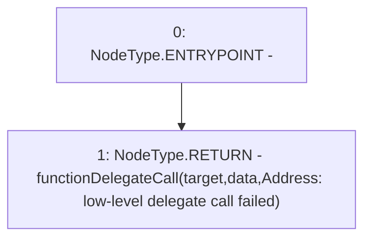

# Context: Address.functionDelegateCall

**Contract:** `Address` (Inherits: None)
**Signature:** `functionDelegateCall(address,bytes) returns (bytes)`
**Method Selector ID:** `Internal (No Method ID)`
**Visibility:** `internal`
**Environment-Free:** `Yes`
**Modifiers:** None

### State Variables Interaction
- **Reads:** None
- **Writes:** None

### Environment & Verification Flags
- **Uses Foundry Cheatcodes:** No
- **Has Echidna Properties:** No

### Internal Calls Tree
- None

### External Calls / Value Transfers
- None

### Control Flow Graph (CFG)


### Source Mapping
Declared in: `certora-ac-datasets/detasets/web3bugs/dataset/web3bugs/17/node_modules/@openzeppelin/contracts/utils/Address.sol` on lines **153** to **155**

```solidity
    function functionDelegateCall(address target, bytes memory data) internal returns (bytes memory) {
        return functionDelegateCall(target, data, "Address: low-level delegate call failed");
    }

```
