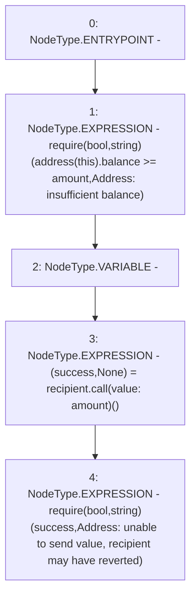

# Context: Address.sendValue

**Contract:** `Address` (Inherits: None)
**Signature:** `sendValue(address,uint256)`
**Method Selector ID:** `Internal (No Method ID)`
**Visibility:** `internal`
**Environment-Free:** `Yes`
**Modifiers:** None

### State Variables Interaction
- **Reads:** None
- **Writes:** None

### Assertion Checks & Business Requirements
- require/assert: `require(bool,string)(address(this).balance >= amount,Address: insufficient balance)`
- require/assert: `require(bool,string)(success,Address: unable to send value, recipient may have reverted)`

### Environment & Verification Flags
- **Uses Foundry Cheatcodes:** No
- **Has Echidna Properties:** No

### Internal Calls Tree
- None

### External Calls / Value Transfers
- `TMP_319(None) = SOLIDITY_CALL require(bool,string)(success,Address: unable to send value, recipient may have reverted)`
- `low-level-call`

### Control Flow Graph (CFG)


### Source Mapping
Declared in: `certora-ac-datasets/detasets/web3bugs/dataset/web3bugs/17/node_modules/@openzeppelin/contracts/utils/Address.sol` on lines **53** to **59**

```solidity
    function sendValue(address payable recipient, uint256 amount) internal {
        require(address(this).balance >= amount, "Address: insufficient balance");

        // solhint-disable-next-line avoid-low-level-calls, avoid-call-value
        (bool success, ) = recipient.call{ value: amount }("");
        require(success, "Address: unable to send value, recipient may have reverted");
    }

```
