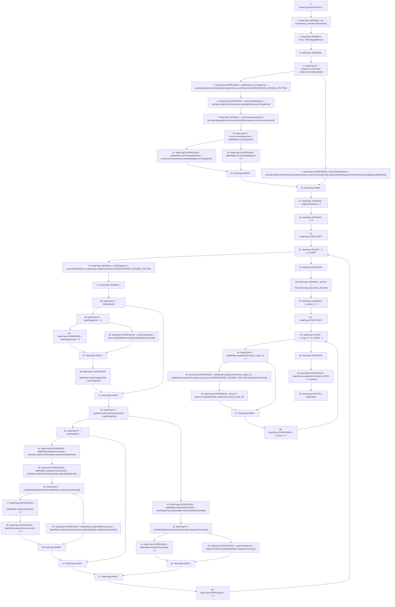

# Context: Allocation._calcVaultTargetDelta

**Contract:** `Allocation` (Inherits: IAllocation, Whitelist, Controllable, Ownable, Context, Constants)
**Signature:** `_calcVaultTargetDelta(SystemState,bool,bool) returns (StablecoinAllocationState)`
**Method Selector ID:** `Internal (No Method ID)`
**Visibility:** `private`
**Environment-Free:** `Yes`
**Modifiers:** None

### State Variables Interaction
- **Reads:** N_COINS, PERCENTAGE_DECIMAL_FACTOR, swapThreshold
- **Writes:** None

### Environment & Verification Flags
- **Uses Foundry Cheatcodes:** No
- **Has Echidna Properties:** No

### Internal Calls Tree
- None

### External Calls / Value Transfers
- `SafeMath.TMP_146(uint256) = LIBRARY_CALL, dest:SafeMath, function:SafeMath.mul(uint256,uint256), arguments:['REF_45', 'REF_47'] `
- `SafeMath.TMP_173(uint256) = LIBRARY_CALL, dest:SafeMath, function:SafeMath.sub(uint256,uint256), arguments:['percent', 'REF_113'] `
- `SafeMath.TMP_172(uint256) = LIBRARY_CALL, dest:SafeMath, function:SafeMath.div(uint256,uint256), arguments:['TMP_171', 'swapOutTotalUsd'] `
- `SafeMath.TMP_164(uint256) = LIBRARY_CALL, dest:SafeMath, function:SafeMath.sub(uint256,uint256), arguments:['vaultTargetUsd', 'REF_95'] `
- `SafeMath.TMP_147(uint256) = LIBRARY_CALL, dest:SafeMath, function:SafeMath.div(uint256,uint256), arguments:['TMP_146', 'PERCENTAGE_DECIMAL_FACTOR'] `
- `SafeMath.TMP_151(uint256) = LIBRARY_CALL, dest:SafeMath, function:SafeMath.sub(uint256,uint256), arguments:['TMP_150', 'REF_59'] `
- `SafeMath.TMP_153(uint256) = LIBRARY_CALL, dest:SafeMath, function:SafeMath.add(uint256,uint256), arguments:['TMP_151', 'TMP_152'] `
- `SafeMath.TMP_150(uint256) = LIBRARY_CALL, dest:SafeMath, function:SafeMath.sub(uint256,uint256), arguments:['REF_55', 'REF_57'] `
- `SafeMath.TMP_177(uint256) = LIBRARY_CALL, dest:SafeMath, function:SafeMath.sub(uint256,uint256), arguments:['curveCurrentAssetsUsd', 'REF_119'] `
- `SafeMath.TMP_148(uint256) = LIBRARY_CALL, dest:SafeMath, function:SafeMath.sub(uint256,uint256), arguments:['REF_49', 'REF_51'] `
- `SafeMath.TMP_161(uint256) = LIBRARY_CALL, dest:SafeMath, function:SafeMath.sub(uint256,uint256), arguments:['REF_78', 'vaultTargetUsd'] `
- `IController.TMP_140(address) = HIGH_LEVEL_CALL, dest:TMP_139(IController), function:lifeGuard, arguments:[]  `
- `SafeMath.TMP_149(uint256) = LIBRARY_CALL, dest:SafeMath, function:SafeMath.add(uint256,uint256), arguments:['REF_52', 'REF_54'] `
- `SafeMath.TMP_166(uint256) = LIBRARY_CALL, dest:SafeMath, function:SafeMath.add(uint256,uint256), arguments:['swapOutTotalUsd', 'REF_102'] `
- `ILifeGuard.TMP_142(address) = HIGH_LEVEL_CALL, dest:lg(ILifeGuard), function:getBuoy, arguments:[]  `
- `SafeMath.TMP_155(uint256) = LIBRARY_CALL, dest:SafeMath, function:SafeMath.mul(uint256,uint256), arguments:['amountToRebalance', 'REF_64'] `
- `SafeMath.TMP_171(uint256) = LIBRARY_CALL, dest:SafeMath, function:SafeMath.mul(uint256,uint256), arguments:['REF_108', 'PERCENTAGE_DECIMAL_FACTOR'] `
- `SafeMath.TMP_163(uint256) = LIBRARY_CALL, dest:SafeMath, function:SafeMath.add(uint256,uint256), arguments:['REF_87', 'REF_90'] `
- `ILifeGuard.TMP_152(uint256) = HIGH_LEVEL_CALL, dest:lg(ILifeGuard), function:availableUsd, arguments:[]  `
- `SafeMath.TMP_156(uint256) = LIBRARY_CALL, dest:SafeMath, function:SafeMath.div(uint256,uint256), arguments:['TMP_155', 'PERCENTAGE_DECIMAL_FACTOR'] `
- `SafeMath.TMP_160(uint256) = LIBRARY_CALL, dest:SafeMath, function:SafeMath.sub(uint256,uint256), arguments:['REF_73', 'vaultTargetAssets'] `
- `IBuoy.TMP_180(uint256) = HIGH_LEVEL_CALL, dest:buoy(IBuoy), function:singleStableFromUsd, arguments:['vaultTargetUsd', 'TMP_179']  `

### Control Flow Graph (CFG)


### Source Mapping
Declared in: `certora-ac-datasets/detasets/web3bugs/dataset/web3bugs/17/contracts/insurance/Allocation.sol` on lines **165** to **256**

```solidity
    function _calcVaultTargetDelta(
        SystemState memory sysState,
        bool onlySwapOut,
        bool includeCurveVault
    ) private view returns (StablecoinAllocationState memory stableState) {
        ILifeGuard lg = ILifeGuard(_controller().lifeGuard());
        IBuoy buoy = IBuoy(lg.getBuoy());

        uint256 amountToRebalance;
        // The rebalance may only be possible by moving assets out of the Curve vault,
        //  as Curve adds exposure to all stablecoins
        if (includeCurveVault && needCurveVault(sysState)) {
            stableState.curveTargetUsd = sysState.totalCurrentAssetsUsd.mul(sysState.curvePercent).div(
                PERCENTAGE_DECIMAL_FACTOR
            );
            // Estimate how much needs to be moved out of the Curve vault
            amountToRebalance = sysState.totalCurrentAssetsUsd.sub(stableState.curveTargetUsd);
            // When establishing current Curve exposures, we include uninvested assets in the lifeguard
            // as part of the Curve vault, otherwise I rebalance could temporarily fix an overexposure,
            // just to have to deal with the same overexposure when the lifeguard assets get invested
            // into the Curve vault.
            uint256 curveCurrentAssetsUsd = sysState.lifeguardCurrentAssetsUsd.add(sysState.curveCurrentAssetsUsd);
            stableState.curveTargetDeltaUsd = curveCurrentAssetsUsd > stableState.curveTargetUsd
                ? curveCurrentAssetsUsd.sub(stableState.curveTargetUsd)
                : 0;
        } else {
            // If we dont have to consider the Curve vault, Remove Curve assets and the part in lifeguard for Curve
            // from the rebalance calculations
            amountToRebalance = sysState
            .totalCurrentAssetsUsd
            .sub(sysState.curveCurrentAssetsUsd)
            .sub(sysState.lifeguardCurrentAssetsUsd)
            .add(lg.availableUsd());
        }

        // Calculate the strategy amount by vaultAssets * percentOfStrategy
        uint256 swapOutTotalUsd = 0;
        for (uint256 i = 0; i < N_COINS; i++) {
            // Compare allocation targets with actual assets in vault -
            //   if onlySwapOut = True, we don't consider the the current assets in the vault,
            //   but rather how much we need to remove from the vault based on target allocations.
            //   This means that the removal amount gets split throughout the vaults based on
            //   the allocation targets, rather than the difference between the allocation target
            //   and the actual amount of assets in the vault.
            uint256 vaultTargetUsd = amountToRebalance.mul(sysState.stablePercents[i]).div(PERCENTAGE_DECIMAL_FACTOR);
            uint256 vaultTargetAssets;
            if (!onlySwapOut) {
                vaultTargetAssets = vaultTargetUsd == 0 ? 0 : buoy.singleStableFromUsd(vaultTargetUsd, int128(i));
                stableState.vaultsTargetUsd[i] = vaultTargetUsd;
            }

            // More than target
            if (sysState.vaultCurrentAssetsUsd[i] > vaultTargetUsd) {
                if (!onlySwapOut) {
                    stableState.swapInAmounts[i] = sysState.vaultCurrentAssets[i].sub(vaultTargetAssets);
                    stableState.swapInAmountsUsd[i] = sysState.vaultCurrentAssetsUsd[i].sub(vaultTargetUsd);
                    // Make sure that that the change in vault asset is large enough to
                    // justify rebalancing the vault
                    if (invalidDelta(swapThreshold, stableState.swapInAmountsUsd[i])) {
                        stableState.swapInAmounts[i] = 0;
                        stableState.swapInAmountsUsd[i] = 0;
                    } else {
                        stableState.swapInTotalAmountUsd = stableState.swapInTotalAmountUsd.add(
                            stableState.swapInAmountsUsd[i]
                        );
                    }
                }
                // Less than target
            } else {
                stableState.swapOutPercents[i] = vaultTargetUsd.sub(sysState.vaultCurrentAssetsUsd[i]);
                // Make sure that that the change in vault asset is large enough to
                // justify rebalancing the vault
                if (invalidDelta(swapThreshold, stableState.swapOutPercents[i])) {
                    stableState.swapOutPercents[i] = 0;
                } else {
                    swapOutTotalUsd = swapOutTotalUsd.add(stableState.swapOutPercents[i]);
                }
            }
        }

        // Establish percentage (BP) amount for change in each vault
        uint256 percent = PERCENTAGE_DECIMAL_FACTOR;
        for (uint256 i = 0; i < N_COINS - 1; i++) {
            if (stableState.swapOutPercents[i] > 0) {
                stableState.swapOutPercents[i] = stableState.swapOutPercents[i].mul(PERCENTAGE_DECIMAL_FACTOR).div(
                    swapOutTotalUsd
                );
                percent = percent.sub(stableState.swapOutPercents[i]);
            }
        }
        stableState.swapOutPercents[N_COINS - 1] = percent;
    }

```
