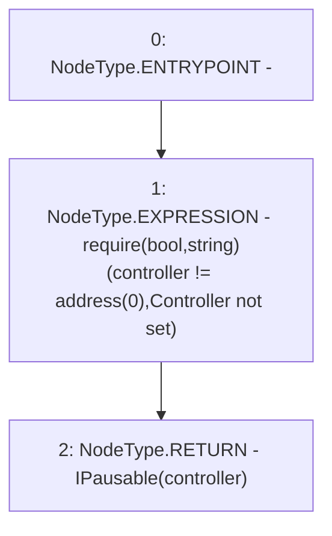

# Context: Allocation._pausable

**Contract:** `Allocation` (Inherits: IAllocation, Whitelist, Controllable, Ownable, Context, Constants)
**Signature:** `_pausable() returns (IPausable)`
**Method Selector ID:** `Internal (No Method ID)`
**Visibility:** `internal`
**Environment-Free:** `Yes`
**Modifiers:** None

### State Variables Interaction
- **Reads:** controller
- **Writes:** None

### Assertion Checks & Business Requirements
- require/assert: `require(bool,string)(controller != address(0),Controller not set)`

### Environment & Verification Flags
- **Uses Foundry Cheatcodes:** No
- **Has Echidna Properties:** No

### Internal Calls Tree
- None

### External Calls / Value Transfers
- None

### Control Flow Graph (CFG)


### Source Mapping
Declared in: `certora-ac-datasets/detasets/web3bugs/dataset/web3bugs/17/contracts/common/Controllable.sol` on lines **47** to **50**

```solidity
    function _pausable() internal view returns (IPausable) {
        require(controller != address(0), "Controller not set");
        return IPausable(controller);
    }

```
