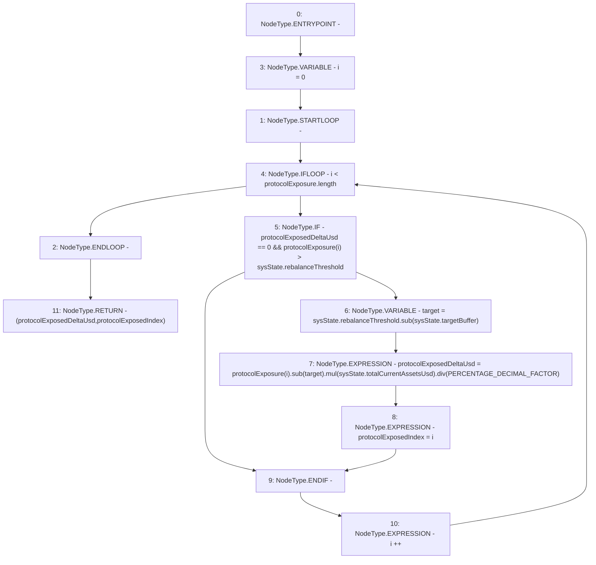

# Context: Allocation.calcProtocolExposureDelta

**Contract:** `Allocation` (Inherits: IAllocation, Whitelist, Controllable, Ownable, Context, Constants)
**Signature:** `calcProtocolExposureDelta(uint256[],SystemState) returns (uint256, uint256)`
**Method Selector ID:** `Internal (No Method ID)`
**Visibility:** `private`
**Environment-Free:** `Yes`
**Modifiers:** None

### State Variables Interaction
- **Reads:** PERCENTAGE_DECIMAL_FACTOR
- **Writes:** None

### Environment & Verification Flags
- **Uses Foundry Cheatcodes:** No
- **Has Echidna Properties:** No

### Internal Calls Tree
- None

### External Calls / Value Transfers
- `SafeMath.TMP_193(uint256) = LIBRARY_CALL, dest:SafeMath, function:SafeMath.mul(uint256,uint256), arguments:['TMP_192', 'REF_138'] `
- `SafeMath.TMP_191(uint256) = LIBRARY_CALL, dest:SafeMath, function:SafeMath.sub(uint256,uint256), arguments:['REF_132', 'REF_134'] `
- `SafeMath.TMP_194(uint256) = LIBRARY_CALL, dest:SafeMath, function:SafeMath.div(uint256,uint256), arguments:['TMP_193', 'PERCENTAGE_DECIMAL_FACTOR'] `
- `SafeMath.TMP_192(uint256) = LIBRARY_CALL, dest:SafeMath, function:SafeMath.sub(uint256,uint256), arguments:['REF_135', 'target'] `

### Control Flow Graph (CFG)


### Source Mapping
Declared in: `certora-ac-datasets/detasets/web3bugs/dataset/web3bugs/17/contracts/insurance/Allocation.sol` on lines **286** to **302**

```solidity
    function calcProtocolExposureDelta(uint256[] memory protocolExposure, SystemState memory sysState)
        private
        pure
        returns (uint256 protocolExposedDeltaUsd, uint256 protocolExposedIndex)
    {
        for (uint256 i = 0; i < protocolExposure.length; i++) {
            // If the exposure is greater than the rebalance threshold...
            if (protocolExposedDeltaUsd == 0 && protocolExposure[i] > sysState.rebalanceThreshold) {
                // ...Calculate the delta between exposure and target
                uint256 target = sysState.rebalanceThreshold.sub(sysState.targetBuffer);
                protocolExposedDeltaUsd = protocolExposure[i].sub(target).mul(sysState.totalCurrentAssetsUsd).div(
                    PERCENTAGE_DECIMAL_FACTOR
                );
                protocolExposedIndex = i;
            }
        }
    }

```
