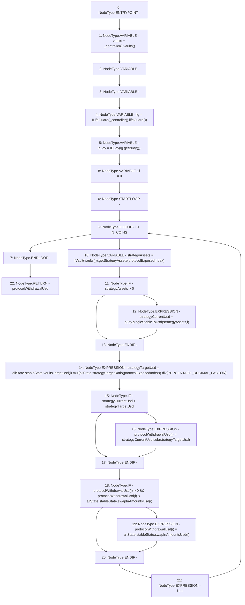

# Context: Allocation.calcProtocolWithdraw

**Contract:** `Allocation` (Inherits: IAllocation, Whitelist, Controllable, Ownable, Context, Constants)
**Signature:** `calcProtocolWithdraw(AllocationState,uint256) returns (uint256[3])`
**Method Selector ID:** `Internal (No Method ID)`
**Visibility:** `private`
**Environment-Free:** `Yes`
**Modifiers:** None

### State Variables Interaction
- **Reads:** N_COINS, PERCENTAGE_DECIMAL_FACTOR
- **Writes:** None

### Environment & Verification Flags
- **Uses Foundry Cheatcodes:** No
- **Has Echidna Properties:** No

### Internal Calls Tree
- None

### External Calls / Value Transfers
- `IController.TMP_120(address[3]) = HIGH_LEVEL_CALL, dest:TMP_119(IController), function:vaults, arguments:[]  `
- `IBuoy.TMP_130(uint256) = HIGH_LEVEL_CALL, dest:buoy(IBuoy), function:singleStableToUsd, arguments:['strategyAssets', 'i']  `
- `IController.TMP_122(address) = HIGH_LEVEL_CALL, dest:TMP_121(IController), function:lifeGuard, arguments:[]  `
- `ILifeGuard.TMP_124(address) = HIGH_LEVEL_CALL, dest:lg(ILifeGuard), function:getBuoy, arguments:[]  `
- `SafeMath.TMP_131(uint256) = LIBRARY_CALL, dest:SafeMath, function:SafeMath.mul(uint256,uint256), arguments:['REF_26', 'REF_29'] `
- `IVault.TMP_128(uint256) = HIGH_LEVEL_CALL, dest:TMP_127(IVault), function:getStrategyAssets, arguments:['protocolExposedIndex']  `
- `SafeMath.TMP_134(uint256) = LIBRARY_CALL, dest:SafeMath, function:SafeMath.sub(uint256,uint256), arguments:['strategyCurrentUsd', 'strategyTargetUsd'] `
- `SafeMath.TMP_132(uint256) = LIBRARY_CALL, dest:SafeMath, function:SafeMath.div(uint256,uint256), arguments:['TMP_131', 'PERCENTAGE_DECIMAL_FACTOR'] `

### Control Flow Graph (CFG)


### Source Mapping
Declared in: `certora-ac-datasets/detasets/web3bugs/dataset/web3bugs/17/contracts/insurance/Allocation.sol` on lines **126** to **159**

```solidity
    function calcProtocolWithdraw(AllocationState memory allState, uint256 protocolExposedIndex)
        private
        view
        returns (uint256[N_COINS] memory protocolWithdrawalUsd)
    {
        address[N_COINS] memory vaults = _controller().vaults();
        // How much to withdraw from each protocol
        uint256 strategyCurrentUsd;
        uint256 strategyTargetUsd;
        ILifeGuard lg = ILifeGuard(_controller().lifeGuard());
        IBuoy buoy = IBuoy(lg.getBuoy());
        // Loop over each vault
        for (uint256 i = 0; i < N_COINS; i++) {
            uint256 strategyAssets = IVault(vaults[i]).getStrategyAssets(protocolExposedIndex);
            // If the strategy has assets, determine the USD value of the asset
            if (strategyAssets > 0) {
                strategyCurrentUsd = buoy.singleStableToUsd(strategyAssets, i);
            }
            // Determine the USD value of the strategy asset target
            strategyTargetUsd = allState
            .stableState
            .vaultsTargetUsd[i]
            .mul(allState.strategyTargetRatio[protocolExposedIndex])
            .div(PERCENTAGE_DECIMAL_FACTOR);
            // If the strategy is over exposed, assets can be removed
            if (strategyCurrentUsd > strategyTargetUsd) {
                protocolWithdrawalUsd[i] = strategyCurrentUsd.sub(strategyTargetUsd);
            }
            // If the strategy is empty or under exposed, assets can be added
            if (protocolWithdrawalUsd[i] > 0 && protocolWithdrawalUsd[i] < allState.stableState.swapInAmountsUsd[i]) {
                protocolWithdrawalUsd[i] = allState.stableState.swapInAmountsUsd[i];
            }
        }
    }

```
