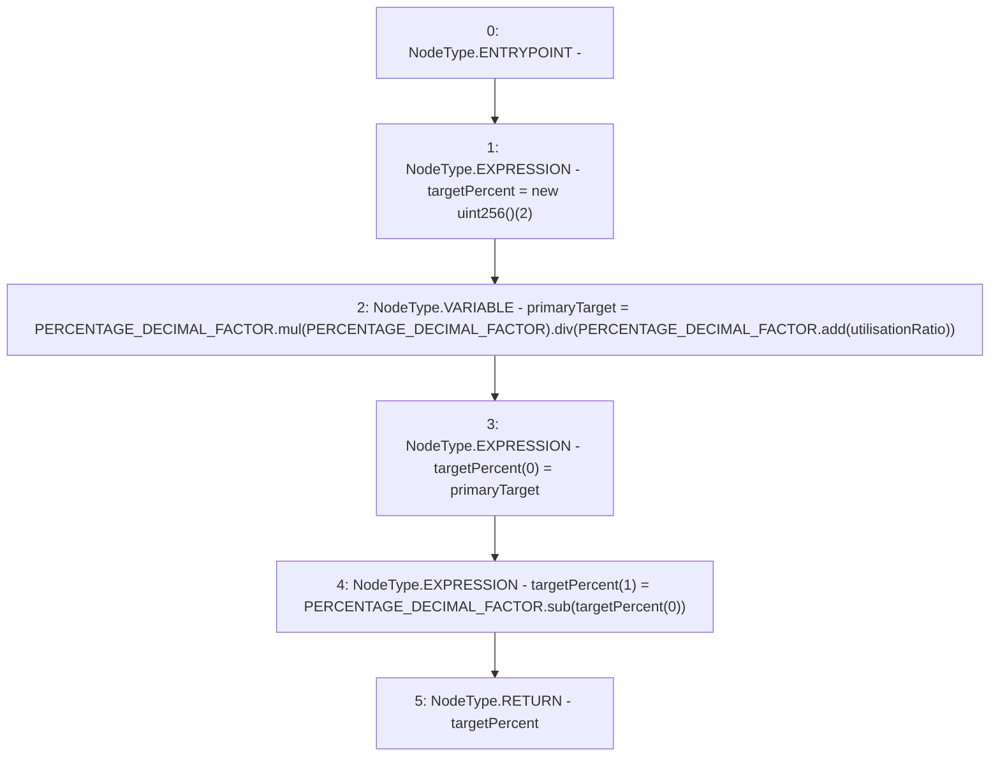

# Context: Allocation.calcStrategyPercent

**Contract:** `Allocation` (Inherits: IAllocation, Whitelist, Controllable, Ownable, Context, Constants)
**Signature:** `calcStrategyPercent(uint256) returns (uint256[])`
**Method Selector ID:** `0xd90e7af3`
**Visibility:** `public`
**Environment-Free:** `Yes`
**Modifiers:** None

### State Variables Interaction
- **Reads:** PERCENTAGE_DECIMAL_FACTOR
- **Writes:** None

### Environment & Verification Flags
- **Uses Foundry Cheatcodes:** No
- **Has Echidna Properties:** No

### Internal Calls Tree
- None

### External Calls / Value Transfers
- `SafeMath.TMP_184(uint256) = LIBRARY_CALL, dest:SafeMath, function:SafeMath.add(uint256,uint256), arguments:['PERCENTAGE_DECIMAL_FACTOR', 'utilisationRatio'] `
- `SafeMath.TMP_186(uint256) = LIBRARY_CALL, dest:SafeMath, function:SafeMath.sub(uint256,uint256), arguments:['PERCENTAGE_DECIMAL_FACTOR', 'REF_128'] `
- `SafeMath.TMP_185(uint256) = LIBRARY_CALL, dest:SafeMath, function:SafeMath.div(uint256,uint256), arguments:['TMP_183', 'TMP_184'] `
- `SafeMath.TMP_183(uint256) = LIBRARY_CALL, dest:SafeMath, function:SafeMath.mul(uint256,uint256), arguments:['PERCENTAGE_DECIMAL_FACTOR', 'PERCENTAGE_DECIMAL_FACTOR'] `

### Control Flow Graph (CFG)


### Source Mapping
Declared in: `certora-ac-datasets/detasets/web3bugs/dataset/web3bugs/17/contracts/insurance/Allocation.sol` on lines **262** to **276**

```solidity
    function calcStrategyPercent(uint256 utilisationRatio)
        public
        pure
        override
        returns (uint256[] memory targetPercent)
    {
        targetPercent = new uint256[](2);
        uint256 primaryTarget = PERCENTAGE_DECIMAL_FACTOR.mul(PERCENTAGE_DECIMAL_FACTOR).div(
            PERCENTAGE_DECIMAL_FACTOR.add(utilisationRatio)
        );

        targetPercent[0] = primaryTarget; // Primary
        targetPercent[1] = PERCENTAGE_DECIMAL_FACTOR // Secondary
        .sub(targetPercent[0]);
    }

```
