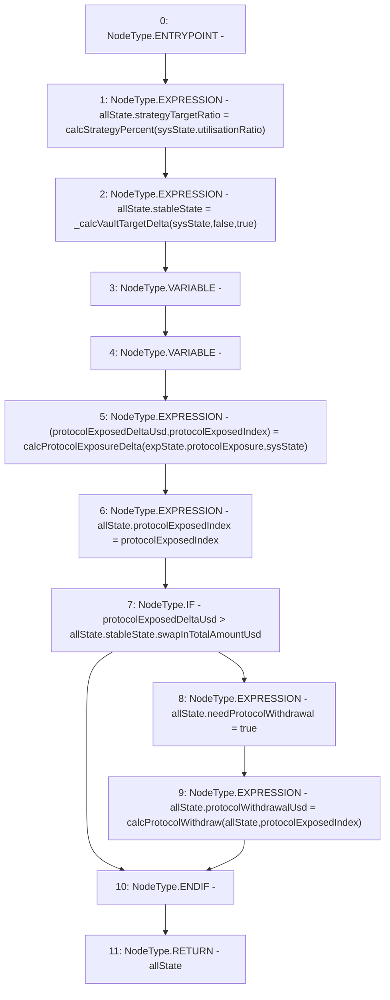

# Context: Allocation.calcSystemTargetDelta

**Contract:** `Allocation` (Inherits: IAllocation, Whitelist, Controllable, Ownable, Context, Constants)
**Signature:** `calcSystemTargetDelta(SystemState,ExposureState) returns (AllocationState)`
**Method Selector ID:** `0x3b2691c2`
**Visibility:** `public`
**Environment-Free:** `Yes`
**Modifiers:** None

### State Variables Interaction
- **Reads:** None
- **Writes:** None

### Environment & Verification Flags
- **Uses Foundry Cheatcodes:** No
- **Has Echidna Properties:** No

### Internal Calls Tree
- None

### External Calls / Value Transfers
- None

### Control Flow Graph (CFG)


### Source Mapping
Declared in: `certora-ac-datasets/detasets/web3bugs/dataset/web3bugs/17/contracts/insurance/Allocation.sol` on lines **62** to **86**

```solidity
    function calcSystemTargetDelta(SystemState memory sysState, ExposureState memory expState)
        public
        view
        override
        returns (AllocationState memory allState)
    {
        // Strategy targets in stablecoin vaults are determined by the pwrd/gvt utilisationRatio
        allState.strategyTargetRatio = calcStrategyPercent(sysState.utilisationRatio);
        // Curve target is determined by governance (insurance - curveVaultPercent)
        allState.stableState = _calcVaultTargetDelta(sysState, false, true);
        // Calculate exposure delta - difference between targets and current assets
        (uint256 protocolExposedDeltaUsd, uint256 protocolExposedIndex) = calcProtocolExposureDelta(
            expState.protocolExposure,
            sysState
        );
        allState.protocolExposedIndex = protocolExposedIndex;
        if (protocolExposedDeltaUsd > allState.stableState.swapInTotalAmountUsd) {
            // If the rebalance cannot be achieved by simply moving assets from one vault, the
            // system needs to establish how to withdraw assets from all vaults and their
            // underlying strategies. Calculate protocol withdrawals based on all vaults,
            // each strategy above target withdraws: delta of current assets - target assets
            allState.needProtocolWithdrawal = true;
            allState.protocolWithdrawalUsd = calcProtocolWithdraw(allState, protocolExposedIndex);
        }
    }

```
