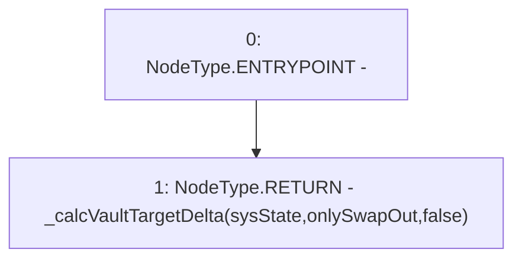

# Context: Allocation.calcVaultTargetDelta

**Contract:** `Allocation` (Inherits: IAllocation, Whitelist, Controllable, Ownable, Context, Constants)
**Signature:** `calcVaultTargetDelta(SystemState,bool) returns (StablecoinAllocationState)`
**Method Selector ID:** `0x3320592b`
**Visibility:** `public`
**Environment-Free:** `Yes`
**Modifiers:** None

### State Variables Interaction
- **Reads:** None
- **Writes:** None

### Environment & Verification Flags
- **Uses Foundry Cheatcodes:** No
- **Has Echidna Properties:** No

### Internal Calls Tree
- None

### External Calls / Value Transfers
- None

### Control Flow Graph (CFG)


### Source Mapping
Declared in: `certora-ac-datasets/detasets/web3bugs/dataset/web3bugs/17/contracts/insurance/Allocation.sol` on lines **92** to **99**

```solidity
    function calcVaultTargetDelta(SystemState memory sysState, bool onlySwapOut)
        public
        view
        override
        returns (StablecoinAllocationState memory)
    {
        return _calcVaultTargetDelta(sysState, onlySwapOut, false);
    }

```
