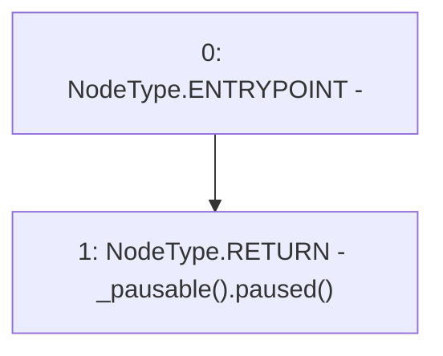

# Context: Allocation.ctrlPaused

**Contract:** `Allocation` (Inherits: IAllocation, Whitelist, Controllable, Ownable, Context, Constants)
**Signature:** `ctrlPaused() returns (bool)`
**Method Selector ID:** `0x19e40993`
**Visibility:** `public`
**Environment-Free:** `Yes`
**Modifiers:** None

### State Variables Interaction
- **Reads:** None
- **Writes:** None

### Environment & Verification Flags
- **Uses Foundry Cheatcodes:** No
- **Has Echidna Properties:** No

### Internal Calls Tree
- None

### External Calls / Value Transfers
- `IPausable.TMP_96(bool) = HIGH_LEVEL_CALL, dest:TMP_95(IPausable), function:paused, arguments:[]  `

### Control Flow Graph (CFG)


### Source Mapping
Declared in: `certora-ac-datasets/detasets/web3bugs/dataset/web3bugs/17/contracts/common/Controllable.sol` on lines **31** to **33**

```solidity
    function ctrlPaused() public view returns (bool) {
        return _pausable().paused();
    }

```
