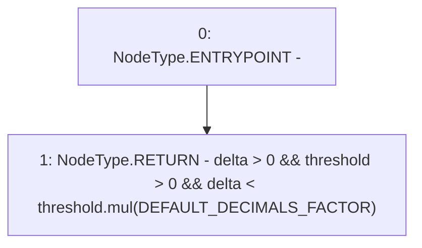

# Context: Allocation.invalidDelta

**Contract:** `Allocation` (Inherits: IAllocation, Whitelist, Controllable, Ownable, Context, Constants)
**Signature:** `invalidDelta(uint256,uint256) returns (bool)`
**Method Selector ID:** `Internal (No Method ID)`
**Visibility:** `private`
**Environment-Free:** `Yes`
**Modifiers:** None

### State Variables Interaction
- **Reads:** DEFAULT_DECIMALS_FACTOR
- **Writes:** None

### Environment & Verification Flags
- **Uses Foundry Cheatcodes:** No
- **Has Echidna Properties:** No

### Internal Calls Tree
- None

### External Calls / Value Transfers
- `SafeMath.TMP_199(uint256) = LIBRARY_CALL, dest:SafeMath, function:SafeMath.mul(uint256,uint256), arguments:['threshold', 'DEFAULT_DECIMALS_FACTOR'] `

### Control Flow Graph (CFG)


### Source Mapping
Declared in: `certora-ac-datasets/detasets/web3bugs/dataset/web3bugs/17/contracts/insurance/Allocation.sol` on lines **308** to **310**

```solidity
    function invalidDelta(uint256 threshold, uint256 delta) private pure returns (bool) {
        return delta > 0 && threshold > 0 && delta < threshold.mul(DEFAULT_DECIMALS_FACTOR);
    }

```
