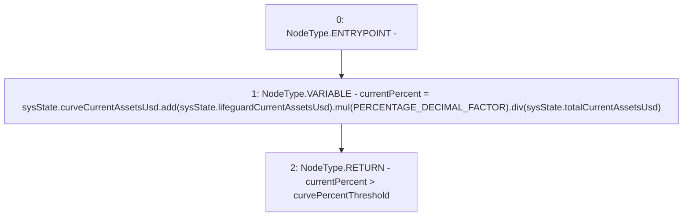

# Context: Allocation.needCurveVault

**Contract:** `Allocation` (Inherits: IAllocation, Whitelist, Controllable, Ownable, Context, Constants)
**Signature:** `needCurveVault(SystemState) returns (bool)`
**Method Selector ID:** `Internal (No Method ID)`
**Visibility:** `private`
**Environment-Free:** `Yes`
**Modifiers:** None

### State Variables Interaction
- **Reads:** PERCENTAGE_DECIMAL_FACTOR, curvePercentThreshold
- **Writes:** None

### Environment & Verification Flags
- **Uses Foundry Cheatcodes:** No
- **Has Echidna Properties:** No

### Internal Calls Tree
- None

### External Calls / Value Transfers
- `SafeMath.TMP_203(uint256) = LIBRARY_CALL, dest:SafeMath, function:SafeMath.mul(uint256,uint256), arguments:['TMP_202', 'PERCENTAGE_DECIMAL_FACTOR'] `
- `SafeMath.TMP_204(uint256) = LIBRARY_CALL, dest:SafeMath, function:SafeMath.div(uint256,uint256), arguments:['TMP_203', 'REF_146'] `
- `SafeMath.TMP_202(uint256) = LIBRARY_CALL, dest:SafeMath, function:SafeMath.add(uint256,uint256), arguments:['REF_141', 'REF_143'] `

### Control Flow Graph (CFG)


### Source Mapping
Declared in: `certora-ac-datasets/detasets/web3bugs/dataset/web3bugs/17/contracts/insurance/Allocation.sol` on lines **314** to **321**

```solidity
    function needCurveVault(SystemState memory sysState) private view returns (bool) {
        uint256 currentPercent = sysState
        .curveCurrentAssetsUsd
        .add(sysState.lifeguardCurrentAssetsUsd)
        .mul(PERCENTAGE_DECIMAL_FACTOR)
        .div(sysState.totalCurrentAssetsUsd);
        return currentPercent > curvePercentThreshold;
    }

```
