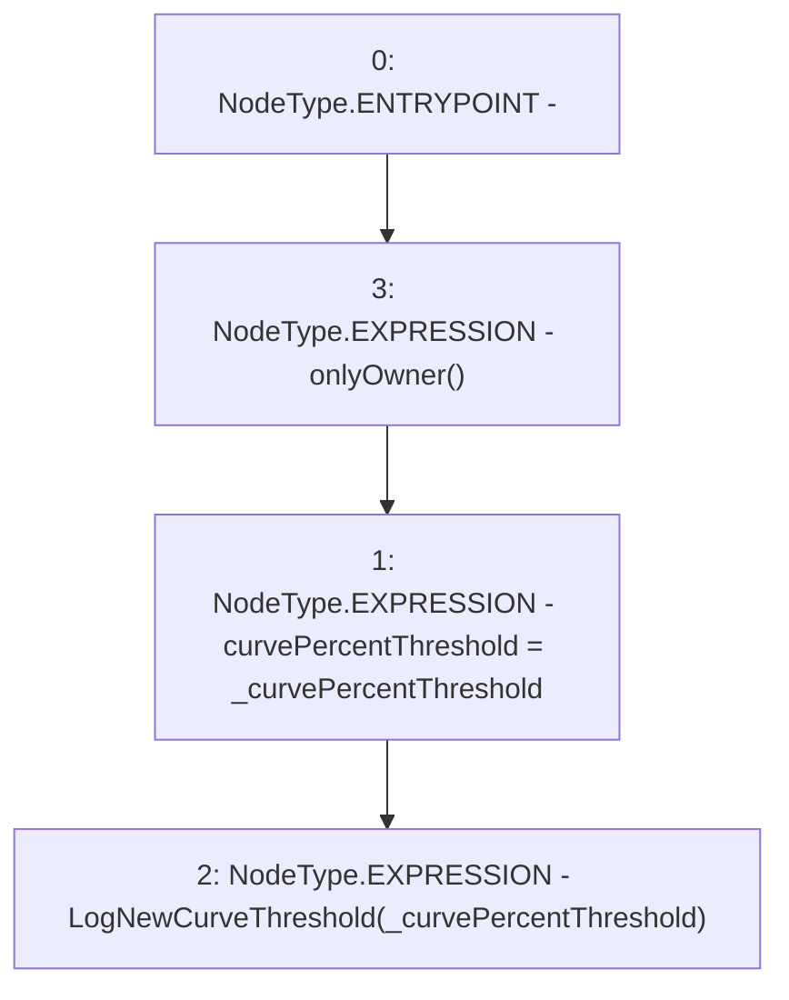

# Context: Allocation.setCurvePercentThreshold

**Contract:** `Allocation` (Inherits: IAllocation, Whitelist, Controllable, Ownable, Context, Constants)
**Signature:** `setCurvePercentThreshold(uint256)`
**Method Selector ID:** `0x39327adb`
**Visibility:** `external`
**Environment-Free:** `No (reads EVM state context)`
**Modifiers:**
- `onlyOwner`
  ```solidity
  modifier onlyOwner() {
          require(owner() == _msgSender(), "Ownable: caller is not the owner");
          _;
      }
  ```

### State Variables Interaction
- **Reads:** None
- **Writes:** curvePercentThreshold

### Environment & Verification Flags
- **Uses Foundry Cheatcodes:** No
- **Has Echidna Properties:** No

### Internal Calls Tree
- None

### External Calls / Value Transfers
- None

### Control Flow Graph (CFG)


### Source Mapping
Declared in: `certora-ac-datasets/detasets/web3bugs/dataset/web3bugs/17/contracts/insurance/Allocation.sol` on lines **51** to **54**

```solidity
    function setCurvePercentThreshold(uint256 _curvePercentThreshold) external onlyOwner {
        curvePercentThreshold = _curvePercentThreshold;
        emit LogNewCurveThreshold(_curvePercentThreshold);
    }

```
