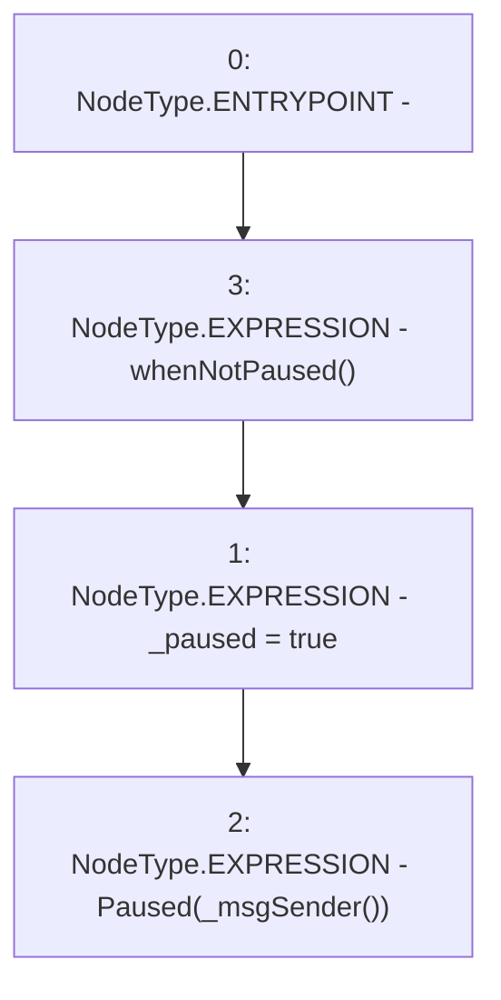

# Context: Controller._pause

**Contract:** `Controller` (Inherits: IController, FixedGTokens, FixedStablecoins, Constants, Whitelist, Ownable, Pausable, Context)
**Signature:** `_pause()`
**Method Selector ID:** `Internal (No Method ID)`
**Visibility:** `internal`
**Environment-Free:** `No (reads EVM state context)`
**Modifiers:**
- `whenNotPaused`
  ```solidity
  modifier whenNotPaused() {
          require(!paused(), "Pausable: paused");
          _;
      }
  ```

### State Variables Interaction
- **Reads:** None
- **Writes:** _paused

### Environment & Verification Flags
- **Uses Foundry Cheatcodes:** No
- **Has Echidna Properties:** No

### Internal Calls Tree
- None

### External Calls / Value Transfers
- None

### Control Flow Graph (CFG)


### Source Mapping
Declared in: `certora-ac-datasets/detasets/web3bugs/dataset/web3bugs/17/node_modules/@openzeppelin/contracts/utils/Pausable.sol` on lines **74** to **77**

```solidity
    function _pause() internal virtual whenNotPaused {
        _paused = true;
        emit Paused(_msgSender());
    }

```
