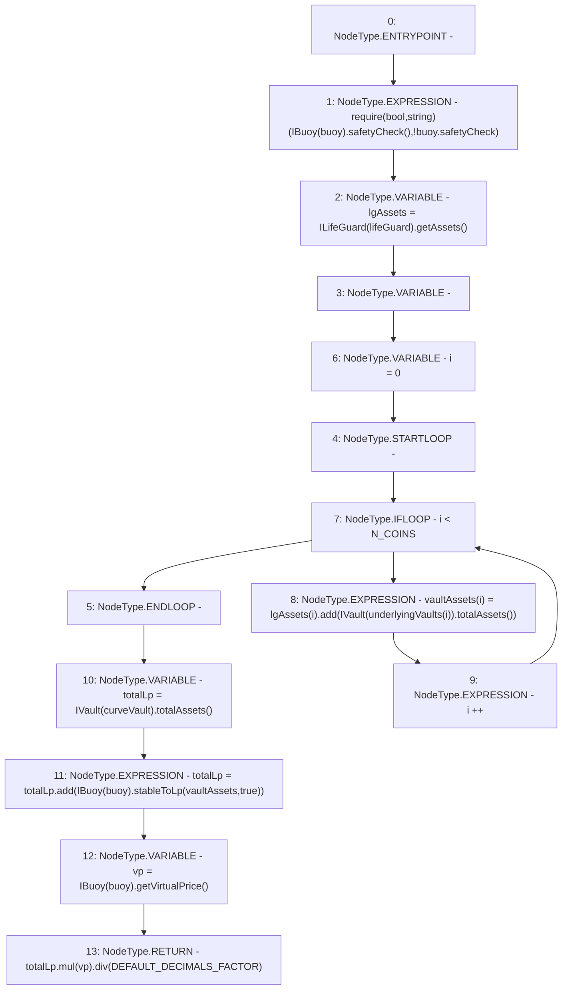

# Context: Controller._totalAssets

**Contract:** `Controller` (Inherits: IController, FixedGTokens, FixedStablecoins, Constants, Whitelist, Ownable, Pausable, Context)
**Signature:** `_totalAssets() returns (uint256)`
**Method Selector ID:** `Internal (No Method ID)`
**Visibility:** `private`
**Environment-Free:** `Yes`
**Modifiers:** None

### State Variables Interaction
- **Reads:** DEFAULT_DECIMALS_FACTOR, N_COINS, buoy, curveVault, lifeGuard, underlyingVaults
- **Writes:** None

### Assertion Checks & Business Requirements
- require/assert: `require(bool,string)(IBuoy(buoy).safetyCheck(),!buoy.safetyCheck)`

### Environment & Verification Flags
- **Uses Foundry Cheatcodes:** No
- **Has Echidna Properties:** No

### Internal Calls Tree
- None

### External Calls / Value Transfers
- `ILifeGuard.TMP_146(uint256[3]) = HIGH_LEVEL_CALL, dest:TMP_145(ILifeGuard), function:getAssets, arguments:[]  `
- `SafeMath.TMP_156(uint256) = LIBRARY_CALL, dest:SafeMath, function:SafeMath.add(uint256,uint256), arguments:['totalLp', 'TMP_155'] `
- `IBuoy.TMP_143(bool) = HIGH_LEVEL_CALL, dest:TMP_142(IBuoy), function:safetyCheck, arguments:[]  `
- `SafeMath.TMP_160(uint256) = LIBRARY_CALL, dest:SafeMath, function:SafeMath.div(uint256,uint256), arguments:['TMP_159', 'DEFAULT_DECIMALS_FACTOR'] `
- `IVault.TMP_153(uint256) = HIGH_LEVEL_CALL, dest:TMP_152(IVault), function:totalAssets, arguments:[]  `
- `SafeMath.TMP_150(uint256) = LIBRARY_CALL, dest:SafeMath, function:SafeMath.add(uint256,uint256), arguments:['REF_35', 'TMP_149'] `
- `IVault.TMP_149(uint256) = HIGH_LEVEL_CALL, dest:TMP_148(IVault), function:totalAssets, arguments:[]  `
- `IBuoy.TMP_158(uint256) = HIGH_LEVEL_CALL, dest:TMP_157(IBuoy), function:getVirtualPrice, arguments:[]  `
- `IBuoy.TMP_155(uint256) = HIGH_LEVEL_CALL, dest:TMP_154(IBuoy), function:stableToLp, arguments:['vaultAssets', 'True']  `
- `SafeMath.TMP_159(uint256) = LIBRARY_CALL, dest:SafeMath, function:SafeMath.mul(uint256,uint256), arguments:['totalLp', 'vp'] `

### Control Flow Graph (CFG)


### Source Mapping
Declared in: `certora-ac-datasets/detasets/web3bugs/dataset/web3bugs/17/contracts/Controller.sol` on lines **275** to **287**

```solidity
    function _totalAssets() private view returns (uint256) {
        require(IBuoy(buoy).safetyCheck(), "!buoy.safetyCheck");
        uint256[N_COINS] memory lgAssets = ILifeGuard(lifeGuard).getAssets();
        uint256[N_COINS] memory vaultAssets;
        for (uint256 i = 0; i < N_COINS; i++) {
            vaultAssets[i] = lgAssets[i].add(IVault(underlyingVaults[i]).totalAssets());
        }
        uint256 totalLp = IVault(curveVault).totalAssets();
        totalLp = totalLp.add(IBuoy(buoy).stableToLp(vaultAssets, true));
        uint256 vp = IBuoy(buoy).getVirtualPrice();

        return totalLp.mul(vp).div(DEFAULT_DECIMALS_FACTOR);
    }

```
