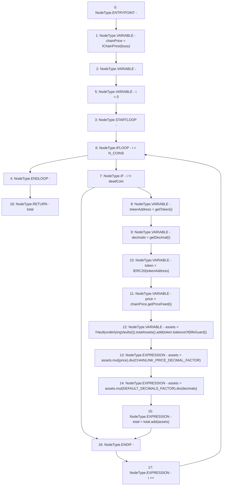

# Context: Controller._totalAssetsEmergency

**Contract:** `Controller` (Inherits: IController, FixedGTokens, FixedStablecoins, Constants, Whitelist, Ownable, Pausable, Context)
**Signature:** `_totalAssetsEmergency() returns (uint256)`
**Method Selector ID:** `Internal (No Method ID)`
**Visibility:** `private`
**Environment-Free:** `Yes`
**Modifiers:** None

### State Variables Interaction
- **Reads:** CHAINLINK_PRICE_DECIMAL_FACTOR, DEFAULT_DECIMALS_FACTOR, N_COINS, buoy, deadCoin, lifeGuard, underlyingVaults
- **Writes:** None

### Environment & Verification Flags
- **Uses Foundry Cheatcodes:** No
- **Has Echidna Properties:** No

### Internal Calls Tree
- None

### External Calls / Value Transfers
- `SafeMath.TMP_175(uint256) = LIBRARY_CALL, dest:SafeMath, function:SafeMath.div(uint256,uint256), arguments:['TMP_174', 'decimals'] `
- `SafeMath.TMP_171(uint256) = LIBRARY_CALL, dest:SafeMath, function:SafeMath.add(uint256,uint256), arguments:['TMP_169', 'TMP_170'] `
- `IVault.TMP_169(uint256) = HIGH_LEVEL_CALL, dest:TMP_168(IVault), function:totalAssets, arguments:[]  `
- `IChainPrice.TMP_167(uint256) = HIGH_LEVEL_CALL, dest:chainPrice(IChainPrice), function:getPriceFeed, arguments:['i']  `
- `IERC20.TMP_170(uint256) = HIGH_LEVEL_CALL, dest:token(IERC20), function:balanceOf, arguments:['lifeGuard']  `
- `SafeMath.TMP_176(uint256) = LIBRARY_CALL, dest:SafeMath, function:SafeMath.add(uint256,uint256), arguments:['total', 'assets'] `
- `SafeMath.TMP_172(uint256) = LIBRARY_CALL, dest:SafeMath, function:SafeMath.mul(uint256,uint256), arguments:['assets', 'price'] `
- `SafeMath.TMP_173(uint256) = LIBRARY_CALL, dest:SafeMath, function:SafeMath.div(uint256,uint256), arguments:['TMP_172', 'CHAINLINK_PRICE_DECIMAL_FACTOR'] `
- `SafeMath.TMP_174(uint256) = LIBRARY_CALL, dest:SafeMath, function:SafeMath.mul(uint256,uint256), arguments:['assets', 'DEFAULT_DECIMALS_FACTOR'] `

### Control Flow Graph (CFG)


### Source Mapping
Declared in: `certora-ac-datasets/detasets/web3bugs/dataset/web3bugs/17/contracts/Controller.sol` on lines **291** to **307**

```solidity
    function _totalAssetsEmergency() private view returns (uint256) {
        IChainPrice chainPrice = IChainPrice(buoy);
        uint256 total;
        for (uint256 i = 0; i < N_COINS; i++) {
            if (i != deadCoin) {
                address tokenAddress = getToken(i);
                uint256 decimals = getDecimal(i);
                IERC20 token = IERC20(tokenAddress);
                uint256 price = chainPrice.getPriceFeed(i);
                uint256 assets = IVault(underlyingVaults[i]).totalAssets().add(token.balanceOf(lifeGuard));
                assets = assets.mul(price).div(CHAINLINK_PRICE_DECIMAL_FACTOR);
                assets = assets.mul(DEFAULT_DECIMALS_FACTOR).div(decimals);
                total = total.add(assets);
            }
        }
        return total;
    }

```
