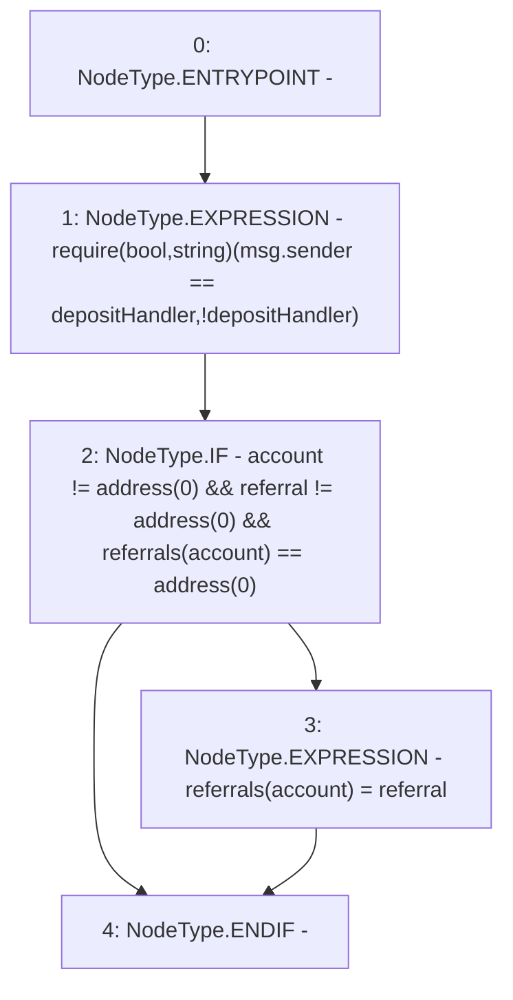

# Context: Controller.addReferral

**Contract:** `Controller` (Inherits: IController, FixedGTokens, FixedStablecoins, Constants, Whitelist, Ownable, Pausable, Context)
**Signature:** `addReferral(address,address)`
**Method Selector ID:** `0x0b5c3f87`
**Visibility:** `external`
**Environment-Free:** `No (reads EVM state context)`
**Modifiers:** None

### State Variables Interaction
- **Reads:** depositHandler, referrals
- **Writes:** referrals

### Assertion Checks & Business Requirements
- require/assert: `require(bool,string)(msg.sender == depositHandler,!depositHandler)`

### Environment & Verification Flags
- **Uses Foundry Cheatcodes:** No
- **Has Echidna Properties:** No

### Internal Calls Tree
- None

### External Calls / Value Transfers
- None

### Control Flow Graph (CFG)


### Source Mapping
Declared in: `certora-ac-datasets/detasets/web3bugs/dataset/web3bugs/17/contracts/Controller.sol` on lines **200** to **205**

```solidity
    function addReferral(address account, address referral) external override {
        require(msg.sender == depositHandler, "!depositHandler");
        if (account != address(0) && referral != address(0) && referrals[account] == address(0)) {
            referrals[account] = referral;
        }
    }

```
