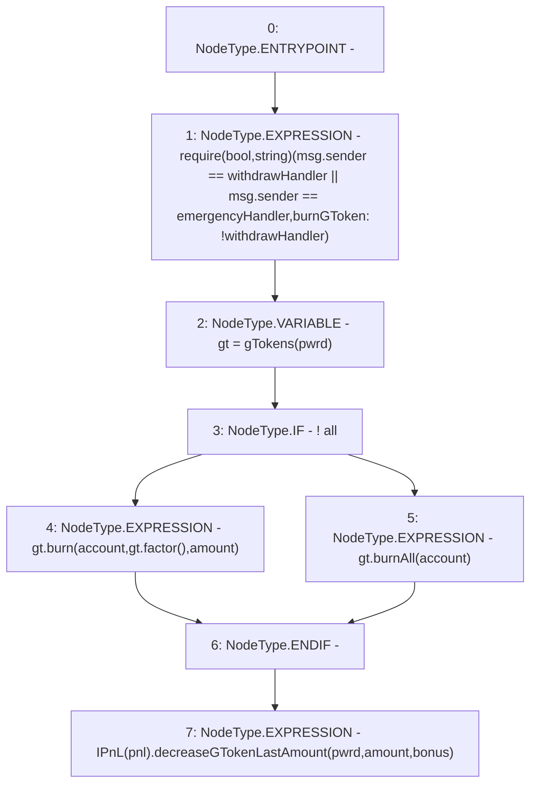

# Context: Controller.burnGToken

**Contract:** `Controller` (Inherits: IController, FixedGTokens, FixedStablecoins, Constants, Whitelist, Ownable, Pausable, Context)
**Signature:** `burnGToken(bool,bool,address,uint256,uint256)`
**Method Selector ID:** `0x78a88477`
**Visibility:** `external`
**Environment-Free:** `No (reads EVM state context)`
**Modifiers:** None

### State Variables Interaction
- **Reads:** emergencyHandler, pnl, withdrawHandler
- **Writes:** None

### Assertion Checks & Business Requirements
- require/assert: `require(bool,string)(msg.sender == withdrawHandler || msg.sender == emergencyHandler,burnGToken: !withdrawHandler)`

### Environment & Verification Flags
- **Uses Foundry Cheatcodes:** No
- **Has Echidna Properties:** No

### Internal Calls Tree
- None

### External Calls / Value Transfers
- `IPnL.HIGH_LEVEL_CALL, dest:TMP_238(IPnL), function:decreaseGTokenLastAmount, arguments:['pwrd', 'amount', 'bonus']  `
- `IToken.TMP_235(uint256) = HIGH_LEVEL_CALL, dest:gt(IToken), function:factor, arguments:[]  `
- `IToken.HIGH_LEVEL_CALL, dest:gt(IToken), function:burnAll, arguments:['account']  `
- `IToken.HIGH_LEVEL_CALL, dest:gt(IToken), function:burn, arguments:['account', 'TMP_235', 'amount']  `

### Control Flow Graph (CFG)


### Source Mapping
Declared in: `certora-ac-datasets/detasets/web3bugs/dataset/web3bugs/17/contracts/Controller.sol` on lines **398** to **414**

```solidity
    function burnGToken(
        bool pwrd,
        bool all,
        address account,
        uint256 amount,
        uint256 bonus
    ) external override {
        require(msg.sender == withdrawHandler || msg.sender == emergencyHandler, "burnGToken: !withdrawHandler");
        IToken gt = gTokens(pwrd);
        if (!all) {
            gt.burn(account, gt.factor(), amount);
        } else {
            gt.burnAll(account);
        }
        // Update underlying assets held in pwrd/gvt
        IPnL(pnl).decreaseGTokenLastAmount(pwrd, amount, bonus);
    }

```
