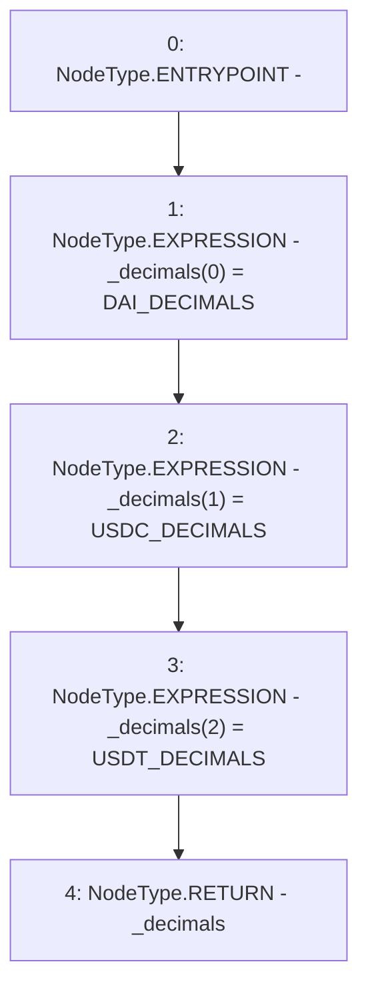

# Context: Controller.decimals

**Contract:** `Controller` (Inherits: IController, FixedGTokens, FixedStablecoins, Constants, Whitelist, Ownable, Pausable, Context)
**Signature:** `decimals() returns (uint256[3])`
**Method Selector ID:** `Internal (No Method ID)`
**Visibility:** `internal`
**Environment-Free:** `Yes`
**Modifiers:** None

### State Variables Interaction
- **Reads:** DAI_DECIMALS, USDC_DECIMALS, USDT_DECIMALS
- **Writes:** None

### Environment & Verification Flags
- **Uses Foundry Cheatcodes:** No
- **Has Echidna Properties:** No

### Internal Calls Tree
- None

### External Calls / Value Transfers
- None

### Control Flow Graph (CFG)


### Source Mapping
Declared in: `certora-ac-datasets/detasets/web3bugs/dataset/web3bugs/17/contracts/common/FixedContracts.sol` on lines **42** to **46**

```solidity
    function decimals() internal view returns (uint256[N_COINS] memory _decimals) {
        _decimals[0] = DAI_DECIMALS;
        _decimals[1] = USDC_DECIMALS;
        _decimals[2] = USDT_DECIMALS;
    }

```
