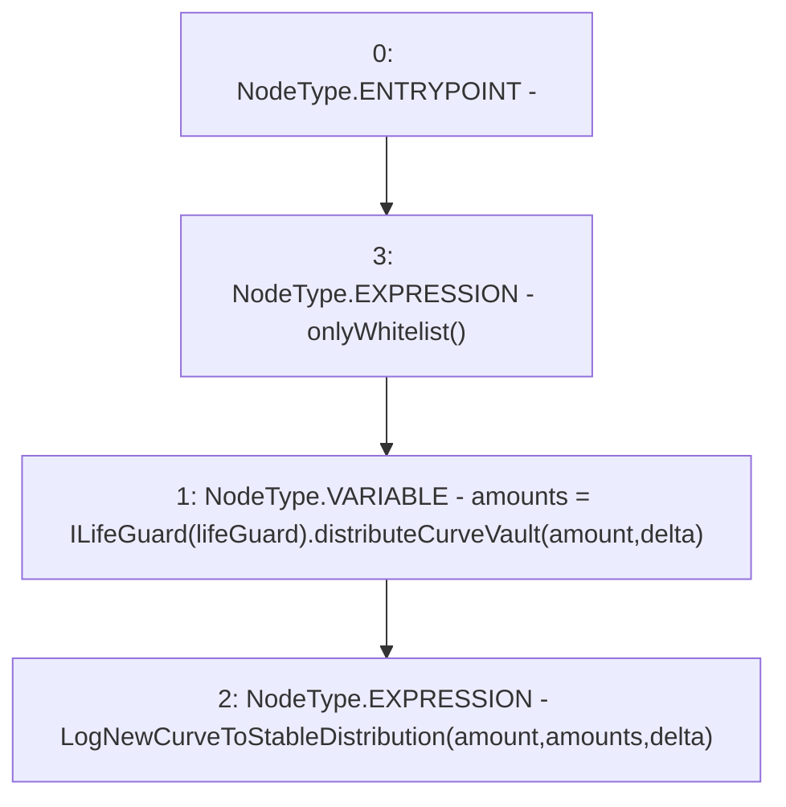

# Context: Controller.distributeCurveAssets

**Contract:** `Controller` (Inherits: IController, FixedGTokens, FixedStablecoins, Constants, Whitelist, Ownable, Pausable, Context)
**Signature:** `distributeCurveAssets(uint256,uint256[3])`
**Method Selector ID:** `0xb4f67ab3`
**Visibility:** `external`
**Environment-Free:** `No (reads EVM state context)`
**Modifiers:**
- `onlyWhitelist`
  ```solidity
  modifier onlyWhitelist() {
          require(whitelist[msg.sender], "only whitelist");
          _;
      }
  ```

### State Variables Interaction
- **Reads:** lifeGuard
- **Writes:** None

### Environment & Verification Flags
- **Uses Foundry Cheatcodes:** No
- **Has Echidna Properties:** No

### Internal Calls Tree
- None

### External Calls / Value Transfers
- `ILifeGuard.TMP_135(uint256[3]) = HIGH_LEVEL_CALL, dest:TMP_134(ILifeGuard), function:distributeCurveVault, arguments:['amount', 'delta']  `

### Control Flow Graph (CFG)


### Source Mapping
Declared in: `certora-ac-datasets/detasets/web3bugs/dataset/web3bugs/17/contracts/Controller.sol` on lines **261** to **264**

```solidity
    function distributeCurveAssets(uint256 amount, uint256[N_COINS] memory delta) external onlyWhitelist {
        uint256[N_COINS] memory amounts = ILifeGuard(lifeGuard).distributeCurveVault(amount, delta);
        emit LogNewCurveToStableDistribution(amount, amounts, delta);
    }

```
