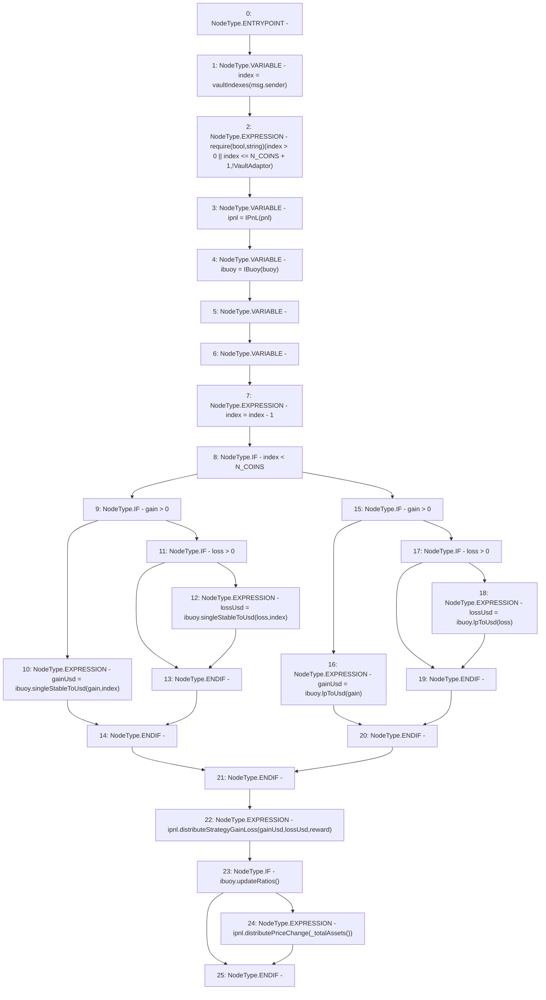

# Context: Controller.distributeStrategyGainLoss

**Contract:** `Controller` (Inherits: IController, FixedGTokens, FixedStablecoins, Constants, Whitelist, Ownable, Pausable, Context)
**Signature:** `distributeStrategyGainLoss(uint256,uint256)`
**Method Selector ID:** `0x93ce07b2`
**Visibility:** `external`
**Environment-Free:** `No (reads EVM state context)`
**Modifiers:** None

### State Variables Interaction
- **Reads:** N_COINS, buoy, pnl, reward, vaultIndexes
- **Writes:** None

### Assertion Checks & Business Requirements
- require/assert: `require(bool,string)(index > 0 || index <= N_COINS + 1,!VaultAdaptor)`

### Environment & Verification Flags
- **Uses Foundry Cheatcodes:** No
- **Has Echidna Properties:** No

### Internal Calls Tree
- None

### External Calls / Value Transfers
- `IBuoy.TMP_216(uint256) = HIGH_LEVEL_CALL, dest:ibuoy(IBuoy), function:lpToUsd, arguments:['loss']  `
- `IPnL.HIGH_LEVEL_CALL, dest:ipnl(IPnL), function:distributePriceChange, arguments:['TMP_219']  `
- `IBuoy.TMP_210(uint256) = HIGH_LEVEL_CALL, dest:ibuoy(IBuoy), function:singleStableToUsd, arguments:['gain', 'index']  `
- `IBuoy.TMP_212(uint256) = HIGH_LEVEL_CALL, dest:ibuoy(IBuoy), function:singleStableToUsd, arguments:['loss', 'index']  `
- `IBuoy.TMP_214(uint256) = HIGH_LEVEL_CALL, dest:ibuoy(IBuoy), function:lpToUsd, arguments:['gain']  `
- `IPnL.HIGH_LEVEL_CALL, dest:ipnl(IPnL), function:distributeStrategyGainLoss, arguments:['gainUsd', 'lossUsd', 'reward']  `
- `IBuoy.TMP_218(bool) = HIGH_LEVEL_CALL, dest:ibuoy(IBuoy), function:updateRatios, arguments:[]  `

### Control Flow Graph (CFG)


### Source Mapping
Declared in: `certora-ac-datasets/detasets/web3bugs/dataset/web3bugs/17/contracts/Controller.sol` on lines **355** to **382**

```solidity
    function distributeStrategyGainLoss(uint256 gain, uint256 loss) external override {
        uint256 index = vaultIndexes[msg.sender];
        require(index > 0 || index <= N_COINS + 1, "!VaultAdaptor");
        IPnL ipnl = IPnL(pnl);
        IBuoy ibuoy = IBuoy(buoy);
        uint256 gainUsd;
        uint256 lossUsd;
        index = index - 1;
        if (index < N_COINS) {
            if (gain > 0) {
                gainUsd = ibuoy.singleStableToUsd(gain, index);
            } else if (loss > 0) {
                lossUsd = ibuoy.singleStableToUsd(loss, index);
            }
        } else {
            if (gain > 0) {
                gainUsd = ibuoy.lpToUsd(gain);
            } else if (loss > 0) {
                lossUsd = ibuoy.lpToUsd(loss);
            }
        }
        ipnl.distributeStrategyGainLoss(gainUsd, lossUsd, reward);
        // Check if curve spot price within tollerance, if so update them
        if (ibuoy.updateRatios()) {
            // If the curve ratios were successfully updated, realize system price changes
            ipnl.distributePriceChange(_totalAssets());
        }
    }

```
