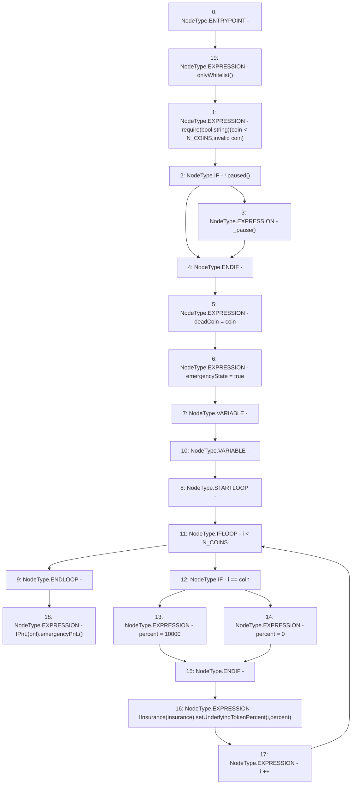

# Context: Controller.emergency

**Contract:** `Controller` (Inherits: IController, FixedGTokens, FixedStablecoins, Constants, Whitelist, Ownable, Pausable, Context)
**Signature:** `emergency(uint256)`
**Method Selector ID:** `0xe5c30120`
**Visibility:** `external`
**Environment-Free:** `No (reads EVM state context)`
**Modifiers:**
- `onlyWhitelist`
  ```solidity
  modifier onlyWhitelist() {
          require(whitelist[msg.sender], "only whitelist");
          _;
      }
  ```

### State Variables Interaction
- **Reads:** N_COINS, insurance, pnl
- **Writes:** deadCoin, emergencyState

### Assertion Checks & Business Requirements
- require/assert: `require(bool,string)(coin < N_COINS,invalid coin)`

### Environment & Verification Flags
- **Uses Foundry Cheatcodes:** No
- **Has Echidna Properties:** No

### Internal Calls Tree
- None

### External Calls / Value Transfers
- `IPnL.HIGH_LEVEL_CALL, dest:TMP_188(IPnL), function:emergencyPnL, arguments:[]  `
- `IInsurance.HIGH_LEVEL_CALL, dest:TMP_185(IInsurance), function:setUnderlyingTokenPercent, arguments:['i', 'percent']  `

### Control Flow Graph (CFG)


### Source Mapping
Declared in: `certora-ac-datasets/detasets/web3bugs/dataset/web3bugs/17/contracts/Controller.sol` on lines **317** to **335**

```solidity
    function emergency(uint256 coin) external onlyWhitelist {
        require(coin < N_COINS, "invalid coin");
        if (!paused()) {
            _pause();
        }
        deadCoin = coin;
        emergencyState = true;

        uint256 percent;
        for (uint256 i; i < N_COINS; i++) {
            if (i == coin) {
                percent = 10000;
            } else {
                percent = 0;
            }
            IInsurance(insurance).setUnderlyingTokenPercent(i, percent);
        }
        IPnL(pnl).emergencyPnL();
    }

```
