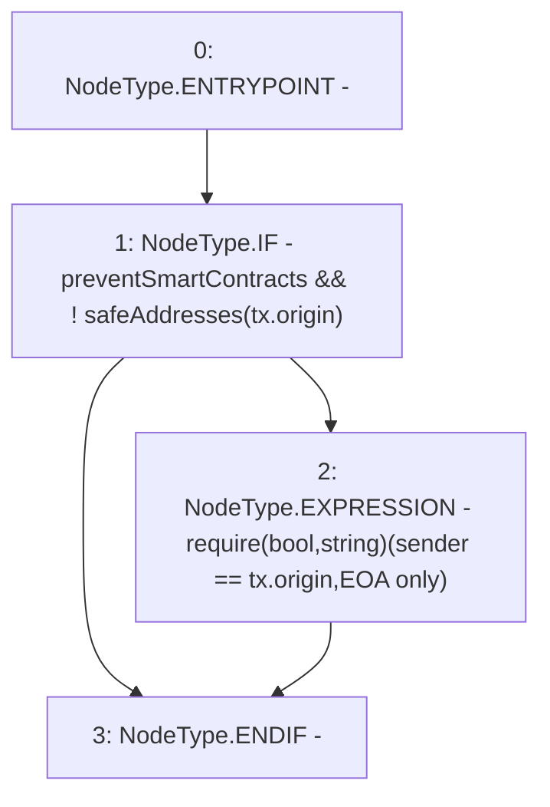

# Context: Controller.eoaOnly

**Contract:** `Controller` (Inherits: IController, FixedGTokens, FixedStablecoins, Constants, Whitelist, Ownable, Pausable, Context)
**Signature:** `eoaOnly(address)`
**Method Selector ID:** `0xa220f60a`
**Visibility:** `public`
**Environment-Free:** `No (reads EVM state context)`
**Modifiers:** None

### State Variables Interaction
- **Reads:** preventSmartContracts, safeAddresses
- **Writes:** None

### Assertion Checks & Business Requirements
- require/assert: `require(bool,string)(sender == tx.origin,EOA only)`

### Environment & Verification Flags
- **Uses Foundry Cheatcodes:** No
- **Has Echidna Properties:** No

### Internal Calls Tree
- None

### External Calls / Value Transfers
- None

### Control Flow Graph (CFG)


### Source Mapping
Declared in: `certora-ac-datasets/detasets/web3bugs/dataset/web3bugs/17/contracts/Controller.sol` on lines **268** to **272**

```solidity
    function eoaOnly(address sender) public override {
        if (preventSmartContracts && !safeAddresses[tx.origin]) {
            require(sender == tx.origin, "EOA only");
        }
    }

```
