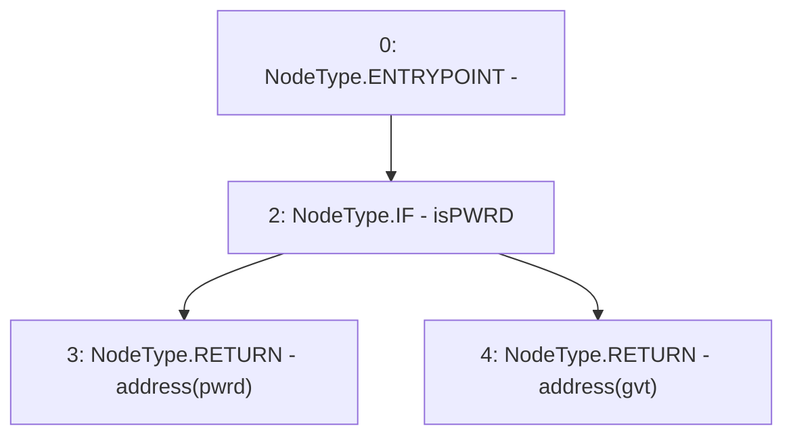

# Context: Controller.gToken

**Contract:** `Controller` (Inherits: IController, FixedGTokens, FixedStablecoins, Constants, Whitelist, Ownable, Pausable, Context)
**Signature:** `gToken(bool) returns (address)`
**Method Selector ID:** `0x21f1b8e9`
**Visibility:** `external`
**Environment-Free:** `Yes`
**Modifiers:** None

### State Variables Interaction
- **Reads:** gvt, pwrd
- **Writes:** None

### Environment & Verification Flags
- **Uses Foundry Cheatcodes:** No
- **Has Echidna Properties:** No

### Internal Calls Tree
- None

### External Calls / Value Transfers
- None

### Control Flow Graph (CFG)


### Source Mapping
Declared in: `certora-ac-datasets/detasets/web3bugs/dataset/web3bugs/17/contracts/Controller.sol` on lines **232** to **234**

```solidity
    function gToken(bool isPWRD) external view override returns (address) {
        return isPWRD ? address(pwrd) : address(gvt);
    }

```
