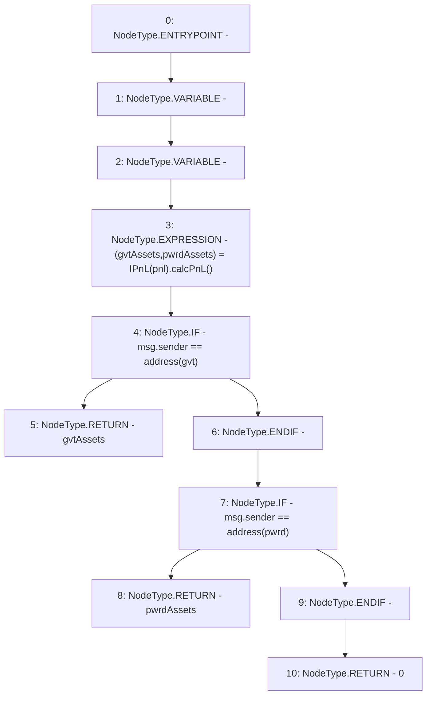

# Context: Controller.gTokenTotalAssets

**Contract:** `Controller` (Inherits: IController, FixedGTokens, FixedStablecoins, Constants, Whitelist, Ownable, Pausable, Context)
**Signature:** `gTokenTotalAssets() returns (uint256)`
**Method Selector ID:** `0x4941995d`
**Visibility:** `public`
**Environment-Free:** `No (reads EVM state context)`
**Modifiers:** None

### State Variables Interaction
- **Reads:** gvt, pnl, pwrd
- **Writes:** None

### Environment & Verification Flags
- **Uses Foundry Cheatcodes:** No
- **Has Echidna Properties:** No

### Internal Calls Tree
- None

### External Calls / Value Transfers
- `IPnL.TUPLE_0(uint256,uint256) = HIGH_LEVEL_CALL, dest:TMP_112(IPnL), function:calcPnL, arguments:[]  `

### Control Flow Graph (CFG)


### Source Mapping
Declared in: `certora-ac-datasets/detasets/web3bugs/dataset/web3bugs/17/contracts/Controller.sol` on lines **221** to **230**

```solidity
    function gTokenTotalAssets() public view override returns (uint256) {
        (uint256 gvtAssets, uint256 pwrdAssets) = IPnL(pnl).calcPnL();
        if (msg.sender == address(gvt)) {
            return gvtAssets;
        }
        if (msg.sender == address(pwrd)) {
            return pwrdAssets;
        }
        return 0;
    }

```
