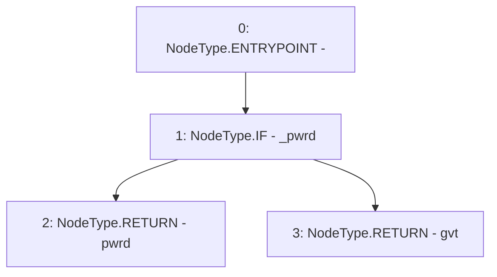

# Context: Controller.gTokens

**Contract:** `Controller` (Inherits: IController, FixedGTokens, FixedStablecoins, Constants, Whitelist, Ownable, Pausable, Context)
**Signature:** `gTokens(bool) returns (IToken)`
**Method Selector ID:** `Internal (No Method ID)`
**Visibility:** `internal`
**Environment-Free:** `Yes`
**Modifiers:** None

### State Variables Interaction
- **Reads:** gvt, pwrd
- **Writes:** None

### Environment & Verification Flags
- **Uses Foundry Cheatcodes:** No
- **Has Echidna Properties:** No

### Internal Calls Tree
- None

### External Calls / Value Transfers
- None

### Control Flow Graph (CFG)


### Source Mapping
Declared in: `certora-ac-datasets/detasets/web3bugs/dataset/web3bugs/17/contracts/common/FixedContracts.sol` on lines **68** to **74**

```solidity
    function gTokens(bool _pwrd) internal view returns (IToken) {
        if (_pwrd) {
            return pwrd;
        } else {
            return gvt;
        }
    }

```
