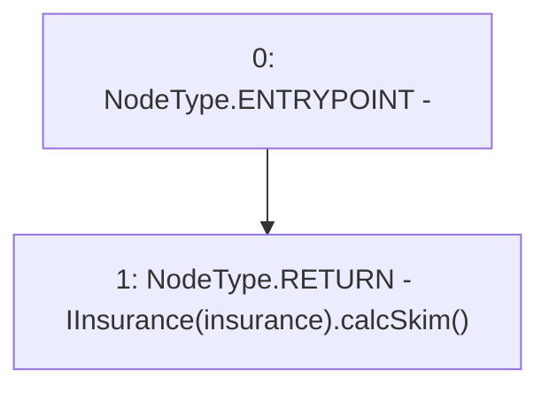

# Context: Controller.getSkimPercent

**Contract:** `Controller` (Inherits: IController, FixedGTokens, FixedStablecoins, Constants, Whitelist, Ownable, Pausable, Context)
**Signature:** `getSkimPercent() returns (uint256)`
**Method Selector ID:** `0x455cb589`
**Visibility:** `external`
**Environment-Free:** `Yes`
**Modifiers:** None

### State Variables Interaction
- **Reads:** insurance
- **Writes:** None

### Environment & Verification Flags
- **Uses Foundry Cheatcodes:** No
- **Has Echidna Properties:** No

### Internal Calls Tree
- None

### External Calls / Value Transfers
- `IInsurance.TMP_52(uint256) = HIGH_LEVEL_CALL, dest:TMP_51(IInsurance), function:calcSkim, arguments:[]  `

### Control Flow Graph (CFG)


### Source Mapping
Declared in: `certora-ac-datasets/detasets/web3bugs/dataset/web3bugs/17/contracts/Controller.sol` on lines **123** to **125**

```solidity
    function getSkimPercent() external view override returns (uint256) {
        return IInsurance(insurance).calcSkim();
    }

```
