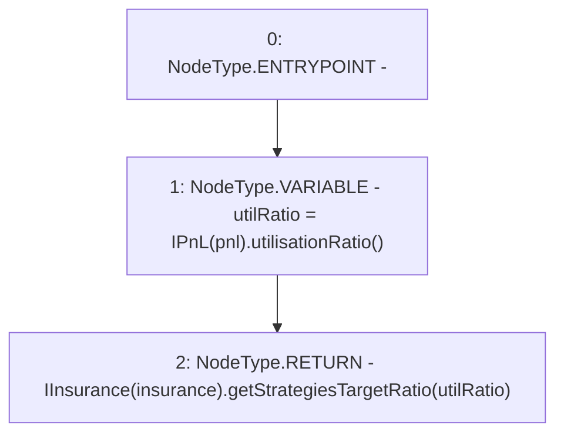

# Context: Controller.getStrategiesTargetRatio

**Contract:** `Controller` (Inherits: IController, FixedGTokens, FixedStablecoins, Constants, Whitelist, Ownable, Pausable, Context)
**Signature:** `getStrategiesTargetRatio() returns (uint256[])`
**Method Selector ID:** `0xdbfdc6e7`
**Visibility:** `external`
**Environment-Free:** `Yes`
**Modifiers:** None

### State Variables Interaction
- **Reads:** insurance, pnl
- **Writes:** None

### Environment & Verification Flags
- **Uses Foundry Cheatcodes:** No
- **Has Echidna Properties:** No

### Internal Calls Tree
- None

### External Calls / Value Transfers
- `IPnL.TMP_272(uint256) = HIGH_LEVEL_CALL, dest:TMP_271(IPnL), function:utilisationRatio, arguments:[]  `
- `IInsurance.TMP_274(uint256[]) = HIGH_LEVEL_CALL, dest:TMP_273(IInsurance), function:getStrategiesTargetRatio, arguments:['utilRatio']  `

### Control Flow Graph (CFG)


### Source Mapping
Declared in: `certora-ac-datasets/detasets/web3bugs/dataset/web3bugs/17/contracts/Controller.sol` on lines **469** to **472**

```solidity
    function getStrategiesTargetRatio() external view override returns (uint256[] memory) {
        uint256 utilRatio = IPnL(pnl).utilisationRatio();
        return IInsurance(insurance).getStrategiesTargetRatio(utilRatio);
    }

```
