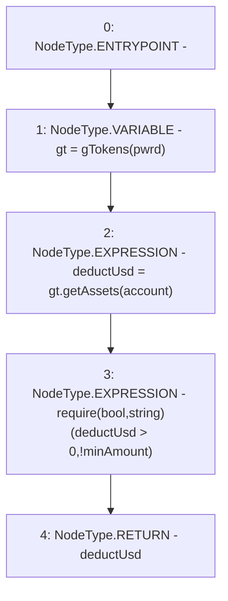

# Context: Controller.getUserAssets

**Contract:** `Controller` (Inherits: IController, FixedGTokens, FixedStablecoins, Constants, Whitelist, Ownable, Pausable, Context)
**Signature:** `getUserAssets(bool,address) returns (uint256)`
**Method Selector ID:** `0xc3709e5b`
**Visibility:** `external`
**Environment-Free:** `Yes`
**Modifiers:** None

### State Variables Interaction
- **Reads:** None
- **Writes:** None

### Assertion Checks & Business Requirements
- require/assert: `require(bool,string)(deductUsd > 0,!minAmount)`

### Environment & Verification Flags
- **Uses Foundry Cheatcodes:** No
- **Has Echidna Properties:** No

### Internal Calls Tree
- None

### External Calls / Value Transfers
- `IToken.TMP_248(uint256) = HIGH_LEVEL_CALL, dest:gt(IToken), function:getAssets, arguments:['account']  `

### Control Flow Graph (CFG)


### Source Mapping
Declared in: `certora-ac-datasets/detasets/web3bugs/dataset/web3bugs/17/contracts/Controller.sol` on lines **430** to **434**

```solidity
    function getUserAssets(bool pwrd, address account) external view override returns (uint256 deductUsd) {
        IToken gt = gTokens(pwrd);
        deductUsd = gt.getAssets(account);
        require(deductUsd > 0, "!minAmount");
    }

```
