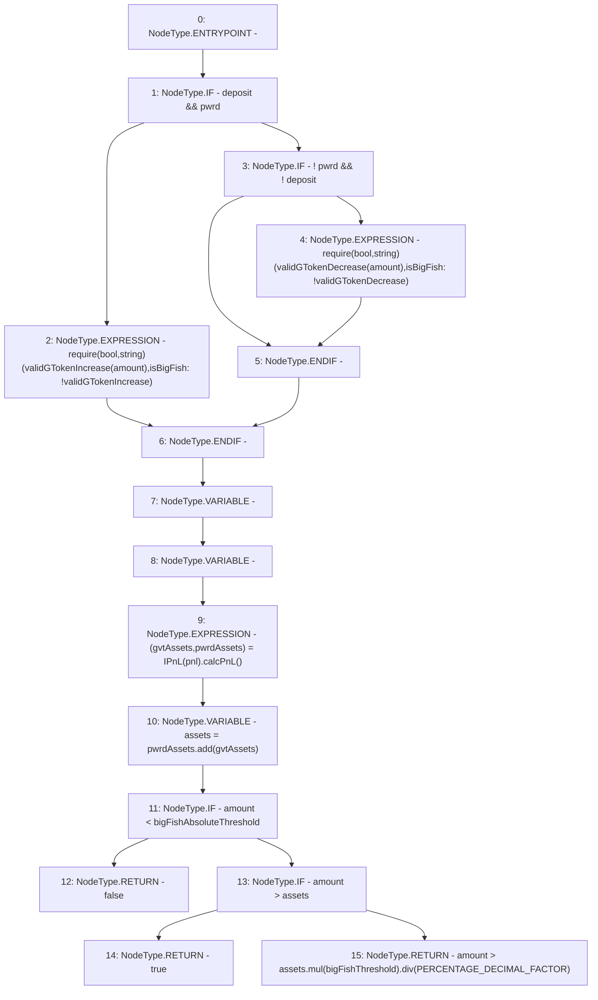

# Context: Controller.isValidBigFish

**Contract:** `Controller` (Inherits: IController, FixedGTokens, FixedStablecoins, Constants, Whitelist, Ownable, Pausable, Context)
**Signature:** `isValidBigFish(bool,bool,uint256) returns (bool)`
**Method Selector ID:** `0x40946859`
**Visibility:** `external`
**Environment-Free:** `Yes`
**Modifiers:** None

### State Variables Interaction
- **Reads:** PERCENTAGE_DECIMAL_FACTOR, bigFishAbsoluteThreshold, bigFishThreshold, pnl
- **Writes:** None

### Assertion Checks & Business Requirements
- require/assert: `require(bool,string)(validGTokenIncrease(amount),isBigFish: !validGTokenIncrease)`
- require/assert: `require(bool,string)(validGTokenDecrease(amount),isBigFish: !validGTokenDecrease)`

### Environment & Verification Flags
- **Uses Foundry Cheatcodes:** No
- **Has Echidna Properties:** No

### Internal Calls Tree
- None

### External Calls / Value Transfers
- `SafeMath.TMP_131(uint256) = LIBRARY_CALL, dest:SafeMath, function:SafeMath.mul(uint256,uint256), arguments:['assets', 'bigFishThreshold'] `
- `SafeMath.TMP_128(uint256) = LIBRARY_CALL, dest:SafeMath, function:SafeMath.add(uint256,uint256), arguments:['pwrdAssets', 'gvtAssets'] `
- `SafeMath.TMP_132(uint256) = LIBRARY_CALL, dest:SafeMath, function:SafeMath.div(uint256,uint256), arguments:['TMP_131', 'PERCENTAGE_DECIMAL_FACTOR'] `
- `IPnL.TUPLE_1(uint256,uint256) = HIGH_LEVEL_CALL, dest:TMP_127(IPnL), function:calcPnL, arguments:[]  `

### Control Flow Graph (CFG)


### Source Mapping
Declared in: `certora-ac-datasets/detasets/web3bugs/dataset/web3bugs/17/contracts/Controller.sol` on lines **240** to **259**

```solidity
    function isValidBigFish(
        bool pwrd,
        bool deposit,
        uint256 amount
    ) external view override returns (bool) {
        if (deposit && pwrd) {
            require(validGTokenIncrease(amount), "isBigFish: !validGTokenIncrease");
        } else if (!pwrd && !deposit) {
            require(validGTokenDecrease(amount), "isBigFish: !validGTokenDecrease");
        }
        (uint256 gvtAssets, uint256 pwrdAssets) = IPnL(pnl).calcPnL();
        uint256 assets = pwrdAssets.add(gvtAssets);
        if (amount < bigFishAbsoluteThreshold) {
            return false;
        } else if (amount > assets) {
            return true;
        } else {
            return amount > assets.mul(bigFishThreshold).div(PERCENTAGE_DECIMAL_FACTOR);
        }
    }

```
