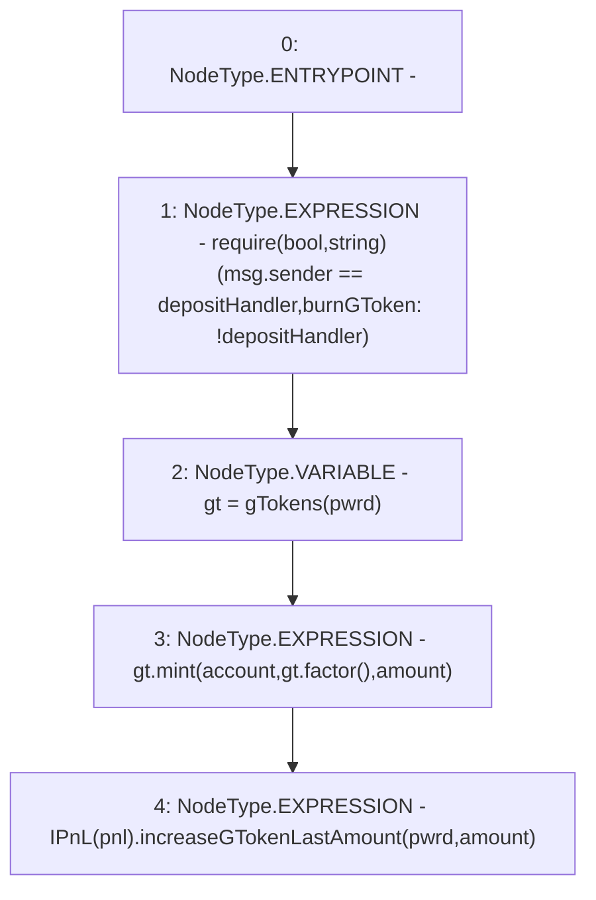

# Context: Controller.mintGToken

**Contract:** `Controller` (Inherits: IController, FixedGTokens, FixedStablecoins, Constants, Whitelist, Ownable, Pausable, Context)
**Signature:** `mintGToken(bool,address,uint256)`
**Method Selector ID:** `0x0251d893`
**Visibility:** `external`
**Environment-Free:** `No (reads EVM state context)`
**Modifiers:** None

### State Variables Interaction
- **Reads:** depositHandler, pnl
- **Writes:** None

### Assertion Checks & Business Requirements
- require/assert: `require(bool,string)(msg.sender == depositHandler,burnGToken: !depositHandler)`

### Environment & Verification Flags
- **Uses Foundry Cheatcodes:** No
- **Has Echidna Properties:** No

### Internal Calls Tree
- None

### External Calls / Value Transfers
- `IPnL.HIGH_LEVEL_CALL, dest:TMP_245(IPnL), function:increaseGTokenLastAmount, arguments:['pwrd', 'amount']  `
- `IToken.HIGH_LEVEL_CALL, dest:gt(IToken), function:mint, arguments:['account', 'TMP_243', 'amount']  `
- `IToken.TMP_243(uint256) = HIGH_LEVEL_CALL, dest:gt(IToken), function:factor, arguments:[]  `

### Control Flow Graph (CFG)


### Source Mapping
Declared in: `certora-ac-datasets/detasets/web3bugs/dataset/web3bugs/17/contracts/Controller.sol` on lines **416** to **425**

```solidity
    function mintGToken(
        bool pwrd,
        address account,
        uint256 amount
    ) external override {
        require(msg.sender == depositHandler, "burnGToken: !depositHandler");
        IToken gt = gTokens(pwrd);
        gt.mint(account, gt.factor(), amount);
        IPnL(pnl).increaseGTokenLastAmount(pwrd, amount);
    }

```
