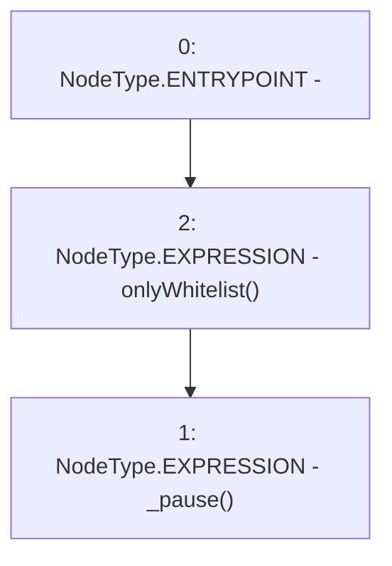

# Context: Controller.pause

**Contract:** `Controller` (Inherits: IController, FixedGTokens, FixedStablecoins, Constants, Whitelist, Ownable, Pausable, Context)
**Signature:** `pause()`
**Method Selector ID:** `0x8456cb59`
**Visibility:** `external`
**Environment-Free:** `No (reads EVM state context)`
**Modifiers:**
- `onlyWhitelist`
  ```solidity
  modifier onlyWhitelist() {
          require(whitelist[msg.sender], "only whitelist");
          _;
      }
  ```

### State Variables Interaction
- **Reads:** None
- **Writes:** None

### Environment & Verification Flags
- **Uses Foundry Cheatcodes:** No
- **Has Echidna Properties:** No

### Internal Calls Tree
- None

### External Calls / Value Transfers
- None

### Control Flow Graph (CFG)


### Source Mapping
Declared in: `certora-ac-datasets/detasets/web3bugs/dataset/web3bugs/17/contracts/Controller.sol` on lines **97** to **99**

```solidity
    function pause() external onlyWhitelist {
        _pause();
    }

```
