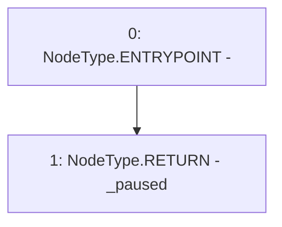

# Context: Controller.paused

**Contract:** `Controller` (Inherits: IController, FixedGTokens, FixedStablecoins, Constants, Whitelist, Ownable, Pausable, Context)
**Signature:** `paused() returns (bool)`
**Method Selector ID:** `0x5c975abb`
**Visibility:** `public`
**Environment-Free:** `Yes`
**Modifiers:** None

### State Variables Interaction
- **Reads:** _paused
- **Writes:** None

### Environment & Verification Flags
- **Uses Foundry Cheatcodes:** No
- **Has Echidna Properties:** No

### Internal Calls Tree
- None

### External Calls / Value Transfers
- None

### Control Flow Graph (CFG)


### Source Mapping
Declared in: `certora-ac-datasets/detasets/web3bugs/dataset/web3bugs/17/node_modules/@openzeppelin/contracts/utils/Pausable.sol` on lines **39** to **41**

```solidity
    function paused() public view virtual returns (bool) {
        return _paused;
    }

```
