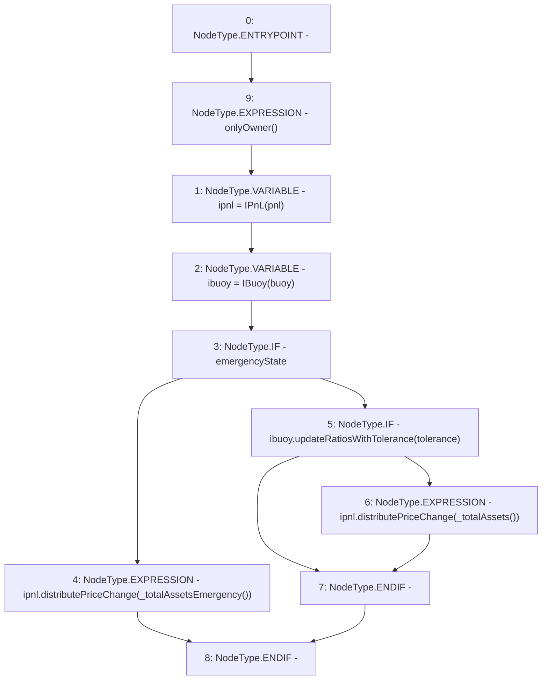

# Context: Controller.realizePriceChange

**Contract:** `Controller` (Inherits: IController, FixedGTokens, FixedStablecoins, Constants, Whitelist, Ownable, Pausable, Context)
**Signature:** `realizePriceChange(uint256)`
**Method Selector ID:** `0x5ba6aa2f`
**Visibility:** `external`
**Environment-Free:** `No (reads EVM state context)`
**Modifiers:**
- `onlyOwner`
  ```solidity
  modifier onlyOwner() {
          require(owner() == _msgSender(), "Ownable: caller is not the owner");
          _;
      }
  ```

### State Variables Interaction
- **Reads:** buoy, emergencyState, pnl
- **Writes:** None

### Environment & Verification Flags
- **Uses Foundry Cheatcodes:** No
- **Has Echidna Properties:** No

### Internal Calls Tree
- None

### External Calls / Value Transfers
- `IBuoy.TMP_225(bool) = HIGH_LEVEL_CALL, dest:ibuoy(IBuoy), function:updateRatiosWithTolerance, arguments:['tolerance']  `
- `IPnL.HIGH_LEVEL_CALL, dest:ipnl(IPnL), function:distributePriceChange, arguments:['TMP_226']  `
- `IPnL.HIGH_LEVEL_CALL, dest:ipnl(IPnL), function:distributePriceChange, arguments:['TMP_223']  `

### Control Flow Graph (CFG)


### Source Mapping
Declared in: `certora-ac-datasets/detasets/web3bugs/dataset/web3bugs/17/contracts/Controller.sol` on lines **384** to **396**

```solidity
    function realizePriceChange(uint256 tolerance) external onlyOwner {
        IPnL ipnl = IPnL(pnl);
        IBuoy ibuoy = IBuoy(buoy);
        if (emergencyState) {
            ipnl.distributePriceChange(_totalAssetsEmergency());
        } else {
            // Check if curve spot price within tollerance, if so update them
            if (ibuoy.updateRatiosWithTolerance(tolerance)) {
                // If the curve ratios were successfully updated, realize system price changes
                ipnl.distributePriceChange(_totalAssets());
            }
        }
    }

```
