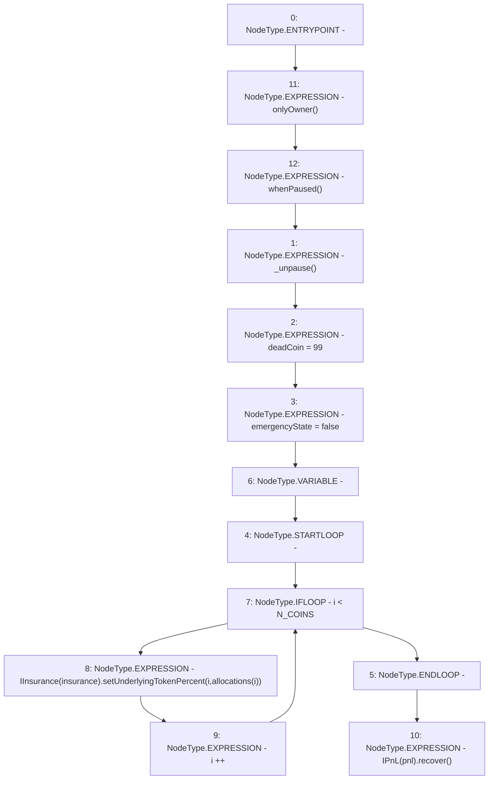

# Context: Controller.restart

**Contract:** `Controller` (Inherits: IController, FixedGTokens, FixedStablecoins, Constants, Whitelist, Ownable, Pausable, Context)
**Signature:** `restart(uint256[])`
**Method Selector ID:** `0xbec3dd91`
**Visibility:** `external`
**Environment-Free:** `No (reads EVM state context)`
**Modifiers:**
- `onlyOwner`
  ```solidity
  modifier onlyOwner() {
          require(owner() == _msgSender(), "Ownable: caller is not the owner");
          _;
      }
  ```
- `whenPaused`
  ```solidity
  modifier whenPaused() {
          require(paused(), "Pausable: not paused");
          _;
      }
  ```

### State Variables Interaction
- **Reads:** N_COINS, insurance, pnl
- **Writes:** deadCoin, emergencyState

### Environment & Verification Flags
- **Uses Foundry Cheatcodes:** No
- **Has Echidna Properties:** No

### Internal Calls Tree
- None

### External Calls / Value Transfers
- `IInsurance.HIGH_LEVEL_CALL, dest:TMP_193(IInsurance), function:setUnderlyingTokenPercent, arguments:['i', 'REF_58']  `
- `IPnL.HIGH_LEVEL_CALL, dest:TMP_196(IPnL), function:recover, arguments:[]  `

### Control Flow Graph (CFG)


### Source Mapping
Declared in: `certora-ac-datasets/detasets/web3bugs/dataset/web3bugs/17/contracts/Controller.sol` on lines **341** to **350**

```solidity
    function restart(uint256[] calldata allocations) external onlyOwner whenPaused {
        _unpause();
        deadCoin = 99;
        emergencyState = false;

        for (uint256 i; i < N_COINS; i++) {
            IInsurance(insurance).setUnderlyingTokenPercent(i, allocations[i]);
        }
        IPnL(pnl).recover();
    }

```
