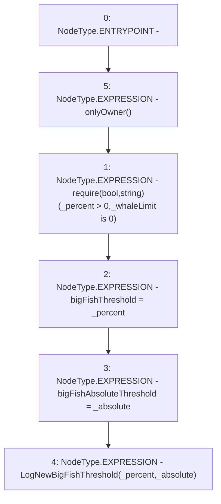

# Context: Controller.setBigFishThreshold

**Contract:** `Controller` (Inherits: IController, FixedGTokens, FixedStablecoins, Constants, Whitelist, Ownable, Pausable, Context)
**Signature:** `setBigFishThreshold(uint256,uint256)`
**Method Selector ID:** `0x283c5bbe`
**Visibility:** `external`
**Environment-Free:** `No (reads EVM state context)`
**Modifiers:**
- `onlyOwner`
  ```solidity
  modifier onlyOwner() {
          require(owner() == _msgSender(), "Ownable: caller is not the owner");
          _;
      }
  ```

### State Variables Interaction
- **Reads:** None
- **Writes:** bigFishAbsoluteThreshold, bigFishThreshold

### Assertion Checks & Business Requirements
- require/assert: `require(bool,string)(_percent > 0,_whaleLimit is 0)`

### Environment & Verification Flags
- **Uses Foundry Cheatcodes:** No
- **Has Echidna Properties:** No

### Internal Calls Tree
- None

### External Calls / Value Transfers
- None

### Control Flow Graph (CFG)


### Source Mapping
Declared in: `certora-ac-datasets/detasets/web3bugs/dataset/web3bugs/17/contracts/Controller.sol` on lines **187** to **192**

```solidity
    function setBigFishThreshold(uint256 _percent, uint256 _absolute) external onlyOwner {
        require(_percent > 0, "_whaleLimit is 0");
        bigFishThreshold = _percent;
        bigFishAbsoluteThreshold = _absolute;
        emit LogNewBigFishThreshold(_percent, _absolute);
    }

```
