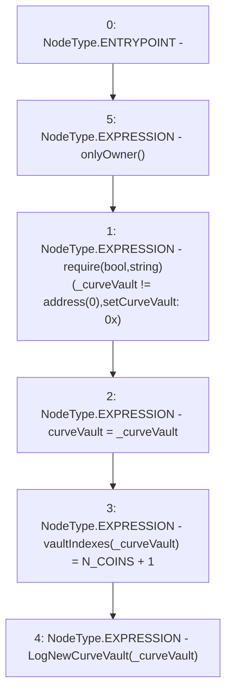

# Context: Controller.setCurveVault

**Contract:** `Controller` (Inherits: IController, FixedGTokens, FixedStablecoins, Constants, Whitelist, Ownable, Pausable, Context)
**Signature:** `setCurveVault(address)`
**Method Selector ID:** `0xa1c317fd`
**Visibility:** `external`
**Environment-Free:** `No (reads EVM state context)`
**Modifiers:**
- `onlyOwner`
  ```solidity
  modifier onlyOwner() {
          require(owner() == _msgSender(), "Ownable: caller is not the owner");
          _;
      }
  ```

### State Variables Interaction
- **Reads:** N_COINS
- **Writes:** curveVault, vaultIndexes

### Assertion Checks & Business Requirements
- require/assert: `require(bool,string)(_curveVault != address(0),setCurveVault: 0x)`

### Environment & Verification Flags
- **Uses Foundry Cheatcodes:** No
- **Has Echidna Properties:** No

### Internal Calls Tree
- None

### External Calls / Value Transfers
- None

### Control Flow Graph (CFG)


### Source Mapping
Declared in: `certora-ac-datasets/detasets/web3bugs/dataset/web3bugs/17/contracts/Controller.sol` on lines **145** to **150**

```solidity
    function setCurveVault(address _curveVault) external onlyOwner {
        require(_curveVault != address(0), "setCurveVault: 0x");
        curveVault = _curveVault;
        vaultIndexes[_curveVault] = N_COINS + 1;
        emit LogNewCurveVault(_curveVault);
    }

```
