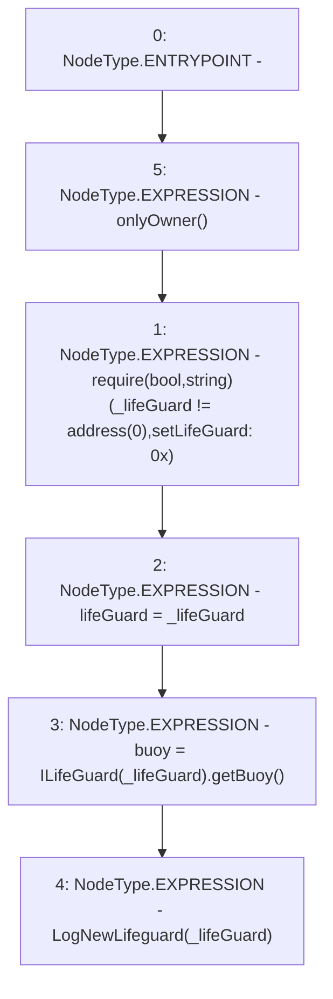

# Context: Controller.setLifeGuard

**Contract:** `Controller` (Inherits: IController, FixedGTokens, FixedStablecoins, Constants, Whitelist, Ownable, Pausable, Context)
**Signature:** `setLifeGuard(address)`
**Method Selector ID:** `0x01c71360`
**Visibility:** `external`
**Environment-Free:** `No (reads EVM state context)`
**Modifiers:**
- `onlyOwner`
  ```solidity
  modifier onlyOwner() {
          require(owner() == _msgSender(), "Ownable: caller is not the owner");
          _;
      }
  ```

### State Variables Interaction
- **Reads:** None
- **Writes:** buoy, lifeGuard

### Assertion Checks & Business Requirements
- require/assert: `require(bool,string)(_lifeGuard != address(0),setLifeGuard: 0x)`

### Environment & Verification Flags
- **Uses Foundry Cheatcodes:** No
- **Has Echidna Properties:** No

### Internal Calls Tree
- None

### External Calls / Value Transfers
- `ILifeGuard.TMP_73(address) = HIGH_LEVEL_CALL, dest:TMP_72(ILifeGuard), function:getBuoy, arguments:[]  `

### Control Flow Graph (CFG)


### Source Mapping
Declared in: `certora-ac-datasets/detasets/web3bugs/dataset/web3bugs/17/contracts/Controller.sol` on lines **152** to **157**

```solidity
    function setLifeGuard(address _lifeGuard) external onlyOwner {
        require(_lifeGuard != address(0), "setLifeGuard: 0x");
        lifeGuard = _lifeGuard;
        buoy = ILifeGuard(_lifeGuard).getBuoy();
        emit LogNewLifeguard(_lifeGuard);
    }

```
