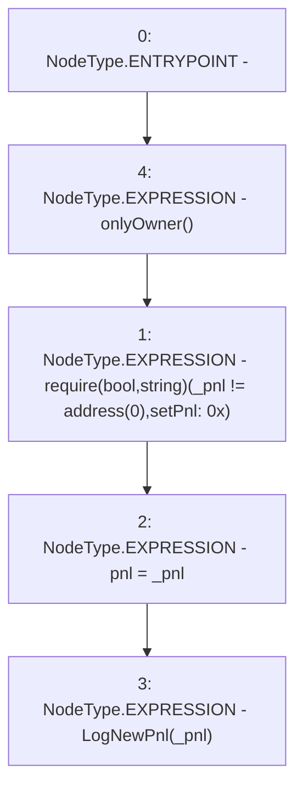

# Context: Controller.setPnL

**Contract:** `Controller` (Inherits: IController, FixedGTokens, FixedStablecoins, Constants, Whitelist, Ownable, Pausable, Context)
**Signature:** `setPnL(address)`
**Method Selector ID:** `0x8dc83df8`
**Visibility:** `external`
**Environment-Free:** `No (reads EVM state context)`
**Modifiers:**
- `onlyOwner`
  ```solidity
  modifier onlyOwner() {
          require(owner() == _msgSender(), "Ownable: caller is not the owner");
          _;
      }
  ```

### State Variables Interaction
- **Reads:** None
- **Writes:** pnl

### Assertion Checks & Business Requirements
- require/assert: `require(bool,string)(_pnl != address(0),setPnl: 0x)`

### Environment & Verification Flags
- **Uses Foundry Cheatcodes:** No
- **Has Echidna Properties:** No

### Internal Calls Tree
- None

### External Calls / Value Transfers
- None

### Control Flow Graph (CFG)


### Source Mapping
Declared in: `certora-ac-datasets/detasets/web3bugs/dataset/web3bugs/17/contracts/Controller.sol` on lines **165** to **169**

```solidity
    function setPnL(address _pnl) external onlyOwner {
        require(_pnl != address(0), "setPnl: 0x");
        pnl = _pnl;
        emit LogNewPnl(_pnl);
    }

```
