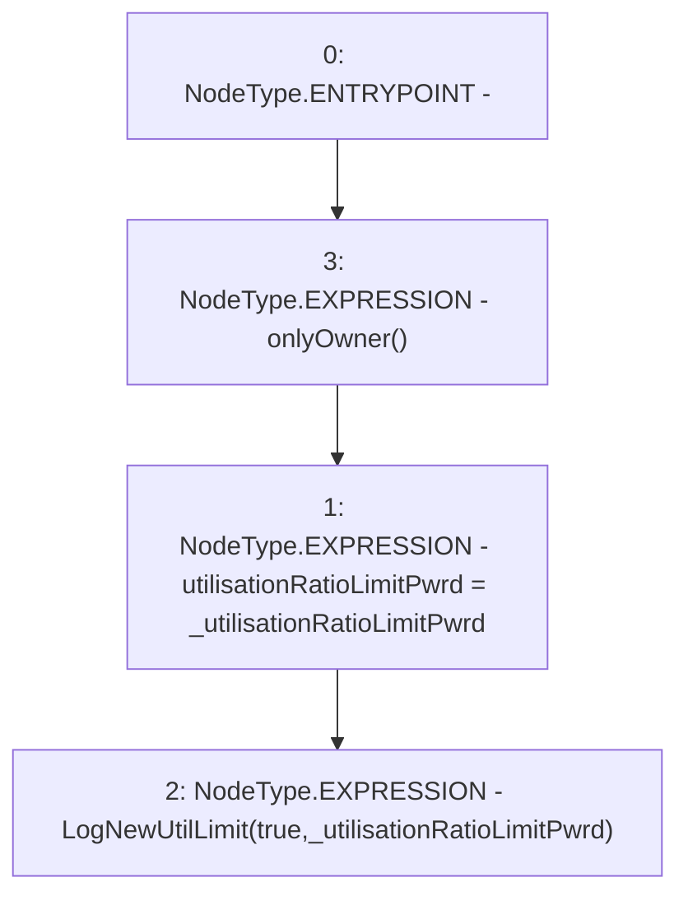

# Context: Controller.setUtilisationRatioLimitPwrd

**Contract:** `Controller` (Inherits: IController, FixedGTokens, FixedStablecoins, Constants, Whitelist, Ownable, Pausable, Context)
**Signature:** `setUtilisationRatioLimitPwrd(uint256)`
**Method Selector ID:** `0x4ea8e2a9`
**Visibility:** `external`
**Environment-Free:** `No (reads EVM state context)`
**Modifiers:**
- `onlyOwner`
  ```solidity
  modifier onlyOwner() {
          require(owner() == _msgSender(), "Ownable: caller is not the owner");
          _;
      }
  ```

### State Variables Interaction
- **Reads:** None
- **Writes:** utilisationRatioLimitPwrd

### Environment & Verification Flags
- **Uses Foundry Cheatcodes:** No
- **Has Echidna Properties:** No

### Internal Calls Tree
- None

### External Calls / Value Transfers
- None

### Control Flow Graph (CFG)


### Source Mapping
Declared in: `certora-ac-datasets/detasets/web3bugs/dataset/web3bugs/17/contracts/Controller.sol` on lines **457** to **460**

```solidity
    function setUtilisationRatioLimitPwrd(uint256 _utilisationRatioLimitPwrd) external onlyOwner {
        utilisationRatioLimitPwrd = _utilisationRatioLimitPwrd;
        emit LogNewUtilLimit(true, _utilisationRatioLimitPwrd);
    }

```
