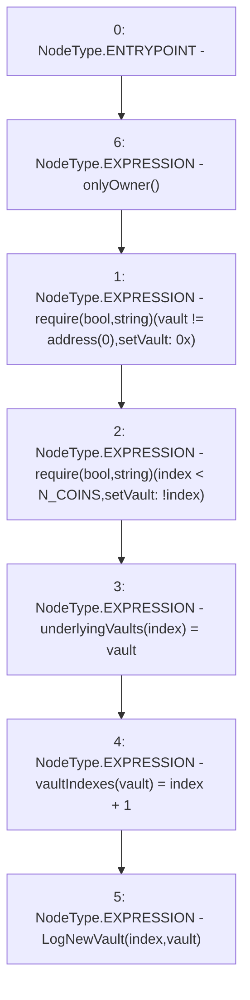

# Context: Controller.setVault

**Contract:** `Controller` (Inherits: IController, FixedGTokens, FixedStablecoins, Constants, Whitelist, Ownable, Pausable, Context)
**Signature:** `setVault(uint256,address)`
**Method Selector ID:** `0x8c16d1da`
**Visibility:** `external`
**Environment-Free:** `No (reads EVM state context)`
**Modifiers:**
- `onlyOwner`
  ```solidity
  modifier onlyOwner() {
          require(owner() == _msgSender(), "Ownable: caller is not the owner");
          _;
      }
  ```

### State Variables Interaction
- **Reads:** N_COINS
- **Writes:** underlyingVaults, vaultIndexes

### Assertion Checks & Business Requirements
- require/assert: `require(bool,string)(vault != address(0),setVault: 0x)`
- require/assert: `require(bool,string)(index < N_COINS,setVault: !index)`

### Environment & Verification Flags
- **Uses Foundry Cheatcodes:** No
- **Has Echidna Properties:** No

### Internal Calls Tree
- None

### External Calls / Value Transfers
- None

### Control Flow Graph (CFG)


### Source Mapping
Declared in: `certora-ac-datasets/detasets/web3bugs/dataset/web3bugs/17/contracts/Controller.sol` on lines **137** to **143**

```solidity
    function setVault(uint256 index, address vault) external onlyOwner {
        require(vault != address(0), "setVault: 0x");
        require(index < N_COINS, "setVault: !index");
        underlyingVaults[index] = vault;
        vaultIndexes[vault] = index + 1;
        emit LogNewVault(index, vault);
    }

```
