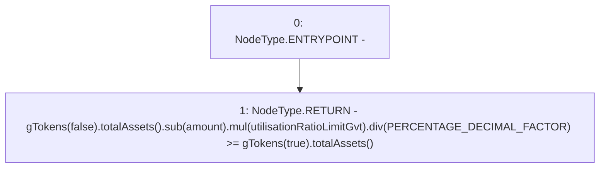

# Context: Controller.validGTokenDecrease

**Contract:** `Controller` (Inherits: IController, FixedGTokens, FixedStablecoins, Constants, Whitelist, Ownable, Pausable, Context)
**Signature:** `validGTokenDecrease(uint256) returns (bool)`
**Method Selector ID:** `0x7a116d7c`
**Visibility:** `public`
**Environment-Free:** `Yes`
**Modifiers:** None

### State Variables Interaction
- **Reads:** PERCENTAGE_DECIMAL_FACTOR, utilisationRatioLimitGvt
- **Writes:** None

### Environment & Verification Flags
- **Uses Foundry Cheatcodes:** No
- **Has Echidna Properties:** No

### Internal Calls Tree
- None

### External Calls / Value Transfers
- `SafeMath.TMP_261(uint256) = LIBRARY_CALL, dest:SafeMath, function:SafeMath.sub(uint256,uint256), arguments:['TMP_260', 'amount'] `
- `IToken.TMP_260(uint256) = HIGH_LEVEL_CALL, dest:TMP_259(IToken), function:totalAssets, arguments:[]  `
- `SafeMath.TMP_262(uint256) = LIBRARY_CALL, dest:SafeMath, function:SafeMath.mul(uint256,uint256), arguments:['TMP_261', 'utilisationRatioLimitGvt'] `
- `SafeMath.TMP_263(uint256) = LIBRARY_CALL, dest:SafeMath, function:SafeMath.div(uint256,uint256), arguments:['TMP_262', 'PERCENTAGE_DECIMAL_FACTOR'] `
- `IToken.TMP_265(uint256) = HIGH_LEVEL_CALL, dest:TMP_264(IToken), function:totalAssets, arguments:[]  `

### Control Flow Graph (CFG)


### Source Mapping
Declared in: `certora-ac-datasets/detasets/web3bugs/dataset/web3bugs/17/contracts/Controller.sol` on lines **448** to **452**

```solidity
    function validGTokenDecrease(uint256 amount) public view override returns (bool) {
        return
            gTokens(false).totalAssets().sub(amount).mul(utilisationRatioLimitGvt).div(PERCENTAGE_DECIMAL_FACTOR) >=
            gTokens(true).totalAssets();
    }

```
