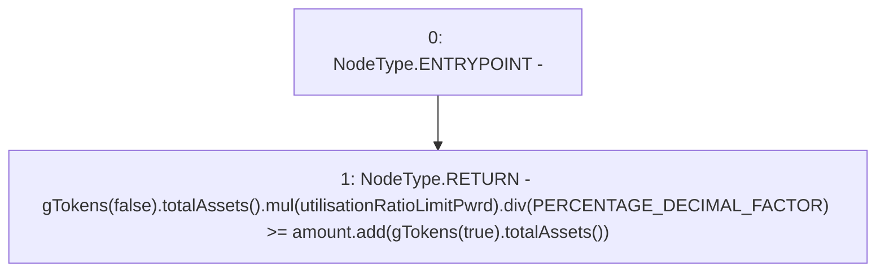

# Context: Controller.validGTokenIncrease

**Contract:** `Controller` (Inherits: IController, FixedGTokens, FixedStablecoins, Constants, Whitelist, Ownable, Pausable, Context)
**Signature:** `validGTokenIncrease(uint256) returns (bool)`
**Method Selector ID:** `Internal (No Method ID)`
**Visibility:** `private`
**Environment-Free:** `Yes`
**Modifiers:** None

### State Variables Interaction
- **Reads:** PERCENTAGE_DECIMAL_FACTOR, utilisationRatioLimitPwrd
- **Writes:** None

### Environment & Verification Flags
- **Uses Foundry Cheatcodes:** No
- **Has Echidna Properties:** No

### Internal Calls Tree
- None

### External Calls / Value Transfers
- `IToken.TMP_252(uint256) = HIGH_LEVEL_CALL, dest:TMP_251(IToken), function:totalAssets, arguments:[]  `
- `SafeMath.TMP_254(uint256) = LIBRARY_CALL, dest:SafeMath, function:SafeMath.div(uint256,uint256), arguments:['TMP_253', 'PERCENTAGE_DECIMAL_FACTOR'] `
- `IToken.TMP_256(uint256) = HIGH_LEVEL_CALL, dest:TMP_255(IToken), function:totalAssets, arguments:[]  `
- `SafeMath.TMP_257(uint256) = LIBRARY_CALL, dest:SafeMath, function:SafeMath.add(uint256,uint256), arguments:['amount', 'TMP_256'] `
- `SafeMath.TMP_253(uint256) = LIBRARY_CALL, dest:SafeMath, function:SafeMath.mul(uint256,uint256), arguments:['TMP_252', 'utilisationRatioLimitPwrd'] `

### Control Flow Graph (CFG)


### Source Mapping
Declared in: `certora-ac-datasets/detasets/web3bugs/dataset/web3bugs/17/contracts/Controller.sol` on lines **439** to **443**

```solidity
    function validGTokenIncrease(uint256 amount) private view returns (bool) {
        return
            gTokens(false).totalAssets().mul(utilisationRatioLimitPwrd).div(PERCENTAGE_DECIMAL_FACTOR) >=
            amount.add(gTokens(true).totalAssets());
    }

```
