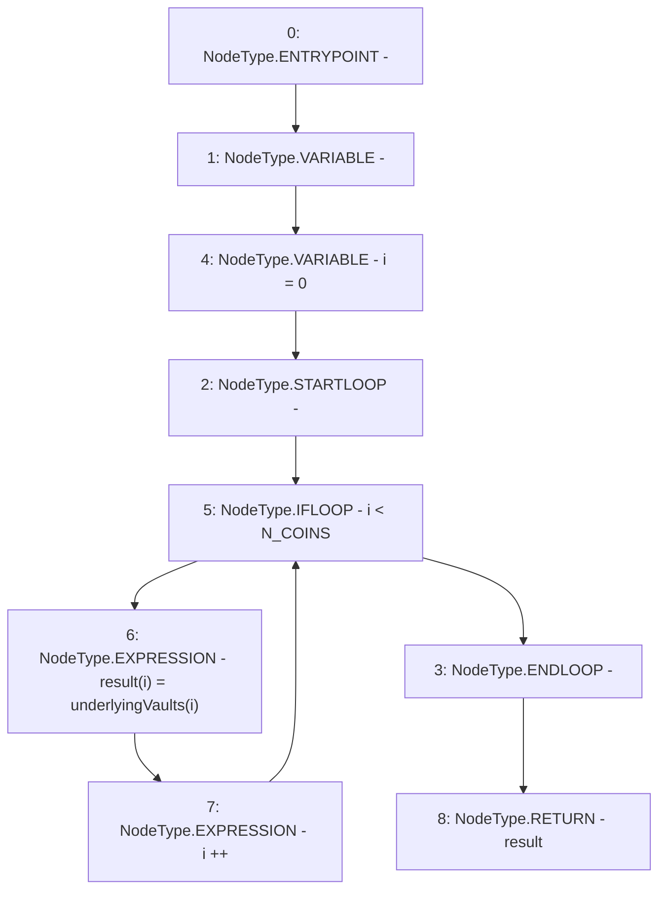

# Context: Controller.vaults

**Contract:** `Controller` (Inherits: IController, FixedGTokens, FixedStablecoins, Constants, Whitelist, Ownable, Pausable, Context)
**Signature:** `vaults() returns (address[3])`
**Method Selector ID:** `0x8220ef5b`
**Visibility:** `external`
**Environment-Free:** `Yes`
**Modifiers:** None

### State Variables Interaction
- **Reads:** N_COINS, underlyingVaults
- **Writes:** None

### Environment & Verification Flags
- **Uses Foundry Cheatcodes:** No
- **Has Echidna Properties:** No

### Internal Calls Tree
- None

### External Calls / Value Transfers
- None

### Control Flow Graph (CFG)


### Source Mapping
Declared in: `certora-ac-datasets/detasets/web3bugs/dataset/web3bugs/17/contracts/Controller.sol` on lines **128** to **134**

```solidity
    function vaults() external view override returns (address[N_COINS] memory) {
        address[N_COINS] memory result;
        for (uint256 i = 0; i < N_COINS; i++) {
            result[i] = underlyingVaults[i];
        }
        return result;
    }

```
