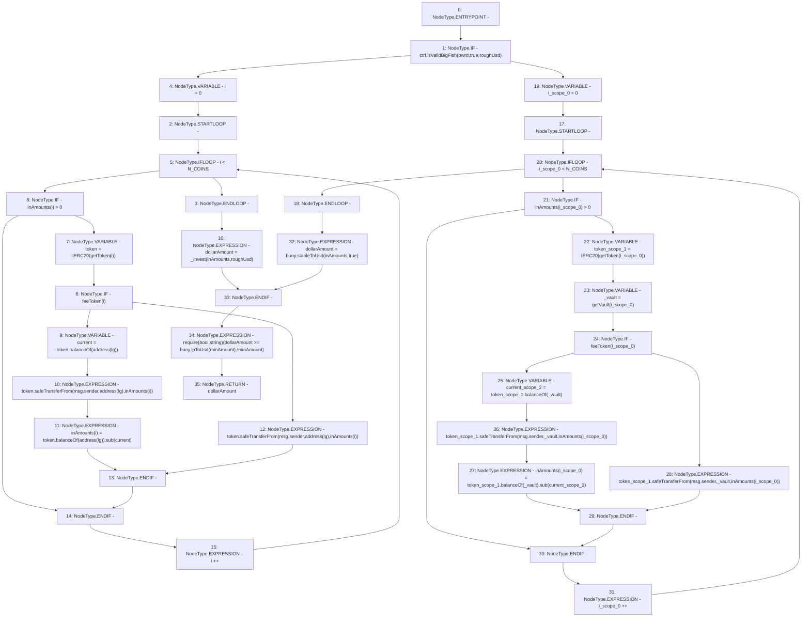

# Context: DepositHandler._deposit

**Contract:** `DepositHandler` (Inherits: IDepositHandler, FixedVaults, FixedStablecoins, Constants, Controllable, Ownable, Context)
**Signature:** `_deposit(bool,uint256,uint256,uint256[3]) returns (uint256)`
**Method Selector ID:** `Internal (No Method ID)`
**Visibility:** `private`
**Environment-Free:** `No (reads EVM state context)`
**Modifiers:** None

### State Variables Interaction
- **Reads:** N_COINS, buoy, ctrl, feeToken, lg
- **Writes:** None

### Assertion Checks & Business Requirements
- require/assert: `require(bool,string)(dollarAmount >= buoy.lpToUsd(minAmount),!minAmount)`

### Environment & Verification Flags
- **Uses Foundry Cheatcodes:** No
- **Has Echidna Properties:** No

### Internal Calls Tree
- None

### External Calls / Value Transfers
- `SafeERC20.LIBRARY_CALL, dest:SafeERC20, function:SafeERC20.safeTransferFrom(IERC20,address,address,uint256), arguments:['token', 'msg.sender', 'TMP_76', 'REF_36'] `
- `IBuoy.TMP_97(uint256) = HIGH_LEVEL_CALL, dest:buoy(IBuoy), function:lpToUsd, arguments:['minAmount']  `
- `SafeERC20.LIBRARY_CALL, dest:SafeERC20, function:SafeERC20.safeTransferFrom(IERC20,address,address,uint256), arguments:['token', 'msg.sender', 'TMP_81', 'REF_41'] `
- `IERC20.TMP_90(uint256) = HIGH_LEVEL_CALL, dest:token_scope_1(IERC20), function:balanceOf, arguments:['_vault']  `
- `IERC20.TMP_79(uint256) = HIGH_LEVEL_CALL, dest:token(IERC20), function:balanceOf, arguments:['TMP_78']  `
- `SafeERC20.LIBRARY_CALL, dest:SafeERC20, function:SafeERC20.safeTransferFrom(IERC20,address,address,uint256), arguments:['token_scope_1', 'msg.sender', '_vault', 'REF_51'] `
- `SafeERC20.LIBRARY_CALL, dest:SafeERC20, function:SafeERC20.safeTransferFrom(IERC20,address,address,uint256), arguments:['token_scope_1', 'msg.sender', '_vault', 'REF_46'] `
- `IBuoy.TMP_96(uint256) = HIGH_LEVEL_CALL, dest:buoy(IBuoy), function:stableToUsd, arguments:['inAmounts', 'True']  `
- `IERC20.TMP_92(uint256) = HIGH_LEVEL_CALL, dest:token_scope_1(IERC20), function:balanceOf, arguments:['_vault']  `
- `SafeMath.TMP_93(uint256) = LIBRARY_CALL, dest:SafeMath, function:SafeMath.sub(uint256,uint256), arguments:['TMP_92', 'current_scope_2'] `
- `IERC20.TMP_75(uint256) = HIGH_LEVEL_CALL, dest:token(IERC20), function:balanceOf, arguments:['TMP_74']  `
- `SafeMath.TMP_80(uint256) = LIBRARY_CALL, dest:SafeMath, function:SafeMath.sub(uint256,uint256), arguments:['TMP_79', 'current'] `
- `IController.TMP_69(bool) = HIGH_LEVEL_CALL, dest:ctrl(IController), function:isValidBigFish, arguments:['pwrd', 'True', 'roughUsd']  `

### Control Flow Graph (CFG)


### Source Mapping
Declared in: `certora-ac-datasets/detasets/web3bugs/dataset/web3bugs/17/contracts/DepositHandler.sol` on lines **133** to **177**

```solidity
    function _deposit(
        bool pwrd,
        uint256 roughUsd,
        uint256 minAmount,
        uint256[N_COINS] memory inAmounts
    ) private returns (uint256 dollarAmount) {
        // If a large fish, transfer assets to lifeguard before determening what to do with them
        if (ctrl.isValidBigFish(pwrd, true, roughUsd)) {
            for (uint256 i = 0; i < N_COINS; i++) {
                // Transfer token to target (lifeguard)
                if (inAmounts[i] > 0) {
                    IERC20 token = IERC20(getToken(i));
                    if (feeToken[i]) {
                        // Separate logic for USDT
                        uint256 current = token.balanceOf(address(lg));
                        token.safeTransferFrom(msg.sender, address(lg), inAmounts[i]);
                        inAmounts[i] = token.balanceOf(address(lg)).sub(current);
                    } else {
                        token.safeTransferFrom(msg.sender, address(lg), inAmounts[i]);
                    }
                }
            }
            dollarAmount = _invest(inAmounts, roughUsd);
        } else {
            // If sardine, send the assets directly to the vault adapter
            for (uint256 i = 0; i < N_COINS; i++) {
                if (inAmounts[i] > 0) {
                    // Transfer token to vaultadaptor
                    IERC20 token = IERC20(getToken(i));
                    address _vault = getVault(i);
                    if (feeToken[i]) {
                        // Seperate logic for USDT
                        uint256 current = token.balanceOf(_vault);
                        token.safeTransferFrom(msg.sender, _vault, inAmounts[i]);
                        inAmounts[i] = token.balanceOf(_vault).sub(current);
                    } else {
                        token.safeTransferFrom(msg.sender, _vault, inAmounts[i]);
                    }
                }
            }
            // Establish USD vault of deposit
            dollarAmount = buoy.stableToUsd(inAmounts, true);
        }
        require(dollarAmount >= buoy.lpToUsd(minAmount), "!minAmount");
    }

```
