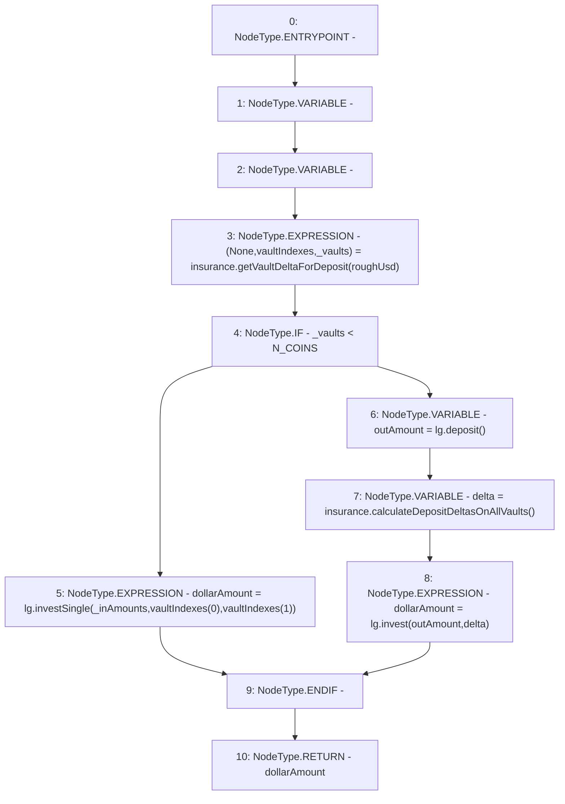

# Context: DepositHandler._invest

**Contract:** `DepositHandler` (Inherits: IDepositHandler, FixedVaults, FixedStablecoins, Constants, Controllable, Ownable, Context)
**Signature:** `_invest(uint256[3],uint256) returns (uint256)`
**Method Selector ID:** `Internal (No Method ID)`
**Visibility:** `internal`
**Environment-Free:** `Yes`
**Modifiers:** None

### State Variables Interaction
- **Reads:** N_COINS, insurance, lg
- **Writes:** None

### Environment & Verification Flags
- **Uses Foundry Cheatcodes:** No
- **Has Echidna Properties:** No

### Internal Calls Tree
- None

### External Calls / Value Transfers
- `IInsurance.TUPLE_0(uint256[3],uint256[3],uint256) = HIGH_LEVEL_CALL, dest:insurance(IInsurance), function:getVaultDeltaForDeposit, arguments:['roughUsd']  `
- `ILifeGuard.TMP_101(uint256) = HIGH_LEVEL_CALL, dest:lg(ILifeGuard), function:investSingle, arguments:['_inAmounts', 'REF_56', 'REF_57']  `
- `ILifeGuard.TMP_104(uint256) = HIGH_LEVEL_CALL, dest:lg(ILifeGuard), function:invest, arguments:['outAmount', 'delta']  `
- `IInsurance.TMP_103(uint256[3]) = HIGH_LEVEL_CALL, dest:insurance(IInsurance), function:calculateDepositDeltasOnAllVaults, arguments:[]  `
- `ILifeGuard.TMP_102(uint256) = HIGH_LEVEL_CALL, dest:lg(ILifeGuard), function:deposit, arguments:[]  `

### Control Flow Graph (CFG)


### Source Mapping
Declared in: `certora-ac-datasets/detasets/web3bugs/dataset/web3bugs/17/contracts/DepositHandler.sol` on lines **189** to **201**

```solidity
    function _invest(uint256[N_COINS] memory _inAmounts, uint256 roughUsd) internal returns (uint256 dollarAmount) {
        // Calculate asset distribution - for large deposits, we will want to spread the
        // assets across all stablecoin vaults to avoid overexposure, otherwise we only
        // ensure that the deposit doesn't target the most overexposed vault
        (, uint256[N_COINS] memory vaultIndexes, uint256 _vaults) = insurance.getVaultDeltaForDeposit(roughUsd);
        if (_vaults < N_COINS) {
            dollarAmount = lg.investSingle(_inAmounts, vaultIndexes[0], vaultIndexes[1]);
        } else {
            uint256 outAmount = lg.deposit();
            uint256[N_COINS] memory delta = insurance.calculateDepositDeltasOnAllVaults();
            dollarAmount = lg.invest(outAmount, delta);
        }
    }

```
