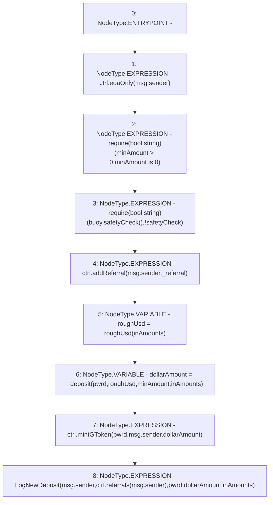

# Context: DepositHandler.depositGToken

**Contract:** `DepositHandler` (Inherits: IDepositHandler, FixedVaults, FixedStablecoins, Constants, Controllable, Ownable, Context)
**Signature:** `depositGToken(uint256[3],uint256,address,bool)`
**Method Selector ID:** `Internal (No Method ID)`
**Visibility:** `private`
**Environment-Free:** `No (reads EVM state context)`
**Modifiers:** None

### State Variables Interaction
- **Reads:** buoy, ctrl
- **Writes:** None

### Assertion Checks & Business Requirements
- require/assert: `require(bool,string)(minAmount > 0,minAmount is 0)`
- require/assert: `require(bool,string)(buoy.safetyCheck(),!safetyCheck)`

### Environment & Verification Flags
- **Uses Foundry Cheatcodes:** No
- **Has Echidna Properties:** No

### Internal Calls Tree
- None

### External Calls / Value Transfers
- `IController.HIGH_LEVEL_CALL, dest:ctrl(IController), function:eoaOnly, arguments:['msg.sender']  `
- `IController.HIGH_LEVEL_CALL, dest:ctrl(IController), function:addReferral, arguments:['msg.sender', '_referral']  `
- `IController.HIGH_LEVEL_CALL, dest:ctrl(IController), function:mintGToken, arguments:['pwrd', 'msg.sender', 'dollarAmount']  `
- `IBuoy.TMP_61(bool) = HIGH_LEVEL_CALL, dest:buoy(IBuoy), function:safetyCheck, arguments:[]  `
- `IController.TMP_67(address) = HIGH_LEVEL_CALL, dest:ctrl(IController), function:referrals, arguments:['msg.sender']  `

### Control Flow Graph (CFG)


### Source Mapping
Declared in: `certora-ac-datasets/detasets/web3bugs/dataset/web3bugs/17/contracts/DepositHandler.sol` on lines **106** to **122**

```solidity
    function depositGToken(
        uint256[N_COINS] memory inAmounts,
        uint256 minAmount,
        address _referral,
        bool pwrd
    ) private {
        ctrl.eoaOnly(msg.sender);
        require(minAmount > 0, "minAmount is 0");
        require(buoy.safetyCheck(), "!safetyCheck");
        ctrl.addReferral(msg.sender, _referral);

        uint256 roughUsd = roughUsd(inAmounts);
        uint256 dollarAmount = _deposit(pwrd, roughUsd, minAmount, inAmounts);
        ctrl.mintGToken(pwrd, msg.sender, dollarAmount);
        // Update underlying assets held in pwrd/gvt
        emit LogNewDeposit(msg.sender, ctrl.referrals(msg.sender), pwrd, dollarAmount, inAmounts);
    }

```
