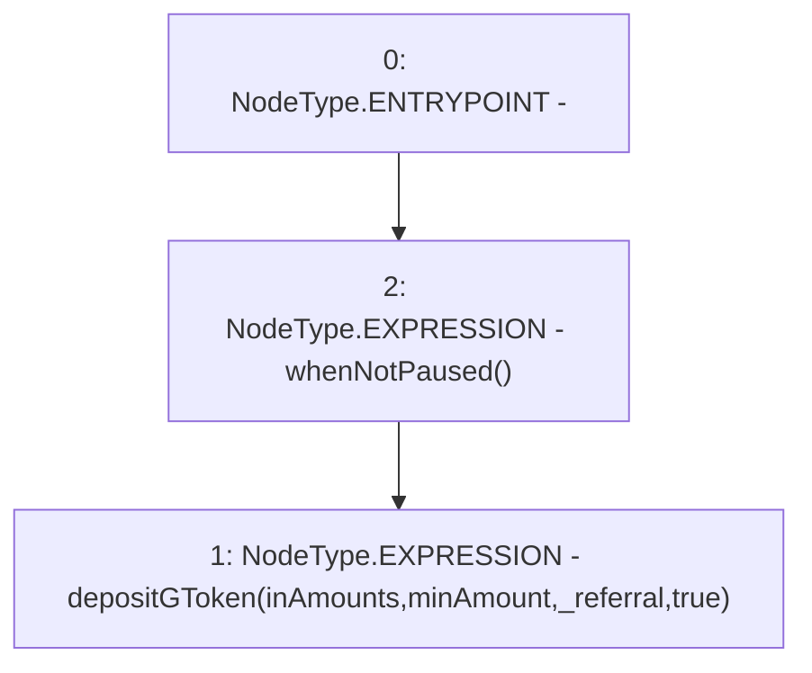

# Context: DepositHandler.depositPwrd

**Contract:** `DepositHandler` (Inherits: IDepositHandler, FixedVaults, FixedStablecoins, Constants, Controllable, Ownable, Context)
**Signature:** `depositPwrd(uint256[3],uint256,address)`
**Method Selector ID:** `0xd365d303`
**Visibility:** `external`
**Environment-Free:** `No (reads EVM state context)`
**Modifiers:**
- `whenNotPaused`
  ```solidity
  modifier whenNotPaused() {
          require(!_pausable().paused(), "Pausable: paused");
          _;
      }
  ```

### State Variables Interaction
- **Reads:** None
- **Writes:** None

### Environment & Verification Flags
- **Uses Foundry Cheatcodes:** No
- **Has Echidna Properties:** No

### Internal Calls Tree
- None

### External Calls / Value Transfers
- None

### Control Flow Graph (CFG)


### Source Mapping
Declared in: `certora-ac-datasets/detasets/web3bugs/dataset/web3bugs/17/contracts/DepositHandler.sol` on lines **81** to **87**

```solidity
    function depositPwrd(
        uint256[N_COINS] memory inAmounts,
        uint256 minAmount,
        address _referral
    ) external override whenNotPaused {
        depositGToken(inAmounts, minAmount, _referral, true);
    }

```
