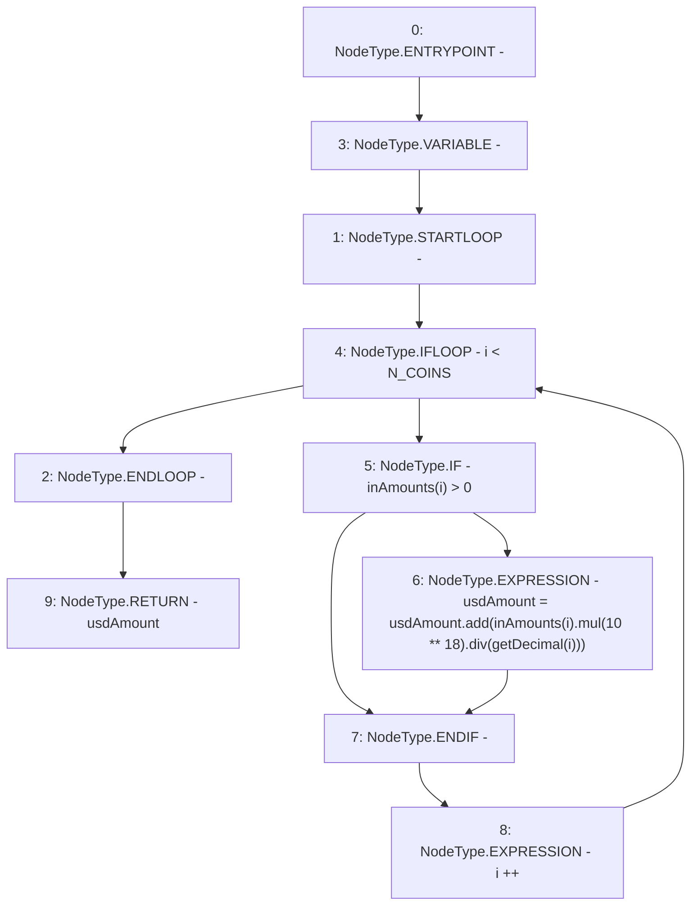

# Context: DepositHandler.roughUsd

**Contract:** `DepositHandler` (Inherits: IDepositHandler, FixedVaults, FixedStablecoins, Constants, Controllable, Ownable, Context)
**Signature:** `roughUsd(uint256[3]) returns (uint256)`
**Method Selector ID:** `Internal (No Method ID)`
**Visibility:** `private`
**Environment-Free:** `Yes`
**Modifiers:** None

### State Variables Interaction
- **Reads:** N_COINS
- **Writes:** None

### Environment & Verification Flags
- **Uses Foundry Cheatcodes:** No
- **Has Echidna Properties:** No

### Internal Calls Tree
- None

### External Calls / Value Transfers
- `SafeMath.TMP_111(uint256) = LIBRARY_CALL, dest:SafeMath, function:SafeMath.add(uint256,uint256), arguments:['usdAmount', 'TMP_110'] `
- `SafeMath.TMP_110(uint256) = LIBRARY_CALL, dest:SafeMath, function:SafeMath.div(uint256,uint256), arguments:['TMP_108', 'TMP_109'] `
- `SafeMath.TMP_108(uint256) = LIBRARY_CALL, dest:SafeMath, function:SafeMath.mul(uint256,uint256), arguments:['REF_63', 'TMP_107'] `

### Control Flow Graph (CFG)


### Source Mapping
Declared in: `certora-ac-datasets/detasets/web3bugs/dataset/web3bugs/17/contracts/DepositHandler.sol` on lines **206** to **212**

```solidity
    function roughUsd(uint256[N_COINS] memory inAmounts) private view returns (uint256 usdAmount) {
        for (uint256 i; i < N_COINS; i++) {
            if (inAmounts[i] > 0) {
                usdAmount = usdAmount.add(inAmounts[i].mul(10**18).div(getDecimal(i)));
            }
        }
    }

```
